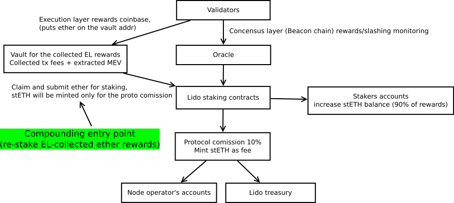

# On-chain part of the rewards distribution after the Merge

## Simple summary

The Lido protocol upgrade that re-stakes newly appeared rewards after the Ethereum Merge will happen to achieve rewards compounding.

## Abstract

We introduce the rewards distribution mechanism which consists of a dedicated vault contract acting as a coinbase (i.e. fee recipient) for the newly appeared rewards on the execution layer (ex. ETH1), and an upgrade for the `Lido` contract which affects the rewards distribution run, i.e. the Lido oracle beacon report handler.

The proposed rewards distribution mechanism should work as follows:
1. Node operators collect ether-nominated execution level rewards on a dedicated vault contract by setting its address as a fee recipient. To be precise, MEV rewards could be collected in the two ways: directly by setting the validator’s `feeRecipient` address as the coinbase address of the payload, or the payload builders may include an explicit transaction which transfers MEV rewards to the `feeRecipient`. So the proposed dedicated contract also accepts incoming ether (payable) transactions.
1. The Lido contract withdraws all collected rewards from the vault, re-stakes it and mints new stETH only for protocol fee (10%) as part of the beacon chain rewards distribution run
1. In the case of the non-profitable Lido oracle report don't mint any new stETH (i.e. the protocol fee).

## Motivation

Now the Lido protocol collects only Beacon chain staking rewards. These rewards are locked on the Beacon chain until withdrawals are enabled sometime later in 2022. After the merge, validators will start to receive two additional types of rewards: transaction fees (priority fee, to be exact) and extracted MEV which would be paid on the execution layer (EL).

Lido is likely to approach MEV using [Flashbots](https://flashbots.net) ecosystem. The Lido Node Operators would use [mev-boost](https://github.com/flashbots/mev-boost) as a middleware which allows to receive transaction bundles submitted by [searchers](https://docs.flashbots.net/flashbots-auction/searchers/quick-start). Searchers share the revenue with validators by sending part of rewards to the `feeRecipient` address.

We propose to re-stake all collected EL rewards while minting only the protocol fee (10%) stETH as part of the beacon chain rewards distribution run. But don't mint/distribute any protocol fee on the non-profitable Lido oracle report.

The proposed way brings rewards compounding, has a fast shipment time due to little impact on the existing distribution scheme. It's also reasonably automated and self-governed. And finally, it fallbacks to the already adopted solution in case Merge hardfork is delayed.

The compound effect depends on the EL- and CL- APRs, but a long-term stakeholder generally gains additional interest rate increase every day. For example, if EL- ad CL- APRs are both equal to 4.5% (i.e., their sum is 9%), then a 1y-long stakeholder has an APY value near ~9.2, and a 3y-long stakeholder has an APY value near [~9.6%](assets/lip-12/restaking_effect.ipynb).

The rewards distribution scheme is provided below.


## Specification

A rewards vault is represented with the new `LidoExecutionLayerRewardsVault` contract. Rewards distribution run performs with the upgraded `Lido` contract.

#### Algorithm sketch

1) Start the Lido oracle report
2) Withdraw EL-collected rewards from the `LidoExecutionLayerRewardsVault` contract to the `Lido` contract address (re-stake)
3) Compare the report numbers with previous ones to check whether it is profitable or not.
4) If report IS profitable (i.e. beacon chain delta is positive):
    * sum rewards (beacon chain delta + EL-collected tx fees and extracted MEV)
    * mint stETH in the amount of 10% from the overall rewards for a protocol fee
    * distribute a protocol fee between the NOs and Lido DAO
    * update `bufferedEther` variable to stake EL-collected rewards on the next depositor run.
5) If the report IS NOT profitable (the beacon chain delta is zero or negative), don't mint protocol fee for the NOs and Lido DAO just update `bufferedEther` to stake EL-collected rewards on the next depositor run.

We explicitly state that protocol fee distributed if and only if CL-stake balances delta between the two consecutive reports is positive. This way was selected to motivate NOs to do their main job of securing network better with active and healthy validators.

Also, we added a withdrawal daily limit to avoid too large rebasing events when distributing a large amount of MEV or tx fees accrued between Lido oracle reports.

### An execution layer rewards vault contract

The proposed `LidoExecutionLayerRewardsVault` vault contract is devoted for the EL-rewards collecting. Transactions priority fee collected by setting the the vault contract address as a coinbase (`feeRecipient`). MEV rewards could be collected by the two ways simultaneously: the first one require coinbase setup too but the second presumes that payloads builders may include an explicit transaction which transfers MEV shares to the `feeRecipient` in the payload. Thus, `LidoExecutionLayerRewardsVault` has the payable `receive` function which accepts incoming ether.

**We can't recover accidentally sent by someone outside the Lido NOs set ether.**

We propose the following interface for the `LidoExecutionLayerRewardsVault` contract. The code below presumes the Solidity v0.8 syntax.

#### Constructor
```solidity
constructor(address _lido, address _treasury)
```
Construct a vault contract instance with the provided `_lido` and `_treasury` addresses. Where _lido is allowed to withdraw collected rewards, and _treasury is allowed to recover `ERC20` and `ERC721` tokens
* Reverts if `_lido` is set to zero.
* Reverts if `_treasury` is set to zero.

#### Function: receive
```solidity
receive() external payable
```
Allows the contract to receive ETH
* Emits the `ETHReceived` event

#### Function: withdrawRewards
```solidity
function withdrawRewards(uint256 _maxAmount) external returns (uint256 amount)
```
Withdraw a limited by `_maxAmount` param accumulated rewards nominated in ether to the `Lido` contract by calling a newly proposed `receiveELRewards` payable method.
Returns amount of the received rewards.
* Reverts if `msg.sender` is not the `Lido` contract
* Does nothing if there are no accumulated rewards (and returns zero)

#### Function: recoverERC20
```solidity
function recoverERC20(address _token, uint256 _amount) external
```
Transfers a given `_amount` of an ERC20-token (defined by the `_token` contract address) to the Lido treasury address (defined in the `construct`).

* Reverts if `_amount` is zero
* Emits the `ERC20Recovered` event

#### Function: recoverERC721
```solidity
function recoverERC721(address _token, uint256 _tokenId) external
```
Transfers a given `_token` of an ERC721-compatible NFT (defined by the token contract address) to the Lido treasury address (defined in the `construct`).
* Emits the `ERC721Recovered` event


#### Event: ETHReceived
```solidity
event ETHReceived(uint256 amount);
```
Emitted when the vault received ETH

#### Event: ERC20Recovered
```solidity
event ERC20Recovered(
    address indexed requestedBy,
    address indexed token,
    uint256 amount
);
```
Emitted when the `amount` of ERC20 `token` recovered (i.e. transferred) to the Lido treasure address by `requestedBy` sender.

#### Event: ERC721Recovered
```solidity
event ERC721Recovered(
    address indexed requestedBy,
    address indexed token,
    uint256 tokenId
);
```
Emitted when the ERC721-compatible `token` (NFT) recovered (i.e. transferred) to the Lido treasury address by `requestedBy` sender.

### An upgrade for the `Lido` contract

We propose to introduce new functions to grab rewards from the `LidoExecutionLayerRewardsVault` and update the existing `pushBeacon` function (also rename it to `handleOracleReport` for the sake of meaningfulness).

Note: to keep stETH APR estimation valid as described in the Lido [docs](https://docs.lido.fi/contracts/lido-oracle#add-calculation-of-staker-rewards-apr):
```javascript
APR = (postTotalPooledEther - preTotalPooledEther) * secondsInYear / (preTotalPooledEther * timeElapsed)
```
we just sum all rewards type together (consensus layer rewards + execution layer rewards) updating the `postTotalPooledEther`.

The code below presumes the Solidity v0.4.24 syntax.

#### Function: receiveELRewards
```solidity
function receiveELRewards() external payable
```
Payable function to accept the withdrawn rewards for a vault contract
* Reverts if msg.sender is not the `LidoExecutionLayerRewardsVault` contract.
* Emits the `ELRewardsReceived` event.

#### Function: getELRewardsVault
```solidity
function getELRewardsVault() public view returns (address)
```
Returns address of the contract set as `LidoExecutionLayerRewardsVault`

#### Function: setELRewardsVault
```solidity
function setELRewardsVault(address _executionLayerRewardsVault) external
```
Set the `LidoExecutionLayerRewardsVault` address for the `Lido` contract.
* Reverts if called without `SET_EL_REWARDS_VAULT_ROLE`
* Emits the `ELRewardsVaultSet` event

#### Function: setELRewardsWithdrawalLimit
```solidity
function setELRewardsWithdrawalLimit(uint16 _limitPoints) external
```

Sets limit on amount of ETH to withdraw from execution layer rewards vault per LidoOracle report

* Reverts if called without `SET_EL_REWARDS_WITHDRAWAL_LIMIT_ROLE`
* Emits the `ELRewardsWithdrawalLimitSet` event

#### Function: getTotalELRewardsCollected
```solidity
function getTotalELRewardsCollected() external view returns (uint256)
```
Get total amount of execution layer rewards collected to Lido contract

#### Function: getELRewardsWithdrawalLimit
```solidity
function getELRewardsWithdrawalLimit() external view returns (uint256)
```
Get limit in basis points to amount of ETH to withdraw per LidoOracle report

#### Function: handleOracleReport (replaces pushBeacon)
```solidity
function handleOracleReport(uint256 _beaconValidators, uint256 _beaconBalance) external whenNotStopped
```
In addition to the existing `pushBeacon` code, claims EL-collected rewards after saving current beacon balance, and in case of positive beacon chain delta increase overall rewards amount by the EL-collected value before calling `distributeRewards` function.
* Must not change rewards distribution if there are no EL-collected rewards or `LidoExecutionLayerRewardsVault` address is zero.
* Must not distribute any rewards if beacon chain delta (with a correction by newly appeared validators amount) is zero or negative.
* Must not introduce additional revert reasons if all permissions agree.

#### Event: ELRewardsReceived
```solidity
event ELRewardsReceived(uint256 amount)
```
Emitted when the EL-collected rewards `amount` were withdrawn from the vault contract.

#### Event: ELRewardsVaultSet
```solidity
event ELRewardsVaultSet(address executionLayerRewardsVault)
```
Emitted when the `executionLayerRewardsVault` address was set in the `Lido` contract.

#### Event: ELRewardsWithdrawalLimitSet
```solidity
event ELRewardsWithdrawalLimitSet(uint256 limitPoints)
```
Emitted when the EL rewards `limitPoints` was set in the `Lido` contract.

### An upgrade to LidoOracle contract
There is also a single change to LidoOracle contract: a one-line refactoring to match with the renaming of Lido contract's `pushBeacon` to `handleOracleReport`.

## Backwards compatibility

In case of postponed merge, an EL-rewards vault contract holds zero ether amount so the conventional rewards distribution scheme would work as usual without any differences.

As an option, we also could keep the `LidoExecutionLayerRewardsVault` address is zero inside the `Lido` contract to bypass all of the EL-rewards logic explicitly.

## Security considerations

#### Validators may misbehave by using incorrect setup

To mitigate this problem we propose to establish continuous off-chain monitoring.

#### Vault contract immunity

We propose to make a vault contract non-upgradable and non-ownable with a restrained interface to make exactly one thing: allow to withdraw collected rewards by the `Lido` contract solely and log it.

#### No finality on a consensus layer

Rewards distribution would be postponed till the next oracle report.

#### Slashing conditions

Under the mass slashing conditions (Beacon-chain balance decrease between the consecutive oracle reports) we don't distribute protocol fee to motivate NOs work better.

#### Rewards distribution run could incur enormous token rebase

If oracle reports don’t get quorum long enough, then the first successful report would incur an enormous rebasing event (for a ~three weeks or longer, the rebase may achieve ~1% of stETH supply). It could open the door for various front-running techniques in general. We mitigate it with continuous monitoring and the possibility to forcibly send oracle reports transactions using FlashBots.

## Links

- [ADR #3: Rewards distribution after The Merge](https://research.lido.fi/t/rewards-distribution-after-the-merge-architecture-decision-record/1535)
- [Announcing the Flashbots Eth2 Working Group](https://medium.com/flashbots/announcing-the-flashbots-eth2-working-group-599b2b92634b)
- [Join the Flashbots Eth2 Working Group](https://research.lido.fi/t/join-the-flashbots-eth2-working-group/1451) — Hasu on the Lido DAO research forum
- [Fees and MEV monitoring spec draft (WIP)](https://hackmd.io/@george-avs/rJ14Rv7qF)
- [Lido MEV monitoring github repo (WIP)](https://github.com/lidofinance/lido-mev-monitoring/)
- [Compound effect evaluation // Jupyter Notebook (Python3)](assets/lip-12/restaking_effect.ipynb)
