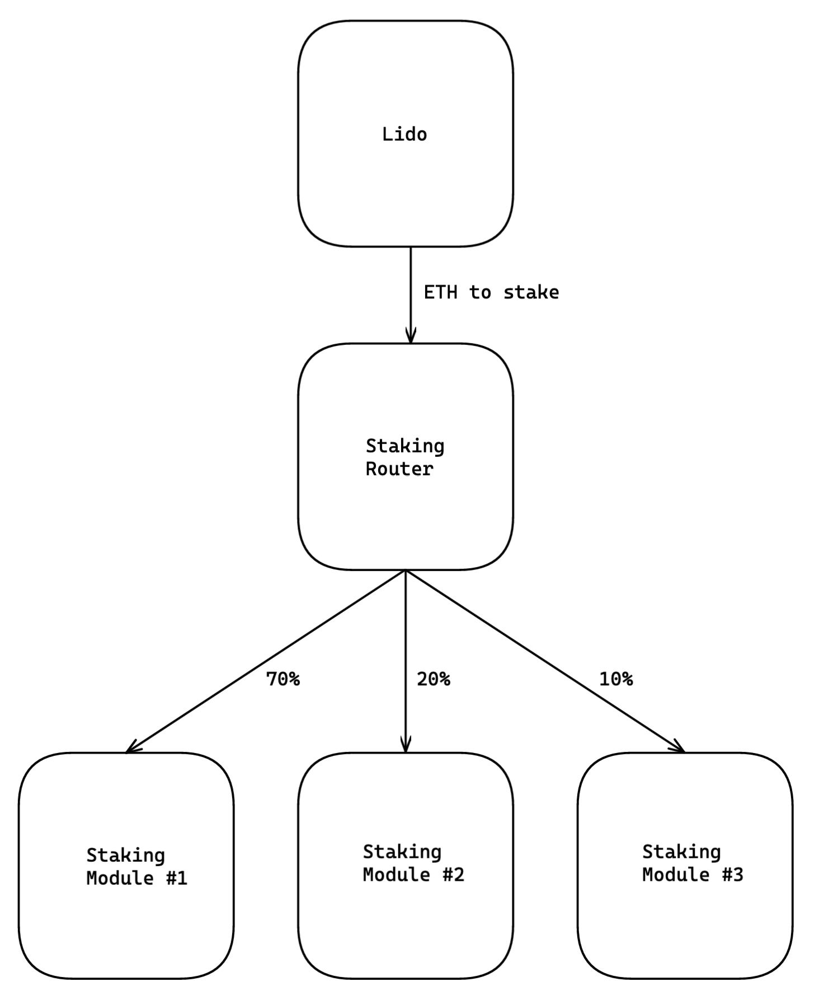
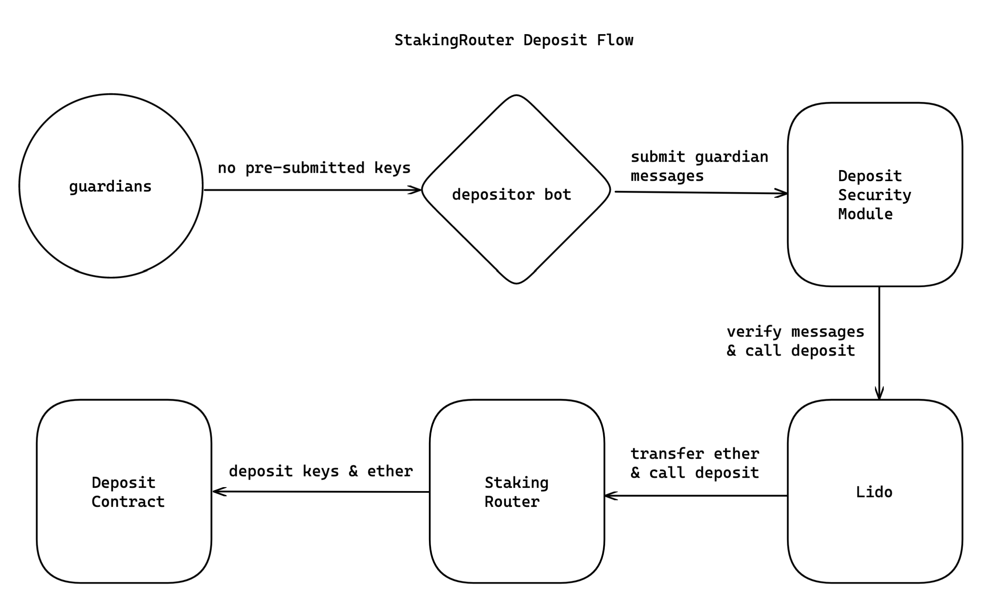

# LIP-20. Staking Router

## Abstract 

Other than the curated set of node operators, the existing monolithic architecture of the registry makes it difficult for Lido to onboard different validator subsets such as community operators, DVT-enabled validators, off-chain and L2 validators. We propose to move to a modular architecture by introducing Staking Router. With this protocol update, various validator subsets will be able to join Lido as separate registries, or modules. Each module will be responsible for managing their operators, storing their keys, distributing stake and rewards between them. Modules are integrated into Lido through Staking Router, a controller contract that operates at the module-level. This document covers the important decisions made in the design of Staking Router and the emerging changes to the existing protocol.

## Motivation

As introduced in [The Next Chapter for Lido | Lido Finance](https://blog.lido.fi/the-next-chapter-for-lido/), the protocol’s long-term goal is to ensure that the validator set is good and stays good. To achieve this, Lido is working on diversifying its validator set: committing to allowing solo stakers to participat1 in the protocol and actively experimenting with DVT.

To incorporate all these mechanics, it is necessary to support this possibility at the smart-contract level. Now Lido only supports the validator set curated by Lido DAO through [LNOSG](https://lido.fi/governance). All logic for managing the list of operator nodes, validator keys, and reward distribution is handled by the contract [NodeOperatorRegistry](https://etherscan.io/address/0x55032650b14df07b85bF18A3a3eC8E0Af2e028d5), which is part of the Lido protocol.

The current monolithic architecture of the protocol needs to be more flexible to test different validator set approaches because different validator subsets require different implementations in the protocol. For instance, permissionless validation requires the implementation of bonds or a reputation mechanism, and to integrate DVT; it is required to support even more features like random committee formation, DKG, validator performance oracle, and so on. Since the validator registry is strongly coupled with the rest of the protocol logic, it is difficult to implement these features in parallel.

To simplify the protocol code and speed up further iterations, we propose a modular way for Lido on Ethereum validator set. Instead of the monolithic registry, we want to introduce the StakingRouter contract, which would be responsible for stake balancing and reward distribution between modules that implement business logic related to specific validator subsets.

This approach is similar to the current NodeOperatorRegistry, which distributes staked ether between node operators. Still, instead of addresses of node operators, StakingRouter has a list of smart contracts responsible for different validator subsets along with a quota for the maximum amount of stake set in percent.

We propose implementing a modular approach based on the staking router in the next protocol upgrade. Just after the upgrade, the current NodeOperatorRegistry contract will become the only module for the staking router with a stake share of 100%. As more validator subsets are connected to the StakingRouter, Lido DAO can start with small numbers to safely test new approaches before gradually increasing the limit. This will significantly speed up experiments with the diversification and optimization of the validator set, allowing several independent teams to work on this without a major protocol upgrade.

Despite the simplicity of the idea behind StakingRouter, it is necessary to agree on a number of architectural decisions and a router-module interface. The Lido protocol contributors prepared an [Architecture Design Record about StakingRouter](https://hackmd.io/f1wvHzpjTIq41-GCrdaMjw?view) in which they looked at various approaches to the problem. 

## General overview

The diagram below illustrates a high-level architecture that the StakingRouter upgrade proposes.



### Deposit workflow

The deposit workflow is a procedure whereby a batch of deposits of 32 ether together with validator keys are submitted to `DepositContract` in a single transaction. Because each module is responsible for their own deposits, each batch deposit is limited to keys from one module only.

The deposit procedure is essentially a chain of contract calls initiated by an off-chain software called the depositor bot. The bot collects guardian messages verifying that there are no pre-submitted keys in the registry [to exploit the frontrunning vulnerability](https://github.com/lidofinance/lido-improvement-proposals/blob/develop/LIPS/lip-5.md). Once the guardian quorum is reached, the bot passes the messages and the module identifier to `DepositSecurityModule` which first verifies the authenticity of messages and calls the deposit function on `Lido` passing the maximum number of deposits that the current block size allows. The latter then computes the maximum number of deposits to include in the batch based on the current deposit buffer and calls `StakingRouter`'s deposit function. `StakingRouter` calculates the allocation of buffered ether to the module whose keys are to be used in the deposit and finally performs the batch deposit.



### Allocation algorithm

One of the main responsibilites of `StakingRouter` is to distribute depositable ether to modules in a proportion that brings them closer to their DAO-imposed target shares. The target shares are the DAO's way to guide newly joined module through a controlled growth. The motivation behind this mechanism is given in [ADR: Staking Router](https://hackmd.io/f1wvHzpjTIq41-GCrdaMjw?view#Target-shares).

As mentioned in the Deposit workflow section, the deposit procedure starts with the depositor bot calling the deposit function on `DepositSecurityModule`. Along with guardian messages, the bot passes along the identifier of the staking module whose keys will be used for the deposit. `Lido` then relays the call to `StakingRouter` which calculates the allocation to the specified module and performs the deposit returning any unused ether back to `Lido`.

The main variables of the allocation algorithm are:
- `_maxDepositsPerBlock` from `DepositSecurityModule`, a manually set value that limits the number of deposits in a single transaction based on the current block size;
- `depositableEth` from `Lido`, a multiple of 32 ether passed to `StakingRouter` for deposit;
- active keys in each module, i.e. the keys already deposited to `DepositContract`;
- total active keys, meaning the sum of all active keys across all modules;
- available keys in each module, i.e. the keys uploaded by operators to the module but not yet deposited;
- the target share of each module expressed in basis points, i.e. 1 basis point equals 0.01% and 10,000 equals 100%;

The steps of the allocation algorithm:
1. Get the maximum number of deposits that can fit in a single block from the variable `_maxDepositsPerBlock` in `DepositSecurityModule`. This is to ensure that the batch transaction does not hit the block size limit;
2. Get the maximum number of deposits based on the amount of ether available for deposits by dividing the deposit buffer by 32. The deposit buffer stored in `Lido` as `BUFFERED_ETHER_POSITION` is the sum of all user submissions and execution-layer rewards transferred to `Lido` from the execution-layer rewards vault;
3. Calculate the final maximum number of deposits by taking the smallest of the results obtained in steps 1 and 2. We will refer to this value as `finalMaxDeposits`.
4. Calculate the new key limits for all modules based on their target shares, i.e. the maximum amount of active validators in the module with the incoming batch of ether fully deposited. This is done by taking the sum of all active keys across all modules and `finalMaxDeposits` and multiplying by the module's target share. The result is the flat cap of active keys of the module;
5. Calculate the capacity of each module by taking the minimum of the result obtained in the previous step and the module's available keys;
6. Starting with the module with the fewest active keys, allocate to it an amount of keys that is enough to catch up to the next module or to hit its capacity, whichever comes first.
7. If the module hits its capacity before catching up to the next module, proceed with the next module. Otherwise, distribute keys evenly between the modules until one of them hits its capacity.
8. Repeat the last two steps until there is no ether to allocate or until all modules hit their capacity.
9. Perform the deposits using the final allocated amount to the specified module.
10. Finally, return unused ether if any back to `Lido`.

The animated chart below illustrates the process of allocation where the bars represent the modules, the black outline is the module capacity, the green fill is the active keys, and yellow is the allocation.

### Rewards distribution

Every stETH represents equivalent ether in the total supply. However, internally the protocol keeps track of user balances [by way of shares](https://docs.lido.fi/guides/steth-integration-guide#steth-internals-share-mechanics), a fraction of the total stETH pool that each holder is entitled to. Whenever a user submits ether, `Lido` mints new shares at the current rate of a share to stETH. On the rebase, the same number of shares appreciate or depreciate in terms of stETH compared to the previous day based on whether the validators gained profit or were slashed.

Thus, one of the core mechanisms in Lido is synchronizing validator balances on the consensus layer with the total stETH supply on the execution layer. Lido employs a set of oracles to track validator balances and report them at regular intervals to `LidoOracle`, a contract that stores the beacon chain state. Once the quorum is reached, the total supply of stETH is updated. This is how all stETH holders receive their rewards. However, to ensure sustainability and to incentivize node operators, Lido takes a cut of these rewards and splits it between the protocol treasury and node operators on each finalized report.

On each report, the protocol determines whether the rebase is positive by comparing the total balance of validators on the consensus layer against the reward base, which is the sum of the previously reported balance and all newly activated validators times 32 ether. Even though execution-layer rewards are distributed across the protocol, they do not contribute to the decision on whether the rebase is positive or negative. If the rebase is positive, `Lido` fetches the protocol fee breakdown from `StakingRouter` and mints new shares in the amount that reduces stETH inflation by the total protocol fee and then distributes the fee between the modules and the treasury.

### Fee structure

The fee structure is set independently in each module. There are two components to the fee structure: the module fee and the treasury fee, both specified as percentages (basis points). For example, a 5% (500 basis points) module fee split between node operators in the module and a 5% (500 basis points) treasury fee sent to the treasury. Additionally, `StakingRouter` utilizes a precision factor of 100 * 10<sup>18</sup> for fees that prevents arithmetic operations from truncating the fees of small modules. 

Because Lido does not account for validator performance, the protocol fee is distributed between modules proportionally to active validators and the specified module fee. For example, a module with 75% of all validators in the protocol and a 5% module fee will receive 3.75% of the total rewards across the protocol, obtained with the equation below:
```
modulesShareOfTotalRewards = 100 * modulesShareOfValidators * moduleFee
modulesShareOfTotalRewards = 100 * 0.75 * 0.05 = 3.75
```

The treasury fee is calculated the same way. The same module from the example above with a 5% treasury fee will bring 3.75% to the treasury:

```
modulesTreasuryContributionOfTotalRewards = 100 * modulesShareOfValidators * moduleTreasuryFee
modulesTreasuryContributionOfTotalRewards = 100 * 0.75 * 0.05 = 3.75
```

It follows that the total protocol fee is calculated by adding the module and treasury shares across all modules:

```
anotherModulesShareOfTotalRewards = 100 * 0.25 * 0.05 = 1.25
anotherModulesTreasuryContributionOfTotalRewards = 100 * 0.25 * 0.05 = 1.25

protocolFee = modulesShareOfTotalRewards + modulesTreasuryContributionOfTotalRewards + anotherModulesShareOfTotalRewards + anotherModulesTreasuryContributionOfTotalRewards
protocolFee = 3.75 + 3.75 + 1.25. + 1.25 = 10
```

This means that if the modules' fee and treasury fee do not exceed 10%, the total protocol fee will not either, no matter how many modules there are.

There is also an edge case where the module is stopped for emergency while its validators are still active. In this case the module fee will be transferred to the treasury and once the module is back online, the rewards will be returned back to the module from the treasury.

## Specification

### Overview

This Staking Router update includes one new contract, `StakingRouter`, and significant changes to the three existing contracts: `Lido`, `NodeOperatorsRegistry` and `DepositSecuirityModule`.

`StakingRouter` is the contract responsible for managing the list of modules, allocating stake to modules, calculating fees and sending deposits to `DepositContract`, a former responsibility of `Lido`. `Lido` will be distributing the protocol fee based on the calculations provided by `StakingRouter`. With a significant amount of protocol logic moving out of `Lido`, a number of its functions will be deprecated. `DepositSecurityModule` will updated to reflect the changes in the deposit workflow. And finally, to connect to `StakingRouter`, `NodeOperatorsRegistry` now must implement the `IStakingModule` interface and expose functions given in this specification.

### StakingRouter

`StakingRouter` is the top-level controller contract tha manages the list of modules, allocates stake to modules, calculates fees and submits deposits to `DepositContract`.

Used libraries:
- `UnstructuredStorage` associates a value with a storage key obtained with a keccak256 hash of the descriptive string, to avoid storage slot collissions;
- `MinFirstAllocationStrategy` abstracts away allocation logic described in [Allocation algorithm](#allocation-algorithm).

Inherited contracts:
- `BeaconChainDepositor` provides a function for performing a batch deposit to `DepositContract`;
- `AccessControlEnumerable` provides a role-based access system where members of a role may be enumerated.

#### Enum: `StakingModuleStatus`
```solidity
enum StakingModuleStatus {
	Active,
	DepositsPaused,
	Stopped
}
```
Indicates the module's operational mode.
| status           | perform deposits | receive rewards |
|------------------|------------------|-----------------|
| `Active`         | ✅                | ✅               |
| `DepositsPaused` | ❌                | ✅               |
| `Stopped`        | ❌                | ❌               |

#### Struct: `StakingModule`
```solidity
struct StakingModule {
	uint24 id;
	address stakingModuleAddress;
	uint16 stakingModuleFee;
	uint16 treasuryFee;
	uint16 targetShare;
	uint8 status;
	string name;
	uint64 lastDepositAt;
	uint256 lastDepositBlock;
}
```
A structure containing all relevant information about the staking module.
| Key                    | Type      | Description                                                                      |
|------------------------|-----------|----------------------------------------------------------------------------------|
| `id`                   | `uint24`  | 1-based module identifier                                                        |
| `stakingModuleAddress` | `address` | address of the module contract                                                   |
| `stakingModuleFee`     | `uint16`  | percentage of rewards taken by the module, in basis points                       |
| `treasuryFee`          | `uint16`  | percentage of rewards contributed to the treasury by the module, in basis points |
| `targetShare`          | `uint16`  | target percentage of active validators in the protocol                                          |
| `status`               | `uint8`   | staking module operation status, see `StakingModuleStatus` enum                  |
| `name`                 | `string`  | human-readable module name                                                       |
| `lastDepositAt`        | `uint64`  | unix timestamp of the module's latest deposit                                    |
| `lastDepositBlock`     | `uint256` | block number of the module's latest deposit                                      |
| `exitedKeysCount`     | `uint256` | number of exited keys                                      |

#### Struct: `KeysCountCorrection`
```solidity
struct KeysCountCorrection {
	uint256 currentModuleExitedKeysCount;
	uint256 currentNodeOperatorExitedKeysCount;
	uint256 currentNodeOperatorStuckKeysCount;
	uint256 newModuleExitedKeysCount;
	uint256 newNodeOperatorExitedKeysCount;
	uint256 newNodeOperatorStuckKeysCount;
}
```
A structure containing corrections details for unsafely updating exited keys; accepting a structure instead of individual arguments prevents the stack depth compiler error.
| Key                                  | Type      | Description                                                                         |
|--------------------------------------|-----------|-------------------------------------------------------------------------------------|
| `currentModuleExitedKeysCount`       | `uint256` | expected current number of exited keys of the module that is being corrected        |
| `currentNodeOperatorExitedKeysCount` | `uint256` | expected current number of exited keys of the node operator that is being corrected |
| `currentNodeOperatorStuckKeysCount`  | `uint256` | expected current number of stuck keys of the node operator that is being corrected  |
| `newModuleExitedKeysCount`           | `uint256` | corrected number of exited keys of the module                                       |
| `newNodeOperatorExitedKeysCount`     | `uint256` | corrected number of exited keys of the node operator                                |
| `newNodeOperatorStuckKeysCount`      | `uint256` | corrected number of stuck keys of the node operator                                 |

#### Roles
| Role                                 | Permission                                     |
|--------------------------------------|------------------------------------------------|
| `DEFAULT_ADMIN_ROLE`                 | manage all roles                               |
| `MANAGE_WITHDRAWAL_CREDENTIALS_ROLE` | set withdrawal credentials                     |
| `STAKING_MODULE_PAUSE_ROLE`          | pause deposits for a module                    |
| `STAKING_MODULE_RESUME_ROLE`         | set the module status to active                |
| `STAKING_MODULE_MANAGE_ROLE`         | add, update modules and change module statuses |
| `REPORT_EXITED_KEYS_ROLE`          | update the number of exited keys for modules and node operators |
| `UNSAFE_SET_EXITED_KEYS_ROLE`         | set exited keys count without security checks |
| `REPORT_REWARDS_MINTED_ROLE`         | report rewards minted|

#### Constants
| Name                   | Type      | Visibility | Description                                 |
|------------------------|-----------|------------|---------------------------------------------|
| `FEE_PRECISION_POINTS` | `uint256` | `public`   | 10^20; precision factor for fee calculation |
| `TOTAL_BASIS_POINTS`   | `uint256` | `public`   | 10,000; represents 100%                     |

#### Constructor
```solidity
constructor(
	address _depositContract
) BeaconChainDepositor(_depositContract);
```

Stores `_depositContract` as the address to which deposits will be submitted and sets the contract version in the implementation contract to the maximum `uint256` value.

##### Branches:
- reverts if `_depositContract` is zero address.

##### Events:
- `event ContractVersionSet(uint256 version)`

##### Parameters
| Name               | Type      | Description               |
|--------------------|-----------|---------------------------|
| `_depositContract` | `address` | `DepositContract` address |

#### Function: `initialize`
```solidity
function initialize(
	address _admin,
	address _lido,
	bytes32 _withdrawalCredentials
) external;
```
Sets the initial state variables:
- the version in the proxy contract storage to `1`. 
- `_admin` as the default admin who can grant and revoke roles;
- `_lido` as the address of `Lido`, the core protocol contract;
- `_withdrawalCredentials` as the protocol-wide withdrawal credentials used for deposits.

##### Branches:
- reverts if `_admin` is zero address;
- reverts if `_admin` already is the default admin;
- reverts if `_lido` is zero address;
- reverts if the version on the proxy contract is not `0`.

##### Events:
- `event ContractVersionSet(uint256 version)`
- `event RoleGranted(bytes32 indexed role, address indexed account, address indexed sender)`
- `event WithdrawalCredentialsSet(bytes32 withdrawalCredentials, address setBy)`

##### Parameters
| Name                     | Type      | Description                                  |
|--------------------------|-----------|----------------------------------------------|
| `_admin`                 | `address` | account managing roles                 |
| `_lido`                  | `address` | `Lido` contract address                      |
| `_withdrawalCredentials` | `bytes32` | protocol-wide deposit withdrawal credentials |

#### Function: `getLido`
```solidity
function getLido() public view returns (ILido);
```
Returns the address of the `Lido` contract.

#### Function: `addStakingModule`
```solidity
function addStakingModule(
	string calldata _name,
	address _stakingModuleAddress,
	uint16 _targetShare,
	uint16 _stakingModuleFee,
	uint16 _treasuryFee
) external;
```
Registers a new staking module.

##### Branches:
- reverts if the sender does not have the `STAKING_MODULE_MANAGE_ROLE` role;
- reverts if `_targetShare` is greater than 10,000, i.e. 100%;
- reverts if the sum of `_stakingModuleFee` and `_treasuryFee` is greater than 10,000, i.e. 100%;
- reverts if there are 32 staking modules registered;
- reverts if the proxy contract version is not `0`.

##### Events:
- `event StakingModuleAdded(uint24 indexed stakingModuleId, address stakingModule, string name, address createdBy)`
- `event StakingModuleTargetShareSet(uint24 indexed stakingModuleId, uint16 targetShare, address setBy)`
- `event StakingModuleFeesSet(uint24 indexed stakingModuleId, uint16 stakingModuleFee, uint16 treasuryFee, address setBy)`

##### Parameters
| Name                    | Type      | Description                        |
|-------------------------|-----------|------------------------------------|
| `_name`                 | `string`  | Human-readable staking module name |
| `_stakingModuleAddress` | `address` | staking module address             |
| `_targetShare`          | `uint16`  | module's target share              |
| `_stakingModuleFee`     | `uint16`  | module's fee                       |
| `_treasuryFee`          | `uint16`  | module's treasury fee contribution |

#### Function: `updateStakingModule`
```solidity
function updateStakingModule(
	uint256 _stakingModuleId,
	uint16 _targetShare,
	uint16 _stakingModuleFee,
	uint16 _treasuryFee
) external;
```
Changes the module's target share, fee and treasury fee.

##### Branches:
- reverts if `_stakingModuleId` is greater than `UINT24_MAX`;
- reverts if the sender does not have the `STAKING_MODULE_MANAGE_ROLE` role;
- reverts if `_targetShare` is greater than 10,000, i.e. 100%;
- reverts if the sum of `_stakingModuleFee` and `_treasuryFee` is greater than 10,000, i.e. 100%.

##### Events:
- `event StakingModuleTargetShareSet(uint24 indexed stakingModuleId, uint16 targetShare, address setBy)`
- `event StakingModuleFeesSet(uint24 indexed stakingModuleId, uint16 stakingModuleFee, uint16 treasuryFee, address setBy)`

##### Parameters
| Name                    | Type      | Description                        |
|-------------------------|-----------|------------------------------------|
| `_name`                 | `string`  | Human-readable staking module name |
| `_stakingModuleId` | `address` | staking module id             |
| `_targetShare`          | `uint16`  | module's target share              |
| `_stakingModuleFee`     | `uint16`  | module's fee                       |
| `_treasuryFee`          | `uint16`  | module's treasury fee contribution |

#### Function: `reportRewardsMinted`
```solidity
function reportRewardsMinted(
	uint256[] calldata _stakingModuleIds,
	uint256[] calldata _totalShares
) external;
```
Calls the reward handler function exposed on the modules passing the shares minted.

##### Branches:
- reverts if `_stakingModuleIds` contains an id greater than `UINT24_MAX` or `0`;
- reverts if the sender does not have the `REPORT_REWARDS_MINTED_ROLE` role.

##### Parameters
| Name                    | Type      | Description                        |
|-------------------------|-----------|------------------------------------|
| `_stakingModuleIds` | `uint256[]`  | an array of module ids |
| `_totalShares` | `uint256[]` | an array of shares minted to the module|

#### Function: `updateExitedKeysCountByStakingModule`
```solidity
function updateExitedKeysCountByStakingModule(
	uint256[] calldata _stakingModuleIds,
	uint256[] calldata _exitedKeysCounts
) external;
```
Updates the exited keys count for multiple modules.

##### Branches:
- reverts if `_stakingModuleIds` contains an id greater than `UINT24_MAX` or `0`;
- reverts if the sender does not have the `REPORT_EXITED_KEYS_ROLE` role;
- reverts if the new exited keys count is less than what was reported to `StakingRouter` ;
- emits `StakingModuleExitedKeysIncompleteReporting` if there is a discrepancy between what was reported to `StakingRouter` and retrieved from the module directly using the module's `getValidatorsKeysStats()`.

##### Events:
- `event StakingModuleExitedKeysIncompleteReporting(uint24 indexed stakingModuleId, uint256 unreportedExitedKeysCount);`

##### Parameters
| Name                    | Type      | Description                        |
|-------------------------|-----------|------------------------------------|
| `_stakingModuleIds` | `uint256[]`  | an array of module ids |
| `_exitedKeysCounts` | `uint256[]` | an array of new exited keys counts|

#### Function: `reportStakingModuleExitedKeysCountByNodeOperator`
```solidity
function reportStakingModuleExitedKeysCountByNodeOperator(
	uint256 _stakingModuleId,
	uint256[] calldata _nodeOperatorIds,
	uint256[] calldata _exitedKeysCounts
) external;
```
Updates the exited keys count for node operators in a module.

##### Branches:
- reverts if `_stakingModuleId` is greater than `UINT24_MAX` or `0`;
- reverts if the sender does not have the `REPORT_EXITED_KEYS_ROLE` role;

##### Parameters
| Name                    | Type      | Description                        |
|-------------------------|-----------|------------------------------------|
| `_stakingModuleId` | `uint256`  | staking module id |
| `_nodeOperatorIds` | `uint256[]`  | an array of node operator ids |
| `_exitedKeysCounts` | `uint256[]` | an array of new exited keys counts|

#### Function: `unsafeSetExitedKeysCount`
```solidity
function unsafeSetExitedKeysCount(
	uint256 _stakingModuleId,
	uint256 _nodeOperatorId,
	bool _triggerUpdateFinish,
	KeysCountCorrection memory _correction
) external;
```
Updates the exited keys count for a node operator without security checks; should only be used by the DAO in extreme cases and with sufficient precautions to correct invalid data reported by the oracle committee due to a bug in the oracle daemon.

##### Branches:
- reverts if `_stakingModuleId` is greater than `UINT24_MAX` or `0`;
- reverts if the sender does not have the `REPORT_EXITED_KEYS_ROLE` role;

##### Parameters
| Name                    | Type      | Description                        |
|-------------------------|-----------|------------------------------------|
| `_stakingModuleId` | `uint256`  | staking module id |
| `_nodeOperatorId` | `uint256`  | node operator id |
| `_exitedKeysCount` | `uint256` | new exited keys count|

#### Function: `getExitedKeysCountAcrossAllModules`
```solidity
function getExitedKeysCountAcrossAllModules() external view returns (uint256);
```
Returns the sum of exited keys across all modules.

#### Function: `getStakingModules`
```solidity
function getStakingModules(
) external view returns (StakingModule[]);
```
Returns an array of registered module structs.

#### Function: `getStakingModuleIds`
```solidity
function getStakingModules(
) external view returns (stakingModuleIds[]);
```
Returns an array of the ids of all registered staking modules.

#### Function: `getStakingModule`
```solidity
function getStakingModule(
	uint256 _stakingModuleId
) external view returns (
	StakingModule memory
);
```
Returns the staking module struct with the specified id.

##### Branches:
- reverts if `_stakingModuleId` is greater than `UINT24_MAX`.

| Name               | Type      | Description       |
|--------------------|-----------|-------------------|
| `_stakingModuleId` | `uint256` | staking module id |

#### Function: `getStakingModulesCount`
```solidity
function getStakingModulesCount(
) public view returns (
	uint256
);
```
Returns the number of registered staking modules.

#### Function: `getStakingModuleStatus`
```solidity
function getStakingModuleStatus(
	uint256 _stakingModuleId
) public view returns (
	StakingModuleStatus
);
```
Returns the status of the staking module with the specified id.

##### Branches:
- reverts if `_stakingModuleId` is greater than `UINT24_MAX`.

| Name               | Type      | Description       |
|--------------------|-----------|-------------------|
| `_stakingModuleId` | `uint256` | staking module id |

#### Function: `setStakingModuleStatus`
```solidity
function setStakingModuleStatus(
	uint256 _stakingModuleId,
	StakingModuleStatus _status
) external;
```
Update the status of the staking module with the specified id.

##### Branches:
- reverts if `_stakingModuleId` is greater than `UINT24_MAX`;
- reverts if the sender does not have the `STAKING_MODULE_MANAGE_ROLE` role;

##### Events:
- `event StakingModuleStatusSet(uint24 indexed stakingModuleId, StakingModuleStatus status, address setBy)`

##### Parameters
| Name               | Type                  | Description       |
|--------------------|-----------------------|-------------------|
| `_stakingModuleId` | `uint256`             | staking module id |
| `_status`          | `StakingModuleStatus` | new status        |

#### Function: `pauseStakingModule`
```solidity
function pauseStakingModule(
	uint256 _stakingModuleId
) external;
```
Blocks deposits from the module with the specified id.

##### Branches:
- reverts if `_stakingModuleId` is greater than `UINT24_MAX`;
- reverts if the sender does not have the `STAKING_MODULE_PAUSE_ROLE` role;

##### Events:
- `event StakingModuleStatusSet(uint24 indexed stakingModuleId, StakingModuleStatus status, address setBy)`

##### Parameters
| Name               | Type                  | Description       |
|--------------------|-----------------------|-------------------|
| `_stakingModuleId` | `uint256`             | staking module id |

#### Function: `resumeStakingModule`
```solidity
function resumeStakingModule(
	uint256 _stakingModuleId
) external;
```
Lifts the block on deposits from the module with the specified id.

##### Branches:
- reverts if `_stakingModuleId` is greater than `UINT24_MAX`;
- reverts if the sender does not have the `STAKING_MODULE_RESUME_ROLE` role;

##### Events:
- `event StakingModuleStatusSet(uint24 indexed stakingModuleId, StakingModuleStatus status, address setBy)`

##### Parameters
| Name               | Type                  | Description       |
|--------------------|-----------------------|-------------------|
| `_stakingModuleId` | `uint256`             | staking module id |

#### Function: `getStakingModuleIsStopped`
```solidity
function getStakingModuleIsStopped(
	uint256 _stakingModuleId
) external view returns (
	bool
);
```
Returns a boolean value indicating whether the module with the specified id is forbidden from performing deposits and does not receive rewards.

##### Branches:
- reverts if `_stakingModuleId` is greater than `UINT24_MAX`;

##### Parameters
| Name               | Type                  | Description       |
|--------------------|-----------------------|-------------------|
| `_stakingModuleId` | `uint256`             | staking module id |

#### Function: `getStakingModuleIsDepositsPaused`
```solidity
function getStakingModuleIsDepositsPaused(
	uint256 _stakingModuleId
) external view returns (
	bool
);
```
Returns a boolean value indicating whether deposits from the module with the specified id are blocked.

##### Branches:
- reverts if `_stakingModuleId` is greater than `UINT24_MAX`;

##### Parameters
| Name               | Type                  | Description       |
|--------------------|-----------------------|-------------------|
| `_stakingModuleId` | `uint256`             | staking module id |

#### Function: `getStakingModuleIsActive`
```solidity
function getStakingModuleIsActive(
	uint256 _stakingModuleId
) external view returns (
	bool
);
```
Returns a boolean value indicating whether the module with the specified id can perform deposits and receive rewards.

##### Branches:
- reverts if `_stakingModuleId` is greater than `UINT24_MAX`;

##### Parameters
| Name               | Type                  | Description       |
|--------------------|-----------------------|-------------------|
| `_stakingModuleId` | `uint256`             | staking module id |

#### Function: `getStakingModuleKeysOpIndex`
```solidity
function getStakingModuleKeysOpIndex(
	uint256 _stakingModuleId
) external view returns (
	uint256
);
```
Returns the nonce of key operations in the module with the specified id.

##### Branches:
- reverts if `_stakingModuleId` is greater than `UINT24_MAX`;

##### Parameters
| Name               | Type                  | Description       |
|--------------------|-----------------------|-------------------|
| `_stakingModuleId` | `uint256`             | staking module id |

#### Function: `getStakingModuleLastDepositBlock`
```solidity
function getStakingModuleLastDepositBlock(
	uint256 _stakingModuleId
) external view returns (
	uint256
);
```
Returns the block number of the latest deposit from the module with the specified id.

##### Branches:
- reverts if `_stakingModuleId` is greater than `UINT24_MAX`;

##### Parameters
| Name               | Type                  | Description       |
|--------------------|-----------------------|-------------------|
| `_stakingModuleId` | `uint256`             | staking module id |

#### Function: `getStakingModuleActiveKeysCount`
```solidity
function getStakingModuleActiveKeysCount(
	uint256 _stakingModuleId
) external view returns (
	uint256
);
```
Returns the number of keys deposited to `DepositContract` from the module with the specified id.

##### Branches:
- reverts if `_stakingModuleId` is greater than `UINT24_MAX`;

##### Parameters
| Name               | Type                  | Description       |
|--------------------|-----------------------|-------------------|
| `_stakingModuleId` | `uint256`             | staking module id |

#### Function: `getStakingModuleMaxDepositableKeys`
```solidity
function getStakingModuleMaxDepositableKeys(
	uint256 _stakingModuleIndex
) public view returns (
	uint256
);
```
Returns the number of keys currently depositable from the module with the specified id based on the current depositable buffer size.

##### Parameters
| Name               | Type                  | Description       |
|--------------------|-----------------------|-------------------|
| `_stakingModuleIndex` | `uint256`             | staking module index |

#### Function: `getStakingFeeAggregateDistribution`
```solidity
function getStakingFeeAggregateDistribution() external view returns (
	uint96 modulesFee,
	uint96 treasuryFee,
	uint256 basePrecision
);
```
Returns the aggregate fee distribution proportion.

#### Function: `getStakingRewardsDistribution`
```solidity
function getStakingRewardsDistribution(
) external view returns (
	address[] memory recipients,
	uint96[] memory stakingModuleFees,
	uint96 totalFee,
	uint256 precisionPoints
);
```
Returns:
- `recipients`: an array of rewarded staking module addresses;
- `stakingModuleFees`: an array of module rewards, a percentage out of total rewards earned in a given round of distribution, in basis points;
- `totalFee`: the protocol fee cut out of total rewards earned in a given round of distribution taken by the protocol, i.e. treasury fee and module rewards, in basis points;
- `precisionPoints`: the precision factor used for calculation equivalent to 100% with a precision up to 18 decimals.

##### Branches:
- returns default values if there are no modules or active keys;
- returns no module fee for modules which do not have active keys;
- returns no module fee for stopped modules but adds the calculated module fee to the total fee, so it may be returned to the module once it is active again;
- reverts if the total protocol fee is greater than 100%;

#### Function: `getKeysAllocation`
```solidity
function getKeysAllocation(
	uint256 _keysToAllocate
) public view returns (
	uint256 allocated,
	uint256[] memory allocations
);
```
Returns:
- `allocated`: the total number of keys across all modules that can be deposited at the given time;
- `allocations`: an array of sums of active and depositable keys for each module.

##### Branches:
- return default values if there are no staking modules registered.

| Name               | Type                  | Description       |
|--------------------|-----------------------|-------------------|
| `_keysToAllocate` | `uint256`             | maximum number of depositable keys based on the deposit buffer |

#### Function: `deposit`
```solidity
function deposit(
	uint256 _maxDepositsCount,
	uint256 _stakingModuleId,
	bytes calldata _depositCalldata
) external payable returns (
	uint256 keysCount
);
```
Performs a batch deposit to `DepositContract` using the keys from the module with the specified id and returns the number of keys deposited.

##### Branches:
- reverts if `_stakingModuleId` is greater than `UINT24_MAX`;
- reverts if `msg.sender` is not the `Lido` contract;
- shortcuts if `msg.value` is 0 and transfers all ether on the balance to the `Lido` contract;
- reverts if withdrawal credentials are not set;
- reverts if the specified module is not active;
- shortcuts if either `_maxDepositsCount` or the module's depositable keys is less than or equals 0 and transfers all controlled ether to the `Lido` contract;
- shortcuts if the module fails to provide keys and transfers all controlled ether to the `Lido` contract;

##### Events:
- `event StakingRouterETHDeposited(uint24 indexed stakingModuleId, uint256 amount);`

##### Parameters
| Name                    | Type      | Description                        |
|-------------------------|-----------|------------------------------------|
| `_maxDepositsCount` | `uint256`  | maximum number of deposits based on the deposit buffer and block size |
| `_stakingModuleId` | `uint256` | id of the staking module providing the keys for deposit |
| `_depositCalldata`          | `bytes`  | a sequence of bytes |

#### Function: `setWithdrawalCredentials`
```solidity
function setWithdrawalCredentials(
	bytes32 _withdrawalCredentials
) external;
```
Set credentials to withdraw ETH on Consensus Layer side after the phase 2 is launched to `_withdrawalCredentials`.

##### Branches:
- reverts if the sender does not have `MANAGE_WITHDRAWAL_CREDENTIALS_ROLE`;

##### Parameters
| Name               | Type                  | Description       |
|--------------------|-----------------------|-------------------|
| `_withdrawalCredentials` | `uint256`             | withdrawal credentials field as defined in the Ethereum PoS consensus specs |

##### Events:
- `event WithdrawalCredentialsSet(bytes32 withdrawalCredentials, address setBy);`

#### Function: `getWithdrawalCredentials`
```solidity
function getWithdrawalCredentials() public view returns (bytes32);
```
Returns current credentials to withdraw ETH on Consensus Layer side after the phase 2 is launched.

### `IStakingModule.sol`

The staking module interface required for `StakingRouter`.

#### Function: `getType`
```
function getType() external view returns (bytes32);
```
Returns the type of the staking module; required for off-chain support.

#### Function: `getValidatorsKeysStats`
```
function getValidatorsKeysStats() external view returns (
	uint256 exitedValidatorsCount,
	uint256 activeValidatorsKeysCount,
	uint256 readyToDepositValidatorsKeysCount
);
```
Returns:
- `exitedValidatorsCount`: the number of exited validators for the entire module;
- `activeValidatorsKeysCount`: the number of active validators for the entire module;
- `readyToDepositValidatorsKeysCount`: the number of validators keys ready for deposit for the entire module.

#### Function: `getValidatorsKeysStats`
```
function getValidatorsKeysStats(uint256 _nodeOperatorId) external view returns (
	uint256 exitedValidatorsCount,
	uint256 activeValidatorsKeysCount,
	uint256 readyToDepositValidatorsKeysCount
);
```
Returns:
- `exitedValidatorsCount`: the number of exited validators for the specified module;
- `activeValidatorsKeysCount`: the number of active validators for the specified module;
- `readyToDepositValidatorsKeysCount`: the number of validators keys ready for deposit for the specified module.

##### Parameters
| Name               | Type                  | Description       |
|--------------------|-----------------------|-------------------|
| `_nodeOperatorId` | `uint256`             | node operator id |

#### Function: `getValidatorsKeysNonce`
```
function getValidatorsKeysNonce() external view returns (uint256);
```
Returns a monotonical counter incremented when:
- a node operator's key(s) is added;
- a node operator's key(s) is removed;
- a node operator's ready to deposit keys count is changed;
- a node operator was activated/deactivated;
- a node operator's key(s) is used for the deposit.

#### Function: `getNodeOperatorsCount`
```
function getNodeOperatorsCount() external view returns (uint256);
```
Returns the total number of node operators in the module.

#### Function: `getActiveNodeOperatorsCount`
```
function getActiveNodeOperatorsCount() external view returns (uint256);
```
Returns the number of active node operators in the module.

#### Function: `getNodeOperatorIsActive`
```
function getNodeOperatorIsActive(uint256 _nodeOperatorId) external view returns (bool);
```
Returns the boolean indicating whether the specified node operator is active.

##### Parameters
| Name               | Type                  | Description       |
|--------------------|-----------------------|-------------------|
| `_nodeOperatorId` | `uint256`             | node operator id |

#### Function: `handleRewardsMinted`
```
function handleRewardsMinted(uint256 _totalShares) external;
```
Called by `StakingRouter` to signal that stETH rewards were minted for this module.

##### Parameters
| Name               | Type                  | Description       |
|--------------------|-----------------------|-------------------|
| `_totalShares` | `uint256`             | number of shares minted |

#### Function: `updateStuckValidatorsKeysCount`
```
function updateStuckValidatorsKeysCount(
	uint256 _nodeOperatorId,
	uint256 _stuckValidatorKeysCount
) external;
```
Updates the number of the validators of the specified node operator that were requested to exit but failed to do so in the max allowed time.

##### Parameters
| Name               | Type                  | Description       |
|--------------------|-----------------------|-------------------|
| `_nodeOperatorId` | `uint256`             | node operator id |
| `_stuckValidatorKeysCount` | `uint256`             | new number of stuck validators of the node operator |

#### Function: `updateExitedValidatorsKeysCount`
```
function updateExitedValidatorsKeysCount(
	uint256 _nodeOperatorId,
	uint256 _exitedValidatorKeysCount
) external returns (uint256);
```
Updates the number of the validators in the EXITED state for the specified node operator.

##### Parameters
| Name               | Type                  | Description       |
|--------------------|-----------------------|-------------------|
| `_nodeOperatorId` | `uint256`             | node operator id |
| `_exitedValidatorKeysCount` | `uint256`             | new number of EXITED validators of the node operator |

#### Function: `getNodeOperatorsCount`
```
function finishUpdatingExitedValidatorsKeysCount() external;
```
Called by StakingRouter after oracle finishes updating exited keys counts for all operators.

#### Function: `invalidateReadyToDepositKeys`
```
function invalidateReadyToDepositKeys() external;;
```
Invalidates all unused validators keys for all node operators.

#### Function: `requestValidatorsKeysForDeposits`
```
function requestValidatorsKeysForDeposits(
	uint256 _keysCount,
	bytes calldata _calldata
) external returns (
	uint256 returnedKeysCount,
	bytes memory publicKeys,
	bytes memory signatures
);
```
Requests the given number of the validator keys from the staking module.

##### Parameters
| Name               | Type                  | Description       |
|--------------------|-----------------------|-------------------|
| `_keysCount` | `uint256`             | number of keys to return |
| `_calldata` | `bytes` | Staking module defined data encoded as bytes |

### `Lido.sol`

Much of the logic related to deposits and stake distribution was moved to `StakingRouter`. In this specification we will highlight these changes and omit anything that will remain unchanged.

#### Function removed: ~~`depositBufferedEther`~~
```solidity
function depositBufferedEther() external
```
**Note: each module has own `deposit` function**

#### Function removed: ~~`depositBufferedEther`~~
```solidity
function depositBufferedEther(uint256 _maxDeposits) external
```
**Note: each module has own `deposit` function**

#### Function removed: ~~`getDepositContract`~~ 
```solidity
function getDepositContract() public view returns (IDepositContract);
```
**Note: Moved to `StakingRouter.getDepositContract()`

#### Function removed: ~~`getWithdrawalCredentials`~~ 
```solidity
function getWithdrawalCredentials() public view returns (bytes32);
```
**Note: Moved to `StakingRouter.getWithdrawalCredentials()`

#### Function removed: ~~`setWithdrawalCredentials`~~ 
```solidity
function setWithdrawalCredentials(bytes32 _withdrawalCredentials) external;
```
**Note: Moved to `StakingRouter.setWithdrawalCredentials()`

#### Function: `deposit`
```
function deposit(
	uint256 _maxDepositsCount,
	uint256 _stakingModuleId,
	bytes _depositCalldata
) external;
```
Invokes a deposit call to the `StakingRouter` contract and updates buffered counters.

##### Branches:
- reverts if the sender is not `DepositSecurityModule`;
- reverts if `_stakingModuleId` is greater than `UINT24_MAX`;
- reverts if the protocol is in bunker mode, see [Withdrawals](https://hackmd.io/@lido/SyaJQsZoj);
- reverts if the protocol is stopped;
- shortcuts if there is no depositable ether (buffered ether is less than the withdrawals reserve).

##### Parameters
| Name                     | Type      | Description                                  |
|--------------------------|-----------|----------------------------------------------|
| `_maxDepositsCount`                 | `uint256` | maximum number of deposits based on the buffer and block size |
| `_stakingModuleId`                  | `uint256` | id of the staking module to be deposited    |
| `_depositCalldata` | `bytes32` | module calldata |

### `NodeOperatorRegistry.sol` (WIP)

All the change in `NodeOperatorsRegistry` relate to the introduction of `StakingRouter` and the `IStakingModule` specification requirements. In this specification we will highlight these changes and omit anything that will remain unchanged.

#### Constants

##### Constant: `TOTAL_BASIS_POINTS`

```solidity
uint256 internal constant TOTAL_BASIS_POINTS = 10000;
```
Total Basis points

##### Constant: `FEE_POSITION`

```solidity!
bytes32 internal constant FEE_POSITION = keccak256("lido.NodeOperatorsRegistry.fee");
```
Module fee

##### Constant: `TOTAL_KEYS_POSITION`

```solidity!
bytes32 internal constant TOTAL_KEYS_POSITION = keccak256("lido.NodeOperatorsRegistry.totalKeys");
```

##### Constant: `TOTAL_USED_KEYS_POSITION`

```solidity!
bytes32 internal constant TOTAL_USED_KEYS_POSITION = keccak256("lido.NodeOperatorsRegistry.totalUsedKeys");
```

##### Constant: `TOTAL_STOPPED_KEYS_POSITION`

```solidity!
bytes32 internal constant TOTAL_STOPPED_KEYS_POSITION = keccak256("lido.NodeOperatorsRegistry.totalStoppedKeys");
```

##### Constant: `TOTAL_EXITED_KEYS_POSITION`

```solidity!
bytes32 internal constant TOTAL_EXITED_KEYS_POSITION = keccak256("lido.NodeOperatorsRegistry.totalExitedKeys");
```

##### Constant: `CONTRACT_VERSION_POSITION`

```solidity!
bytes32 internal constant CONTRACT_VERSION_POSITION = keccak256("lido.NodeOperatorsRegistry.contractVersion");
```

Contract version

#### Functions

##### Function: `getVersion()`
```solidity!
function getVersion() external view returns (uint256)
```

Get contract version

#### Function: `finalizeUpgrade_v2()`
```solidity!
function finalizeUpgrade_v2() external;
```

- update contract version to v2
- initialize keys stats


#### Function: `deposit()`
```solidity 
function deposit(uint256 _numKeys) external;
```

Call `deposit()` function on StakingRouter 

- reverts if pubkeys length <= 0
- reverts if pubkeys length multiple PUBKEY_LENGTH
- reverts if pubkeys length multiple SIGNATURE_LENGTH
- reverts if expected `_numKeys` is not equal to actual on StakingRouter

#### Function: `distributeRewards()`

```solidity!
function distributeRewards() external;
```
Distribute rewards to node operators


#### Function: `getKeysStat`
```solidity
function getKeysStat() external view returns (KeysStat memory)
```
Returns structure including information about keys

##### Function: `getTotalKeys`
```solidity
function getTotalKeys() external view returns (uint256)
```

##### Function: `getTotalUsedKeys`
```solidity
function getTotalUsedKeys() external view returns (uint256);
```

##### Function: `getTotalStoppedKeys`
```solidity
function getTotalStoppedKeys() external view returns (uint256);
```

##### Function: `getTotalExitedKeys`
```solidity
function getTotalExitedKeys() external view returns (uint256);
```


## Security Considerations

### Upgradability

The contract is deployed as an implementation for the upgradable ossifiable proxy. 
Proxy admin **MUST** be set to the `Lido DAO Agent` address.

### Ownership

Only `Lido DAO Agent` is allowed to perform administrative actions (pause/resume withdrawals requests placement).

## Reference implementation

## Links
-  [The Next Chapter for Lido | Lido Finance](https://blog.lido.fi/the-next-chapter-for-lido/)
-  [LNOSG](https://lido.fi/governance)
- [NodeOperatorRegistry](https://etherscan.io/address/0x55032650b14df07b85bF18A3a3eC8E0Af2e028d5)
- [ADR: Staking Router](https://hackmd.io/f1wvHzpjTIq41-GCrdaMjw?view#Target-shares)
- [Deposit frontrunning](https://github.com/lidofinance/lido-improvement-proposals/blob/develop/LIPS/lip-5.md)
-  [StETH share mechanic](https://docs.lido.fi/guides/steth-integration-guide#steth-internals-share-mechanics)
- [Withdrawals](https://hackmd.io/@lido/SyaJQsZoj)