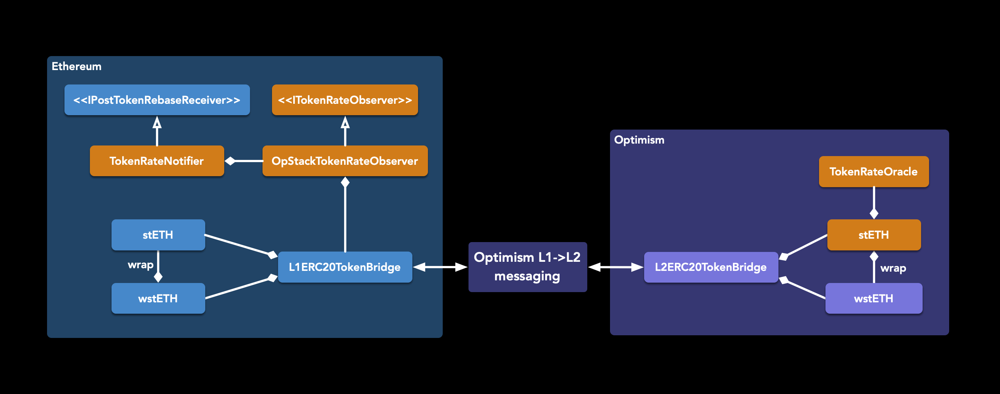
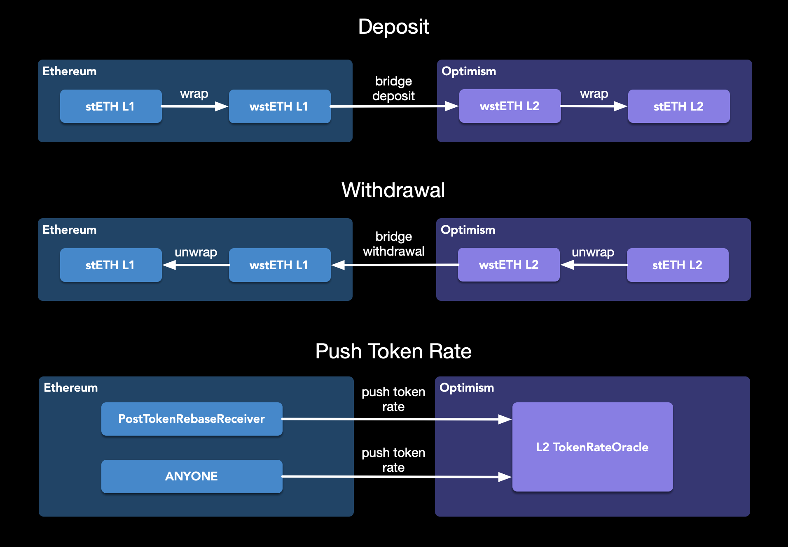
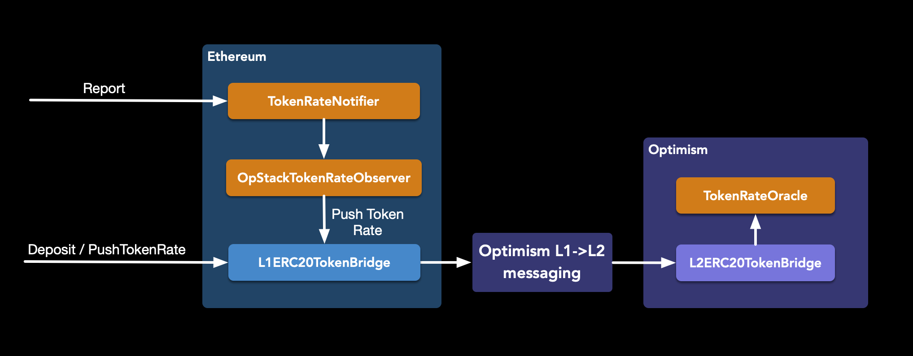
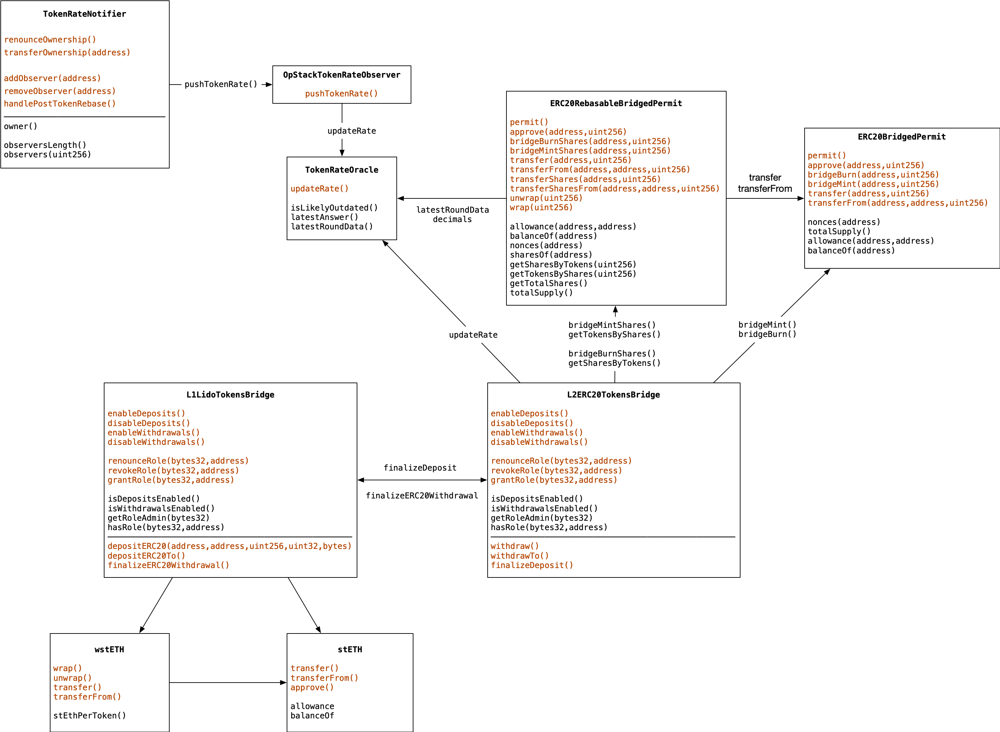

# LIP-22. stETH on L2

## Simple Summary

Propose an architecture framework for the rebasable stETH token on L2 to be used across various Ethereum Layer 2 (L2) networks. The idea is to create a canonical version of stETH on these networks, being wrapped on top of wstETH (sort of 'wrapped twice'). This approach will streamline the process of moving stETH across Ethereum rollups, making use of the existing wstETH infrastructure and liquidity venues on L2 networks.

As a practical example, explore a design of upgrading the wstETH custom bridge on the Optimism network. The design relies on the previously presented [`lido-l2`](https://github.com/lidofinance/lido-l2/tree/main/contracts/optimism) reference architecture.

## Abstract

The 'lock-and-mint' wstETH bridge extension (i.e., [`lido-l2`](https://github.com/lidofinance/lido-l2/tree/main/contracts/optimism)) introduces a set of the new bridging flows:

#### Bridging stETH from L1 to L2

User locks stETH, and the bridge contract wraps it into wstETH. The amount of wrapped tokens is then forwarded through the already implemented wstETH bridging path (e.g., [wstETH on Optimism](https://github.com/lidofinance/lido-l2/blob/277631b5b323312f57fc1aed7ec79e75f4b7e912/contracts/optimism/L1ERC20TokenBridge.sol#L46)) with the intent to have stETH on the L2 end. Therefore, the L2 bridge mints wstETH and wraps it back to stETH.

The design facilitates the L2 stETH bridged amount is being the same as was sent from L1 in most cases by attaching the token rate data with each bridging request.

#### Bridging back stETH from L2 to L1

The bridge transfers stETH from a user upon request,  unwraps it to wstETH, and burns that wstETH on L2 side. The amount of burned tokens is then forwarded through the established path with the goal of receiving stETH on the L1 end. To achieve this, the L1 bridge, in turn, unlocks wstETH and unwraps it to stETH.

Since the withdrawal process can take up to a week (a common case for optimistic rollups), it's expected that the stETH amount will be different on the L1 side upon the withdrawal completion due to rebases happened during the withdrawal delay (i.e., challenge period) of a rollup, and user rewards/penalties will be attributed properly.

#### Forwarding the `wstETH/stETH` in-protocol rate from L1 to L2

Include the token rate as a part of the calldata in each L1 to L2 bridging request. This involves incorporating the L1 `block.timestamp` and utilizing the information from https://docs.lido.fi/contracts/wsteth#getstethbywsteth.

Furthermore, allow permissionless token rate updates to be sent from L1 to L2 with a zero token amount escrowing.

It's also suggested to push the token rate as a part of each `AccountingOracle` report (upon the `submitReportData` transaction execution).

#### Emergency flow

It's assumed that a rollup allows to perform force inclusion of the transaction in case of rogue or stale sequencer. To achieve this, the same approach of `L1->L2` messaging is used, while the inclusion itselft is guaranteed when the sequencing window duration passes (12h for Optimism, 24h for Arbitrum).

It's also assumed that general rollup failures and communication loss of `L1->L2` messaging would mean that L2 blocks are not produced and the L2 state is not going forward. Also, the design presumes that no fraud L2 transactions are included.

## Design assumptions and invariants

#### Risks not concerned
- fraud transactions
- rollup spec violations, including:
    - loss of L1->L2 messaging
    - loss of block production for 24h+

#### Risks addressed
- sequencer failure (outage, censor, clogging)
- reorganization on L1
    - either L2 would be reorganized too, or the deposit window duration would ensure that the L1 rate is settled (the report epoch is finalized)
- bridge endpoint contract has been upgraded and changed (incl. maliciously)
- L1->L2 transactions might be reordered when claimed on the L2 side (attaching timestamps to rate delivery messages to make them ordered for the token rate oracle)
- token rate on L2 might be delayed up to 2 oracle reports
    - each oracle report might happen after finalizing the daily reference slot
    - the worst case is when the oracle report happens just before the new reference slot, and the next report for this new slot happens ~30 minutes after

#### Invariants upheld
- the token rate on L1 can never be older than on L2
- the token rate submission is permissionless, L1 onchain contracts are the source of truth
- no new trusted parties and trust assumptions for a token rate submission

## Motivation

The wstETH token has been successfully integrated on various L2s: Optimism, Arbitrum, Base, zkSync Era, Linea, Mantle providing the ultimate easiness for DeFi integrations being a straightforward value-accruing token using the 'lock-and-mint' L1→L2 bridging approach.

In contrast to wstETH, stETH depends on the rate changes to recalculate each user's balance (e.g., perform a rebase). There is an essential UX property: the stETH token balance represents the underlying Ether value expected to be redeemed 1:1 via the protocol upon a withdrawal request.

Beyond just updating an account's balance in the wallet, having rebasable stETH on L2 hypothetically unlocks the following use cases and scenarios:
- staking/withdrawal requests originated from L2s with accuracy accounting for the stETH rebases that occurred during the bridging period
- performing gas payments in stETH with amounts corresponding to ether on rollups that opted in to support token gas payments (e.g., following the Account Abstraction)
- cross-domain stETH deposits/withdrawals (L1 and L2s) for CEXes
- custodians and service providers to support L2s directly (DeFi interactions, deposits/withdrawals) as they can charge fees with each rebase while users still see their balance changing each day
- once main routine user activity migrated from L1 to L2, there should be UX available as it was previously (rebasable token)

## Specification for stETH on Optimism

The scheme outlines a place of a new rebasable token on L2 (an orange square stETH on the Optimism side) and rate oracle contracts in a [current architecture](https://github.com/lidofinance/lido-l2).



Three main flows are presented on the following diagram:



### Rebasable token (stETH on L2)

#### StETH token on L2 is a wrapped wstETH
L2 stETH can be minted by calling the `StETH.wrap` method which requires locking L2 wstETH. To unlock L2 wstETH back, one should call `StETH.unwrap`, burning L2 stETH.

#### Function: `wrap`
Returns amount of L2 stETH user receives after wrap.
```solidity
function wrap(uint256 amount_) external returns (uint256)
```
Locks the provided amount of L2 wstETH token on the contract, mints L2 stETH token in return. The amount of L2 stETH tokens is calculated using `TokensByShares = shares[user] * tokensRate` formula.

- reverts if `amount_` is zero;
- reverts if `msg.sender` is zero address;
- reverts if `wrappedToken` doesn't not have enough allowance to transfer `msg.sender` tokens;
- reverts if `msg.sender` does not have enough balance;

##### Parameters

| Name       | Type      | Description |
| --------   | --------  | -------- |
| `amount_` | `uint256` | amount of L2 wstETH token to wrap in exchange for L2 stETH token |


#### Function: `unwrap`
Returns amount of L2 wstETH user receives after unwrap.
```solidity
function unwrap(uint256 amount_) external returns (uint256)
```
Burns the provided L2 stETH token amount, unlocks the previously locked L2 wstETH token corresponding amount from the contract. The amount of L2 stETH tokens is calculated using `SharesByTokens = tokenAmount_ / tokensRate` formula.

- reverts if `amount_` is zero;
- reverts if `msg.sender` is zero address;
- reverts if `msg.sender` does not have enough shares to burn;
- reverts if `wrappedToken` does not have enough tokens to transfer to `msg.sender`;

##### Parameters

| Name       | Type      | Description |
| --------   | --------  | -------- |
| `amount_` | `uint256` | amount of L2 stETH token to wrap in exchange for L2 wstETH token |

#### Balance
The balance of the stETH token on L1, normally, gets recalculated [daily when the Lido oracle reports](https://docs.lido.fi/contracts/accounting-oracle#report-cycle) the Beacon Chain ether balance update. Its amount depends on the total amount of pooled Ether and the total amount of [shares](https://docs.lido.fi/guides/lido-tokens-integration-guide#steth-internals-share-mechanics). Treating L1 as the source of truth, a new rebasable token on L2 can also store shares and calculate balance using pushed from L1 `wstETH/stETH` token rate. Here, it is essential to notice that the wstETH token represents the account's share of the stETH total supply. Thus, share and wstETH are similar concepts.

#### Function: `balanceOf`
Returns the amount of L2 stETH tokens owned by `account_`.
```solidity
function balanceOf(address account_) external view returns (uint256)
```

Returns the amount of tokens owned by `account_`. Since the token rate that is passed from L1 to L2 is stETH:wstETH proportion, the balance of stETH on L2 can be calculated using `balanceOf(user) = shares[user] * tokensRate` formula.

##### Parameters

| Name       | Type      | Description |
| --------   | --------  | -------- |
| `account_` | `address` | an address for whom to query the balance |

#### Bridging helpers
To deposit or withdraw stETH on L2, the bridge should be able to mint and burn L2 stETH using shares. The following functions facilitate these actions:

#### Function: `mintShares`
Returns total amount of shares.
```solidity
function mintShares(address account_, uint256 amount_) external returns (uint256)
```
Creates `amount_` shares and assigns them to `account_`, increasing the total shares supply. Authorized only to be called on behalf of the bridge.

- reverts if `msg.sender` isn't bridge;
- reverts if `msg.sender` is zero address;

##### Parameters

| Name       | Type      | Description |
| --------   | --------  | -------- |
| `account_` | `address` | an address of the account to mint shares |
| `amount_` | `uint256` | an amount of shares to mint |


#### Function: `burnShares`
Returns total amount of shares.
```solidity
function burnShares(address account_, uint256 amount_) external
```

Destroys `amount_` tokens from `account_`, reducing the total supply. Authorized only to be called on behalf of the bridge.

- reverts if `msg.sender` isn't bridge;
- reverts if `msg.sender` is zero address;
- reverts if `account_` does not have enough shares to burn;

##### Parameters

| Name       | Type      | Description |
| --------   | --------  | -------- |
| `account_` | `address` | an address of the account to burn shares |
| `amount_` | `uint256` | an amount of shares to burn |

### L1 bridge

#### Function: `depositERC20To`

The deposit method of the L1 bridge will remain unchanged as it is required to conform to the same interface to maintain compatibility with the Optimism UI. However, if the user passes the stETH tokens, it wraps L1 stETH into L1 wstETH, sends it across, and then unwraps it to L2 stETH on the other side.

#### Function: `pushTokenRate`
Pushes token rate by depositing zero stETH tokens.
```solidity
function pushTokenRate(uint32 l2Gas_) external
```
Permissionless to call. Allows to push token rate even when deposits are disabled, unlike the `depositERC20()` and `depositERC20To()` functions.

- emits `ERC20DepositInitiated` event;

#### Parameters

| Name       | Type      | Description |
| --------   | --------  | -------- |
| `l2Gas_` | `uint32` | Gas limit required to complete the deposit on L2 |


### Token Rate Oracle
As mentioned before, for calculating L2 stETH token balance, the `wstETH/stETH` token rate is required. Therefore, a token rate oracle contract on L2 is placed to receive, store, and fetch the token rate. The fetching interface follows the Chainlink data feeds API, a widely adopted standard that will simplify integration in the future.

#### Function: `latestRoundData`
Returns the latest token rate data.
```solidity
function latestRoundData()
    external
    view
    returns (
        uint80 roundId,
        int256 answer,
        uint256 startedAt,
        uint256 updatedAt,
        uint80 answeredInRound
    )
```

As previously mentioned, L1 serves as a source of truth. Therefore, each time a token rate is pushed from L1, a timestamp can be stored in the oracle. This timestamp can later be used by clients as a flag of token rate freshness.

Returns:
* `roundId` is a unique id for each answer. The value is based on timestamp.
* `answer` is `wstETH/stETH` token rate.
* `startedAt` is time when rate was pushed on L1 side.
* `updatedAt` is is the same as startedAt.
* `answeredInRound` is the same as roundId.

#### Function: `latestAnswer`
```solidity
    function latestAnswer() external view returns (int256)
```
Returns the latest token rate.

#### Function: `decimals`
```solidity
    function decimals() external view returns (uint8)
```
Represents the number of decimals the oracle responses represent.

#### Function: `updateRate`
```solidity
    function updateRate(int256 rate, uint256 rateL1Timestamp) external
```
Updates token rate. To guarantee the updating of the rate with the most recent value, it is necessary to supply it with the `rateL1Timestamp`.
Permission to make calls is granted to the L2 bridge only.

#### Parameters

| Name       | Type      | Description |
| --------   | --------  | -------- |
| `rate` | `int256` | the `wstETH/stETH` token rate |
| `rateL1Timestamp` | `uint256` | is the L1 timestamp when provided rate was updated |

### Token bridge contracts

#### Deposit and withdrawal flows
Although the interface of both bridge contracts won't change, as it is a requirement of Optimism bridges, modifications are needed in the implementation of the deposit and withdraw methods. The most interesting aspect here is packing rate and its timestamp into a single message and transmitting it across layers. This can be achieved through the Optimism Cross-Domain Messenger, which involves a specialized contract and an Optimism service to facilitate the process. The following pseudocode explains how it works.

```bash
function deposit(to, amount)
    transfer stETH tokens user => bridge
    convert stETH to wstETH
    pack rate and its timestamp to the bytes array
    send crossdomain message with wstETH tokens and packed data
    mint L2 stETH tokens using received wstETH amount and unpacked rate on L2 side

function withdraw(from, amount)
    burn L2 stETH tokens using shares
    send crossdomain message to finish withdraw on L1 side
    convert wstETH to stETH
    transfer stETH tokens back from bridge to user on L1
```

#### Updating the token rate



There are two options to deliver the `wstETH/stETH` token rate from L1 to L2 permissionlessly:
##### Option 1. Send the rate with each `wstETH/stETH` token deposit message from L1 to L2

The L1 bridge retrieves the token rate using the `StETH.stEthPerToken()` function, encoding it with the current timestamp into a byte array. Subsequently, the bridge transmits this byte array, along with the token addresses intended for the deposit and other deposit-related data, to the Optimism cross-bridge messenger. On the L2 side, the bridge receives deposit data, verifies its initiation for the wstETH token, fetches the rate timestamp, and updates it for `TokenRateOracle`. This process ensures that the L2 side can mint the accurate amount of rebasable tokens and use the correct rate for subsequent wrap/unwrap operations.

##### Option 2. Allow sending the token rate with zero token amount escrowed

By only incurring the transaction fee, this creates a permissionless way of updating the token rate on L2. This way isn't affected by paused deposits.


###### Automatic token rate delivery

To fortify token rate delivery, the proposal suggests utilizing the core Lido protocol to transmit the token rate whenever a rebase event takes place. This requires developing a contract adapter that conforms to the [`IPostTokenRebaseReceiver`](https://github.com/lidofinance/lido-dao/blob/cadffa46a2b8ed6cfa1127fca2468bae1a82d6bf/contracts/0.4.24/Lido.sol#L20-L30) protocol, thereby replacing the outdated [`LegacyOracle`](https://docs.lido.fi/contracts/legacy-oracle/) contract.

When a rebase event occurs, the adapter can forward the token rate to a list of contracts, each responsible for executing deposit transactions for specific rollup solutions. The currently solution is focused mainly on Optimism. `TokenRateNotifier` should manage reverts during calls to each observer to ensure the oracle report remains uninterrupted. Additionally, it should emit an event upon failure.

```solidity
interface IPostTokenRebaseReceiver {
    function handlePostTokenRebase(
        uint256 _reportTimestamp,
        uint256 _timeElapsed,
        uint256 _preTotalShares,
        uint256 _preTotalEther,
        uint256 _postTotalShares,
        uint256 _postTotalEther,
        uint256 _sharesMintedAsFees
    ) external;
}

interface ITokenRateObserver {
    function handleTokenRebased();
}

contract OpStackTokenRateObserver is ITokenRateObserver {
    function handleTokenRebased() {
        bridge.pushTokenRate();
    }
}

contract TokenRateNotifier: IPostTokenRebaseReceiver {
    function registerObserver(address observer_);

    function handlePostTokenRebase() {
        _notifyObservers();
    }
}
```

## Rationale

As was mentioned before, non-rebasable token (wstETH on L2) was already implemented, tested, and integrated, and the user can deposit/withdraw it using the custom bridges available for wstETH on L2 projects.

The proposed design doesn't require a separate bridging architecture rather relying on the existing wstETH upgradable one. Therefore, one can treat stETH bridging parts as a kind of plugin for the previously developed wstETH bridge solution.

### Why stETH is wrapped wstETH

stETH and wstETH allows participating in the same protocol on the same rules and assumptions. Therefore, the both tokens should be convertible to each other through the in-protocol interfaces and contracts not involving secondary markets and 3rd-parties.

wstETH on L1 is the non-upgradable wrapped version of stETH. However, wstETH token balance corresponds to the shares balance of stETH while stETH balance is changing according to the `token_rate`: `shares x token_rate`. Hence, it could have been quite solid to have the same architecture for L2 as well: wstETH is the primary token, and stETH is its wrapped version.

If it was decided to sunset stETH on L2 at some point, there would be a straightforward pass to migrate back to wstETH (just unwrapping the tokens).

### Rate delivery flow L1->L2

#### Deposit flow

A regular flow allows pushing the token rate through the standard rollup messaging service. The best part here is that passing the rate together with each bridging request provides an expectation (although, might be violated in rare cases) that the user receives the same amount of stETH on L2 that he was locked on the L1 side before.

The additional gas required for packing and transmitting token rate in each deposit is approximately 50k, which, compared to the total deposit transaction cost of around 670k, constitutes only an 8% increase. This increase is considered a tolerable amount for users to bear.

The rate delivery is permissionless and derives the same flow as the token bridging request already has.

#### Rate delivery as a part of the `AccountingOracle` report

Sending deposit transactions directly from the core protocol to the Optimism portal brings several advantages:
- Seamless integration: No new services needed to maintain and operate manually (outside of the core protocol).
- DAO involvement: the new L2 token comes with an explicit vote to support it.
- Guarantee of delivery: According to the Optimism specification, sending deposit transactions to `OptimismPortal` ensures fault-tolerant (wrt Sequencer issues) delivery to Layer 2.


### Storage layout and versions

Given that L2 wstETH has already been deployed on certain rollups, it's crucial to consider upgrades without disrupting the existing storage state. Below is a list of current contracts along with their hierarchy and storage types.

| Contract | Storage |
| -------- | ------- |
|`L1ERC20ExtendedTokensBridge`/`L2ERC20ExtendedTokensBridge`|no storage except inherited|
|&nbsp;&nbsp;\|_`BridgingManager`|mixed storage |
|&nbsp;&nbsp;\|_`RebasableAndNonRebasableTokens`|no storage|
|&nbsp;&nbsp;\|_`CrossDomainEnabled`|no storage|
|&nbsp;|&nbsp;|
|`ERC20Bridged`|no storage variables except inherited|
|&nbsp;&nbsp;\|_`ERC20Core`|linear storage: totalSupply, balanceOf, allowance|
|&nbsp;&nbsp;\|_`ERC20Metadata`|unstructured storage: Struct {name, symbol}|

It's evident that there is no consistent approach in organizing the storage layout. For new implementations and upgrades, it's recommended to adopt a single approach, favoring unstructured storage. Thus, here is a list of new and upgraded contracts with their storage types. There is no `TokenRateNotifier` and `OpStackTokenRatePusher` since they are going to be used without proxy.

| Contract | Storage |
| -------- | ------- |
|`L1ERC20ExtendedTokensBridge`/`L2ERC20ExtendedTokensBridge`|no storage variables except inherited|
|&nbsp;&nbsp;\|_`BridgingManager`|mixed storage|
|&nbsp;&nbsp;\|_`RebasableAndNonRebasableTokens`|no storage variables|
|&nbsp;&nbsp;\|_`CrossDomainEnabled`|no storage variables|
|`TokenRateOracle`|unstructed storage|
|&nbsp;&nbsp;\|_`CrossDomainEnabled`|no storage variables|
|&nbsp;|&nbsp;|
|`ERC20BridgedPermit`||no storage variables except inherited|
|&nbsp;&nbsp;\|_`ERC20Bridged`||no storage variables except inherited|
|&nbsp;&nbsp;&nbsp;&nbsp;&nbsp;\|_`ERC20Core`|linear storage: totalSupply, balanceOf, allowance|
|&nbsp;&nbsp;&nbsp;&nbsp;&nbsp;\|_`ERC20Metadata`|unstructured storage: Struct {name, symbol}|
|&nbsp;&nbsp;\|_`PermitExtension`|unstructured storage: Struct {name, verions}, noncesByAddress|
|&nbsp;&nbsp;&nbsp;&nbsp;&nbsp;\|_`EIP712`|no storage variables|
|&nbsp;|&nbsp;|
|`ERC20RebasableBridgedPermit`|no storage variables except inherited|
|&nbsp;&nbsp;\|_`ERC20RebasableBridged`|unstructured storage: tokenAllowance, shares, totalShares|
|&nbsp;&nbsp;&nbsp;&nbsp;&nbsp;\|_`ERC20Metadata`|unstructured storage: Struct {name, symbol}|
|&nbsp;&nbsp;\|_`PermitExtension`|unstructured storage: Struct {name, verions}, noncesByAddress|
|&nbsp;&nbsp;&nbsp;&nbsp;&nbsp;\|_`EIP712`|no storage variables|

### Scheme with all contracts and their API


### Upgradeability and ownership

The following expectations are set for the design described.

##### Contracts upgradeable by the Lido DAO Agent

- Both wstETH and stETH tokens upgradeable by the Lido DAO Agent.
- Token bridges contracts upgradeable by the Lido DAO Agent.
- `TokenRateOracle` upgradeability is achieved by an immutable variable stored inside the L2 stETH token contract.
- `TokenRateNotifier` upgradeable by the Lido DAO Agent.

##### Pausable and resumable

- Token bridges pausable and resumable by the Lido DAO Agent
- Token bridges are pausable by the Emergency breaks msig
- Proving a token rate on L2 by the emergency msig earlier

## Security considerations

### Pause Token Rate Oracle

#### Reason
The design offered earlier allows updating the token rate (sourced from L1 wstETH) on the L2 TokenRateOracle by either depositing tokens through a bridge or directly pushing the token rate via the TokenRateNotifier. Deposits can always be paused by the "deposits enabler" role, but pushing token rate cannot be paused. However, there is a risk that the protocol could be compromised, resulting in a malicious token rate being applied. To mitigate this risk, adding a pause feature to the TokenRateOracle updates is proposed. This feature would enable a reaction to any applied malicious token rate. Additionally, making the TokenRateOracle suspendable would facilitate easier future upgrades of the TokenRateOracle.

#### Describe Pause mechanism
Simply pausing the TokenRateOracle update and retaining the already applied rate will not resolve the issue of an incorrect rate, as it has already been applied. There should be a mechanism to revert the rate to its previous value. The past value should be recent enough for the committee to respond effectively but not so old that it allows the committee to manipulate the rate. Reverting the rate to its value from one day prior seems reasonable, as it aligns with the original design assumptions. As for the resuming method, it should be called with the most recent token rate.

#### Technical details
Pause method should be called with rate element index, the rate should be applied if the index corresponds to the last element, or if the element is not older (i.e., refreshed) than one day. Any remaining elements would be deleted as they are considered malicious. Additionally, to prevent the array from being filled with many elements (which could be difficult to delete due to gas usage), the update rate should be filtered based on the frequency of rate updates.

To understand how pause/resume will work, let's examine a table of typical data that the updateRate function will be called with, and what exactly the oracle will store.

| Rate       | L1TimeUpdate      | L2TimeReceived |
|--------|--------|--------|
|Report 1 happened|
|1.1|0 days|0 days + 1 hour|
|1.1|0 days|0 days + 2 hours|
|1.1|0 days|0 days + 3 hours|
|....|
|1.1|0 days|0 days + 23 hours|
|Report 2 happened|
|1.2|1 day|1 day + 1 hour|
|1.2|1 day|1 day + 2 hours|
|1.2|1 day|1 day + 3 hours|
|....|
|1.2|1 day|1 day + 23 hours|
|3rd report delayed|
|1.2|1 day|2 days + 1 hours|
|1.2|1 day|2 days + 2 hours|

TokenRate stores in the array all elements in the format [TokenRate + L1TimeUpgrade + L2TimeReceived], ensuring not to add elements with the same L1TimeUpgrade value. After this input, the array of token rates will look like this: `[{1.1, 0d, 0d+23h}, { 1.2, 1d, 2d+2h}]`. Considering all the logic described above and input data, it will be possible to revert only to the last element with a pause.

#### Pause impact on protocol
Pause won't revert the transaction and just emits an event if a token rate update is called. Here are deposit/withdrawal/rate pause combinations and what impact on protocol they have.

| Deposit/Withdrawal Disabled | TokenRateOracle Paused| result |
|--------|--------|--------|
|false|false|everything works, deposit, withdrawals and pushing rate|
|false|true|Since oracle pause doesn't revert users can deposit/withdrawal but rate won't be updated.|
|true|false|users can't deposit/withdrawal but pushing rate by TokenRateNotifier is still possible|
|true|true|both flows are paused|


### Cross-domain token rate arbitrage

#### Risks analysis

Centralized exchanges supporting stETH on several chains might be used to quickly transfer stETH between supported chains and arbitrage the rebase rate. The arbitrage scheme is quite simple: deposit stETH to a CEX on the chain where rebase already happened and immediately withdraw this stETH amount on the chain where rebase has not happened yet. This will result in receiving more stETH shares and harvesting rebase for the second time on the new chain in the same day.

This arbitrage scheme might be used on a daily basis between the Ethereum Mainnet and L2s given that the rebase data delivery from the Ethereum Mainnet to most popular Ethereum L2s takes ~15-20 minutes while the ERC20 deposit+withdrawal combination on major CEXes might be completed in 24 blocks or ~5 minutes.

**Potential profit for an arbitrageur and potential loss for a CEX for 1 arbitrage iteration = stETH daily rebase ratio (~0.01% on average in late 2023) * stETH inventory held by a CEX on the L2 with slow rebase delivery.**
Negative stETH rebase might be fully avoided by following the reverse scheme: deposit stETH to a CEX on the chain where rebase has not happened yet and immediately withdraw this stETH amount on the chain where rebase has already happened to receive more shares.

#### Preventing arbitrage losses

It's recommended to always bridge assets from L1 to L2 using the native bridge instead of going to market. By doing that, one can enjoy the best token rate available, propagating it to the L2 side.

Centralized and decentralized cryptocurrency exchanges, which enable withdrawals while bypassing the native bridge to chains where the token rate has not yet been delivered, may face unfair arbitrage losses.

To mitigate this risk, it's recommended either:
- **always check that the destination L2 token rate is up to date with L1**, otherwise push the rate permissionlessly through the native bridge and wait until it is updated
- use shares-based (wstETH) bookkeeping as the transfer units

## Reference implementation for wstETH on Optimism

- An early [PR draft](https://github.com/lidofinance/lido-l2/pull/58) to the `lido-l2` reference implementation repo.

## Links and references

- wstETH on Optimism [reference spec](https://github.com/lidofinance/lido-l2/tree/main/contracts/optimism)
- [Lido rebase](https://docs.lido.fi/contracts/lido#rebase) docs
- [AccountingOracle](https://docs.lido.fi/guides/lido-tokens-integration-guide#accounting-oracle) integration notes
- stETH on L1: [share mechanics](https://docs.lido.fi/guides/lido-tokens-integration-guide#steth-internals-share-mechanics)
