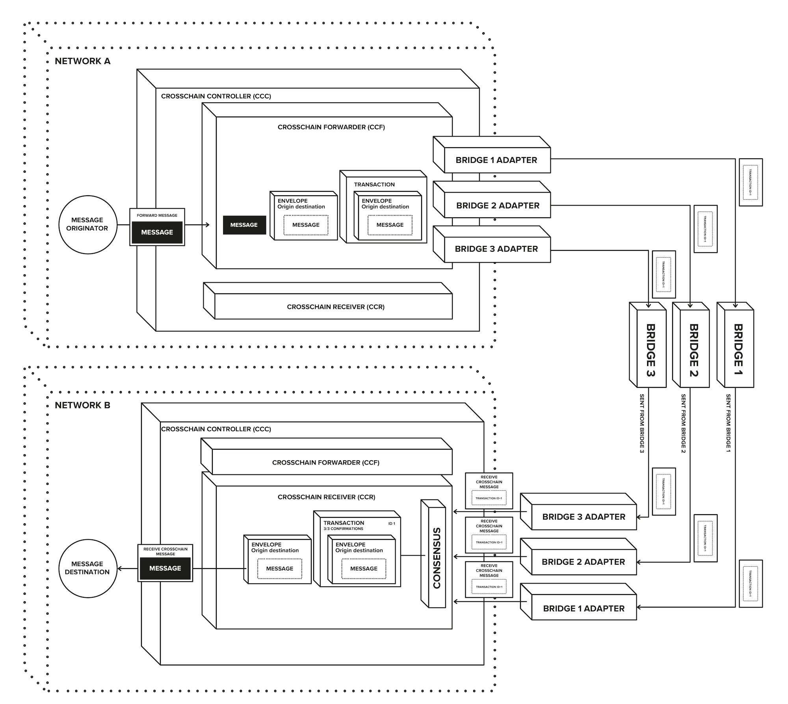

# LIP-24: Governance decision forwarding to non-L2 networks using AAVE Delivery Infrastructure

## Simple Summary

This document advocates for implementing AAVE Delivery Infrastructure (a.DI) as the cross-chain communication abstraction layer for Lido's governance decisions one-way forwarding from Ethereum mainnet to non-L2 networks.

## Motivation

Currently, Lido's governance system forwards its decisions to Layer 2 (L2) networks seamlessly, utilizing canonical bridges without adding additional trust assumptions while governance motions are processed on L2 networks.

For decentralized networks like, for example, BNB Chain (BSC), the current approach is not feasible without compromising security. This is because there is no secure and reliable method for transmitting governance decisions due to lack of a dedicated canonical bridge with the security 1:1 matched to the network consensus rules. Using only a single 3rd-party bridge service could lead to the risk of vendor lock-in and complete dependence on the good intentions of the bridge operator, which is not a desirable situation.

Using a.DI as the transport layer to forward Lido's governance decisions to non-L2 networks aims to mitigate existing limitations and address specific challenges associated with governance on side-chains or separate chains through several vital benefits

- DAO decisions are autonomously verified using meta-consensus mechanisms, making aspects like the risk profile of the underlying bridges less critical.
- Smart contracts enable the execution of actions without intermediaries, making the execution process secure and trustworthy. This is unlike multi-sig wallets, which require intermediaries to execute them.
- This framework is battle-tested by AAVE, one of the largest DeFi protocols on  Ethereum and cross-chain ecosystems.
- Motion execution might be compatible with the currently rolled-out governance forwarders' format used extensively on L2 networks for wstETH deployments.
- a.DI provides a scalable framework for future growth, accommodating expansion by fast new bridges and blockchain network integrations.

## Specification

### a.Di framework overview

> The main idea of a.DI is the ability to aggregate multiple 3rd-party bridges together as a transport layer with built-in redundancy (i.e., having a quorum threshold to consider the message being valid and delivered) for transferring messages from one network to another.

The concept of a.DI is simple and can be seen in the image below. It is designed to be DAO-friendly and functions as a "black box," which means that users can dispatch a message through a simple interface without having an in-depth understanding of the underlying system. The message is then consistently received on the destination network from the same contract, ensuring a smooth cross-chain communication process.



Full a.DI specification can be found here: https://github.com/bgd-labs/aave-delivery-infrastructure/blob/main/docs/overview.md


### Motions forwarding and execution using a.DI

The current process for Lido governance across different L2 chains involves using mainnet transactions and an `L2Executor` contract that is deployed on the L2 chain to execute governance commands. It has been suggested that the execution process of non-L2 governance motions will be compatible with the one used for forwarding governance on L2 chains. Therefore, a.DI will be used as a delivery layer for non-L2 networks, and once it has meta-consensus on the message received from the Ethereum [Lido DAO Agent](https://etherscan.io/address/0x3e40D73EB977Dc6a537aF587D48316feE66E9C8c), it will forward the message to the `CrossChainExecutor` contract on the target network. This contract will then act on behalf of the DAO will, executing the motions in the same way as it is done for L2 chains, using the same flow and message wiring formats.

### Forwarding DAO motion 

To forward a motion to a non-L2 network, the DAO should call the `forwardMessage` function on the `CrossChainController` contract living on Ethereum. The function should specify the `destinationChainId`, `receiver` (which is the `CrossChainExecutor` on the target network), `executionGasLimit`, and encoded motion payload `message` for `CrossChainExecutor` in the same format that it's used currently for L2 networks.

```solidity=
/**
 * @notice method that will bridge the payload to the chain specified
 * @param receiver address of the receiver contract on destination chain
 * @param executionGasLimit amount of the gas limit in wei to use for delivering the message on destination network. Each adapter will manage this as needed.
 * @param destinationChainId id of the destination chain in the bridge notation
 * @param message to send to the specified chain
 * @return the third-party bridge entrypoint, the third-party bridge message id
 */
function forwardMessage(
  address receiver,
  uint256 executionGasLimit,
  uint256 destinationChainId,
  bytes calldata message
) external returns (address, uint256);
```

### CrossChainExecutor

The `CrossChainExecutor` contract is based on the [`BridgeExecutorBase`](https://github.com/lidofinance/governance-crosschain-bridges/blob/master/contracts/bridges/BridgeExecutorBase.sol) contract utilized for a myriad of wstETH on L2 projects, so the motion execution process will be the same. It also implements the `IBaseReceiverPortal` interface to support messages forwarding from `CrossChainReceiver` part of a.DI. Those messages are then enqueed for execution and must be executed separately.

```solidity=
interface IBaseReceiverPortal {
  /**
   * @notice method called by CrossChainController when a message has been confirmed
   * @param originSender address of the sender of the bridged message
   * @param originChainId id of the chain where the message originated
   * @param message bytes bridged containing the desired information
   */
  function receiveCrossChainMessage(
    address originSender,
    uint256 originChainId,
    bytes memory message
  ) external;
}
```

### Example setup for Binance Smart Chain (BSC) integration

The proposed setup for Lido is based on AAVE's current a.DI setup. However, the Emergency Mode has been removed to avoid centralization issues and msig management, lowering the setup's complexity.


| Configuration       | Binance Smart Chain                   |
|---------------------|---------------------------------------|
| **Direction**       | Forwarding only from Ethereum Mainnet |
| **Consensus**       | 3/4                                   |
| **Bridges**         | CCIP, HyperLane, LayerZero, Wormhole* |
| **Emergency Mode**  | Disabled                              |
| **Approved senders**| [DAO Agent](https://etherscan.io/address/0x3e40D73EB977Dc6a537aF587D48316feE66E9C8c) |


*_According to the community voting[^bcw], Wormhole and Axelar bridge adapters are approved to be used with BSC. a.DI does not provide Axelar adapter out of the box, but it does provide the one for Wormhole._

## Security Considerations

#### Audits

There are three major parts that has to be audited together as a single scope:

- The a.DI core `CrossChainController` smart contract responsible for data delivery/aggregation;
- Bridge adapters: CCIP, Hyper Lane, Layer Zero, Polygon Fx, Wormhole
- Governance decisions `CrossChainExecutor` contract

This is intended to be used by the Lido DAO to forward the Lido Governance on-chain executable actions from Ethereum to other networks, namely BSC.

- [Audit scope for MixBytes](https://hackmd.io/@lido/Hy8iK226T)
- Audit result from MixBytes: TBA

## Souce code and tests

- [Pull request](https://github.com/lidofinance/aave-delivery-infrastructure/pull/2) with the a.DI setup for Lido DAO governance decisions forwarding to BSC.

## Links and references

- a.DI (Aave Delivery Infrastructure) [source code](https://github.com/bgd-labs/aave-delivery-infrastructure)
- Lido L2 Governance Cross-Chain Bridges [source code](https://github.com/lidofinance/governance-crosschain-bridges)
- wstETH bridge on BNB [proposal](https://snapshot.org/#/lido-snapshot.eth/proposal/0xc12ae07242326a719cb6b6a5eb19cb77eb4515b4a5ebe58508f965a5b9abb27c)
