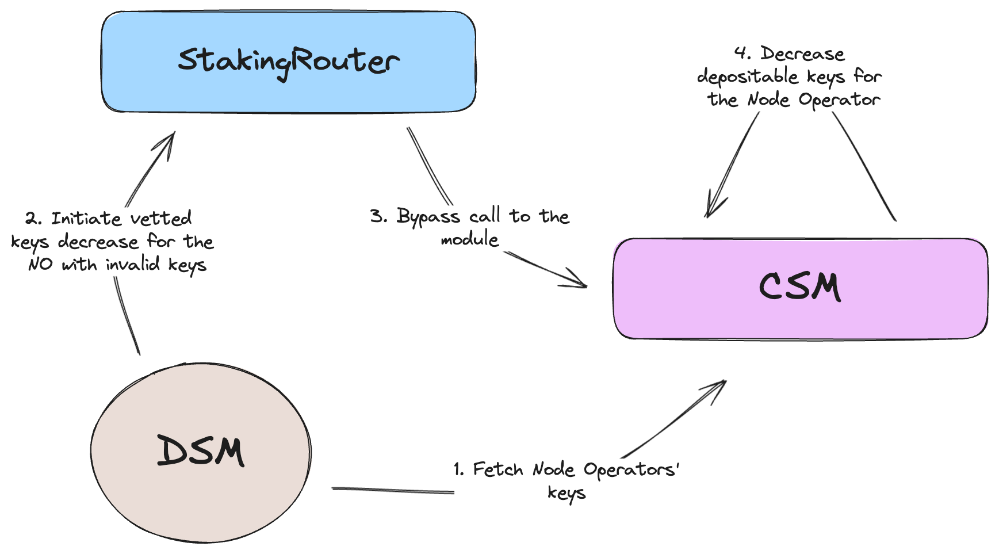

# LIP-26. Community Staking Module

## Simple Summary

This proposal introduces the Community Staking Module (CSM), a groundbreaking addition to the [Staking Router](https://research.lido.fi/t/lip-20-staking-router/3790) architecture as the first permissionless staking module. CSM facilitates open access to the Lido on Ethereum validator set, enabling solo and community stakers to participate under favorable conditions through the Early Adoption mechanics. This proposal provides an overview of CSM's development motivations and a comprehensive technical description of its architecture and implementation. It should be considered together with the [CSM Architecture](https://hackmd.io/@lido/rJMcGj0Ap).

## Motivation

The current permissioned nature of the Lido validator set limits participation from community stakers, which contradicts Ethereum's priority to encourage broader community involvement. To align with Ethereum's goals, it is essential to integrate a permissionless entry mechanism into the Lido on Ethereum Node Operator set, empowering solo stakers to engage with the protocol.

The proposed staking module, built upon the Staking Router architecture from the [Lido V2](https://blog.lido.fi/introducing-lido-v2/) upgrade, aims to open the Lido on Ethereum Node Operator set to permissionless entry. This will enhance solo-staker participation while ensuring that the protocol's security, reliability, and capital efficiency are maintained or improved.

## Specification

> Terms validator, key, validator key, and deposit data meanings are the same within the document

### General Architecture


As depicted in the scheme above, CSM is a set of Ethereum smart contracts and off-chain tools, namely:

#### Contracts

**`CSmodule.sol`** (CSM on the scheme) - a core module contract conforming to the `IStakingModule` interface. Stores information about Node Operators and deposit data (DD). This contract is used as an entry point for the Node Operators. It is responsible for all interactions with the `StakingRouter`, namely, the DD queue management and Node Operator's params.

**`CSAccounting.sol`** (Accounting in the scheme) - a supplementary contract responsible for the management of bond, rewards, and penalties. It stores bond tokens in the form of `stETH` shares, provides information about the bond required, and provides interfaces for the penalties.

**`CSVerifier.sol`** (Verifier on the scheme) - a utility contract responsible for the validation of the CL data proofs using EIP-4788. It accepts proof of the validator withdrawal and slashing events and reports these facts to the `CSModule.sol` if the proof is valid.

**`CSEarlyAdoption.sol`** (EarlyAdoption on the scheme) - a supplementary contract responsible for the Early Adoption members' verification. It validates if the address is eligible to create a Node Operator during the Early Adoption period or if the address is eligible to create a Node Operator with the discounted bond curve once the Early Adoption period is over. It stores information about eligible addresses that have already been used to create a Node Operator.

**`CSFeeDistributor.sol`** (FeeDistributor on the scheme) - a supplementary contract that stores non-claimed and non-distributed Node Operator rewards on balance and the latest root of a rewards distribution Merkle tree root. It accepts calls from `CSAccounting.sol` with reward claim requests and stores data about already claimed rewards by the Node Operator. It receives non-distributed rewards from the `CSModule.sol` each time the `StakingRouter` mints the new portion of the Node Operators' rewards.

**`CSFeeOracle.sol`** (FeeOracle on the scheme) - a utility contract responsible for the execution of the CSM Oracle report once the consensus is reached in the `HashConsensus.sol` contract, namely, transforming non-distributed rewards to non-claimed rewards stored on the `CSFeeDistributor.sol`, and reporting the latest root of rewards distribution Merkle tree to the `CSFeeDistributor.sol`.  Inherited from the `BaseOracle.sol` from Lido on Ethereum.

**`HashConsensus.sol`** - a utility contract responsible for reaching consensus between CSM Oracle members. Uses the standard code of the `HashConsensus` contract from the Lido on Ethereum.

**`CSMSettleELStealingPenalty.sol`** (EasyTrack on the scheme) - a utility contract responsible for the application of the reported EL stealing penalties. A part of the common `EasyTrack` setup within Lido on Ethereum.

**`GateSeal.vy`** (GateSeal on the scheme) - a utility contract responsible for the one-time pause of the `CSModule.sol`, `CSAccounting.sol`, and `CSFeeOracle.sol` contracts to prevent possible exploitation of the module through zero-day vulnerability. Pause can only be triggered once per GateSeal instance by the sealing committee, It is assumed that a dedicated CSM committee will be formed for that purpose. Created using `GateSealFactory` contract from Lido on Ethereum.

#### Off-chain tools

**`CSM Bot`** - a daemon application responsible for monitoring and reporting the withdrawal and slashing events associated with the CSM validators.

**`EL stealing detector`** - a daemon application or EOA responsible for detecting and reporting the EL stealing facts by the CSM validators. Assumed to be EOA controlled by the dev team at the early stages of the MEV monitoring software maturity and later converted to the automated bot to avoid false-positive activations.

**`CSM Oracle`** - an oracle [module](https://github.com/lidofinance/lido-oracle?tab=readme-ov-file#how-it-works) in the common Lido on Ethereum oracle set ([Accounting Oracle](https://docs.lido.fi/contracts/accounting-oracle) and [VEBO](https://docs.lido.fi/contracts/validators-exit-bus-oracle)). Operated by the existing oracles set alongside Accounting Oracle and Validator Exit Bus Oracle. It is responsible for the calculation of the CSM Node Operators' rewards distribution based on their attestation performance on the CL.

### Main flows

#### Create Node Operator


Node Operator creation is done using `CSModule.sol`. To avoid flooding of the module with empty Node Operators, at least one deposit data and corresponding bond amount is required to create a Node Operator. Prior to Node Operator creation, a required bond amount should be fetched from the `CSAccounting.sol`. Depending on the selected token, this amount should be:
- attached as a payment to the transaction (ETH);
- approved to be transferred by `CSAccounting.sol` (stETH, wstETH);
- included in permit data approving transfers by `CSAccounting.sol` (stETH, wstETH);

#### Upload deposit data


Node Operators can upload deposit data after Node Operator creation. Prior to uploading, the required bond amount should be fetched from `CSAccounting.sol`, and corresponding approvals, permits, or direct attachments as a payment should be performed the same way as for the [Node Operator creation](#Create-Node-Operator).

#### Delete deposit data


The node operator can request deposit data deletion if it has not been deposited yet. The Node Operator requests deposit data deletion from `CSModule.sol` to do it. `CSModule.sol` validates that deposit data has not yet been deposited. If deletion is possible `CSAccounting.sol` confiscate `deletionFee` from the Node Operator's bond.

#### Top-up bond without deposit data upload


CSM Node Operators can top-up bond at any time to have excess bond in advance or compensate for the penalties. Top-up is done via `CSModule.sol`. Once funds are transferred to `CSAccounting.sol`, `CSModule.sol` is informed about the bond amount change and corresponding changes in the depositable keys for the Node Operator to account for it.

#### Stake allocation

To determine the next portion of the validator keys to be deposited, CSM utilizes the FIFO queue. A description of the queue can be found in the [CSM Architecture](https://hackmd.io/gGRgZ0yeTnm-9SSFuHrXwg#Stake-allocation-queue) document and in a [separate spec](https://hackmd.io/@lido/ryw2Qo5ia).

##### Basic flow


Once uploaded, deposit data is placed in the queue. To allocate stake to the CSM Node Operators, `StakingRouter` calls the [`obtainDepositData(depositsCount)`](https://github.com/lidofinance/lido-dao/blob/master/contracts/0.8.9/interfaces/IStakingModule.sol#L140) method to get the next `depositsCount` [depositable keys](https://hackmd.io/gGRgZ0yeTnm-9SSFuHrXwg#Depositable-keys) from the keys queue.

##### Invalid keys



Due to [optimistic vetting approach](https://hackmd.io/gGRgZ0yeTnm-9SSFuHrXwg#Deposit-data-validation-and-invalidation-aka-vetting-and-unvetting), invalid keys might be present in the queue. DSM is responsible for the detection and reporting of invalid keys through `StakingRouter`. If invalid keys are detected, a call to `decreaseOperatorVettedKeys` is expected from `StakingRouter` to `CSModule.sol`.

#### Rewards distribution


`StakingRouter` mints rewards for CSM Node Operators on each report of the `AccountingOracle`. `CSModule.sol` bypasses minted rewards to the `CSFeeDistributor.sol`. Once the report slot is reached for the next CSM Oracle report, the rewards distribution tree is [calculated](https://hackmd.io/gGRgZ0yeTnm-9SSFuHrXwg#Performance-Oracle) by each Oracle member. After reaching the quorum, a new Merkle tree root is submitted to the `CSFeeDistributor.sol`, and the corresponding portion of the rewards is transferred from the non-distributed to the non-claimed state.

#### Rewards claim


Total rewards for the CSM Node Operators are comprised of [bond rewards and staking fees](https://hackmd.io/gGRgZ0yeTnm-9SSFuHrXwg#%F0%9F%A4%91-Step-2-Rewards). To claim the total rewards, the Node Operator needs to bring proof of the latest `cumulativeFeeShares` in the rewards tree. With that proof `CSAccounting.sol` pulls the Node Operator's portion of the staking fees from the `CSFeeDistributor.sol` and combines it with the Node Operator's bond. After that, all bond funds exceeding the bond required for the currently active keys are available for claim. 

Node Operator can transfer staking rewards to the bond without transferring it to the reward address by passing `0` as the amount requested for the claim.

If there are no new rewards to pull from the `CSFeeDistributor.sol` Node Operator can still claim excess bond using the same flow.

#### EL stealing penalty


If the Node Operator commits EL rewards stealing (or violates the [Lido MEV policy](https://research.lido.fi/t/discussion-draft-lido-on-ethereum-block-proposer-rewards-policy-2-0/3132/13)) the fact of stealing and stolen amount are reported to the `CSModule.sol` by the EL stealing detector actor. The corresponding amount of the bond funds is locked by the `CSAccounting.sol`. Node Operator can compensate for the stolen funds and fixed fee voluntarily. If the Node Operator does not compensate for the stolen funds, `EasyTrack` is started to confirm the penalty application. Once enacted, a penalty is applied (locked funds are burned), and the bond curve for the Node Operator is reset to the default one.

#### Slashing reporting


If one of the CSM validators is slashed, the CSM Bot will report it. The report is submitted to the `CSVerifier.sol` to validate proof against beaconBlockRoot. If the proof is valid, the report is bypassed to the `CSModule.sol`. `CSModule.sol` marks the validator as slashed and requests bond penalization for the Node Operator by `CSAccounting.sol`.

#### Withdrawal reporting


Once the CSM validator is withdrawn, the CSM Bot will report it. The report is submitted to the `CSVerifier.sol` to validate proof against beaconBlockRoot. If the proof is valid, the report is bypassed to the `CSModule.sol`. `CSModule.sol` marks the validator as withdrawn and requests bond penalization for the Node Operator by `CSAccounting.sol` if the withdrawal balance is lower than 32 ETH. If the withdrawn validator is slashed, the bond curve is reset to the default one for the Node Operator by `CSAccounting.sol`.


### Contracts specifications

#### [`CSModule.sol`](https://github.com/lidofinance/community-staking-module/blob/main/docs/src/src/CSModule.sol/contract.CSModule.md)

#### [`CSAccounting.sol`](https://github.com/lidofinance/community-staking-module/blob/main/docs/src/src/CSAccounting.sol/contract.CSAccounting.md)

#### [`CSVerifier.sol`](https://github.com/lidofinance/community-staking-module/blob/main/docs/src/src/CSVerifier.sol/contract.CSVerifier.md)

#### [`CSEarlyAdoption.sol`](https://github.com/lidofinance/community-staking-module/blob/main/docs/src/src/CSEarlyAdoption.sol/contract.CSEarlyAdoption.md)

#### [`CSFeeDistributor.sol`](https://github.com/lidofinance/community-staking-module/blob/main/docs/src/src/CSFeeDistributor.sol/contract.CSFeeDistributor.md)

#### [`CSFeeOracle.sol`](https://github.com/lidofinance/community-staking-module/blob/main/docs/src/src/CSFeeOracle.sol/contract.CSFeeOracle.md)

### Administrative actions

Community Staking Module contracts support a set of administrative actions, including:

- Changing the configuration options.
- Upgrading the system's code.

Each of these actions can only be performed by a designated admin (`DEFAULT_ADMIN_ROLE`) (set by a configuration option).

### Roles to actors mapping

#### `CSModule.sol`

| Role                                      | Assignee               |
| ----------------------------------------- | ---------------------- |
| `DEFAULT_ADMIN_ROLE`                      | Aragon Agent           |
| `PAUSE_ROLE`                              | Gate Seal contract     |
| `RESUME_ROLE`                             | Aragon Agent           |
| `MODULE_MANAGER_ROLE`                     | Aragon Agent           |
| `STAKING_ROUTER_ROLE`                     | StakingRouter contract |
| `REPORT_EL_REWARDS_STEALING_PENALTY_ROLE` | CS Multisig or Bot EOA |
| `SETTLE_EL_REWARDS_STEALING_PENALTY_ROLE` | Dedicated EasyTrack    |
| `VERIFIER_ROLE`                           | `CSVerifier.sol`       |
| `RECOVERER_ROLE`                          | Aragon Agent           |

#### `CSAccounting.sol`

| Role                          | Assignee                       |
| ----------------------------- | ------------------------------ |
| `DEFAULT_ADMIN_ROLE`          | Aragon Agent                   |
| `PAUSE_ROLE`                  | Gate Seal contract             |
| `RESUME_ROLE`                 | Aragon Agent                   |
| `ACCOUNTING_MANAGER_ROLE`     | Aragon Agent                   |
| `MANAGE_BOND_CURVES_ROLE`     | Aragon Agent                   |
| `SET_BOND_CURVE_ROLE`         | CS Multisig and `CSModule.sol` |
| `RESET_BOND_CURVE_ROLE`       | CS Multisig and `CSModule.sol` |
| `RECOVERER_ROLE`              | Aragon Agent                   |

#### `CSFeeDistributor.sol`
| Role                 | Assignee          |
| -------------------- | ----------------- |
| `DEFAULT_ADMIN_ROLE` | Aragon Agent      |
| `RECOVERER_ROLE`     | Aragon Agent      |

#### `CSFeeOracle.sol`
| Role                             | Assignee                |
| -------------------------------- | ----------------------- |
| `DEFAULT_ADMIN_ROLE`             | Aragon Agent            |
| `CONTRACT_MANAGER_ROLE`          | Aragon Agent            |
| `SUBMIT_DATA_ROLE`               | Not assigned by default |
| `PAUSE_ROLE`                     | GateSeal contract       |
| `RESUME_ROLE`                    | Aragon Agent            |
| `RECOVERER_ROLE`                 | Aragon Agent            |
| `MANAGE_CONSENSUS_CONTRACT_ROLE` | Aragon Agent            |
| `MANAGE_CONSENSUS_VERSION_ROLE`  | Aragon Agent            |

#### `HashConsensus.sol`
| Role                             | Assignee      |
| -------------------------------- | ------------- |
| `DEFAULT_ADMIN_ROLE`             | Aragon Agent  |
| `MANAGE_MEMBERS_AND_QUORUM_ROLE` | Aragon Agent  |
| `DISABLE_CONSENSUS_ROLE`         | Aragon Agent  |
| `MANAGE_FRAME_CONFIG_ROLE`       | Aragon Agent  |
| `MANAGE_FAST_LANE_CONFIG_ROLE`   | Aragon Agent  |
| `MANAGE_REPORT_PROCESSOR_ROLE`   | Aragon Agent  |
#### `CSEarlyAdoption.sol`
Roles are not used for this contract.

#### `CSVerifier.sol`
Roles are not used for this contract.

### Upgradability

`CSmodule.sol`, `CSAccounting.sol`,  `CSFeeOracle.sol`, and `CSFeeDistributor.sol` are upgradable using [OssifiableProxy](https://github.com/lidofinance/community-staking-module/blob/main/src/lib/proxy/OssifiableProxy.sol) contracts.

`CSVerifier.sol` is not upgradable and should be re-deployed if needed.

### Security considerations

#### Bond exposure to negative stETH rebase

The bond stored in stETH inevitably inherits all stETH features, including the possibility of a negative rebase. The effective bond amount (counted in ETH) will decrease in case of a negative rebase. This can lead to the case when a relatively large Node Operator might end up with unbonded keys. Also, it might result in an effective bond being lower than the bond required. Hence, Node Operators will lose part of their rewards.

#### Malicious Oracles can steal all unclaimed CSM rewards

A single updatable Merkle tree approach to the rewards distribution allows malicious Oracles to collude and submit a version of the Merkle tree, indicating that all rewards should be allocated to a single Node Operator (previously created by malicious actors). The worst-case scenario is when all unclaimed rewards stored on the CSM contract will be available for claim by a single Node Operator. 

### Known issues

#### Permissionless withdrawal reporting vulnerability

It is crucial to distinguish partial and full withdrawals to accept permissionless reports about validator withdrawals. For this purpose, the following condition is used (also used by Rocket Pool in [some form](https://github.com/rocket-pool/rocketpool/blob/6a9dbfd85772900bb192aabeb0c9b8d9f6e019d1/contracts/contract/minipool/RocketMinipoolDelegate.sol#L515)):
``` solidity
if (!witness.slashed && gweiToWei(witness.amount) < 8 ether) {
	revert PartialWitdrawal();
}
```
Unfortunately, there is a chance to trick this approach in the following way:
- Wait for full validator withdrawal & sweep
- Be lucky enough that no one provides proof for this withdrawal for at least 1 sweep cycle (~8 days with the network of 1M active validators)
- Deposit 1 ETH for slashed or 8 ETH for non-slashed validator
- Wait for a sweep of this deposit
- Provide proof of the last withdrawal

As a result, the Node Operator's bond will be penalized for 32 ETH - `additional deposit value`. However, all ETH involved, including 1 or 8 ETH deposited by the attacker will remain in the Lido on Ethereum protocol. Hence, the only consequence of the attack is an inconsistency in the bond accounting that can be resolved through the bond deposit approved by the corresponding DAO decision.

##### Resolution

Given no losses for the protocol, a significant cost of attack (1 or 8 ETH), and lack of feasible ways to mitigate it in the smart contract's code, it is proposed to acknowledge the possibility of the attack and be ready to propose a corresponding vote to the DAO if it will ever happen

## Links

- [CSM On-chain code](https://github.com/lidofinance/community-staking-module/tree/main);
- [CSM Prover Tool (CSM Bot)](https://github.com/lidofinance/csm-prover-tool)
- [CSM Performance Oracle](https://github.com/lidofinance/lido-oracle/tree/csm-oracle-via-module)
- [CSM Settle El Rewards Stealing Penalty ET](https://github.com/lidofinance/easy-track/tree/feat/csm-el-stealing-penalty-settling)
- [Community Staking Landscape](https://hackmd.io/@lido/Byp775Ay6) 
- [CSM Architecture](https://hackmd.io/@lido/rJMcGj0Ap)
- [CSM Parameters](https://hackmd.io/@lido/H1G3OPvEA)
- [CSM Research Post](https://research.lido.fi/t/community-staking-module/5917)
- [CSM Docs](https://docs.lido.fi/staking-modules/csm/intro)
- [CSM page on the Operators Portal](https://operatorportal.lido.fi/modules/community-staking-module)
