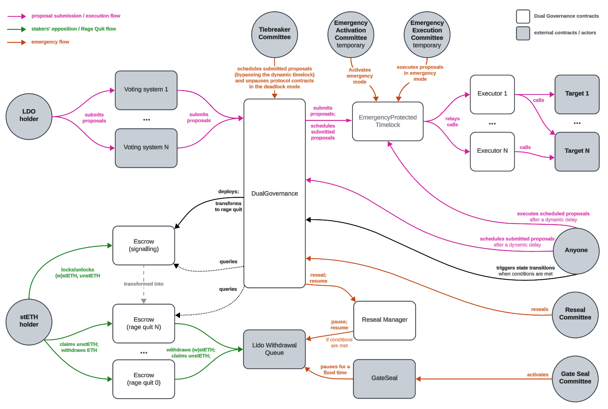

# Dual Governance

## Simple Summary

1. The LIP is about Dual Governance: the dynamic timelock mechanics which allows stETH holders to safely withdraw their ETH from the protocol in the face of contentious/malicious LDO governance proposal.
2. The document outlines relevant product and technical decisions, as well as highlights the numerical parameters proposed and the organisational structure necessary for the implementation.

## Abstract

The Dual Governance is a dynamic timelock mechanism allowing stETH holders to exit Lido on Ethereum in face of contentious Lido DAO governance motion. Given the dynamic nature of Ethereum staking, usual timelocks aren’t a feasible solution.

Dual Governance introduces timelock contract between Lido DAO governance motions and execution. The timelock is connected to escrow, allowing stETH holders to voice their intention to exit the protocol by depositing stETH, wstETH and stETH withdrawal NFTs into a specific escrow contract. Once the amount locked there crosses the “first seal” threshold (proposed to be 1% of Lido on Ethereum TVL), the timelock duration starts growing proportionately. As the amount locked crosses the “second seal” threshold (proposed to be 10% of Lido on Ethereum TVL), the rage quit mechanics is triggered: execution of any motions under Dual Governance is blocked until all the stETHs in escrow are withdrawn to ether.

Dual Governance allows for de-escalation between stakers and the DAO: stakers could withdraw stETH from the escrow until rage quit is triggered, and DAO governance could cancel the contentious motion queued in the Dual Governance. The Dual Governance design mitigates a number of potential misuse scenarios along this basic flow.

## Mechanism design, technical specification and implementation

The product-level specification is outlined in a number of documents

1. Explainer acts as a proper entrypoint to the proposed design https://research.lido.fi/t/lido-dual-governance-explainer-research-distillation/7132

2. Mechanism design outlines product-level decisions along with motivations https://github.com/lidofinance/dual-governance/blob/3e0f1ae5740ef8410e928f6cc106e3a5f45a5a75/docs/mechanism.md
3. Tech Specification dives a level deeper, highlighting the main implementation details  https://github.com/lidofinance/dual-governance/blob/3e0f1ae5740ef8410e928f6cc106e3a5f45a5a75/docs/specification.md
4. Prior to code implementation, Dual Governance had undergone two third-party design reviews: [one by Certora](https://github.com/lidofinance/dual-governance/blob/develop/docs/Certora%20Design%20Review%20Report.pdf) and [another one by Runtime Verification](https://github.com/lidofinance/dual-governance/tree/3e0f1ae5740ef8410e928f6cc106e3a5f45a5a75/docs/RV%20Design%20Review%20Report)

The final code version is published on GitHub https://github.com/lidofinance/dual-governance/tree/3e0f1ae5740ef8410e928f6cc106e3a5f45a5a75 and had been audited ([OpenZeppelin audit](https://github.com/lidofinance/audits?tab=readme-ov-file#11-2024-openzeppelin-dual-governance-audit), [StateMind audit](https://github.com/lidofinance/audits?tab=readme-ov-file#10-2024-statemind-dual-governance-audit)) and formally verified ([Certora security assessment and formal verification](https://github.com/lidofinance/audits?tab=readme-ov-file#02-2025-certora-dual-governance-audit), [Runtime Verification formal verification](https://github.com/lidofinance/audits?tab=readme-ov-file#02-2025-runtime-verification-dual-governance-formal-verification)).

## Numerical parameters

Soundness of the Dual Governance relies on the reasonable choice of numerical parameters going into the deployment. The parameters pick had been [researched by Lido Analytics workstream](https://research.lido.fi/t/dual-governance-analytics-note-on-parameters-values/9905), as well as [Collectif Labs](https://github.com/collectif-dao/dg-research/blob/main/Lido%20Dual%20Governance%20Simulation%20Report.pdf) and [20[]](https://github.com/20squares/dual-governance-public) teams.

The parameters proposed for the initial deployment:
| Parameter name | Value | Description |
| --- | --- | --- |
| FirstSealRageQuitSupport | 1% | Share of total stETH supply that is needed to switch dual governance to the Veto Signaling state |
| SecondSealRageQuitSupport | 10% | Share of total stETH required to change from Veto Signalling state to Rage Quit state |
| ProposalExecutionMinTimelock | 3 days | The minimum number of days a proposal will be held in Dual Governance before execution (unless the Veto signaling state is entered) |
| DynamicTimelockMinDuration | 5 days | The minimum duration of the dynamic timelock, as long as the share of stETH locked in the Veto Signaling contract is higher than the First Seal Rage Quit Support threshold |
| DynamicTimelockMaxDuration | 45 days | Maximum duration of the dynamic timelock, as long as the share of stETH locked in the Veto Signalling contract is higher than the First Seal Rage Quit Support threshold. If the share of locked stETH is higher than the Second Seal Rage Quit Support threshold when this number of days has passed, the state switches to Rage Quit; otherwise, it switches to Deactivation |
| SignallingEscrowMinLockTime | 5 hours | Time during which a stETH holder will be unable to withdraw stETH from the Veto Signaling contract, once stETH was put there |
| VetoSignallingMinActiveDuration | 5 hours | The minimum time that must pass before the veto signaling state can be changed to the deactivation state |
| VetoSignallingDeactivationMaxDuration | 3 days | Maximum duration of the Deactivation stage. This state would either change back to Veto signaling (if new stETH is locked in the Veto Signaling contract) or to Cooldown, if the maximum duration has passed |
| VetoCooldownDuration | 5 hours | Duration of cooldown state; could transition to either Normal state, or to Veto signaling state, depending on the amount of stETH locked in the Veto Signaling escrow. |
| RageQuitExtensionPeriodDuration | 7 days | In addition to the Rage Quit state, this addition ensures that even if a user locks their withdrawal NFT in the veto signaling contract, they will still have at least 7 days to claim ETH |
| RageQuitEthWithdrawalsMinDelay | 60 days | The minimal delay during which withdrawn ETH could not be claimed after Rage Quit. This prevents system abuse by performing cyclical rage quits |
| RageQuitEthWithdrawalsMaxDelay | 180 days | Maximum delay during which withdrawn ETH could not be claimed after Rage Quit |
| RageQuitEthWithdrawalsDelayGrowth | 15 days | Added to RageQuitEthWithdrawalsMinDelay after each Rage Quit in a row, but not more than RageQuitEthWithdrawalsMaxDelay. Once the system gets back to Normal state, the delay also gets back to RageQuitEthWithdrawalsMinDelay |

Note that the numbers, while fitting the sensitivity analysis performed, are based on the current steth holders distribution and DeFi markets structure. In case any of those changes sufficiently, potential recalculations and tweaks could be required.

## Organisational structure and committees

Dual Governance mechanism design opens three cases covered by committee-driven actors.

1. The **Reseal Committee** is a multisig that has exactly one right: given the DAO proposal submission or execution is currently blocked by the Dual Governance mechanism, the committee is allowed to turn an ephemeral pause of a protocol contract into a full one, i.e. until the DAO explicitly unpauses the contract [[SPEC](https://github.com/lidofinance/dual-governance/blob/3e0f1ae5740ef8410e928f6cc106e3a5f45a5a75/docs/mechanism.md#reseal-committee)]. Given the same goal as GateSeal, the proposal is to rely on the same signers set. That said, it’s prudent to have a higher quorum threshold, as decision to pause on Reseal level has longer-term effect from one hand, and doesn’t need to have a fast reaction time (Reseal has the full GateSeal timelock to act, which is measured in multiple days at least).
2. **Emergency Activation** and **Emergency Execution** Committees are covering the Dual Governace Protected deployment mode: during the limited time after the deployment (proposed 1 year: `max_emergency_protection_duration` in [full parameters list](https://research.lido.fi/t/dual-governance-analytics-note-on-parameters-values/9905#p-21022-appendix-a-26)) the Emergency Activation Committee would be able to trigger emergency mode (blocking the permissionless execution of any motions in Dual Governance pipeline), which in turn allows the Emergency Execution Committee to either 1) execute proposals in the Dual Governance pipeline; or 2) perform an Emergency Reset, effectively disabling the Dual Governance; in practice that action would return the execution rights back to Lido DAO Voting contract [[SPEC](https://github.com/lidofinance/dual-governance/blob/develop/docs/specification.md#protected-deployment-mode)]. The mechanics acts as the mitigation of edge-case vulnerability in the codebase. Both committees are proposed to have the same set of signers with different quorum settings for both Emergency Activation (4/7) and Emergency Execution (5/7) committees. Activation should be able to act reasonably fast (about a day of reaction time is expected), and Execution may have a longer timeframe for taking action.
3. **Tiebreaker Committee** is designed to overcome potential tie between the protocol and governance in the particular edge-case [[SPEC](https://github.com/lidofinance/dual-governance/blob/develop/docs/mechanism.md#tiebreaker-committee)]. In order for the Tiebreaker to be activated, the tie should be detected onchain first: 1) Dual Governance is in RageQuit state and the Lido on Ethereum protocol withdrawals are paused for a `TiebreakerActivationTimeout` duration; OR 2) the last time DG had been in Normal or Veto Cooldown state more than `TiebreakerActivationTimeout` time ago.
    
  Once activated, Tiebreaker can do two things:
    
 1. Execute the blocked proposal in Dual Governance pipeline
 2. Unpause any of the paused protocol contracts
  
  Tiebreaker is proposed to be set up as “multisig of multisigs”, with 2/3 quorum on top multisig, and independent quorum settings for underlying multisigs.

## Known risks and limitations

The list of the known risks and limitations of the overall design and implementation details can be found here: https://github.com/lidofinance/dual-governance/blob/3e0f1ae5740ef8410e928f6cc106e3a5f45a5a75/docs/known-risks-and-limitations.md

## Notes on deployment

### Roles to be shifted

In order for Dual Governance to be useful, it must have specific controls in the Lido on Ethereum protocol. There’s a number of “control types” used across Lido on Ethereum smart contracts (contract “ownership”, Aragon ACL roles, non-Aragon ACL roles are the main groups). The actual controls and control-over-controls is distributed between a small number of contracts: Aragon Voting, Aragon Agent, EVMScriptExecutor (EasyTrack motions execution gadget) and specific committees (i.e. GateSeal).

The general idea of the transition to Dual Governance is: 1) Aragon Voting to renounce the in-protocol roles / pass role management to Aragon Agent, so that Aragon Voting can’t “do things” directly in the Lido on Ethereum protocol; 2) Aragon Agent to grant the roles for executing on its’ behalf to Dual Governance Executor contract; 3) EasyTrack setup remains as-is (Aragon Voting can change any settings, but can’t grant protocol-specific roles, which are managed by Aragon Agent under Dual Governance); 4) committees setup remains as-is.

### Smoke test plan

There’s a proposal to host a smoke test on Dual Governance smart contracts before proposing the DAO to switch the mechanics on in mainnet. Smoke test is to trial emergency activation and execution flows before the DAO moves the smart contract roles and permissions under the Dual Governance, allowing for contingencies where needed.

1. Deploy the whole setup with temporary `emergency governance` multisig, so that the contracts can be properly set up before the DAO vote;
2. Trigger the emergency reset through Emergency Activation and Execution committees; 
3. Set the contracts up as described on the params list through the temporary `emergency governance`, removing the temporary parts altogether;
4. Start the Lido DAO Aragon vote to set the onchain rights roles;
5. Submit the “revoke agent forward role from voting” as the Dual Governance action in the vote.
6. Once executed, the motion fully switches on Dual Governance mechanics for Lido on Ethereum protocol.

## Operational concerns

1. With Dual Governance the timelock is getting variable length, so the execution paths relying on the specific “DAO reaction time” need to be considered. As a straightforward notion, the Lido on Ethereum upgrade votes adopting the protocol to Ethereum hardforks need to be scheduled and operationalized with that timelock in mind.
2. GateSeals are getting the “ReSeal” part, allowing the GateSeal committee to prolong the pause to indefinite time in case 1) the temporary pause is already triggered 2) the Dual Governance is in any state but the `Normal` [[spec](https://github.com/lidofinance/dual-governance/blob/main/docs/mechanism.md#reseal-committee)].
3. As the execution of motions successfully passed through the Dual Governance is permissionless, there’s an issue of motions getting executable at random time during the day. If anything, that pushes Contributors to potentially be on call at night. To reduce / control for the need for making complex onchain operations at unfavourable time, the use of execution timer smart contract blocking the `execute` call in the motion during some part of the waking hours is proposed as an opt-in
4. GateSeals duration needs to account for the extra minimal delay (proposed at 3 days) between the DAO voting motion execution and Dual Governance motion being executable.

## Conclusion

Enabling DG would in practice grant stETH holders the built-in right to vocally exit the Lido on Ethereum protocol. The preparation required has layers to make sure the crucial mechanics doesn’t have the avoidable errors, on mechanism, code, parameters pick of deployment plan levels.