# LIP-29. Community Staking Module v2

## Simple Summary

Community Staking Module (CSM) v2 is an evolutionary step in the CSM development. The main features of CSM v2 consist of support for different Node Operator types, improvements in the performance assessment mechanisms, [EIP-7002](https://eips.ethereum.org/EIPS/eip-7002) support, and much more. Detailed description of the features can be found in a [separate document](https://hackmd.io/@lido/csm-v2-tech) that will be referred to later in the text. This document describes the overall CSM v2 architecture and changes made compared to the existing [CSM v1](https://github.com/lidofinance/lido-improvement-proposals/blob/develop/LIPS/lip-26.md).

## Motivation

The current version of the Community Staking Module (CSM) is a great step towards the decentralization of Lido on Ethereum. It allows Node Operators to join Lido on Ethereum protocol permissionlessly and benefit from the outstanding Node Operator rewards. However, there are still some limitations and challenges that need to be addressed to make CSM more robust, flexible, and competitive. One of the main challenges is the need to support different types of Node Operators, such as anonymous permissionless operators, identified community stakers, professional operators, etc. This requires a more sophisticated architecture that can accommodate different types of Node Operators and specific parameters for each. While CSM v1 already supports basic Node Operator types (EA members and permissionless operators), it lacks the ability to have more than 2 types and support for custom parameters for these types, except for the bond curves. 

## Specification

> Terms validator, key, validator key, and deposit data meanings are the same within the document

### General Architecture

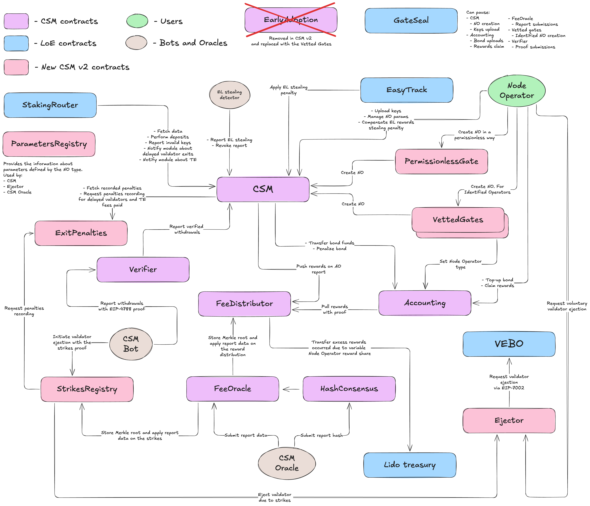

The scheme above depicts CSM's smart contracts architecture and changes made in CSM v2.

#### Contracts

##### `CSModule.sol`
*CSM on the scheme* 

> Changed in v2

`CSModule.sol` is a core module contract conforming to the `IStakingModule` interface. It stores information about Node Operators and deposit data (DD). This contract is responsible for all interactions with the `StakingRouter`, namely, the DD queue management and some of the Node Operator's parameters. Node Operators manage their validator keys and other parameters they can modify through this contract.

**Changes in v2:**
- Node Operator creation methods were replaced with a single permissioned method. Node Operators creation is now possible only through [Entry Gates or Extensions](https://hackmd.io/@lido/csm-v2-tech#Entry-Gates-and-Extensions10) contracts attached to `CSModule.sol` via `CREATE_NODE_OPERATOR_ROLE`;
- Rewards claims and bond top-ups are moved to `CSAccounting.sol`;
- The slashing reporting method is removed;
- Node-Operator-type-related parameters moved to `CSParametersRegistry.sol`;
- DD queue mechanism was reworked to allow for multiple [priority queues](https://hackmd.io/@lido/csm-v2-tech#Priority-Queues);
- Public release mechanism was deprecated. Permissioned CSM is now possible with the use of the Vetted Gates without Permissionless Gate while setting a key limit for the corresponding Node Operator type;
- Reset bond curve removed for cases of slashing and settled EL stealing penalty due to the introduction of the Node Operator types associated with the bond curve;

##### `CSAccounting.sol`
*Accounting in the scheme* 

> Changed in v2

`CSAccounting.sol` is a supplementary contract responsible for the management of bond, rewards, and penalties. It stores bond tokens as `stETH` shares, provides information about the bond required, and provides interfaces for the penalties. Node Operators claim rewards and top-up bonds using this contract.

**Changes in v2:**
- User-facing methods for reward claims and bond top-ups are moved to `CSAccounting.sol` from `CSModule.sol`;
- Public methods to get claimable bond amounts and rewards are added;

##### `CSVerifier.sol`
*Verifier on the scheme*

> Changed in v2

`CSVerifier.sol` is a utility contract responsible for validating the CL data proofs using EIP-4788. It accepts proof of the validator withdrawals and reports these facts to the `CSModule.sol` if the proof is valid.

**Changes in v2:**
- The slashing reporting method is removed;
- Pause methods added;

##### `CSEarlyAdoption.sol`
*EarlyAdoption on the scheme*

> Removed in v2

A contract is **removed** in CSM v2 and replaced with the instance of the `VettedGate.sol`.

##### `CSFeeDistributor.sol`
*FeeDistributor on the scheme*

> Changed in v2

`CSFeeDistributor.sol` is a supplementary contract that stores non-claimed and non-distributed Node Operator rewards on its balance. This contract stores the latest root of a rewards distribution Merkle tree. It accepts calls from `CSAccounting.sol` with reward claim requests and stores data about already claimed rewards by the Node Operator. It receives non-distributed rewards from the `CSModule.sol` each time the `StakingRouter` mints the new portion of the module's rewards. This contract transfers excess rewards allocated by `StakingRouter` due to variable Node Operator reward share back to Lido treasury.

**Changes in v2:**
- Added storage of the distribution history;
- Added support of the variable Node Operator reward share and rebate transfer to Lido treasury;

##### `CSFeeOracle.sol`
*FeeOracle on the scheme*

> Changed in v2

`CSFeeOracle.sol` is a utility contract responsible for the execution of the CSM Oracle report once the consensus is reached in the `HashConsensus.sol` contract, namely, transforming non-distributed rewards to non-claimed rewards stored on the `CSFeeDistributor.sol` and reporting the latest root of rewards distribution Merkle tree to the `CSFeeDistributor.sol`. Alongside rewards distribution, a contract manages strikes data delivery to the `CSStrikes.sol`. A contract is inherited from the [`BaseOracle.sol`](https://github.com/lidofinance/core/blob/master/contracts/0.8.9/oracle/BaseOracle.sol) from Lido on Ethereum (LoE) core.

**Changes in v2:**
- Added strikes reporting support;

##### `HashConsensus.sol`
*HashConsensus on the scheme*

`HashConsensus.sol` is a utility contract responsible for reaching a consensus between CSM Oracle members. Uses the standard code of the [`HashConsensus`](https://github.com/lidofinance/core/blob/master/contracts/0.8.9/oracle/HashConsensus.sol) contract from Lido on Ethereum (LoE) core.

##### `CSParametersRegistry.sol`
*ParametersRegistry on the scheme*

> New in v2

`CSParametersRegistry.sol` is a utility contract that stores Node-Operator-type-related parameters fetched by the other smart contracts related to CSM. A contract requires a mandatory default value for all parameters to ensure consistency. The custom value is returned if it is set for a particular parameter. Otherwise, the default value is returned.

##### `CSStrikes.sol`
*StrikesRegistry on the scheme*

> New in v2

`CSStrikes.sol` is a utility contract that stores information about strikes assigned to the CSM validators by CSM Performance Oracle. It has a permissionless method to prove that a particular validator should be ejected because the number of strikes is above the threshold for this validator. It calls `CSEjector.sol` to perform a strikes threshold check and eject the validator.

##### `PermissionlessGate.sol`
*PermissionlessGate on the scheme*

> New in v2

`PermissionlessGate.sol` is a supplementary contract that enables permissionless Node Operator creation in `CSModule.sol`, serving as an entry point.

##### `VettedGate.sol`
*VettedGates on the scheme*

> New in v2

`VettedGate.sol` is a supplementary contract that enables Node Operator creation for the vetted addresses, which serves as an entry point to `CSModule.sol`. Alongside Node Operator creation, a contract can assign a custom Node Operator type (bondCurveId) in `CSAccounting.sol`. Deployed using `VettedGateFactory.sol` to allow the addition of the new instances later without additional code security audits. The list of the vetted participants is upgradable for each instance of the `VettedGate.sol` individually.

##### `CSEjector.sol`
*Ejector on the scheme*

> New in v2

`CSEjector.sol` is a supplementary contract responsible for interactions with EIP-7002-powered Lido Withdrawal credentials via `VEB`. Node Operators can voluntarily eject their validators. `CSStrikes.sol` uses `CSEjector.sol` to trigger exits for validators that have surpassed the strike threshold.

##### `CSExitPenalties.sol`
*ExitPenalties on the scheme*

> New in v2

`CSExitPenalties.sol` is a supplementary contract responsible for processing and storing information about exit-related penalties, namely:
- Delayed exit penalty;
- Bad performance ejection penalty;
- TE fee paid in case of a forced and involuntary exit.


##### `EasyTrack`

`EasyTrack` is a utility contract responsible for applying the reported EL stealing penalties. A part of the common [`EasyTrack`](https://github.com/lidofinance/easy-track) setup within Lido on Ethereum (LoE).

##### `GateSeal`

> Changed in v2

`GateSeal` is a utility contract responsible for the one-time pause of the `CSModule.sol`, `CSAccounting.sol`, `CSFeeOracle.sol`, `VettedGate.sol`, `CSEjector.sol`, and `CSVerifier.sol` contracts to prevent possible module exploitation through zero-day vulnerabilities. Uses the [standard code](https://github.com/lidofinance/gate-seals) of the `GateSeal` contract from Lido on Ethereum (LoE).

The list of sealable contracts:
- `CSModule.sol`
- `CSAccounting.sol`
- `CSFeeOracle.sol`
- `CSVerifier.sol` (new)
- `CSVettedGate.sol` (new)
- `CSEjector.sol` (new)

**Changes in v2:**
- New sealable contracts added;

#### Off-chain tools

##### `CSM Bot`

> Changed in v2

`CSM Bot` is a daemon application responsible for monitoring and reporting the withdrawal events associated with the CSM validators. Also responsible for validator ejection invocation due to strikes.

**Changes in v2:**
- Slashing reporting removed;
- Validator ejection invocation added;

##### `EL stealing detector`

`EL stealing detector` is a daemon application or EOA or Committee Multisig responsible for detecting and reporting the EL stealing facts by the CSM validators. Assigned to CSM Committee Multisig in the existing version of CSM and assumed to be re-assigned to the automated bot at the acceptable level of MEV monitoring software maturity to avoid false-positive activations.

##### `CSM Oracle`

> Changed in v2

`CSM Oracle` (also known as CSM Performance Oracle) is a module in the common Lido on Ethereum (LoE) Oracle set. It is operated by the existing Oracles set alongside [Accounting Oracle](https://docs.lido.fi/contracts/accounting-oracle) and [Validator Exit Bus Oracle](https://docs.lido.fi/contracts/validators-exit-bus-oracle). It is responsible for calculating the CSM Node Operators' reward distribution and strike assignment based on their performance on the CL.

**Changes in v2:**
- Added strikes calculation;
- Performance calculation algorithm now accounts for block proposals and sync committee participation;
- Added support of the variable Node Operator reward share, and performance threshold;
- Added support for the configurable performance coefficients (Attestation, proposals, and sync committee eff);


### Main flows

#### Create Node Operator

> Changed in v2
>
> - Node Operator creation is now done via Gates;

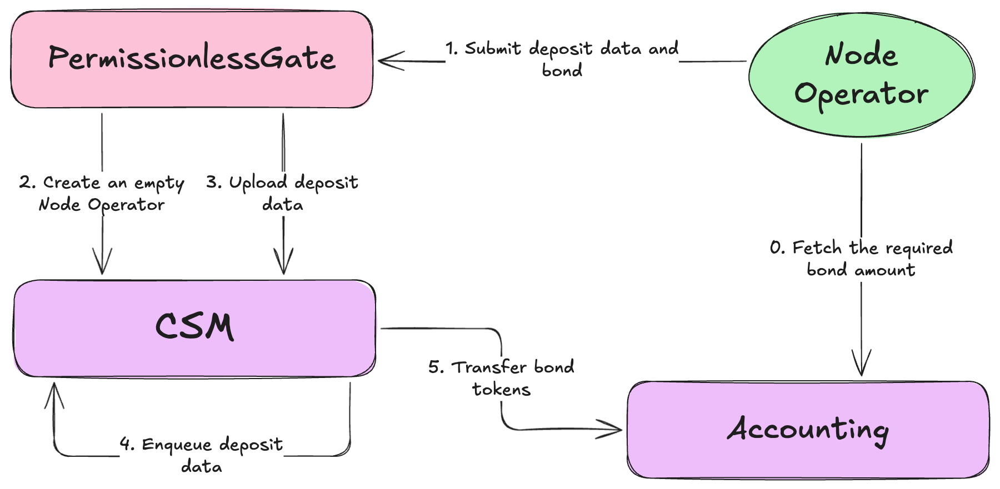
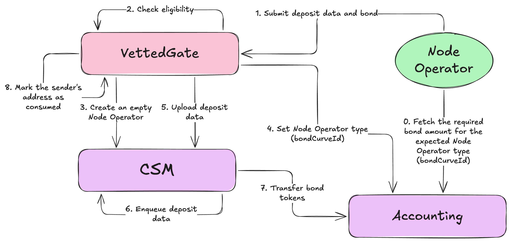

Node Operator creation uses either `PermisssionlessGate.sol` or `VettedGate.sol` or future [Entry Gates or Extensions](https://hackmd.io/@lido/csm-v2-tech#Gates-and-Extensions10) contracts attached to `CSModule.sol` via `CREATE_NODE_OPERATOR_ROLE`. Entry Gates (Extensions) should ensure that at least one deposit data and the corresponding bond amount are required to create a Node Operator to avoid flooding the module with empty Node Operators. Before Node Operator creation, an amount of bond needed should be fetched from the `CSAccounting.sol`. Depending on the selected token, this amount should be:
- attached as a payment to the transaction (ETH);
- approved to be transferred by `CSAccounting.sol` (stETH, wstETH);
- included in permit data approving transfers by `CSAccounting.sol` (stETH, wstETH);

`VettedGate.sol` allows each vetted address a one-time operation of Node Operator creation or Node Operator type claim for the existing Node Operator. If one of the operations is performed, the other can not be used.  `VettedGate.sol` should have `SET_BOND_CURVE_ROLE` role in `CSAccounting.sol` to assign Node Operator types (bond curves).

#### Upload deposit data

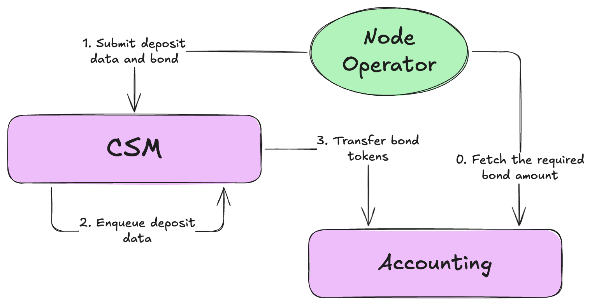

Node Operators can upload deposit data after creation. Before uploading, the required bond amount should be fetched from `CSAccounting.sol`, and corresponding approvals, permits, or direct attachments as a payment should be performed like the Node Operator creation described above.

#### Delete deposit data

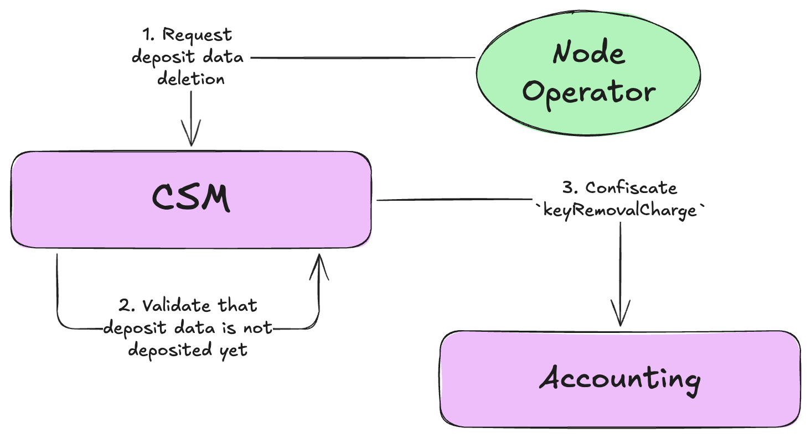

If deposit data has not been deposited yet, the Node Operator can request its deletion from `CSModule.sol`. `CSModule.sol` validates that deposit data has not yet been deposited. If deletion is possible, `CSAccounting.sol` confiscates the `keyRemovalCharge` from the Node Operator's bond.

As a part of the [optimistic vetting approach](https://hackmd.io/@lido/rJrTnEc2a#Optimistic-Vetting), the `removeKeys()` method sets the `totalVettedKeys` pointer to `totalAddedKeys`, effectively vetting back all of the previously unvetted but not deleted keys. More on unvetting [below](#Invalid-keys). 

#### Top-up bond without deposit data upload

> Changed in v2
> 
> - Top-up bond is now done via `CSAccounting.sol`;

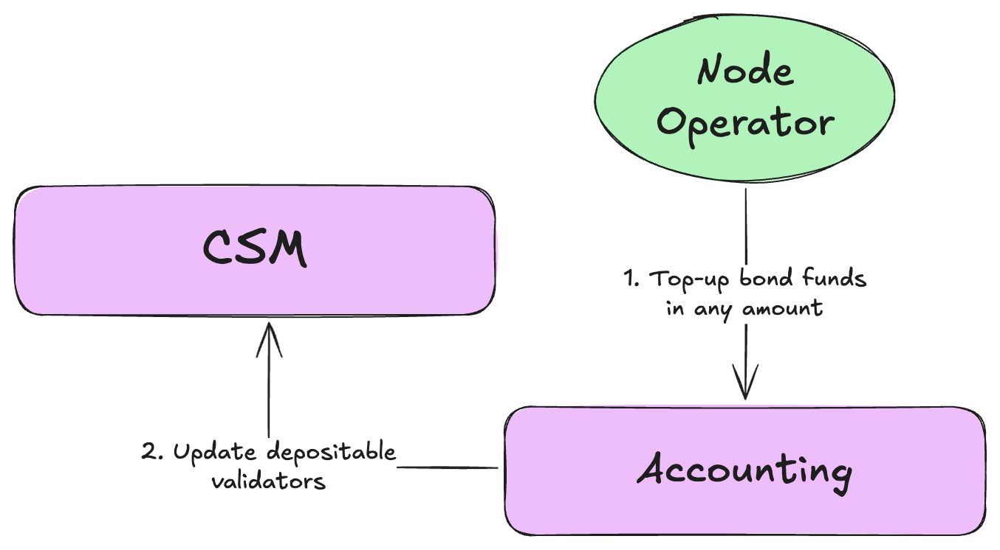

CSM Node Operators can top-up bond balance at any time to have an excess bond in advance or compensate for the penalties. Top-up is done via `CSAccounting.sol`. Once funds are transferred to `CSAccounting.sol`, `CSModule.sol` is informed about the bond amount change and corresponding changes in the depositable keys are performed regarding the Node Operator to account for the change in the bond balance.

#### Stake allocation

> Changed in v2
> 
> - Priority queues added;

CSM utilizes the FIFO queue to determine the next portion of the validator keys to be deposited. Changes to the deposit queue in CSM v2 are described in the [features doc](https://hackmd.io/@lido/csm-v2-tech#Priority-Queues).

##### Basic flow

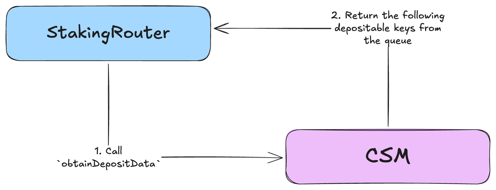

Once uploaded, deposit data is placed in the queue with respect to the Priority queue parameters for the given Node Operator. To allocate stake to the CSM Node Operators, `StakingRouter` calls the `obtainDepositData(depositsCount)` method to get the next `depositsCount` depositable keys from the keys queue.

##### Invalid keys

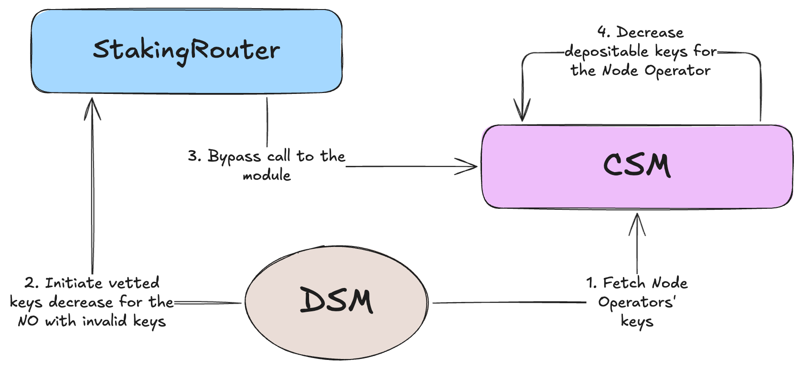

Due to the [optimistic vetting approach](https://hackmd.io/gGRgZ0yeTnm-9SSFuHrXwg#Deposit-data-validation-and-invalidation-aka-vetting-and-unvetting), invalid keys might be present in the queue. [DSM](https://docs.lido.fi/contracts/deposit-security-module) is responsible for detecting and reporting invalid keys through `StakingRouter`. If invalid keys are detected, a call to `decreaseOperatorVettedKeys` is expected from `StakingRouter` to `CSModule.sol`.

Node Operators should [delete](#Delete-deposit-data) the invalid keys to resolve the situation. If the invalid keys are still present after deletion, the process repeats.

#### Rewards distribution

> Changed in v2
> 
> - Variable fee and rebate to treasury added;

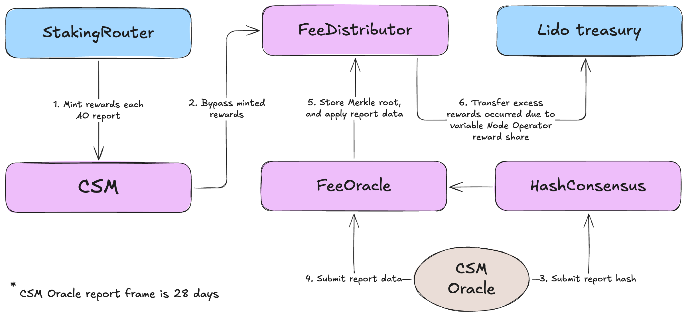

`StakingRouter` mint rewards for CSM Node Operators on each report of the [`AccountingOracle`](https://docs.lido.fi/contracts/accounting-oracle). `CSModule.sol` transfers minted rewards to the `CSFeeDistributor.sol`. Once the report slot is reached for the following CSM Oracle report, the rewards distribution tree is [calculated](https://hackmd.io/@lido/csm-v2-tech#Updated-CSM-Performance-Oracle-metric) by each Oracle member. After reaching the quorum, a new Merkle tree root is submitted to the `CSFeeDistributor.sol`, the corresponding portion of the rewards is transferred from the non-distributed to the non-claimed state, and excess rewards transferred by `StakingRouter` due to variable Node Operator reward share are returned to Lido treasury.

#### Rewards claim

> Changed in v2
> 
> - Rewards claim is now done via `CSAccounting.sol`;

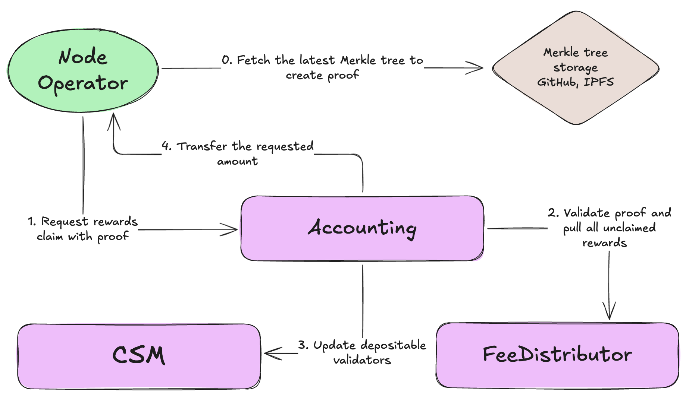

Total rewards for the CSM Node Operators are comprised of [bond rewards and staking fees](https://docs.lido.fi/staking-modules/csm/rewards). To claim the total rewards, the Node Operator needs to bring proof of the latest `cumulativeFeeShares` in the rewards tree. With that proof `CSAccounting.sol` pulls the Node Operator's portion of the staking fees from the `CSFeeDistributor.sol` and combines it with the Node Operator's bond. After that, all bond funds exceeding the bond required for the currently active keys are available for claim. 

Node Operator can transfer staking rewards to the bond without transferring it to the reward address by passing `0` as the amount requested for the claim.

If there are no new rewards to pull from the `CSFeeDistributor.sol` Node Operator can still claim excess bond using the same flow.

#### EL stealing penalty

> Changed in v2
> 
> - Additional fine is now configurable for the Node Operator type;
> - Reset bond curve removed due to the introduction of the Node Operator types associated with the bond curve;

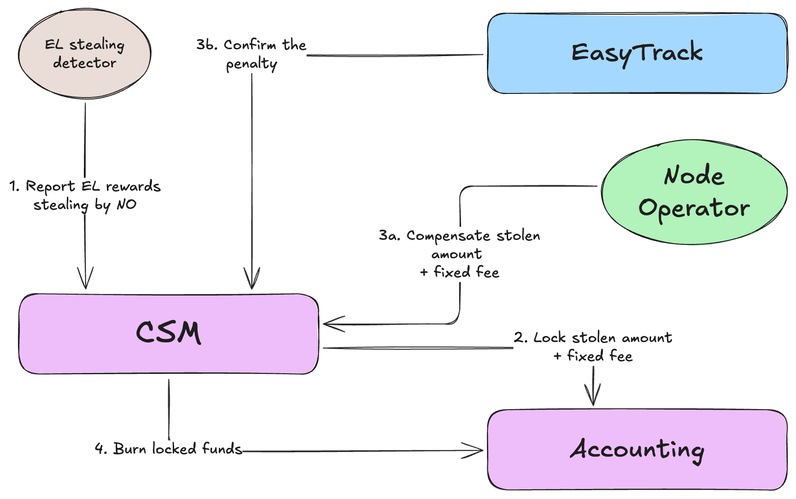

If the Node Operator commits EL rewards stealing (or violates the [Lido on Ethereum Block Proposer Rewards Policy](https://snapshot.box/#/s:lido-snapshot.eth/proposal/0x7ac2431dc0eddcad4a02ba220a19f451ab6b064a0eaef961ed386dc573722a7f)), this fact and the stolen amount are reported to the `CSModule.sol` by the EL stealing detector actor. The corresponding amount of the bond funds (stolen amount + fixed fee) is locked by the `CSAccounting.sol`. Node Operator can compensate for the stolen funds and fixed fee voluntarily. If the Node Operator does not compensate for the stolen funds, `EasyTrack` is started to confirm the penalty application. Once enacted, a penalty is applied (locked funds are burned).

#### Validator ejection due to strikes

> New in v2

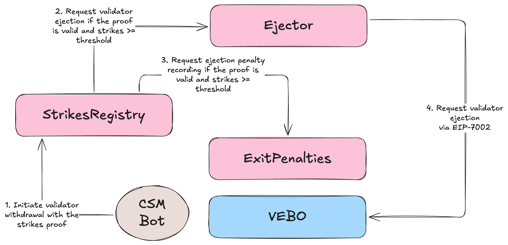

If the validator has reached the strikes threshold (`actual strikes >= threshold`) `CSM Bot` will initiate validator ejection using a permissionless method. `CSStrikes.sol` validates the proof and makes a call to `CSEjector.sol` if the number of strikes >= threshold. `CSEjector.sol` notify `TWG` about the required validator ejection. Corresponding penalties are recorded in `CSExitPenalties.sol`.

> Note: `CSEjector.sol` should have an `ADD_FULL_WITHDRAWAL_REQUEST ROLE` granted on `TWG`

#### Voluntary validator ejection

> New in v2

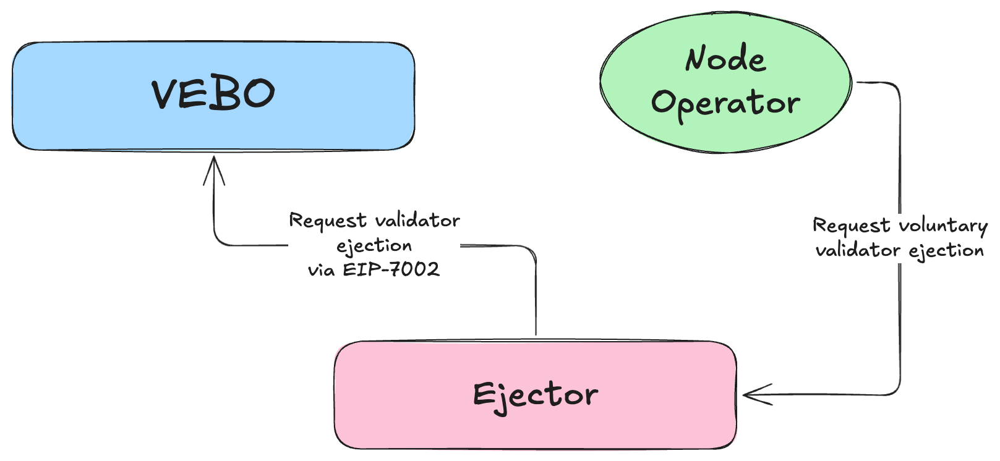

If Node Operators want to use [EIP-7002](https://eips.ethereum.org/EIPS/eip-7002) to exit their validators, they can do so via a dedicated method in the `CSEjector.sol` contract. In this case, `CSEjector.sol` will notify `TWG` about the required validator ejection.


#### Withdrawal reporting

> Changed in v2
>
> - Stuck penalty and TE fee are applied upon validator withdrawal if reported before;
> - Reset bond curve removed due to the introduction of the Node Operator types associated with the bond curve;

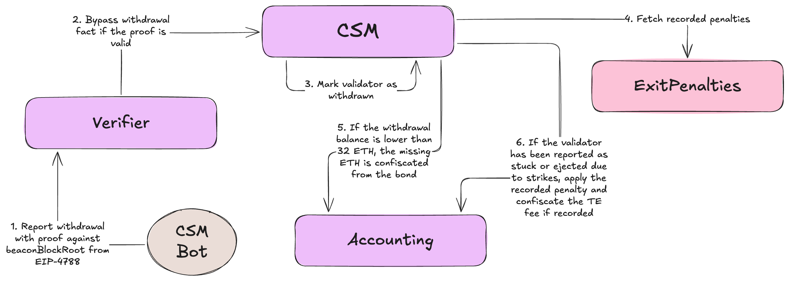

Once the CSM validator is withdrawn, the CSM Bot will report it using a permissionless method. The report is submitted to the `CSVerifier.sol` to validate proof against beaconBlockRoot. The report is bypassed to the `CSModule.sol` if the proof is valid. `CSModule.sol` marks the validator as withdrawn and requests bond penalization for the Node Operator by `CSAccounting.sol` if the withdrawal balance is lower than 32 ETH.

If the validator is reported as stuck, the recorded stuck penalty is applied, and the recorded TE fee is confiscated. If the validator was not reported as stuck but the TE fee is recorded, the TE fee is ignored.


> TE fee confiscation limit is introduced to protect Node Operators from excessive bond confiscation due to theoretically unlimited TE fees.

#### Stuck validators ejection penalty

> New in v2

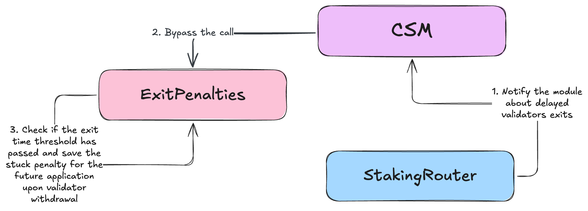
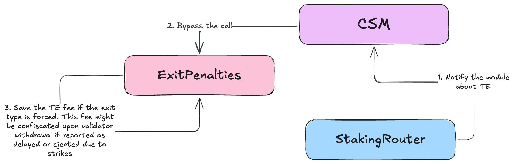

With its updated functionality, `VEBO` can now trigger exits for the validators requested for exit in the `VEBO` report. However, the time when requested validators can be ejected is not limited. Hence, `CSModule.sol` should be notified by `StakingRouter` about the validator exits and the time between the request and ejection. If the time exceeds the threshold, the Node Operator should be penalized for not exiting their validators in time. If Triggerable Exit (TE) was used for the validator, depending on the exit type and if the validator was delayed to exit, the TE fee should be confiscated from the Node Operator's bond. Both stuck penalty and TE fee are recorded in `CSExitPenalties.sol` and applied upon validator withdrawal described above.

> The validator is considered "stuck" if the proof is delivered stating that it was not exited for more than `allowedExitDelay` seconds since the moment it was requested/available for exit. `allowedExitDelay` is a parameter that can be set per-Node-Operator-type.

### Claim beneficial Node Operator type

:::info
New in v2
:::

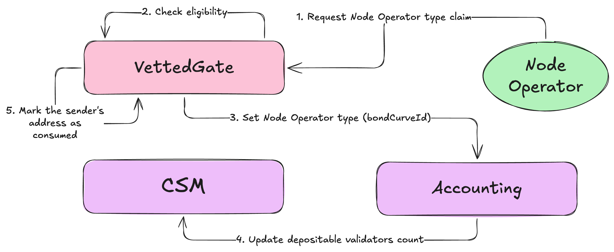

Existing Node Operators can claim a beneficial Node Operator type if their Node Operator's manager or reward address (depending on `extendedManagerPermissions`) is eligible. The claim process is similar to creating a Node Operator via `VettedGate`. If the address has already created a Node Operator using `VettedGate,` this address is no longer eligible to create more Node Operators via `VettedGate` or claim the Node Operator type described above.

#### Referral program

> New in v2

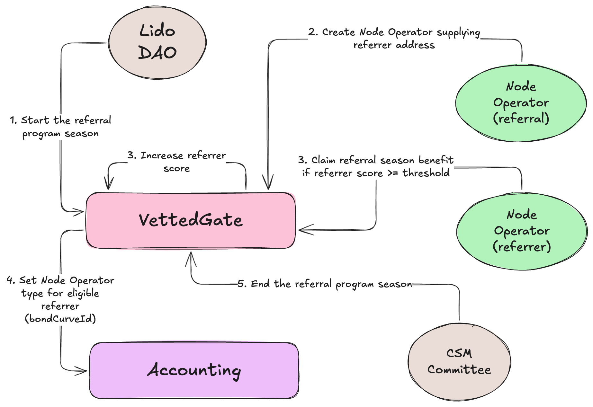

The referral program consists of seasons. At the start of each season, a Node Operator type that can be obtained as a reward and a referrals threshold are set at `VettedGate.sol` instance. These parameters can not be changed within a season. Points for inviting referrals are counted and valid only within a season. The beneficial Node Operator type can be claimed only while the season lasts. When a new season starts, all previously collected referral points are dropped.

Invite means that upon NO creation, the referral specifies the referrer's address in the transaction. This information is recorded on-chain. Node Operators with recorded invites get access to the benefits described.

Both the referral and the referrer should pass the identification process and get an ICS pass.

Referrer can not be specified for existing Node Operators, only for new ones who are eligible for the ICS Node Operator type at the moment of creation.


### Contracts specifications

#### [`CSModule.sol`](https://github.com/lidofinance/community-staking-module/blob/develop/docs/src/src/CSModule.sol/contract.CSModule.md)

#### [`CSAccounting.sol`](https://github.com/lidofinance/community-staking-module/blob/develop/docs/src/src/CSAccounting.sol/contract.CSAccounting.md)

#### [`CSVerifier.sol`](https://github.com/lidofinance/community-staking-module/blob/develop/docs/src/src/CSVerifier.sol/contract.CSVerifier.md)

#### [`CSFeeDistributor.sol`](https://github.com/lidofinance/community-staking-module/blob/develop/docs/src/src/CSFeeDistributor.sol/contract.CSFeeDistributor.md)

#### [`CSFeeOracle.sol`](https://github.com/lidofinance/community-staking-module/blob/develop/docs/src/src/CSFeeOracle.sol/contract.CSFeeOracle.md)

#### [`HashConsensus.sol`](https://github.com/lidofinance/community-staking-module/blob/develop/docs/src/src/lib/base-oracle/HashConsensus.sol/contract.HashConsensus.md)

#### [`CSParametersRegistry.sol`](https://github.com/lidofinance/community-staking-module/blob/develop/docs/src/src/CSParametersRegistry.sol/contract.CSParametersRegistry.md)

#### [`CSStrikes.sol`](https://github.com/lidofinance/community-staking-module/blob/develop/docs/src/src/CSStrikes.sol/contract.CSStrikes.md)

#### [`PermissionlessGate.sol`](https://github.com/lidofinance/community-staking-module/blob/develop/docs/src/src/PermissionlessGate.sol/contract.PermissionlessGate.md)

#### [`VettedGate.sol`](https://github.com/lidofinance/community-staking-module/blob/develop/docs/src/src/VettedGate.sol/contract.VettedGate.md)

#### [`VettedGateFactory.sol`](https://github.com/lidofinance/community-staking-module/blob/develop/docs/src/src/VettedGateFactory.sol/contract.VettedGateFactory.md)

#### [`CSEjector.sol`](https://github.com/lidofinance/community-staking-module/blob/develop/docs/src/src/CSEjector.sol/contract.CSEjector.md)

#### [`CSExitPenalties.sol`](https://github.com/lidofinance/community-staking-module/blob/develop/docs/src/src/CSExitPenalties.sol/contract.CSExitPenalties.md)

### Administrative actions

Community Staking Module contracts support a set of administrative actions, including:

- Changing the configuration options.
- Upgrading the system's code.

Each action can only be performed by a designated admin (`DEFAULT_ADMIN_ROLE`) or other role members. Only members of `DEFAULT_ADMIN_ROLE` can manage role members for the roles in CSM contracts.

### Roles to actors mapping

#### `CSModule.sol`

| Role                                      | Assignee                                             |
| ----------------------------------------- | ---------------------------------------------------- |
| `DEFAULT_ADMIN_ROLE`                      | Aragon Agent                                         |
| `PAUSE_ROLE`                              | Gate Seal contract                                   |
| `RESUME_ROLE`                             | Not assigned by default                              |
| `STAKING_ROUTER_ROLE`                     | `StakingRouter` contract                             |
| `MODULE_MANAGER_ROLE`                     | Removed in v2 and replaced with `DEFAULT_ADMIN_ROLE` |
| `REPORT_EL_REWARDS_STEALING_PENALTY_ROLE` | CSM Committee Multisig or Bot EOA                    |
| `SETTLE_EL_REWARDS_STEALING_PENALTY_ROLE` | Dedicated EasyTrack                                  |
| `VERIFIER_ROLE`                           | `CSVerifier.sol`                                     |
| `RECOVERER_ROLE`                          | Not assigned by default                              |
| `CREATE_NODE_OPERATOR_ROLE`               | `PermissionlessGate.sol` and `VettedGate.sol`        |

#### `CSAccounting.sol`

| Role                      | Assignee                                             |
| ------------------------- | ---------------------------------------------------- |
| `DEFAULT_ADMIN_ROLE`      | Aragon Agent                                         |
| `PAUSE_ROLE`              | Gate Seal contract                                   |
| `RESUME_ROLE`             | Not assigned by default                              |
| `ACCOUNTING_MANAGER_ROLE` | Removed in v2 and replaced with `DEFAULT_ADMIN_ROLE` |
| `MANAGE_BOND_CURVES_ROLE` | Not assigned by default                              |
| `SET_BOND_CURVE_ROLE`     | CSM Committee Multisig and `VettedGate.sol`          |
| `RESET_BOND_CURVE_ROLE`   | Removed in v2                                        |
| `RECOVERER_ROLE`          | Not assigned by default                              |

#### `CSFeeDistributor.sol`

| Role                 | Assignee     |
| -------------------- | ------------ |
| `DEFAULT_ADMIN_ROLE` | Aragon Agent |
| `RECOVERER_ROLE`     | Not Assigned |

#### `CSFeeOracle.sol`

| Role                             | Assignee                                             |
| -------------------------------- | ---------------------------------------------------- |
| `DEFAULT_ADMIN_ROLE`             | Aragon Agent                                         |
| `CONTRACT_MANAGER_ROLE`          | Removed in v2 and replaced with `DEFAULT_ADMIN_ROLE` |
| `SUBMIT_DATA_ROLE`               | Not assigned by default                              |
| `PAUSE_ROLE`                     | GateSeal contract                                    |
| `RESUME_ROLE`                    | Not assigned by default                              |
| `RECOVERER_ROLE`                 | Not assigned by default                              |
| `MANAGE_CONSENSUS_CONTRACT_ROLE` | Not assigned by default                              |
| `MANAGE_CONSENSUS_VERSION_ROLE`  | Not assigned by default                              |

#### `HashConsensus.sol`

| Role                             | Assignee                |
| -------------------------------- | ----------------------- |
| `DEFAULT_ADMIN_ROLE`             | Aragon Agent            |
| `MANAGE_MEMBERS_AND_QUORUM_ROLE` | Aragon Agent            |
| `DISABLE_CONSENSUS_ROLE`         | Not assigned by default |
| `MANAGE_FRAME_CONFIG_ROLE`       | Not assigned by default |
| `MANAGE_FAST_LANE_CONFIG_ROLE`   | Not assigned by default |
| `MANAGE_REPORT_PROCESSOR_ROLE`   | Not assigned by default |

#### `CSVerifier.sol`

| Role                 | Assignee                |
| -------------------- | ----------------------- |
| `DEFAULT_ADMIN_ROLE` | Aragon Agent            |
| `PAUSE_ROLE`         | GateSeal contract       |
| `RESUME_ROLE`        | Not assigned by default |

#### `CSParametersRegistry.sol`

| Role                 | Assignee                |
| -------------------- | ----------------------- |
| `DEFAULT_ADMIN_ROLE` | Aragon Agent            |

#### `VettedGate.sol`

| Role                         | Assignee                               |
| ---------------------------- | -------------------------------------- |
| `DEFAULT_ADMIN_ROLE`         | Aragon Agent                           |
| `PAUSE_ROLE`                 | GateSeal contract                      |
| `RESUME_ROLE`                | Not assigned by default                |
| `SET_TREE_ROLE`              | Dedicated EasyTrack                    |
| `START_REFERRAL_SEASON_ROLE` | Aragon Agent                           |
| `END_REFERRAL_SEASON_ROLE`   | CSM Committee Multisig or Gate Manager |
| `RECOVERER_ROLE`             | Not assigned by default                |

#### `CSEjector.sol`

| Role                         | Assignee                |
| ---------------------------- | ----------------------- |
| `DEFAULT_ADMIN_ROLE`         | Aragon Agent            |
| `PAUSE_ROLE`                 | GateSeal contract       |
| `RESUME_ROLE`                | Not assigned by default |
| `RECOVERER_ROLE`             | Not assigned by default |

#### `CSStrikes.sol`

| Role                         | Assignee                |
| ---------------------------- | ----------------------- |
| `DEFAULT_ADMIN_ROLE`         | Aragon Agent            |

#### `CSExitPenalties.sol`

This contract does not have roles.

#### `PermissionlessGate.sol`

| Role                         | Assignee                |
| ---------------------------- | ----------------------- |
| `DEFAULT_ADMIN_ROLE`         | Aragon Agent            |
| `RECOVERER_ROLE`             | Not assigned by default |

### Upgradability
`CSModule.sol`, `CSAccounting.sol`,  `CSFeeOracle.sol`, `CSFeeDistributor.sol`, `CSParametersRegistry.sol`, `CSStrikes.sol`, `CSExitPenalties.sol`, and `VettedGate.sol` are upgradable using [OssifiableProxy](https://github.com/lidofinance/community-staking-module/blob/main/src/lib/proxy/OssifiableProxy.sol) contracts.

`CSVerifier.sol`, `HashConsensus.sol`,  `CSEjector.sol`, and `PermissionlessGate.sol` are not upgradable and should be redeployed if needed.

### Security considerations
#### Bond exposure to negative stETH rebase
The bond stored in stETH inevitably inherits all stETH features, including the possibility of a negative rebase. 

The effective bond amount (counted in ETH) will decrease in case of a negative rebase. This can lead to the case when a relatively large Node Operator might end up with unbonded keys. Sometimes, a negative stETH rebase might result in the unbonded validators being returned by CSM to the StakingRouter. However, a negative rebase will trigger [bunker mode](https://docs.lido.fi/guides/oracle-spec/accounting-oracle/#bunker-mode), and the deposits will be paused. This leaves enough time to detect affected Node Operators and manually update depositable validators.

Negative stETH rebase might result in an effective bond being lower than the bond required. Hence, Node Operators will lose part of their rewards. 

#### Malicious Oracles can steal all unclaimed CSM rewards
A single updatable Merkle tree approach to the rewards distribution allows malicious Oracles to collude and submit a version of the Merkle tree, indicating that all rewards should be allocated to a single Node Operator (previously created by malicious actors). The worst-case scenario is when all unclaimed rewards stored on the CSM contract will be available for claim by a single Node Operator. 

#### Malicious Oracles can assign an inappropriate number of strikes to the CSM validators
A single updatable Merkle tree approach to the strikes allows malicious Oracles to collude and submit a version of the Merkle tree, indicating an inappropriate number of strikes for the CSM Node Operator. In the worst-case scenario, some validators might get ejected due to that should the Oracles also utilize the permissionless method for the validator ejection due to strikes before the `CSEjector.sol` will be paused using `GateSeal`. The impact in this case is a certain number of validators being inappropriately ejected and the corresponding Node Operators bond will be penalized.

#### TE fees might be confiscated even if the validator had exited voluntarily after `allowedExitDelay`
The current design of the Triggerable Withdrawals ([EIP-7002](https://eips.ethereum.org/EIPS/eip-7002)) allows to request Triggerable Withdrawal (Triggerable Exit) even for the validators that were already exited. Even though the actual request will be [ignored](https://github.com/ethereum/consensus-specs/blob/7bf43d1bc4fdb91059f0e6f4f7f0f3349b144950/specs/electra/beacon-chain.md#execution-layer-withdrawal-requests) on CL, EL request will be accepted, fee will be taken, and no information about the status of the request will be provided on EL.

This results in a small edge case when the validator was not exited within `allowedExitDelay`, then exited voluntarily, and then TE was invoked for the validator with the fee reported to CSM. In this case, CSM will not be able to detect that TE was not actually required and will confiscate the TE fee from the Node Operator bond.

Since there is no motivation for the external actor to request TE for Lido validators, it is assumed that this edge case can only occur due to the bug in the TE bot developed and maintained by Lido DAO contributors. Should there be a bug in the bot code, the TE fee can always be transferred back to the Node Operator's bond from the Lido treasury based on the Lido DAO decision.

### Possible 'resell' of the beneficial Node Operator types
With the introduction of Node Operator types and the ability to claim beneficial type using `VettedGate` (applies to both addition to the vetted list and referral program participation), it becomes more likely that Node Operators will consider a 'resell' of the benefits. This is partially mitigated by the requirement that the eligible address be the ultimate owner of the Node Operator. Hence, it is assumed that Node Operators will think twice before giving away Node Operator ownership to a third party for claiming benefits, since the bond will be at risk in this case. However, this does not fully mitigate the issue. The private key of the eligible address can still be sold. Given that, it is proposed to limit benefits for the custom Node Operator types to avoid massive abuse.

### Known issues
#### Permissionless withdrawal reporting vulnerability
It is crucial to distinguish partial and full withdrawals to accept permissionless reports about validator withdrawals. For this purpose, the following condition is used (also used by Rocket Pool in [some form](https://github.com/rocket-pool/rocketpool/blob/6a9dbfd85772900bb192aabeb0c9b8d9f6e019d1/contracts/contract/minipool/RocketMinipoolDelegate.sol#L515)):
``` solidity
if (!witness.slashed && gweiToWei(witness.amount) < 8 ether) {
	revert PartialWitdrawal();
}
```
Unfortunately, there is a chance to trick this approach in the following way:
- Wait for full validator withdrawal & sweep
- Be lucky enough that no one provides proof for this withdrawal for at least 1 sweep cycle (~8 days with the network of 1M active validators)
- Deposit 1 ETH for slashed or 8 ETH for non-slashed validator
- Wait for a sweep of this deposit
- Provide proof of the last withdrawal

As a result, the Node Operator's bond will be penalized for 32 ETH - `additional deposit value`. However, all ETH involved, including 1 or 8 ETH deposited by the attacker will remain in the Lido on Ethereum protocol. Hence, the only consequence of the attack is an inconsistency in the bond accounting that can be resolved through the bond deposit approved by the corresponding DAO decision.

##### Resolution
Given no losses for the protocol, a significant cost of attack (1 or 8 ETH), and lack of feasible ways to mitigate it in the smart contract's code, it is proposed to acknowledge the possibility of the attack and be ready to propose a corresponding vote to the DAO if it will ever happen

#### Possible keys upload front-run

Ethereum TX calldata is publicly available for anyone while the TX is in the public mempool. This makes it possible for the attacker to use the validator's deposit data meant to be uploaded for one Node Operator in their own TX, effectively front-running the original transaction. In this case, the author of the original transaction will be in a situation where the deposit data uploaded will be considered a duplicate due to the front-run TX being executed earlier. Duplicated deposit data is unvetted according to the rules of the Lido protocol and should be deleted to resume stake allocation to the Node Operator. In normal conditions, CSM charges a fee for deleting each deposit data record. In case of a front-run, the affected Node Operator might have to pay the charge to resume deposits.

It is worth noting that, despite being possible, the described attack is economically unreasonable since:
- The attacker must put a sufficient amount of bond to perform keys upload.
- The attacker must delete the uploaded deposit data to prevent deposits from happening.
- If the attacker does not delete the deposit data and the deposit is made, the bond uploaded alongside the deposit data will eventually be penalized due to the ejection of the inactive keys (assuming the original owner of the keys will not keep them active)

##### Resolution
To ensure that the front-run attack is not applicable, we recommend that Node Operators use private mempools when uploading validator keys (deposit data) to CSM.

## Links

- [CSM v2 features](https://hackmd.io/@lido/csm-v2-tech)
- [LIP-26: CSM](https://github.com/lidofinance/lido-improvement-proposals/blob/develop/LIPS/lip-26.md)
- [CSM On-chain code](https://github.com/lidofinance/community-staking-module/tree/develop);
- [CSM Prover Tool (CSM Bot)](https://github.com/lidofinance/csm-prover-tool)
- [CSM Performance Oracle](https://github.com/lidofinance/lido-oracle/tree/develop/src/modules/csm)
- [CSM Settle El Rewards Stealing Penalty ET](https://github.com/lidofinance/easy-track/tree/feat/csm-el-stealing-penalty-settling)
- [CSM Research Post](https://research.lido.fi/t/community-staking-module/5917)
- [CSM Docs](https://docs.lido.fi/staking-modules/csm/intro)
- [CSM page on the Operators Portal](https://operatorportal.lido.fi/modules/community-staking-module)
