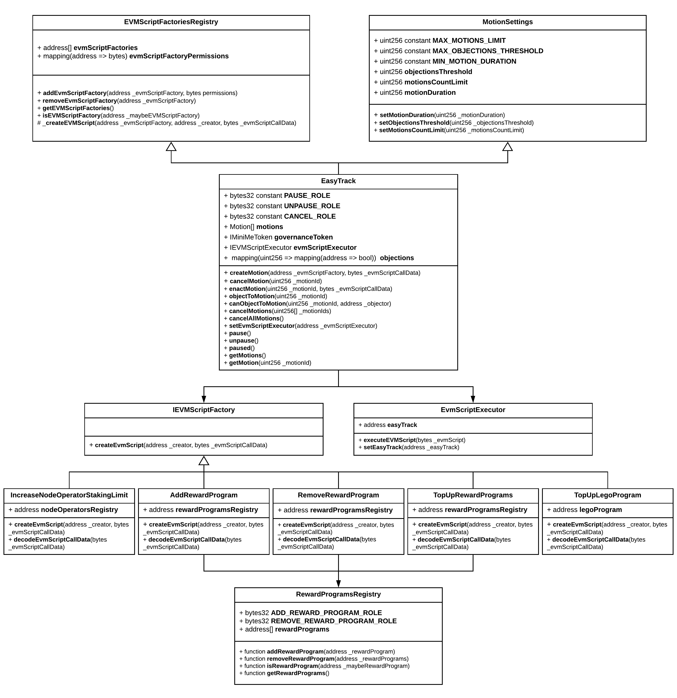

| lip: | title: | status: | author: | discussions-to: | created: | updated: |
| --- | --- | --- | --- | --- | --- | --- |
| 3 | Easy Track Motions for DAO routine operations | Implemented | Bogdan Kovtun (psirex), Gregory Stepanov (grstepanov) | https://research.lido.fi/t/lip-3-easy-track-motions-v2/794 | 2021-07-09 | 2021-12-03 | 

# Summary

## Problem

Lido DAO governance currently relies on Aragon Voting App model. Upon community discussion, DAO approves or rejects proposals via direct on-chain governance token voting. Though transparent and reliable, it is not a convenient way to make decisions only affecting small groups of Lido DAO members. Besides, direct token voting doesn't exactly reflect all the decision-making processes within the Lido DAO and is often used only to formalize the consensus reached in research forum discussion or via snapshot voting.
There are a few natural sub-governance groups within the DAO, e.g. node operators committee, financial operations team and LEGO committee. Every day they need to take routine actions only related to their field of expertise. The decisions they make hardly ever spark any debate in the community, and votings on such decisions often struggle to get the quorum and get enacted on-chain.

## Proposed solution

We propose Easy Track frictionless motions as a solution to this problem. 
Easy Track motion is a lightweight voting considered to have passed if the minimum objections threshold hasn’t been exceeded within the preset voting duration timeframe. As opposed to traditional Aragon votings, Easy Track motions are cheaper (no need to vote ‘pro’, token holders only have to vote ‘contra’ if they have objections) and easier to manage (no need to ask broad DAO community vote on proposals sparking no debate). 

## Use cases for Easy Track motions

There are three types of votings run periodically by the Lido DAO that are proposed to be wrapped into the new Easy Track motions:
- Node Operators increasing staking limits
- Funds being allocated into reward programs
- Funds being allocated to LEGO program

More types of motions can be added later, e.g.:
- Topping up Lido staking referral program
- Purchasing staking cover

## Sub-governance groups

There's a formal or an informal sub-governance group within the Lido DAO for each of the voting cases listed above. Those groups have been formed intentionally or in a more natural way, and it falls within their remits to come up with respective proposals for periodical Aragon votings. 
The proposed improvement will require formalizing sub-governance groups:

1. **Node Operators Committee** to start staking limit increase motions.
2. **Financial Operations Team** to start funds allocation motions (i.e. LEGO and reward programs).

Node Operators Committee should include addresses of active node operators partnering with Lido, the list is easy to look up in the [Node Operators Registry](https://github.com/lidofinance/lido-dao/blob/master/contracts/0.4.24/nos/NodeOperatorsRegistry.sol) smart contract. Financial Operations Team should consist of established DAO members' addresses and be represented as a Gnosis Safe Multisig with access to corresponding Easy Track features.

# Specification

To create a supervised feature as flexible and extendable as possible, we propose splitting Easy Track functionality into several contracts rather than building a single contract for it. 
> The statement below is abstract, please visit [specification.md](https://github.com/lidofinance/easy-track/blob/master/specification.md) for full detailed specification.

## Easy Track workflow and motion life cycle

A group of core smart contracts will implement basic logic and store data related to Easy Track motions, and a series of separate EVMScriptFactory smart contracts will represent all the supported types of Easy Track motions. 
This architecture aims to support further extension by adding new types of Easy Track motions without replacing the core of the proposed system.

A normal motion life cycle includes:
- Motion creation. A motion can be started by an address entitled to start the specific Easy Track motion type.
- The voting period. A preset timeframe (motion duration) when objections can be submitted by the governance token holders. The motion cannot be enacted until this period expires.
- Motion enactment. If the objections threshold hasn't been exceeded within or after the voting period, the motion can be enacted by anyone. Before enactment, the motion can be canceled by the address that started it.

This is how it works in terms of smart contract interactions:
1. A motion can be started by calling `createMotion()` function on `EasyTrack` core contract. 
2. Upon motion creation, `EasyTrack` calls `createEvmScript()` function on the corresponding `EVMScriptFactory` contract passing all the data required to generate a motion enactment EVM script.
3. `EVMScriptFactory` smart contract generates the script and returns it to the `EasyTrack` core contract.
4. `EasyTrack` contract conducts the motion according to the motion settings (i.e. motion duration, objections threshold and maximum active motions count). Until enacted, the motion can be objected by any LDO token holder or canceled by the address that has started it (even if the motion duration timeframe has already expired).
5. In case the objection threshold has been reached, the motion gets instantly rejected and impossible to interact with.
6. As soon as the motion duration expires, it becomes possible to enact the motion (if the objection threshold has not been reached). Anyone can enact the motion from that moment on.
7. To enact the motion, the `EasyTrack` contract recreates the enactment EVM script and passes it to the `EVMScriptExecutor` smart contract for execution.
8. `EVMScriptExecutor` holds all the permissions to run valid enactment EVM scripts passed from the `EasyTrack` smart contract. 

___

## Core smart contracts

The list of core Easy Track contracts includes:
- `EasyTrack` - contains the basic motion logic and data related to all the active Easy Track motions;
- `MotionSettings` - contains logic to set objections threshold, motion duration and maximum active motions count;
- `EVMScriptFactoriesRegistry` - contains logic to add/remove `EVMScriptFactory` contracts and also an internal method to create EVM scripts;

### `EasyTrack` contract

`EasyTrack` smart contract is the main contract containing the basic motion logic and data related to all the ongoing (active) Easy Track motions, including the enactment EVM script (hashed), the address that has started the motion, and when it has been started. 
We propose using byte data type for calldata due to various sets of parameters required for different motion types.
`EasyTrack` stores all the active motions (the ones created but neither enacted nor canceled yet). Once enacted, rejected, or canceled, the motion gets permanently deleted from the smart contract storage, because it is not possible to interact with past motions in any way. All the interactions with active motions also happen as transactions to EasyTrack smart contract, i.e.:
- create motion;
- cancel motion;
- submit objection;
- enact motion.

### `MotionSettings` contract

`MotionSettings` contract provides methods to control easy track settings, including motion duration, objections threshold and maximum active motions count. 

### `EVMScriptFactoriesRegistry` contract

`EVMScriptFactoriesRegistry` contract provides methods to add/remove `EVMScriptFactory` into the list of allowed `EVMScriptFactory` contracts and also an internal method to create EVM scripts.
The internal method `_createEVMScript()` creates the enactment EVM script by calling the corresponding `EVMScriptFactory` contract and also checks if the resulting script meets all the required script factory permissions.  
A new Easy Track type can be added into the registry via an Aragon voting. The voting script should include calling the `addEVMScriptFactory()` method referring to the new `EVMScriptFactory` contract and a set of permissions describing what methods can be called by the resulting EVMScript. The `EVMScriptFactory` should meet a set of [requirements](https://github.com/lidofinance/easy-track#evmscript-factory-requirements).  
______
## `EVMScriptFactory` smart contracts

Initially, five `EVMScriptFactory` contracts will represent five Easy Track motion types.
1. `IncreaseNodeOperatorStakingLimit` - Easy Track motion to increase Node Operator's staking limit.
2. `TopUpLegoProgram` - Easy Track motion to allocate funds into LEGO program.
3. `AddRewardProgram` - Easy Track motion to add a new reward program into the roaster of active Lido reward programs.
4. `RemoveRewardProgram` - Easy Track motion to remove an existing reward program from the roaster of active Lido reward programs.
5. `TopUpRewardProgram` - Easy Track motion to allocate funds into one or multiple existing active Lido reward programs.

### `IEVMScriptFactory` interface

The EVM scripts to enact motions are generated by Easy Track type-specific `EVMScriptFactory` contracts. Each of them implements an interface to create the script, i.e. `IEVMScriptFactory`.
The only method of this interface is `createEVMScript()`. It generates an EVM Script using the arguments passed. The method can also run checks and validations before generating the script, and it reverts the transaction in case some requirements have not been fulfilled.

#### `IncreaseNodeOperatorStakingLimit` script factory contract

`IncreaseNodeOperatorStakingLimit` contract creates EVM scripts to increase node operator's staking limit. Requires permissions to call `setStakingLimit()` method on `NodeOperatorsRegistry` contract.
To successfully complete the EVM script generation, the following requirements must be met:
- reward address of the node operator matches the address of the caller;
- Node Operator is not disabled;
- the new staking limit is greater than the current staking limit;
- total amount of signing keys submitted is less than or equal to the new staking limit.

#### `TopUpLegoProgram` script factory contract

`TopUpLegoProgram` contract creates EVM Script to top up the address of the LEGO program. Allows transferring various ERC20 tokens and ETH.

#### `AddRewardProgram` script factory contract

`AddRewardProgram` contract creates EVM Script to add new reward program address to `RewardProgramsRegistry`. 
`RewardProgramsRegistry` contract is an additional contract storing a whitelist of allowed reward program addresses.
To successfully complete the EVM script generation, the following requirements must be met:
- `RewardProgramsRegistry` doesn’t already contain reward program address.

#### `RemoveRewardProgram` script factory contract

`RemoveRewardProgram` contract creates EVM Script to remove an existing reward program address from `RewardProgramsRegistry`. 
To successfully complete the EVM script generation, the following requirements must be met:
- `RewardProgramsRegistry` already contains the reward program address.

#### `TopUpRewarProgram` script factory contract

`TopUpRewarProgram` contract creates EVM Script to top up balances of reward programs. Addresses to be topped up are restricted to the list stored in the `RewardProgramsRegistry` contract.

## `EVMScriptExecutor` contract

The EVM scripts generated by the script factory contracts can be executed by a separate `EVMScriptExecutor` contract. It implements only `executeEVMScript()` method and accepts scripts built following the Aragon's EVM script structure. Current implementation uses [CallsScript.sol](https://github.com/aragon/aragonOS/blob/next/contracts/evmscript/executors/CallsScript.sol) contract of the Aragon framework. 

___
# Roles management and connection to existing Aragon setup 

To enable some Easy Track types, specific roles should be granted to the `EVMScriptExecutor` contract.
- `SET_NODE_OPERATOR_LIMIT_ROLE` required to enable increase staking limits Easy Track type;
- `CREATE_PAYMENTS_ROLE` required to enable funds allocation Easy Track types (top up LEGO program/reward programs)
Granting and revoking the said roles can only be done via Aragon voting.
___
# Security and sanity checks

The proposed Easy Track Motions design involves timelock as a native security feature. Any suspicious motion can be rejected or canceled within a relatively long motion duration period. To prevent malicious actions, we propose putting the following additional limitations in place (numeric values fixed based on [community feedback from v1](https://research.lido.fi/t/lip-3-easy-track-motions-for-dao-routine-operations/680)):

- It should be impossible to set objections threshold at more than 5% of the total LDO supply. Nevertheless, the default objections threshold should be set a lot lower at 0.5% of the total LDO supply.
- It should be impossible to set motion duration at less than 48 hours. For any motion, there should be enough time for DAO to submit objections and reject the motion. 
- It should be impossible to spam motions. The default limit for simultaneously active motions will be set at 12 and it can only be increased by the DAO to up to 24 motions at a time. This value refers to total number of active motions of all types.
- Pause lever should be added. When Easy Track is paused, it's impossible to start new motions or enact any of the ongoing ones, while it is still possible to submit objections. It is proposed to set up an Easy Track security multi-sig to pause Easy Track in case of emergency. If paused, Easy Track can be unpaused by Aragon voting.

___
# Copyright

Copyright and related rights waived via [CC0](https://creativecommons.org/publicdomain/zero/1.0/).
