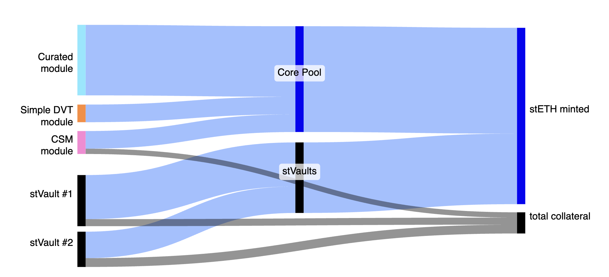

# Expanding stETH liquidity layer with over-collateralized minting

## Simple Summary

Introduce an **over‑collateralised accounting system** for **stETH**, enabling the token to be backed by ether supplied **outside the Lido Core pool** while preserving full fungibility and 1:1 redeemability.

## Abstract

Lido V3 evolves the protocol from a single staking pool into a versatile Ethereum staking infrastructure platform. It introduces **staking vaults** – modular, non-custodial components that enable users to stake with chosen operators under customizable terms while minting stETH. This design preserves stETH as the unified liquidity layer while supporting diverse staking strategies including operator-led liquid staking, DVT clusters, DeFi loops, and institutional vaults.

The protocol generalizes stETH minting through over-collateralization: any entity that can provably lock ≥100% collateral **plus a safety reserve** may mint stETH against the *effective* portion of that collateral. The proposal defines the *in‑protocol* collateral accounting, mint/burn flow, and health‑monitoring hooks while maintaining flexibility for vault implementations.

Key protocol additions:

1. **Collateral Registry (`VaultHub`)** – On‑chain ledger tracking every vault's *total value* (TV) and *locked* portion, serving as the central coordination point for the multi-vault ecosystem.  
2. **Accounting Oracle with extended supply** – Extends the existing oracle by publishing Merkle‑roots of per‑vault balances; `VaultHub` verifies inclusion proofs asynchronously ("lazy oracle" mechanism), enabling scalable vault management.  
3. **External‑shares mint / burn** – `Lido` contract enforces  
   `stETH.totalSupply() ≤ Core Pool total supply + Σ staking vault locked`, refusing mints that break it.  
4. **Reserve‑breach hooks** – if a vault’s buffer drops below certain
   thresholds (`RR`, `FRT`), Lido Core blocks fresh mints and can order an on‑chain rebalance (partial debt repayment through Lido Core).

## Motivation

The introduction of Lido V3 addresses a fundamental trade-off between staking setup control and liquidity. Traditional liquid staking pools offer fungible liquidity but limited control over validator selection and staking strategies. Conversely, direct staking provides full control but lacks liquidity. 

Lido V3 resolves this trade-off by decoupling validator selection from the liquidity layer through **staking vaults**.

Key motivations for this design include:

1. **Expanding addressable market** – Many stakers desire specific operator choice, DVT configurations, or compliance constraints that a single pooled model cannot accommodate. Vaults enable these use cases while preserving stETH liquidity.

2. **Enhanced validator set diversity** – By supporting diverse staking strategies (operator-led liquid staking, DVT clusters, DeFi loops, institutional vaults), the protocol promotes a more resilient and decentralized validator ecosystem.

3. **Risk isolation without liquidity fragmentation** – The Lido V2 model implicitly assumes every ETH deposit carries equal risk, socialized across all holders. As external ether sources join the ecosystem, this assumption becomes untenable. Without safeguards, a single high-risk vault could slash enough stake to force a global negative rebase or mint stETH minutes before an exit, externalizing risk.

4. **Platform evolution** – Moving from a single staking pool to a platform supporting multiple staking products aligns incentives among operators, builders, and stakers, fostering innovation while maintaining the battle-tested Core Pool for users seeking simple, traditional staking.

By hard-coding **over-collateralization at the protocol level** and measuring backing **per-vault**, the design contains tail risks while unlocking new ether supply lines. stETH remains a *single*, fungible liquidity layer; risk is isolated at the source, not socialized unless extreme conditions trigger failure modes.

## Specification

### Glossary

| Concept | Definition | 
|---------|------------|
| **Staking Vault** | Any contract or module that locks ETH and requests stETH mints through VaultHub. |
| **Total Value (TV)** | Sum of all ETH the staking vault controls on Execution + Consensus Layers simultaneously, incl. pending deposits. | 
| **Reserve Ratio (RR)** | Minimum share of TV that **should not** be represented by stETH. |
| **Force Rebalance Threshold (FRT)** | Minimum share of TV that incurs force rabalance if becomes represented by stETH, invariant: `FRT < RR` |
| **Locked** | `locked = TV × (1 – RR)` (floored) |
| **Liability** | stETH shares minted against the staking vault position (value rebases with stETH) |
| **Global backing invariant** | `stETH.totalSupply() ≤ Core Pool total supply + Σ Staking Vault locked` |
| **Reserve Breach** | If `TV – stETH.getTotalPooledEtherBySharesRoundUp(liability) < RR × TV`, staking vault enters *unhealthy* state. |
| **Bad debt** | If `stETH.getTotalPooledEtherBySharesRoundUp(liability) > TV`, staking vault enters *bad debt* state |

#### Design principles to uphold

Three key properties of the stETH token are to be preserved.

#### Collateralization

Every minted stETH has corresponding ether-nominated value, either inside the Lido Core pool or external ether locked (i.e., acting as the external stETH minting collateral) by the protocol. 

The new accounting model implements over-collateralized minting for external token supply sources, managing slashing risks across diverse staking strategies while maintaining flexibility. This approach enables the platform to support various staking setups without imposing rigid operational requirements beyond the core collateralization framework.



#### Redeemability

Every minted stETH must be redeemable either Lido Core pool, or the external minting collateral. 

This collateral must be potentially accessible by the protocol under certain conditions (e.g., collateral shortage or Lido Core pool depletion), allowing writing-off minted stETH external ether source liability by moving the corresponding external ether to the Lido Core pool (treating 1 stETH = 1 ETH).

#### Fungibility

The existing stETH token contract remains to be ERC-20 deployed under the same address on Ethereum mainnet.

Minting or burning new stETH does not trigger stETH token rebase, rebases keep happenning inside the establed `AccountingOracle` report lifecycle as a part of the main phase of the report data delivery. Rewards and penalties, accrued for stETH rebase, remain to be defined by the Lido Core pool validator set (i.e., stETH minted against the external minting collateral doesn't change the embedded stETH staking APR) unless failure mode is activated. 

### Key accounting changes

> For simplicity, 'external ether' means 'staking vault minting collateral', and 'external shares' are stETH shares minted against staking vaults.

#### Total pooled ether update

The total pooled ether (`totalPooledEther`) including the staking vault ether becomes:

```math
\text{totalPooledEther} = \text{bufferedEther} + \text{CLbalance} + \text{transientEther} + \text{externalEther}.
```

If we denote ether supply under the Lido Core pool as `internalEther`:

```math
\text{internalEther} = \text{bufferedEther} + \text{CLbalance} + \text{transientEther}
```

```math
\text{internalShares} = \text{totalShares} - \text{externalShares}
```

The key change is that stETH share rate is now calculated based on internal ether and internal shares:

```math
\text{shareRate} = \frac{\text{internalEther}}{\text{internalShares}}
```

This ensures that external vault performance doesn't affect the core stETH share rate under normal operation. The external ether is then calculated as:

```math
\text{externalEther} = \text{externalShares} \times \text{shareRate} = \frac{\text{externalShares} \times \text{internalEther}}{\text{internalShares}}
```

After applying the oracle report with fees:

```math
\text{totalPooledEther}_{\text{post}} = \text{internalEther}_{\text{post}} + \text{externalShares}_{\text{post}} \times \frac{\text{internalEther}_{\text{post}}}{\text{internalShares}_{\text{post}}}
```

> NB: Any changes in `shareRate` affect `externalEther` as a part of the regular stETH token rebase induced by `AccountingOracle`.
Therefore, the staking vault must maintain the reserve sufficient to update the total collateralized ether amount as a part of the token rebase.

#### Mint external shares

The amount of external stETH shares minted MUST be fully backed via a staking vault (including `RR`).

> NB: The mint operation MUST NOT incur the stETH token rebase.

Upon external shares minting, the `Lido` contract increases the stored `externalShares`. The key insight is that the share rate used for external minting is based on internal values:

- $\Delta S_{\text{ext}}$ as the number of external shares to be minted
- $\text{shareRate} = \frac{\text{internalEther}}{\text{internalShares}}$ as the current internal share rate

The relationship between incremental external shares and the ether they represent:

```math
\Delta ETH_{\text{ext}} = \Delta S_{\text{ext}} \times \text{shareRate} = \Delta S_{\text{ext}} \times \frac{\text{internalEther}}{\text{internalShares}}
```

After minting:
- External shares increase: `externalShares_new = externalShares_old + ΔS_ext`
- Total shares increase: `totalShares_new = totalShares_old + ΔS_ext`
- External ether implicitly increases by: `ΔS_ext × shareRate`
- The global backing invariant must still hold: `totalSupply ≤ internalEther + Σ Staking Vault locked`

#### Burn external shares

A staking vault can burn stETH shares from its balance to unlock the corresponding external ether collateral. This decreases the stored `externalShares`:

- $\Delta S_{\text{ext, burn}}$ as the number of external shares to burn
- The ether value represented by these shares: $\Delta ETH_{\text{ext, burn}} = \Delta S_{\text{ext, burn}} \times \frac{\text{internalEther}}{\text{internalShares}}$

After burning:
- External shares decrease: `externalShares_new = externalShares_old - ΔS_ext,burn`
- Total shares decrease: `totalShares_new = totalShares_old - ΔS_ext,burn`
- External ether implicitly decreases by: `ΔS_ext,burn × shareRate`
- The vault's available collateral increases accordingly

#### Rebalance

Rebalance allows converting external shares to internal by transferring ether from vaults to the Lido Core pool. This operation maintains key invariants while adjusting the internal/external balance:

**Rebalance invariants:**
1. Total shares remain constant: `totalShares_old = totalShares_new`
2. Total pooled ether remains constant: `totalPooledEther_old = totalPooledEther_new`
3. Share rate remains unchanged (no rebase triggered)

**Process for rebalancing** $\Delta S_{\text{ext}}$ external shares:

The vault must transfer ether equal to: $\Delta ETH = \Delta S_{\text{ext}} \times \frac{\text{internalEther}}{\text{internalShares}}$

After rebalance:
```math
externalShares_{new} = externalShares_{old} - \Delta S_{\text{ext}}
```
```math
internalShares_{new} = internalShares_{old} + \Delta S_{\text{ext}}
```
```math
internalEther_{new} = internalEther_{old} + \Delta ETH
```
```math
bufferedEther_{new} = bufferedEther_{old} + \Delta ETH
```

Rebalance is used to:
- Restore vault health when reserves fall below thresholds
- Handle forced rebalancing when FRT is breached
- Manage collateral during slashing events

#### Oracle reports

Accounting oracle reports happen in the same cadence as before, but now include handling of vault-related bad debt (in cases when bad debt is assigned to be socialized by the protocol, happens only explicitly and MUST be assigned to the Lido DAO Agent).

Token rebase is implemented such that `externalEther` gets updated according to the newly delivered Lido Core pool changes after rewards and fees are distributed.

##### Rewards, penalties, and fees

Rewards and penalties accrued by the Lido Core pool validator set define the stETH token rebase. The key change is that share rate calculations now use internal ether and shares:

Transient balance as observed during the report gathering:
```math
transientCLBalance_{report} = 32ETH \times (CLValidators_{report} - CLValidators_{pre})
```
Principal CL balance as observed during the report: 
```math
principalCLbalance_{report} = CLbalance_{pre} + transientCLBalance_{report}
```
Rewards accrued as observed during the report:
```math
CLrewards_{report} = [CLbalance_{report} + withdrawalVault.balance_{report}] - principalCLbalance_{report}
```
Internal ether before fees:
```math
internalEther_{\text{beforeFees}} = 
    internalEther_{pre} + CLrewards_{report} + elRewardsVault.balance_{report} - wqWithdrawals_{report}
```
Internal shares before fees:
```math
internalShares_{\text{beforeFees}} = 
    internalShares_{pre} - sharesToBurn_{report}
```

Protocol fees are now calculated based on internal values:
```math
sharesToMintAsFees = \frac{feeEther \times internalShares_{\text{beforeFees}}}{internalEther_{\text{beforeFees}} - feeEther}
```

After fees and bad debt internalization:
```math
internalShares_{\text{post}} = internalShares_{\text{beforeFees}} + sharesToMintAsFees + badDebtToInternalize
```
```math
externalShares_{\text{post}} = externalShares_{pre} - badDebtToInternalize
```

Lido Core continues to be the sole source of *token* rebases; however, the
oracle now carries the extra field `vaultsRoot`, containing the Merkle root of each vault's `TV`, `fees`, `liability`, `slashing reserve`.

The on‑chain `AccountingOracle` stores the last accepted root. `VaultHub.processVaultReport(proof, values)` can be called permissionlessly
throughout the oracle period to update individual vaults lazily.

##### Bad debt internalization

If there is bad debt to be internalized from vaults, the protocol:
1. Decreases external shares by the bad debt amount
2. Increases internal shares by the same amount
3. This effectively socializes the loss across all stETH holders through share rate dilution

This process happens **after** CL state updates but **before** token rebase emission, maintaining the "one global APR" invariant.

##### Rebase smoothening and sanity checks

To prevent oracle sandwiching and ensure system stability, the protocol applies rebase smoothening:

1. **Base for smoothening**: Internal ether and internal shares (excluding external values)
2. **Sanity checks** include:
   - Report timestamp must be in the past
   - CL validators must be between previous count and deposited validators
   - Internal shares post-rebase cannot be zero
   - Simulated share rate validation for withdrawal finalization

The final post-rebase values are calculated as:
```math
postTotalShares = postInternalShares + postExternalShares
```
```math
postTotalPooledEther = postInternalEther + \frac{postExternalShares \times postInternalEther}{postInternalShares}
```

This ensures that:
- External vaults don't affect the core pool's rebase calculations
- Share rate remains stable and predictable
- Bad debt socialization happens transparently

## Specification (minimal)

#### Function: `Lido.totalPooledEther() → uint256`

Returns  
`internalEther + externalEther`, where:
- `internalEther = bufferedEther + CLBalance + transientEther`
- `externalEther = externalShares * internalEther / internalShares`

#### Function: `Lido.mintExternalShares(address receiver, uint256 sharesAmount)`
*Requirements*

1. **caller** must be `VaultHub`.
2. `sharesAmount` must not be zero.
3. Staking must not be paused.
4. External balance limit must not be exceeded.
5. Staking rate limit must not be exhausted.

*Effects*

1. `externalShares += sharesAmount`  
2. Mint `sharesAmount` stETH shares to `receiver`.
3. Total pooled ether increases by `sharesAmount * shareRate` (implicitly).
4. Consumes staking rate limit of stETH corresponding to `sharesAmount`.

*Events*  
`ExternalSharesMinted(receiver, sharesAmount)`.

#### Function: `Lido.burnExternalShares(uint256 sharesAmount)`
*Requirements*

1. **caller** must be `VaultHub`.
2. `sharesAmount` must not be zero.
3. Staking must not be paused.
4. `externalShares >= sharesAmount` (sufficient external shares).

*Effects*

1. Burn `sharesAmount` stETH shares from caller.
2. `externalShares -= sharesAmount`.
3. Total pooled ether decreases by `sharesAmount * shareRate` (implicitly).
4. Returns staking rate limit of stETH corresponding to `sharesAmount` (clamped at max value)

*Events*  
`ExternalSharesBurnt(sharesAmount)`.

#### Function: `Lido.rebalanceExternalEtherToInternal(uint256 sharesAmount)`
*Requirements*

1. **caller** must be `VaultHub`.
2. `msg.value` must not be zero.
3. Staking must not be paused.
4. `msg.value` must match `sharesAmount * shareRate`.
5. `externalShares >= sharesAmount`.
6. Staking rate limit must not be exhausted.

*Effects*

1. `externalShares -= sharesAmount` (external balance decreased).
2. `bufferedEther += msg.value` (buffer increased).
3. Total shares remain the same (shares moved from external to internal).
4. Consumes staking rate limit of stETH corresponding to `sharesAmount`.

*Events*  
`ExternalEtherRebalanced(msg.value, sharesAmount)`.

#### Function: `Lido.internalizeExternalBadDebt(uint256 sharesAmount)`
*Requirements*

1. **caller** must be `Accounting`.
2. `sharesAmount` must not be zero.
3. Staking must not be paused.
4. `externalShares >= sharesAmount`.

*Effects*

1. `externalShares -= sharesAmount`.
2. Total shares remain the same.
3. Internal shares effectively increase by `sharesAmount`.
4. Share rate decreases (losses socialized across all stETH holders).

*Events*  
`ExternalBadDebtInternalized(sharesAmount)`, `ExternalSharesBurnt(sharesAmount)`.

## Rationale

### Abstracting external ether

The design does not require the protocol to 'understand' the nature of external ether. It only requires trusted external accounting through `VaultHub`, ensuring that the external ether source is credible. The external ether could represent aggregator-controlled validator balances or, potentially, other complex Ethereum and broader ecosystem mechanisms.

### Why track external shares instead of external ether directly

stETH is defined by its share mechanics, and all protocol logic revolves around shares and their rate. By expressing external contributions and redemptions in terms of stETH shares, the protocol remains consistent. Ether is only an input or output measure, while shares define the in-protocol liquidity and distribution rules.

### Why token rebase only through Lido Core

Lido Core acts as a validation performance benchmark oracle in a sense that stETH reward rate isn't changing by allowing external ether to be used for minting, meaning that the Core pool represents the opinionated validator set voted in by the Lido DAO striving for balance between decentralization, efficiency, and resilience.

## Security considerations

### No unbacked mint

Invariant is enforced upon every new stETH mint.

For the already minted, external shares should stay reasonably overcollaterized to accommodate locked increase due to the historically-positive stETH token rebase.
Overcollaterization is controlled with the appropriately chosen `RR` and `FRT` values to allow fine-grainted control:
- block new minting requests when the `RR` threshold breached
- allow force rebalance to be made by the protocol when the `FRT` threshold breached

### Collateral updates (RR & FRT guidance)

* **RR** (e.g., 10 %) must at minimum cover the *validator correlated slashing* scenario contemplated by the risk assessment framework analysis.
* **FRT** should be chosen such that the staking vault with the fully inactive validators can move from breaching `RR` to `FRT` on a scale of a few months.

Detailed analysis is presented withing the [risk assessment framework](https://research.lido.fi/t/risk-assessment-framework-for-stvaults/9978).

### Oracle tamper resistance

* Unchanged **quorum‑of‑N** multi‑sig scheme (same addresses as V2) signs the
  updated `AccountingOracle` payload.
* On‑chain *sanity checks* as a part of the lazy oracle flow (applies at the moment of the report unroll).

### Isolation

* `StakingVault` contract is **upgradeably pinned**;
  `VaultHub` enforces deterministic allowlisted proxy factory deployments per vault type.
* A logic flaw in a vault can only evaporate that vault’s TV; the
  `VaultHub` guard prevents it from ever minting beyond its last reported
  `TV – RR × TV`.

### stETH redemptions risk

The Lido Core pool must maintain reasonable amount of `internalShares` and `internalEther` to preserve redeemability of the stETH token (backed both by internal and external ether supply).

To mitigate these risks, minting security limits should be enforced together with properly aligned incentives between internal and external supply sides.

Under severe Lido Core pool depleting conditions, the protocol may require redemption requests to be handled using staking vaults, attributing the `redemptions` counter nominated in stETH shares accordingly. That would require from vault either voluntary burning `stETH` shares from its balance, decreasing simultaneously `liability` and `redemptions`, or rebalancing the  `redemptions` shares amount, satisfying the assigned obligation.

### Implementation risk

A faulty implementation could allow malicious actors to mint or burn stETH at will, breaking the token’s economic model.

Rigid code reviews, external audits, well-defined access controls, emergency mechanisms, and thorough sophisticated test coverage is essential.

### Staking limits and pause

External shares has a global-to-TVL limit enforcing now new mints can exceed it.

External shares minting consumes staking rate limit and respects minting pauses.
External shares burning returns back staking rate limit (still clamped to its max value).

Pauses are implemented on multiple layers of the system:
- Individual or multiple vaults can be non-eligible for minting using granular limits
- VaultHub has a pause mechanism disabling minting and withdrawing operations for vaults
- Rate limit mechanism can prevent stETH total supply increase by minting
- Overall minting can be paused
- All stETH token transfers can be paused

### One new minter/burner for stETH

This LIP introduces a new source of minting and burning, increasing the importance of access control, deployment configuration, and monitoring.

To limit the control surface, all minting and burning of external shares is authorized only via the single `VaultHub` contract. There is a global minting limit preventing external shares to exceed the sane limits upon initial proposal adoption (as said above).

## Failure modes

### External ether drained

If external ether sources fail or experience a severe mass-slashing event, external shares remain in circulation whilst bad debt accrues in the stETH external ether supply (i.e., the `stETH.getTotalPooledEtherRoundUp(liability) > TV` invariant broken for a vault or a group of vaults).

Losses can be covered by:
- replenishing the staking vaults accrued bad debt with additional funds;
- socializing the bad debt among vaults containing slashed validors of the same node operator;
- executing a self-coverage application (see [LIP-18](./lip-18.md));
- internalizing the losses to protocol, decreasing stETH token rebase (as it would have been with the Lido Core pool staking penalties) within the next oracle report (see bad debt internalization mechanism described above)

### Emergency pause

The collateral registry contract (`VaultHub`) and auxiliary parts implement an emergency pause mechanism, allowing to minimize the potential impact of the discovered vulnerability or unspecified critical protocol state, which is suggested to be used with a GateSeal instance.

Paused state prevents:
- a new staking vault from being registered in the collateral registry;
- already registered vaults can't be disconnected;
- stETH can't be minted or burned against staking vaults;
- ether can't be funded or withdrawn from the registered vaults;
- rebalance operations are paused;
- staking vaults can't receive oracle reports;
- ether can't be deposited to beacon chain from staking vaults
- assigned obligations of staking vaults (redemptions and fees) can't be settled

## Rationale

The evolution to Lido V3 represents a severe transformation from a single-pool liquid staking protocol to a comprehensive Ethereum staking infrastructure platform. This design addresses the fundamental trade-off between staking control and liquidity that has limited liquid staking adoption among sophisticated users and institutions. 

The architecture decouples validator selection from liquidity provision, enabling diverse staking strategies while preserving stETH as the unified liquidity layer. This approach expands Lido's addressable market to include users requiring specific operator choice, DVT configurations, compliance constraints, or custom staking strategies – use cases that a monolithic pool cannot accommodate.

The design choices reflect careful consideration of protocol evolution, market expansion, and ecosystem integration:

### Single fungibility layer

Maintaining stETH as a single fungible token despite multiple backing sources provides critical benefits:

- **DeFi composability**: A unified token preserves existing integrations across lending protocols, DEXes, and other DeFi applications. Fragmenting into multiple tokens would dilute liquidity and complicate integrations.
- **User experience**: Users continue interacting with one familiar token rather than managing multiple vault-specific tokens with different risk profiles and redemption mechanics.
- **Network effects**: The accumulated liquidity, brand recognition, and ecosystem tooling around stETH remain intact, avoiding the cold-start problem for new liquidity tokens.
- **Price discovery**: A single token maintains efficient price discovery and arbitrage mechanisms, preventing price divergence between different backing sources.

### Source-level risk accounting

The over-collateralization requirement at the vault level creates robust risk isolation:

- **No risk socialization**: Each vault maintains its own reserve buffer (RR), ensuring that slashing or operational failures affect only that vault's participants, not the broader stETH holder base unless failure mode is activated.
- **Incentive alignment**: Vault operators bear the cost of their own risk through locked reserves, incentivizing prudent validator management and operational excellence.
- **Transparent risk pricing**: Different vault types can have different reserve requirements based on their risk profile, allowing market-based risk pricing while maintaining token fungibility.
- **Graceful degradation**: The FRT threshold enables orderly unwinding of unhealthy positions before they impact the global system, with forced rebalancing serving as a backstop.

### Upgradeable & extensible architecture

The modular design enables protocol evolution without disrupting existing operations:

- **Vault type flexibility**: New staking strategies, validator configurations, or even non-staking collateral types can be added by deploying new vault implementations and registering them with VaultHub.
- **Oracle extensibility**: The Merkle root approach in the AccountingOracle allows adding new data fields for future vault types without changing the core oracle infrastructure.
- **Minimal coordination**: Adding a new vault type requires only deploying the vault contract and configuring it in the registry — likely no changes to Lido Core, stETH token, or existing integrations.
- **Future-proof**: The design accommodates potential future developments like distributed validators, new consensus mechanisms, or cross-chain staking without architectural changes.

### Minimal Lido Core surface area

The design carefully limits changes to the battle-tested Lido Core:

- **Contained complexity**: New complexity is isolated in VaultHub and vault implementations, while Lido Core adds only essential external share accounting functions.
- **Preserved invariants**: Core protocol invariants around deposits, withdrawals, and rebasing remain unchanged; external shares are handled as a parallel accounting system.
- **Agnostic to vault logic**: Lido Core doesn't need to understand vault-specific logic, strategies, or operational details—it only enforces the global backing invariant.

## Backward compatibility

The implementation of this LIP prioritizes maintaining full backward compatibility with existing Lido infrastructure and integrations. The transition to support external ether sources is designed to be seamless for current users and integrators:

### Existing deposit flow preservation

The traditional ETH staking flow through Lido Core remains completely unchanged:

- **Direct deposits**: Users can continue depositing ETH directly to the Lido contract, receiving stETH 1:1 as before. The deposit flow through `submit()` and referral functions operates identically.
- **Deposit router**: The existing deposit distribution logic and staking module interfaces remain intact. Current staking modules continue operating without modification.
- **Buffer management**: The buffered ether mechanics, withdrawal request handling, and deposit allocation algorithms function as they do today.
- **Validator lifecycle**: The process of spinning up validators, managing exits, and handling rewards through the existing Node Operator Registry remains unchanged for Lido Core.

### wstETH wrapper compatibility

The wrapped stETH (wstETH) contract and its deployments across L1 and L2s maintain full compatibility:

- **Unchanged interface**: The wstETH wrapping/unwrapping mechanics remain identical, as they depend only on stETH's share-based accounting, which is preserved.
- **Cross-chain bridges**: Existing bridge implementations for wstETH on Arbitrum, Base, Optimism, Polygon, and other L2s continue functioning without modification.
- **Share rate consistency**: The fundamental share rate calculation preserves the wstETH:stETH exchange rate continuity, ensuring no disruption to existing positions.
- **Integration stability**: DeFi protocols using wstETH as collateral or for liquidity provision experience no changes in behavior or required integration updates.

### Withdrawal system compatibility

The withdrawal request and claim system maintains full backward compatibility:

- **NFT mechanics**: Withdrawal request NFTs continue to represent claims on the underlying ETH with the same finalization process and timing.
- **Queue processing**: The withdrawal queue processes requests identically, with funds sourced from the buffer, validator exits, and now potentially vault rebalancing.
- **Bunker mode**: The existing bunker mode protections and turbo mode operations function as designed, with external shares not affecting calculations.

### Oracle infrastructure compatibility

Oracle consumers and data feeds maintain compatibility while gaining optional access to new data:

- **Beacon chain oracles**: The beacon chain state reporting continues with the same cadence and validation requirements.
- **Extended data**: New vault-related data is added as optional fields that don't affect existing consumers but enable new functionality for vault management.
- **Report processing**: The oracle report submission and processing flow remains identical for existing oracle operators.

### Integration requirements

**No action required** from existing stETH/wstETH integrators:

- Smart contracts interacting with stETH/wstETH continue functioning without updates
- Exchange integrations, wallets, and custody solutions require no changes
- Existing monitoring, analytics, and reporting tools remain compatible
- Oracle consumers can ignore new fields until ready to utilize vault data

This backward compatibility ensures a smooth transition that doesn't disrupt the extensive ecosystem built around stETH, while enabling new capabilities for those ready to leverage them.

Also, previously known external proof of reserve-type feeds and tools treating Lido = Lido Core only should be updated to accomodate new external supply sources for the whole stETH token supply.

## Reference implementation

The reference testnet implementation is available on GitHub: [feat: stVaults](https://github.com/lidofinance/core/pull/874).

## Links and references

- [Lido V3 Whitepaper: RFC draft](https://research.lido.fi/t/lido-v3-whitepaper-rfc/10124)
- [Lido "Bring Your Own Validator" Alternative Design](https://mixbytes.io/blog/lido-bring-your-own-validator-alternative-design)
- [Lido rebase documentation](https://docs.lido.fi/contracts/lido#rebase)
- [stETH share mechanics](https://docs.lido.fi/guides/lido-tokens-integration-guide#steth-internals-share-mechanics)
- [stVaults testnet deployments](https://docs.lido.fi/deployed-contracts/hoodi-lidov3/)
- [stVaults technical design](https://hackmd.io/@lido/stVaults-design)
- [stVaults risk assessment framework](https://research.lido.fi/t/risk-assessment-framework-for-stvaults/9978)
- [stVaults fee structure](https://research.lido.fi/t/stvaults-fees-approach/9979)