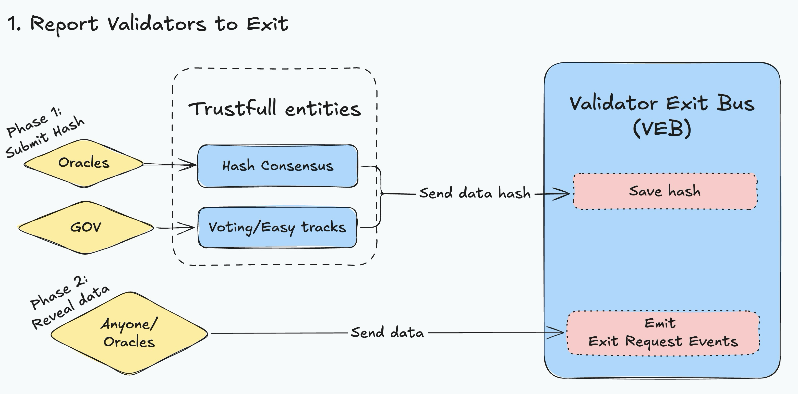
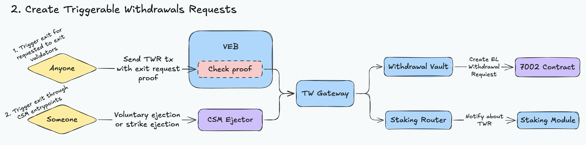
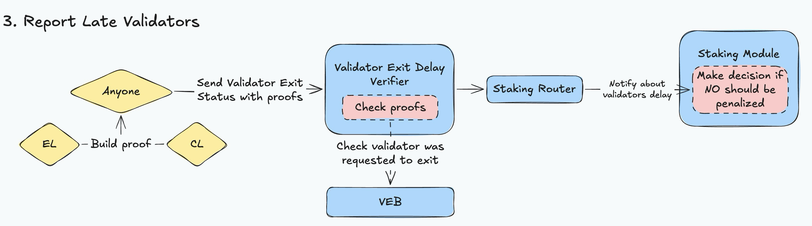

# Simple Summary

This proposal outlines the implementation of the Triggerable Withdrawals framework within the Lido protocol. The goal is to enable permissionless, secure, and verifiable validator exits initiated from the Execution Layer. This enhancement aims to:
- Improve the protocol’s fault tolerance
- Reduce trust assumptions on node operators
- Strengthen the foundation for permissionless staking within Lido

Currently, Lido relies on the Validator Exit Bus Oracle (VEBO) and places trust in Node Operators to initiate validator exits on CL. If a node operator fails to comply with the protocol’s policies, [penalties are applied](https://docs.lido.fi/guides/oracle-spec/penalties).

In the new version of the framework based on the recently adopted EIP-7002, this mechanism remains in place. However, it adds a new capability: withdrawing validators who have requested to exit without requiring Node Operator action. This reduces reliance on node operators and aligns with a more decentralized and trust-minimized Lido protocol design vision.

# Abstract

The **Triggerable Withdrawals (TW)** mechanism is a critical extension of the Lido protocol’s architecture, enabling the initiation of validator exits (and partial withdrawals in future) from the EL side without relying on the involvement of a Node Operator from the CL side. TW is based on [EIP-7002](https://github.com/ethereum/EIPs/blob/master/EIPS/eip-7002.md), which addresses one of the long-standing issues in delegated staking on Ethereum. Previously, stakers had to rely on the goodwill of Node Operators—either to pre-sign an exit message or to agree to process it in the future. This limitation is now lifted: any party with access to a validator’s withdrawal credentials (non-`0x00` types) can initiate its exit directly via the Execution Layer. 

# Motivation
For the **Lido protocol**, TW support means a substantial reduction in trust assumptions toward Node Operators and Oracles. It unlocks the following capabilities:

- **Permissionless Staking Modules**, such as CSM, where ETH cannot be "held hostage" even if the operator misbehaves or significantly underperforms;
- A mechanism for **emergency validator exits**, in case of key loss or a potential compromise event;
- **Direct DAO interaction**, enabling the Lido DAO to request validator exits independently of Oracles.
- Enables permissionless exits for validators that have been requested to exit, preventing NOs from delaying withdrawal requests fulfillment.

# Specification

## 1. Gloassary

### **Validators Exit Bus (VEB)**
An on-chain contract that serves as the central infrastructure for managing validator exit requests. It signals NOs to exit their validators by emitting exit request events, emits exit events, and maintains data and tools that enable anyone to prove a validator was requested to exit. Unlike VEBO, it supports exit reports from a wide range of entities.

### **Validators Exit Bus Oracle (VEBO)**
A component of the existing [oracle system](https://docs.lido.fi/guides/oracle-spec/validator-exit-bus) responsible for delivering exit request reports to the VEB on behalf of oracles. Its primary role is to initiate the exit of enough validators to efficiently fulfill pending withdrawal requests. It is a part of the VEB contract.

### Validator Exit Request
Events generated within the VEB that signal to Node Operators the need to initiate exits for the validators specified in the corresponding event.

### **Triggerable Withdrawal**
A validator exit process initiated via the **EL** without requiring a signature from the validator key, using withdrawal credentials and the precompile contract described in [EIP-7002](https://eips.ethereum.org/EIPS/eip-7002).

### Triggerable Withdrawal Request (TWR)
A request to initiate a validator exit through the EL.

### Triggerable Withdrawal Gateway (TWG)
A new smart contract that serves as the single entry point for all TWRs in the protocol. Responsible for enforcing rate limits, verifying roles and permissions before forwarding EL requests to the Withdrawal Vault.

### Late **Validator**
A validator that has not begun the exit process within the predefined exit time window following the emission of an exit request event in VEB. Such validators can be reported permissionlessly and forwarded to the staking module for potential penalties.

### Validator Exit Delay Verifier
A smart contract that exposes a public, permissionless interface for reporting late validators and forwarding them to Staking Modules, which may apply penalties based on module-specific rules.

## 2. Scope

### Scope

The Triggerable Withdrawals framework introduces a set of changes across both on-chain and off-chain components:
On-chain Components:

- [Lido Locator](https://github.com/lidofinance/core/blob/feat/triggerable-exits/contracts/0.8.9/LidoLocator.sol)
- [Validators Exit Bus](https://github.com/lidofinance/core/blob/feat/triggerable-exits/contracts/0.8.9/oracle/ValidatorsExitBus.sol)
    - [Validators Exit Bus Oracle](https://github.com/lidofinance/core/blob/feat/triggerable-exits/contracts/0.8.9/oracle/ValidatorsExitBusOracle.sol)
- [Accounting Oracle](https://github.com/lidofinance/core/blob/feat/triggerable-exits/contracts/0.8.9/oracle/AccountingOracle.sol)
- [Withdrawal Vault](https://github.com/lidofinance/core/blob/feat/triggerable-exits/contracts/0.8.9/WithdrawalVault.sol)
    - [WithdrawalVaultEIP7002](https://github.com/lidofinance/core/blob/feat/triggerable-exits/contracts/0.8.9/WithdrawalVaultEIP7002.sol)
- [Staking Router](https://github.com/lidofinance/core/blob/feat/triggerable-exits/contracts/0.8.9/StakingRouter.sol)
- [Node Operator Registry](https://github.com/lidofinance/core/blob/feat/triggerable-exits/contracts/0.4.24/nos/NodeOperatorsRegistry.sol)
- [New] [Validator Exit Delay Verifier](https://github.com/lidofinance/core/blob/feat/triggerable-exits/contracts/0.8.25/ValidatorExitDelayVerifier.sol)
- [New] [Triggerable Withdrawals Gateway](https://github.com/lidofinance/core/blob/feat/triggerable-exits/contracts/0.8.9/TriggerableWithdrawalsGateway.sol)

Off-chain Components:

- [Lido Oracle](https://github.com/lidofinance/lido-oracle/pull/685)
- [Validator Ejector](https://github.com/lidofinance/validator-ejector)
- [New] Trigger Exits Bot
- [New] Validator Late Prover Bot

## 3. Architecture and Scenarios

At a high level, the architecture is centered around the **VEB**, which serves as the main coordination point for validator exit requests. Exit reports can be submitted to the VEB by trusted entities such as oracles or governance, which then emit validator exit events. Once exit request events are emitted, Node Operators are expected to voluntarily initiate the validator exit.

The **VEBO** is an extension of the **VEB**, designed to support oracle-driven reporting. While VEB serves as the central hub for coordinating exit events, VEBO adds an oracle-specific layer that enables oracles to submit and confirm exit reports.

To manage all **TWRs** submitted by authorized entities, a dedicated smart contract called the **Triggerable Withdrawals Gateway (TWG)** is introduced. This contract acts as the single entry point for TWRs from trusted sources and forwards valid requests to the **Withdrawal Vault**. It is responsible for:

- Validating the roles and permissions of the caller;
- Enforcing rate limits for safety and protocol stability;
- Coordinating with the `Withdrawal Vault` to trigger validator exits via the Execution Layer (EL);

Once an exit event has been emitted via the VEB, **any participant** can submit a TWR through a permissionless interface provided by the VEB contract. VEB ensures that the validator was indeed requested to exit before passing the request to the TWG for execution.

Additionally, the architecture includes a **Validator Exit Delay Verifier**, a contract that allows anyone to report late validators—those that failed to begin exiting within the expected time window after an exit event was emitted. These reports are submitted on-chain and forwarded to the appropriate staking modules, which may apply penalties based on module-specific logic.

### 3.1 Report Validators to Exit

This flow describes the **two-phase delivery model** for reporting validators to exit. In the first phase, Oracles - via consensus on a smart contract, [Easy Tracks](https://docs.lido.fi/guides/easy-track-guide/) or governance submit a hash of the exit requests data to the **VEB**. The report data includes a list of validators to be exited.

The second phase involves revealing the actual report data and emitting exit events for the listed validators. When the data is revealed, the contract saves a timestamp linked to the data hash. This later allows any actor to prove that a specific validator was requested to exit, and when the corresponding event was emitted.

Because report hashes can be submitted by more than just oracles, this system increases protocol resilience and moves Lido toward a more decentralized architecture.



### 3.2 Triggerable Withdrawal Requests submittion

This scenario describes the creation of **Triggerable Withdrawals** flows through the **TW Gateway (TWG)**.

There are two separate flows for triggering withdrawals, depending on the actor:

- Creating a TWR through the **VEB**;
- Creating a TWR through the **CSM**.

Both flows go through the **TWG**, which checks the caller contract roles, enforces exit limits, refunds any extra value provided, and forwards the request to the Withdrawal Vault. After that, it notifies the Staking Router with information about which validator was requested to exit and the associated fee.



---

#### Submitting TWR through the VEB

Any actor can trigger a validator exit that was previously requested through the **VEB**, as soon as the report has been revealed. The participant uses the previously submitted report data and specifies the validator indices (in an array) to be exited. The **VEB** then performs the following checks:

- The provided exit data hash exists and matches the hash stored in the VEB.
- The corresponding data has already been revealed.

Once validated, the request is forwarded to the **TWG** — the central contract handling all triggerable exit requests. The **TWG**:

- Enforces frame-level rate limits.
- Forwards the request to the **Withdrawal Vault**, which interacts with the **EIP-7002 precompile** to trigger the actual exit.
- Notifies the associated staking module.
- Refunds any extra value provided.

---

#### Submitting TWR through CSM

This flow mirrors the previous one, but instead of using validators that were requested to exit, **trusted entities** can directly initiate an exit **without any prior exit request event in the VEB**.

This direct exit flow is available to specific entities such as **CSM**, but due to its powerful nature, modules must adhere to strict internal checks before using it. These include:

- Verifying that the validator key belongs to the module.
- Ensuring the key was deposited through a **DSM**.
- Ensuring there are no key duplicates in one transaction to avoid dry out TWG limits.
- Implementing additional logic to confirm that the entity calling the **TW** is authorized (e.g., owns the key or is creating a TWR for a validator that is permitted to exit).

With proper validation and verifiable on-chain code, this mechanism allows modules to trigger validator exits **without increasing trust assumptions** toward Node Operators or third parties.

---

### 3.3 Report Late Validators

A **Late Validator** is a validator that was requested to exit via the VEB, but failed to begin exiting on the CL within a defined window (e.g., N slots or epochs). To allow staking modules to penalize such behavior, late validators must be explicitly reported on-chain.

Previously, this was handled via the **AO** by reporting the count of stuck validators. However, this approach was inflexible, fully off-chain dependent, and prone to race conditions — a validator might have exited just before the AO reported it as stuck.

With the new flow, **any actor** can report a validator as "late" as soon as it misses its expected exit window — even by a single slot. This makes the penalty mechanism more precise and unavoidable.

To do this, a participant must:

- Submit a **proof of the validator’s current state** on the CL;
- Reference the VEB report in which the validator was requested to exit.

The system calculates the difference between:

- The timestamp of the exit request emission (from VEB) or validator’s `activation epoch + COMMITTEE_PERIOD`. [Details](#Calculating-secondsSinceEligibleExitRequest-Sent-to-the-Staking-Module);
- The timestamp of the CL state showing the validator is still active.

This time delta is passed to the **staking module**, which uses its internal logic to decide whether a penalty should be applied to the Node Operator and what kind of action is warranted.



## 4. Onchain Components

This section provides a detailed breakdown of each smart contract involved in the Triggerable Withdrawals framework, including their purpose, responsibilities, functions, and external interfaces.

### 4.1 Validator Exit Bus

The Validator Exit Bus is the core contract for coordinating validator exit requests within the Lido protocol.

#### Responsibilities

- Emitting `ValidatorExitRequest` events based on unpacked exit requests.
- Enforcing rate limits on the number of exits per block.
- Tracking exit report history and providing tools to prove that a validator was requested to exit.

---

#### ⚠️ Removal of Last Requested Validator Indexes from On-Chain Storage

Since reports will be delivered not only by Oracles, the contract can no longer guarantee that all validators under a single Node Operator will be requested to exit in order based on their validator indexes on the CL. As a result, functionality relying on this assumption becomes obsolete.

With the introduction of TW, it is expected that once validators are marked as delayed, they will be exited through the TW framework. Therefore, all off-chain applications that previously relied on ordered exits can simply monitor the validator’s state on the CL and read the latest events to determine which validators have been requested to exit or have already exited.

```diff
contract ValidatorsExitBusOracle {
-  function getLastRequestedValidatorIndices(uint256 moduleId, uint256[] calldata nodeOpIds) view;
}
```

---

#### Pausable Contract

The **Validator Exit Bus** contract is pausable using the [GateSeal](https://github.com/lidofinance/gate-seals?tab=readme-ov-file#what-is-a-gateseal) to prevent unexpected behavior that could harm the protocol.

When the contract is paused, it prevents hash submissions, data reveals, and exits triggering.

---

#### Limits enforcement

This contract uses the **Limits Library** to enforce rate limiting. Each **Validator Exit Request** consumes one unit of quota. All Validator Exit Requests, except those from Oracle reports, are subject to a single global limit. Oracle reports are limited with Oracle Sanity Checker contract.

Technical implementation: [**Appendix A – Limit Implementation**](#Appendix-A-–-Limit-Implementation)

In addition to limits, a restriction on the number of max processed validators per tx will be applied. This ensures that the report cannot consume excessive gas during processing.

---

#### Hash Invalidation

Data hashes are invalidated if the VEB contract version changes, preventing outdated data from being revealed in some point of time in far future.

---

#### Validator Exit Bus Oracle

VEBO is an extension of VEB designed specifically to support oracle-based report submission.

**Core differences in exit data revealing comparing to VEB:**
- Report hash is saved into VEB during data submission (on second phase of VEBO report).
- Only Oracle Members can submit report (or someone with `SUBMIT_DATA_ROLE`).

---

### 4.3 Triggerable Withdrawals Gateway

The **Triggerable Withdrawals Gateway** is a core contract responsible for receiving and processing all **Triggerable Withdrawal Requests (TWRs)**. It enforces rate limits on TWR creation, calculates the required fee per request, issues refund (if any) to the designated recipient, and forwards validated requests to the **Withdrawal Vault**. After processing, it notifies the **Staking Router** about the request for further action.

---

#### Limits enforcement

This contract uses the **Limits Library** to enforce rate limiting. Each **TWR** consumes **one unit of quota**. All TWRs, regardless of their source, are subject to a **single global limit**, ensuring that the total number of processed requests remains within the protocol-defined capacity.

Analytics numbers: https://hackmd.io/5wN10bGaSbyPwpzcVkdVVw?both

Technical implementation: [**Appendix A – Limit Implementation**](#Appendix-A-–-Limit-Implementation) 

---

### 4.4 Withdrawal Vault

The **Withdrawal Vault** is a core contract capable of performing **Execution Layer (EL) requests**. We implement support for [EIP-7002: Execution Layer Triggerable Withdrawals](https://eips.ethereum.org/EIPS/eip-7002).

### 4.5 Validator **Exit Delay** Verifier

The **Validator Exit Delay Verifier** is a contract responsible for detecting **late validators**—validators that were requested to exit via the VEB but have **not yet initiated exit on the CL**. It calculates the time during which Node Operators have failed to exit their validators and provides this information to **Staking Modules** via the **Staking Router**.

This is done by submitting **proofs** that:
- The validator **has no exit epoch set** on CL at a known slot;
- The validator **was requested to exit** via a previously submitted VEB report.


#### Calculating `secondsSinceEligibleExitRequest` sent to the Staking Module for each validator

It is important to note that `secondsSinceEligibleExitRequest` is **not always equal** to the raw difference between the timestamp when the validator was requested to exit and the timestamp when the validator is still observed as active. In edge cases, a Node Operator **may not be able to initiate an exit immediately**—for example, if the validator was only recently activated.

Therefore, this value represents the time **between the moment the Node Operator was first eligible to initiate the exit** (i.e., after activation and exit eligibility conditions were met) **and the moment the validator is still observed as active**.

### 4.6 Staking Router

The main update introduces support in the **Staking Router** for a new interface that staking modules must implement. This interface includes two new methods:

- One for reporting **late validators**;
- One for reporting all **triggerable withdrawal requests** that have been executed for validators managed by the module.

#### 4.7 IStakingModule

IStakingModule is updated with new methods required to fully support TW. New interface and methods description can be found below:

```solidity
/// @notice Handles tracking and penalization logic for a validator that remains active beyond its eligible exit window.
/// @dev This function is called by the StakingRouter to report the current exit-related status of a validator
///      belonging to a specific node operator. It accepts a validator's public key, associated
///      with the duration (in seconds) it was eligible to exit but has not exited.
///      This data could be used to trigger penalties for the node operator if the validator has exceeded the allowed exit window.
/// @dev Reverts if the function call would have no effect on the node operator (i.e., no new penalization will be applied).
///
/// @param _nodeOperatorId The ID of the node operator whose validator's status is being delivered.
/// @param _proofSlotTimestamp The timestamp (slot time) when the validator was last known to be in an active ongoing state.
/// @param _publicKey The public key of the validator being reported.
/// @param _eligibleToExitInSec The duration (in seconds) indicating how long the validator has been eligible to exit but has not exited.
function reportValidatorExitDelay(
    uint256 _nodeOperatorId,
    uint256 _proofSlotTimestamp,
    bytes calldata _publicKey,
    uint256 _eligibleToExitInSec
) external;
    
/// @notice Determines whether a validator's exit status should be updated and will have an effect on the Node Operator.
/// @param _nodeOperatorId The ID of the node operator.
/// @param _proofSlotTimestamp The timestamp (slot time) when the validator was last known to be in an active ongoing state.
/// @param _publicKey The public key of the validator.
/// @param _eligibleToExitInSec The number of seconds the validator was eligible to exit but did not.
/// @return bool Returns true if the contract should receive the updated status of the validator.
function isValidatorExitDelayPenaltyApplicable(
    uint256 _nodeOperatorId,
    uint256 _proofSlotTimestamp,
    bytes calldata _publicKey,
    uint256 _eligibleToExitInSec
) external view returns (bool);
    
/// @notice Handles the triggerable exit event for a validator belonging to a specific node operator.
/// @dev This function is called by the StakingRouter when a validator is exited using the triggerable
///      exit request on the Execution Layer (EL).
/// @param _nodeOperatorId The ID of the node operator.
/// @param _publicKey The public key of the validator being reported.
/// @param _withdrawalRequestPaidFee Fee amount paid to send a withdrawal request on the Execution Layer (EL).
/// @param _exitType The type of exit being performed.
///        This parameter may be interpreted differently across various staking modules, depending on their specific implementation.
function onValidatorExitTriggered(
    uint256 _nodeOperatorId,
    bytes calldata _publicKey,
    uint256 _withdrawalRequestPaidFee,
    uint256 _exitType
) external;
    
/// @notice Returns the number of seconds after which a validator is considered late.
/// @return uint256 The exit deadline threshold in seconds for all node operators.
function exitDeadlineThreshold(uint256 _nodeOperatorId) public view returns (uint256);
```

### 4.8 Node Operator Registry and sDVT

In the **Node Operators Registry**, all logic related to **stuck keys** and corresponding penalties will be removed.

When a late validator is reported, the module will not take any direct action other than **emitting a late event**. The same applies when a validator is exited through a triggerable withdrawals — the event will be emitted, but no penalty logic will be executed.

⚠️ This update applies to both the Curated Module and the sDVT Module.

### 4.9 Lido Locator

The following new contract addresses are planned to be added to the **Lido Locator**:

- `TriggerableWithdrawalsGateway`
- `ValidatorExitDelayVerifier`

### 4.10 Accounting Oracle
    
The Accounting Oracle is no longer responsible for delivering stuck keys to the staking modules. Therefore, the data format related to stuck keys has been deprecated. Extra data tx from Oracles will be reverted in case if there are stuck keys info.

## 5. Offchain Components

### 5.1 Validator Exit Bus Oracle

The following changes will be applied to the **off-chain VEBO exit order**:

- **Remove the "stuck and delayed key" predicate** – since Node Operators will no longer be able to intentionally delay exits (because of TW), this check is obsolete.
- **Remove the 1% Penetration in Ethereum Stake predicate** – originally designed to prevent newly onboarded Node Operators from immediately exiting validators after receiving stake. However, this logic is currently non-functional and adds unnecessary configuration complexity. 

Updated Sorting List:
```
| Sorting | Module                                      | Node Operator                                         | Validator              |
| ------- | ------------------------------------------- | ----------------------------------------------------- | ---------------------- |
| V       |                                             | Highest number of targeted validators to boosted exit |                        |
| V       |                                             | Highest number of targeted validators to smooth exit  |                        |
| V       | Highest deviation from the exit share limit |                                                       |                        |
| V       |                                             | Highest number of validators                          |                        |
| V       |                                             |                                                       | Lowest validator index |
```

---

**Duplicating Validator Exit Requests**

After the introduction of **VEB** and the ability for other actors to deliver and unpack reports, the assumption that validators will be exited strictly in ascending order of their indexes from the CL within each Node Operator will no longer be valid. This means that smart contracts will no longer store validator indexes for each Node Operator, and **VEBO** will have to independently determine which validators have already been requested for exit.

**VEBO** will rely on emitted events `ValidatorExitRequest` to decide which validators can be exited. The general logic is as follows:

- Fetch all active validators from the CL.
- Exclude all validators who have been requested for exit during the last time window starting from the reference slot.
    The size of this window is controlled by the parameter `EXIT_EVENTS_LOOKBACK_WINDOW_IN_SLOTS`, which is located in the `OracleDaemonConfigs` contract.

Given the above, there’s a possible situation where **VEBO** may re-request exits for validators that were already requested for exit earlier if those requests were made a long time ago and the validators have not yet exited.

This is considered a normal scenario - it’s expected that all validators will eventually be exited, either by the Node Operator or using the **TWR** framework. Additionally, if validators who were exited before the introduction of the **TW** framework end up stuck, the Oracle will re-request their exit, and they will subsequently be able to exit through the **TW** mechanism.

### 5.2 Accounting Oracle

All functionality related to reporting stuck keys will be removed from Accounting Oracle because it was completely replaced by a new permissionless method for reporting **late** validators. 

### 5.3 Validator Ejector

Some changes will also be required in the Validator Ejector. Currently, we have an allowlist of oracle addresses that protects Node Operators from man-in-the-middle attacks between the ejector and EL node. In the new version of the protocol, reports can be delivered through governance votes and Easy Track motions, which will require updates to support this new functionality.

This will be addressed by introducing new parameters that can whitelist the creator of an Easy Track motion or specific transactions that revealed an exit report. Additionally, if a Node Operator hosts their own Execution Layer node or fully trusts their provider, there will be an option to disable this protection entirely to reduce the operational overhead of managing allowlists.

### 5.4 Trigger Exits Bot

Lido requires an automated mechanism to **trigger validator exits** when delays occur, ensuring that withdrawal requests are not unnecessarily stalled and users experience smooth exits.

The bot will:
- Scan for validators marked as requested-to-exit in the Validator Exit Bus (VEB).
- Monitor whether they have completed their exit in a timely manner.
- Estimate and use optimal gas prices for efficient execution.
- Operate permissionlessly—**anyone can run the bot** to help execute exits.
- Depend on Staking Modules to expose clear rules or public methods for determining which validators are delayed.
- Serve as a **fallback mechanism** when Node Operators fail to execute voluntary exits on time, by submitting TWRs through the EL.

### 5.5 Validator Late Prover Bot

Lido also requires an automated tool to **detect and report late validators** who have failed to exit within the required timeframe after an exit request.

The bot will:
- Continuously track validator exit status on the CL.
- Compare current status to the timestamp of the `ExitRequested` event from VEB.
- Generate and submit **proofs of delinquency** if a validator has overstayed its exit window.
- Operate permissionlessly, ensuring anyone can contribute to protocol safety.
- Rely on Staking Modules to expose public interfaces or logic to validate the delay and apply penalties.

### 6. **Security considerations**

#### 6.1 Attack Vector: Vulnerability from Uncontrolled Creation of TWRs

If proper access controls or exit report validations are missing or incorrectly enforced in the **Triggerable Withdrawals flow**, a malicious actor may be able to **bypass intended safeguards** and force **unauthorized or premature exits** of active validators. This may occur under several conditions:

- A **compromised or misconfigured smart contract** allows EL exits without verifying validator ownership or deposit origin.
- The **Triggerable Withdrawals Gateway** fails to enforce role-based restrictions, allowing anyone to invoke `triggerExitsDirectly`.

**Impact:**

- Mass exit of healthy validators, negatively affecting protocol APR and TVL.
- **Loss of rewards** for Node Operators due to unexpected validator exits.
- **Reputational damage** and erosion of user trust.

**Mitigations:**

- Enforce strict access control in the Triggerable Withdrawals Gateway via role-based checks.
- Limit TWRs creating.
- Implement monitoring and alerting; allow the contract to be paused via the GreatSeal contract.
- Add constraints to TWR creation for trusted smart contracts (e.g., validate key ownership, deposit origin.

#### 6.2 Spam attack on TW limits. Trying to censorship usefull TWR

The **Triggerable Withdrawals framework** enforces a TW **limit** to protect the protocol from excessive or abusive validator exits. However this mechanism can be exploited by a malicious actor to perform a **DoS** attack by **saturating the tw quota with spam validator TWRs**, spending limit quota and thereby blocking legitimate exits during that frame.

Impact:
- Validators cannot be exited via the Execution Layer when needed.
Mitigation:
- The cost of spamming will be prohibitively high for the attacker, provided the quota limits are not set too low.

Analytics research:
- Global Limit on Maximum TW - https://hackmd.io/5wN10bGaSbyPwpzcVkdVVw?view

## 7. Proposed params

Below is a list of configuration values and roles that will be assigned as part of the upcoming upgrade. If certain parameters are not listed, they will either remain unchanged or are defined by network-level constraints.

#### ValidatorExitBusOracle.sol

| Name                         | Value | Description                                                           |
|------------------------------|-------|-----------------------------------------------------------------------|
| `maxValidatorExitsPerReport` | 600   | Maximum number of validators that can be delivered in a single report |
| `maxExitRequestsLimit`       | 11200 | Maximum quota can be accumulated                                      |
| `exitsPerFrame`              | 1     | Amount of quota replenished per frame                                 |
| `frameDuration`              | 48    | Duration of each frame in seconds                                     |

| Role                              | Assignee                                                                                                                               |
|-----------------------------------|----------------------------------------------------------------------------------------------------------------------------------------|
| `DEFAULT_ADMIN_ROLE`              | Aragon Agent                                                                                                                           |
| `SUBMIT_REPORT_HASH_ROLE`         | [Easy Track Motion](https://docs.lido.fi/guides/easy-track-guide/) will be used by Node Operators and sDVTComeette to eject validators |
| `EXIT_REQUEST_LIMIT_MANAGER_ROLE` | Not assigned by default                                                                                                                |
| `PAUSE_ROLE`                      | GateSeal contract                                                                                                                      |
| `RESUME_ROLE`                     | ResealManager contract                                                                                                                 |

#### TriggerableWithdrawalsGateway.sol

| Name                   | Value | Description                           |
|------------------------|-------|---------------------------------------|
| `maxExitRequestsLimit` | 11200 | Maximum quota can be accumulated      |
| `exitsPerFrame`        | 1     | Amount of quota replenished per frame |
| `frameDuration`        | 48    | Duration of each frame in seconds     |

| Role                               | Assignee                           |
|------------------------------------|------------------------------------|
| `DEFAULT_ADMIN_ROLE`               | Aragon Agent                       |
| `ADD_FULL_WITHDRAWAL_REQUEST_ROLE` | `ValidatorsExitBusOracle` contract |
| `EXIT_REQUEST_LIMIT_MANAGER_ROLE`  | Not assigned by default            |
| `PAUSE_ROLE`                       | GateSeal contract                  |
| `RESUME_ROLE`                      | ResealManager contract             |

#### StakingRouter.sol

| Role                                   | Assignee                                 |
|----------------------------------------|------------------------------------------|
| `DEFAULT_ADMIN_ROLE`                   | Aragon Agent                             |
| `REPORT_VALIDATOR_EXITING_STATUS_ROLE` | `ValidatorExitDelayVerifier` contract    |
| `REPORT_VALIDATOR_EXIT_TRIGGERED_ROLE` | `TriggerableWithdrawalsGateway` contract |

#### NoderOperatorRegistry.sol

| Role                        | Assignee                 |
|-----------------------------|--------------------------|
| `DEFAULT_ADMIN_ROLE`        | Aragon Agent             |
| `MANAGE_NODE_OPERATOR_ROLE` | Easy Track Motion        |
| `STAKING_ROUTER_ROLE`       | `StakingRouter` contract |

### Curated and sDVT Staking Module

| Name                    | Value  | Description                                                                                                                                                  |
|-------------------------|--------|--------------------------------------------------------------------------------------------------------------------------------------------------------------|
| `exitDeadlineInSeconds` | 432000 | Number of seconds within which Node Operators must complete a validator exit. Inherited from STUCK_PENALTY_DELAY (retrievable via `getStuckPenaltyDelay()`). |

## 8. **Appendix**

### **Appendix A – Limit Implementation**

To protect the Lido protocol from excessive validator exits and prevent abuse, a **rate-limiting mechanism** is introduced for VEB and TWG. This mechanism enforces a dynamic quota system that gradually grows over time and is consumed as exits are triggered.

**Limit Mechanics**

The system is governed by three core parameters:

1. `maxExitRequestsLimit`
    The maximum capacity of the quota. The available quota cannot exceed this value. With time, the quota is gradually replenished — up to this maximum.
2. `exitsPerFrame`
    Defines how much new quota becomes available with each new frame. This enables gradual and predictable replenishment of the quota over time.
3. `frameDuration` 
       The duration of each frame, in seconds, after which `exitsPerFrame` exits can be restored.

**Track Remaining Quota**

The system keeps `prevExitRequestsLimit` — the remaining quota after the last usage.
When a new request arrives, the system checks how much time has passed since `prevTimestamp`. It calculates how many full `frameDuration` intervals (frames) have elapsed.
For each full frame passed, `exitsPerFrame` units are restored. The updated quota is calculated as:`restoredQuota = prevExitRequestsLimit + framesPassed * exitsPerFrame`, but it is capped at `maxExitRequestsLimit`.
The request amount is subtracted from the restored quota. This new value becomes the `prevExitRequestsLimit` for future calculations.
The `prevTimestamp` is advanced by `framesPassed * frameDuration`, anchoring the system for the next round of quota restoration.

### Appendix B - Easy Tracks for VEB

To simplify the exit request process for Node Operators (NOs) from the **Curated** and **sDVT Staking Modules**, **Easy Tracks** will be set up to facilitate exit requests.

**Easy Track** will allow authorized actors to submit a report hash to the **Validator Exit Bus (VEB)** along with a desired list of validators, applying the following sanity checks:

- Verify that the validators in the list are under the actor’s control.
- Verify that the validator keys genuinely belong to the specified staking module and Node Operator.
- Verify that the keys were deposited through the Lido protocol.

**Technical specification:** https://hackmd.io/FD1xzyibTXGhRnIek38Vhw?view

### Appendix C - Utilizing submitExitRequestsHash by Governance
The `submitExitRequestsHash` will also be used by governance to instantly exit a validator without relying on the Validator Exit Bus Oracle, which imposes its own limitations in terms of report frequency and size.

Tooling will be required to compute the data, which will help prepare the structure for hashing.

The structure should be as follows:
- dataFormat – `1` - only supported for now
- data – a concatenated array of entries, where each entry is structured like this:
```
/// MSB <------------------------------------------------------- LSB
/// |  3 bytes   |  5 bytes   |     8 bytes      |    48 bytes     |
/// |  moduleId  |  nodeOpId  |  validatorIndex  | validatorPubkey |
```

The hash to submit can be computed as follow:
```
hash = keccak256(abi.encode(request.data, dataFormat))
```

After the hash is submitted, the data should be unpacked using the `submitExitRequestsData` function in the VEB contract.
There are some constraints and recommendations:
- The hash expires when the contract version changes. That is, data cannot be delivered after the contract is upgraded, and a hash resubmission will be required.
- The data must be sorted by the following keys in ascending order: `moduleId`, `nodeOpId`, `validatorIndex`.
- A batch cannot contain more than 600 requests. It is recommended to submit batches of 200 requests. This will simplify data revelation and later usage in Triggerable Withdrawals (TW) or reporting late validators.
- The data can be revealed by anyone. It is also recommended to publish it on IPFS.

### 9. References

- [**Pull request**](https://github.com/lidofinance/core/pull/1018/)
- [**Audit scope**](https://hackmd.io/@lido/HJKEEyHbee)
- [**EIP-7002: Execution-layer Triggerable Exits**](https://eips.ethereum.org/EIPS/eip-7002): The primary standard introducing a precompile contract for initiating validator exits via the Execution Layer, without requiring the validator's key.
- [**EIP-7685: EL Request Interface**](https://eips.ethereum.org/EIPS/eip-7685): A general interface specification for contracts that submit and process requests to the Execution Layer (e.g., exits, consolidations, etc.).
- [**CSM V2: EIP-7002 support**](https://hackmd.io/@lido/HJrMPHUt0#EIP-7002-support): Description of TW-related requirements from the Curated Staking Module (CSM), including cases involving lost validator keys or long-term performance failures.
- [**Oracles technical details**](https://docs.lido.fi/guides/oracle-operator-manual/#oracle-phases): Description of how on-chain and off-chain oracles work.
- [**Validators Exit Bus interface**](https://docs.lido.fi/staking-modules/csm/guides/events#contract-vebo): Current VEBO interface with events details.
- [**Limit params for VEB and TWG**](https://hackmd.io/5wN10bGaSbyPwpzcVkdVVw?view): Research from analytics related limit numbers.
- [**VEBO**](https://docs.lido.fi/guides/oracle-spec/validator-exit-bus): Specification how VEBO works.
