# LIP-33. Community Staking Module v3 and Curated Module v2

## Simple Summary

Community Staking Module v3 (CSM v3) is a technical upgrade to the existing [CSM v2](https://github.com/lidofinance/lido-improvement-proposals/blob/develop/LIPS/lip-29.md). It features native support of `0x02` validator withdrawal credentials (assuming operations when each `0x02` validator is fully deposited to `2048 ETH`) however under separate instance, not the existing one, and built-in Node Operator reward splitters. Additionally, several technical improvements have been made, including improved penalty handling, an optimized reward-claim mechanism, and more granular role-based access controls for managing Node Operator type parameters.

Curated Module v2 (CM v2) is a new chapter for the Lido protocol. Based on the solid codebase of CSM, it inherits new concepts introduced in CSM v3, like support for `0x02` validators, integration features, and many more. A robust bonding mechanism allows CM v2 to streamline Node Operator management, reduce operational complexity, and increase protocol security. With CM v2, the curated part of the Lido Validator set will benefit from all the advantages CSM has to offer. Currently existing Curated Module v1 will undergo a sunset process by migrating stake into CM v2 throughout the coordinated migration campaign.

## Motivation

Over the past 1.5 years, CSM has proven to be the most reliable and scalable staking module in the Lido protocol. Fundamental concepts such as validator bonds, automated performance management, and tailored Node Operator types have meaningfully improved the Lido protocol's resilience and decentralization. Today, we introduce the next chapter of the staking modules in the Lido protocol: the CSM upgrade, featuring support for the much-anticipated 0x02 validator withdrawal credentials and more. `0x02` validator WCs are essential for the Ethereum network's scalability and future upgrades. While current version will support `0x02` validators only for a new separate instance of the module, it will allow Lido protocol to keep increasing permissionless participation without compromising on using `0x01` validators for this purpose. Bundled with a few more technical improvements, CSM v3 will make CSM even more user-friendly and reliable.

In addition to CSM upgrade the time has come for the Curated Module to evolve. Being almost unchanged since the Lido v2 release, the Curated module design doesn't fit into the modern vision, so we need to introduce a new version of the Curated module to allow for future evolution, as described in the [forum post](https://research.lido.fi/t/future-of-the-curated-module-cmv2-landscape/10929). Curated Module v2 will be a new deployment and will assume migration from the old version via validator consolidations. Using CSM v3 as a base, Curated Module v2 features several unique mechanics such as Meta Operators Registry and Weighted Stake Allocation. These features lay a solid foundation for the future evolution of the Curated Module that encompasses the Validation Market. While the market is not included in the scope of the current release, it will be added in the future. For now, the main feature that will be enabled by the Curated Module v2 is support for `0x02` validator WCs. This will allow the Lido protocol to migrate the majority of its protocol stake to 0x02 validators, significantly boosting 0x02 WC adoption at the Ethereum network level.

A few numbers to illustrate the impact of the proposed modules:
- `0x02` instance of CSM v3 will allow for an increase in the permissionless participation in the Lido protocol towards 15% or more while keeping the total number of the permissionless validators below the current level due to anticipated migration of the existing large operators to `0x02` WCs and new operators with sufficient capital entering the protocol with `0x02` WCs. Rough estimates suggest that around 80% of the existing `0x01` validators will be migrated to `0x02` WCs over the next few years, if not months. This will reduce the count of permissionless validators by around 90%, while keeping the permissionless stake at the same level or even increasing it.
- Migration of the existing Curated Module to CM v2 initially announced in the [blog post](https://blog.lido.fi/lidos-roadmap-to-pectra-delivering-validator-consolidations-in-the-protocol/) will result in a reduction of the number of validators in the Curated Module by almost 60 times pushing total share of Ethereum staked with `0x02` validators from the current 21% to around 42% or more given the current [share of the Curated Module](https://explorer.rated.network/o/Lido%20Curated%20Module?network=mainnet&timeWindow=1d&viewBy=operator&page=1&pageSize=15&idType=poolShare) in the total Ethereum stake being around 21%.
- Introduction of the weighted stake allocation mechanism in CM v2 will allow for a fairer distribution of stake between the Node Operators in the Curated Module. It will lay the fundamental groundwork for the future introduction of the Validation Market, which will transition the Lido protocol's revenue model from the current fixed fee to a dynamic fee based on market demand and supply. Such a transition will align the Lido protocol's revenue model with market dynamics and enable more sustainable long-term growth.

Without the proposed changes, a few potential issues might arise in the future:
- Without support for `0x02` validator WCs in CSM, growing the permissionless participation in the Lido protocol will result in a negative effect on the network due to an excessive number of validators with `0x01` WCs, and will likely be limited.
- Without support for `0x02` validator WCs in the Curated Module, the majority of the protocol stake will be locked with `0x01` WCs, which will significantly hinder the adoption of `0x02` WCs at the Ethereum network level and will result in a significant portion of the protocol stake being locked with `0x01` WCs for a long time. This will also make it impossible to sunset the existing Curated Module and transition to a more modern design.
- Without the introduction of the weighted stake allocation mechanism in CM v2, the distribution of stake between Node Operators in the Curated Module will be less fair and less aligned with the market demand and supply. This will also make it impossible to transition to the Validation Market and dynamic fee model in the future.

## Migration Plan

Due to the introduction of the `0x02` validator, WCs support in both CSM and CMv2, the following migration plan is proposed:
- Current instance of CSM will be upgraded to a version of CSM v3 that will continue supporting `0x01` WCs only.
- A new instance of CSM v3 (new `stakingModuleId`) with support for `0x02` WCs will be deployed. Operators willing to run new validators with `0x02` WCs will be advised to use this instance, while existing validators with `0x01` WCs will continue operating on the existing CSM v3 instance.
- Any existing CSM operators willing to migrate their existing validators to `0x02` WCs will have to exit their validators from the existing instance of CSM v3 and create new ones in the new instance of CSM v3 with `0x02` WCs. This process will likely be facilitated with the introduction of a special Node Operator type in the `0x02` instance of CSM v3 for the existing ICS operators. This type will feature a deposit-priority boost to incentivize existing operators to migrate to `0x02` WCs. All operators from the existing CSM instance will be incentivized to migrate to the new instance with `0x02` WCs with better economic conditions.
- The new instance of the Curated Module v2 (new `stakingModuleId`) will be deployed. Existing Curated Module v1 validators will be migrated to CM v2 via validator consolidations. The migration process will be coordinated with the existing Curated Module v1 operators to ensure a smooth transition.

## Specification

- [Project repo](https://github.com/lidofinance/community-staking-module)
- Written in [Solidity 0.8.33](https://github.com/ethereum/solidity/tree/v0.8.33)
- Developed in [Foundry](https://github.com/foundry-rs/foundry)

> Terms validator, key, validator key, and deposit data meanings are the same within the document

### General Architecture

#### CSM v3

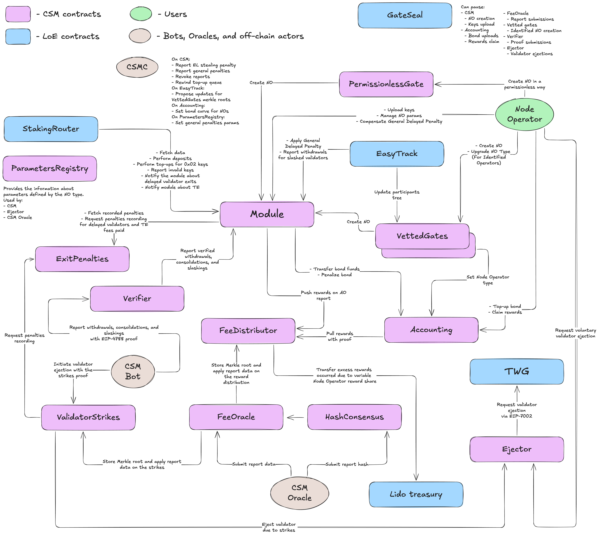

The scheme above illustrates the smart contract architecture of CSM v3.

#### CM v2

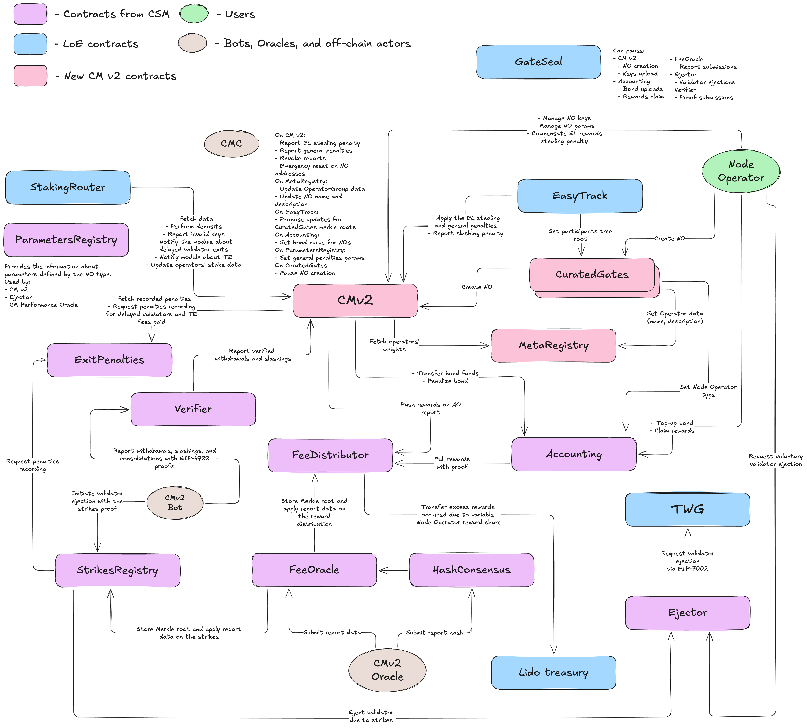

The scheme above depicts CM v2's smart contracts architecture and changes made compared to CSM v3.

> CSM and CM are separate modules. Despite sharing significant parts of the code, each module is deployed in isolation and has its own contract instances.

#### Common contracts

##### `Accounting.sol`

*Accounting in the scheme* 

> Changed in CSM v3

[`Accounting.sol`](#Accountingsol) is a supplementary contract responsible for the management of bond, rewards, and penalties. It stores bond tokens as `stETH` shares, provides information about the required bond, and offers interfaces for penalties. Node Operators claim rewards and top-up bonds using this contract.

**Changes in CSM v3:**
- `FeeSplits` functionality added.
- A bond debt record is created in case of an insufficient bond to cover penalties.
- Locked bond is now compensated from the current bond instead of direct ETH transfer.

##### `Verifier.sol`

*Verifier on the scheme*

> Changed in CSM v3 and CM v2

[`Verifier.sol`](#Verifier) is a utility contract responsible for validating the CL data proofs using [EIP-4788](https://eips.ethereum.org/EIPS/eip-4788). It accepts proof of the validator withdrawals, consolidations, or slashings, and reports these facts to the [`CSModule.sol`](#CSModulesol)/[`CuratedModule.sol`](#CuratedModulesol) if the proof is valid.

**Changes in CSM v3 and CM v2:**
- A special method is added to account for validator consolidations (via balance proof and update).
- A special method is added to prove and report validator slashings to [`CSModule.sol`](#CSModulesol)/[`CuratedModule.sol`](#CuratedModulesol).
- `processWithdrawalProof` method no longer accepts proofs for slashed validators.


##### `FeeDistributor.sol`

*FeeDistributor on the scheme*

[`FeeDistributor.sol`](#FeeDistributorsol) is a supplementary contract that stores non-claimed and non-distributed Node Operator rewards on its balance. This contract stores the latest root of a rewards distribution Merkle tree. It accepts calls from [`Accounting.sol`](#Accountingsol) with reward claim requests and stores data about already claimed rewards by the Node Operator. It receives non-distributed rewards from the [`CSModule.sol`](#CSModulesol)/[`CuratedModule.sol`](#CuratedModulesol) each time the `StakingRouter` mints the new portion of the module's rewards. This contract transfers excess rewards allocated by `StakingRouter` due to the variable Node Operator reward share back to the Lido treasury.

##### `FeeOracle.sol`

*FeeOracle on the scheme*

[`FeeOracle.sol`](#FeeOraclesol) is a utility contract responsible for the execution of the CSM Oracle report once the consensus is reached in the [`HashConsensus.sol`](#HashConsensussol) contract, namely, transforming non-distributed rewards to non-claimed rewards stored on the [`FeeDistributor.sol`](#FeeDistributorsol) and reporting the latest root of rewards distribution Merkle tree to the [`FeeDistributor.sol`](#FeeDistributorsol). Alongside rewards distribution, a contract manages strike data delivery to the [`ValidatorStrikes.sol`](#ValidatorStrikessol). A contract is inherited from the [`BaseOracle.sol`](https://github.com/lidofinance/core/blob/master/contracts/0.8.9/oracle/BaseOracle.sol) from Lido on Ethereum (LoE) core.

##### `HashConsensus.sol`

*HashConsensus on the scheme*

[`HashConsensus.sol`](#HashConsensussol) is a utility contract responsible for reaching a consensus between CSM Oracle members. Uses the standard code of the [`HashConsensus`](https://github.com/lidofinance/core/blob/master/contracts/0.8.9/oracle/HashConsensus.sol) contract from Lido on Ethereum (LoE) core.

##### `ParametersRegistry.sol`

*ParametersRegistry on the scheme*

> Changed in CSM v3 and CM v2

[`ParametersRegistry.sol`](#ParametersRegistrysol) is a utility contract that stores Node-Operator-type-related parameters fetched by the other smart contracts related to CSM. A contract requires a mandatory default value for all parameters to ensure consistency. The custom value is returned if it is set for a particular parameter. Otherwise, the default value is returned.

**Changes in CSM v3 and CM v2:**
- Custom roles for parameter groups management are added.

##### `ValidatorStrikes.sol`

*ValidatorRegistry on the scheme*

[`ValidatorStrikes.sol`](#ValidatorStrikessol) is a utility contract that stores information about strikes assigned to CSM validators by CSM Performance Oracle. It has a permissionless method to prove that a particular validator should be ejected because the number of strikes is above the threshold for this validator. It calls [`Ejector.sol`](#Ejectorsol) to perform a strikes threshold check and eject the validator.

> Not expected to be used in CM v2 unless the plans change.

##### `Ejector.sol`

*Ejector on the scheme*

> Changed in CSM v3 and CM v2

[`Ejector.sol`](#Ejectorsol) is a supplementary contract responsible for interactions with [EIP-7002](https://eips.ethereum.org/EIPS/eip-7002)-powered Lido Withdrawal credentials via `TWG`. Node Operators can voluntarily eject their validators. [`ValidatorStrikes.sol`](#ValidatorStrikessol) uses [`Ejector.sol`](#Ejector.sol) to trigger exits for validators that have surpassed the strike threshold.

**Changes in CSM v3 and CM v2:**
- `voluntaryEject` method is optimized to accept keyIndex list only instead of `startIndex` and `keysCount` to save byte code for two implementations.

##### `ExitPenalties.sol`

*ExitPenalties on the scheme*

[`ExitPenalties.sol`](#ExitPenaltiessol) is a supplementary contract responsible for processing and storing information about exit-related penalties, namely:
- Delayed exit penalty.
- Bad performance ejection penalty.
- TE fee paid in case of a forced and involuntary exit.

##### `PermissionlessGate.sol`

*PermissionlessGate on the scheme*

[`PermissionlessGate.sol`](#PermissionlessGatesol) is a supplementary contract that enables permissionless Node Operator creation in [`CSModule.sol`](#CSModulesol), serving as an entry point.

##### `VettedGate.sol`

*VettedGates on the scheme*

> Changed in CSM v3 and CM v2

[`VettedGate.sol`](#VettedGatesol) is a supplementary contract that enables Node Operator creation for the vetted addresses, which serves as an entry point to [`CSModule.sol`](#CSModulesol). Alongside Node Operator creation, a contract can assign a custom Node Operator type (bondCurveId) in `Accounting.sol`. Deployed using `MerkleGateFactory.sol` to allow the addition of the new instances later without additional code security audits. The list of vetted participants is upgradable for each instance of the [`VettedGate.sol`](#VettedGatesol) individually.

**Changes in CSM v3 and CM v2:**
- Referral program was removed since it was never used and not expected to be used in the current form. Note that the `referrer` argument is still present in the `createNodeOperator` method on `CSModule.sol` to keep track of the information about integrations used to create a Node Operator.

##### `EasyTrack`

> Changed in CSM v3 and CM v2

`EasyTrack` is a part of the common [`EasyTrack`](https://github.com/lidofinance/easy-track) setup within Lido on Ethereum (LoE). In context of CSM/CM `Easy Track` is responsible for:
- Setting Merkle tree params for [`VettedGate.sol`](#VettedGatesol) instances.
- Setting Merkle tree params for [`СuratedGate.sol`](#CuratedGatesol) instances.
- Settling General Delayed Penalty.
- Submitting withdrawals for slashed validators alongside slashing penalty calculated off-chain.

**Changes in CSM v3 and CM v2:**
- A new ET factory is [added](https://github.com/lidofinance/easy-track/pull/100) for submitting withdrawals for slashed validators.
- New ET factories for CM v2.
- Existing ET factory for [`VettedGate.sol`](#VettedGatesol) is [updated](https://github.com/lidofinance/easy-track/pull/96) to serve multiple instances of [`VettedGate.sol`](#VettedGatesol).
- Existing ET factory for EL stealing penalty settling is [updated](https://github.com/lidofinance/easy-track/pull/96) to support a general delayed penalty.

##### `CircuitBreaker`

`CircuitBreaker` is a utility contract responsible for pausing Lido protocol contracts to prevent possible exploitation through zero-day vulnerabilities.

The list of sealable contracts for CSM v3 includes:
- [`CSModule.sol`](#CSModulesol)
- [`Accounting.sol`](#Accountingsol)
- [`FeeOracle.sol`](#FeeOraclesol)
- [`Verifier.sol`](#Verifiersol)
- [`VettedGate.sol`](#VettedGatesol) (multiple instances)
- [`Ejector.sol`](#Ejectorsol)

These contracts are paused using `CircuitBreaker` with [CSMC](#CSMC) being the pause committee (caller of the pause method on `CircuitBreaker` for these contracts).

The list of sealable contracts for CM v2 includes:
- [`CuratedModule.sol`](#CuratedModulesol)
- [`Accounting.sol`](#Accountingsol)
- [`FeeOracle.sol`](#FeeOraclesol)
- [`Verifier.sol`](#Verifiersol)
- [`VettedGate.sol`](#VettedGatesol) (multiple instances)
- [`Ejector.sol`](#Ejectorsol)

These contracts are paused using `CircuitBreaker` with [CMC](#CMC) being the pause committee (caller of the pause method on `CircuitBreaker` for these contracts).

> Note: [`CuratedGate.sol`](#CuratedGatesol) instances are not added to `CircuitBreaker` and paused by [`CMC`](#CMC) directly instead.

#### CSM-only contracts

##### `CSModule.sol`

*Module on the scheme* 

> Changed in CSM v3

[`CSModule.sol`](#CSModulesol) is a core module contract conforming to the `IStakingModule` interface. It stores information about Node Operators and deposit data (DD). This contract is responsible for all interactions with the `StakingRouter`, namely, the DD management and some of the Node Operator's parameters. Node Operators manage their validator keys and other parameters that they can modify through this contract.

**Changes in CSM v3:**
- The withdrawal reporting methods are updated to support the `0x02` WC type.
- Exit penalties account for the validator withdrawal balance before application to support the `0x02` WC type.
- Withdrawals of the slashed validators and slashing penalties are reported via ET instead of [`Verifier.sol`](#Verifiersol).
- The EL rewards stealing penalty mechanism is extended to a general penalty.

#### CM-only contracts

##### `CuratedModule.sol`

*CuratedModule on the scheme* 

> New in CM v2

`CuratedModule.sol` is a core module contract conforming to the `IStakingModule` and `IStakingModuleV2` interfaces. The contract inherits from `BaseModule.sol` (which contains all common parts with CSM) to provide extended functionality while maintaining consistency with the original CSM. It stores information about Node Operators and deposit data (DD). This contract is responsible for all interactions with the `StakingRouter`, namely, the DD management and some of the Node Operator's parameters. Node Operators manage their validator keys and other parameters that they can modify through this contract.

**Changes compared to CSM v3:**
- The management system for the NodeOperators address has been changed to allow custom role members to set both rewardAddress and managerAddress in an emergency.
- Stake distribution is done via a ["greedy" weighted stake allocation strategy](#Allocation-Strategy).

##### `CuratedGate.sol`

*CuratedGates on the scheme*

> New in CM v2

`CuratedGate.sol` is a supplementary contract that enables Node Operator creation for the vetted addresses, which serves as an entry point to [`CuratedModule.sol`](#CuratedModulesol). Alongside Node Operator creation, a contract can assign a custom Node Operator type (bondCurveId) in `Accounting.sol`. Deployed using `MerkleGateFactory.sol` to allow the addition of the new instances later without additional code security audits. The list of curated participants is individually upgradable for each instance of the [`CuratedGate.sol`](#CuratedGatesol) using a dedicated EasyTrack factory.

##### `MetaRegistry.sol`

*MetaRegistry on the scheme*

> New in CM v2

`MetaRegistry.sol` is a supplementary contract that stores information about `OperatorGroups` and operator weights (see [Meta Operators Registry](#Meta-Operators-Registry)).

It also stores Node Operator names and descriptions. Both Node Operators and CMC multisig can edit the values.

#### Off-chain tools for CSM

##### `CSM Bot`

> Changed in CSM v3

`CSM Bot` is a daemon application responsible for monitoring and reporting withdrawal, consolidation, and slashing events associated with CSM validators, as well as invoking validator ejection due to strikes.

**Changes in CSM v3:**
- Validator balances and slashings reporting is added.

> [CSM Bot repo](https://github.com/lidofinance/csm-prover-tool)

##### `CSMC`

`CSMC` (also known as CSM Committee Multisig) is an off-chain committee responsible for overseeing CSM and managing several flows and operations within it.

##### `CSM Oracle`

`CSM Oracle` (also known as CSM Performance Oracle) is a module in the common Lido on Ethereum (LoE) Oracle set. It is operated by the existing Oracles set alongside the [Accounting Oracle](https://docs.lido.fi/contracts/accounting-oracle) and [Validator Exit Bus Oracle](https://docs.lido.fi/contracts/validators-exit-bus-oracle). It is responsible for calculating the CSM Node Operators' reward distribution and strike assignment based on their performance on the CL.

> [CSM Oracle repo](https://github.com/lidofinance/lido-oracle/tree/develop/src/modules/csm)

#### Off-chain tools for CM

##### `CM Bot`

> Changed in CM v2

`CM Bot` is a daemon application that monitors and reports withdrawal, slashing, and consolidation events associated with CM validators. Also responsible for validator ejection invocation due to strikes.

> [CM Bot repo](https://github.com/lidofinance/csm-prover-tool)

**Changes in CM v2:**
- The bot can now also serve CM v2. There will be separate instances for CSM and CM.

##### `CM Oracle`

> Changed in CM v2

`CM Oracle` (also known as CM Performance Oracle) is a module in the common Lido on Ethereum (LoE) Oracle set. It is operated by the existing Oracle set alongside [Accounting Oracle](https://docs.lido.fi/contracts/accounting-oracle), [Validator Exit Bus Oracle](https://docs.lido.fi/contracts/validators-exit-bus-oracle), and CSM Performance Oracle. It is responsible for calculating the CM v2 Node Operators' reward distribution and strike assignment based on their performance on the CL. `CM Oracle` uses the same code as [`CSM Oracle`](https://hackmd.io/@lido/csm-v3-spec#CSM-Oracle) does.

##### `CMC`

> New in CM v2

`CMC` (also known as CM Committee Multisig) is an off-chain committee responsible for overseeing CM v2 and managing several flows and operations within it. Somewhat similar to [Community Staking Module Committee](https://research.lido.fi/t/community-staking-module-committee/8333) Multisig, but with the extended permissions.

### Fundamental concepts of CM

#### Meta Operators Registry

[`CuratedModule.sol`](#CuratedModulesol) uses the [`MetaRegistry.sol`](#MetaRegistrysol) contract to fetch information about Node Operators' stake and allocation weights. [`MetaRegistry.sol`](#MetaRegistrysol) has a permissioned method (expected to be called by [CMC](#CMC)) to add information about `OperatorGroup`. `OperatorGroup` has the following form:

```solidity
struct OperatorGroup {
	SubNodeOperator[] subNodeOperators, // A list of sub-node operators
	ExternalOperator[] externalOperators // A list of external operators data
}

struct SubNodeOperator {
	uint64 nodeOperatorId // Id of the sub node operator in CMv2
	uint16 share // Sub-node operator share in BP
}

struct ExternalOperator {
        bytes data // Generalized data about the external operator outside CMv2
}
```

These structures are used to determine effective weights for sub-node operators and to account for stake in external modules.

###### Sub-node operator weights

Sub-node operator weights are calculated as follows. Assume we have 3 sub-node-operators with weights $w_1$, $w_2$, $w_3$, and the sub-node operator shares $s_1$, $s_2$, $s_3$ . Then, effective weights for the sub-node operators are $ew_1 = (w_1*s_1)/10000$, $ew_2 =(w_2*s_2)/10000$, $ew_3 =(w_3*s_3)/10000$ respectively.

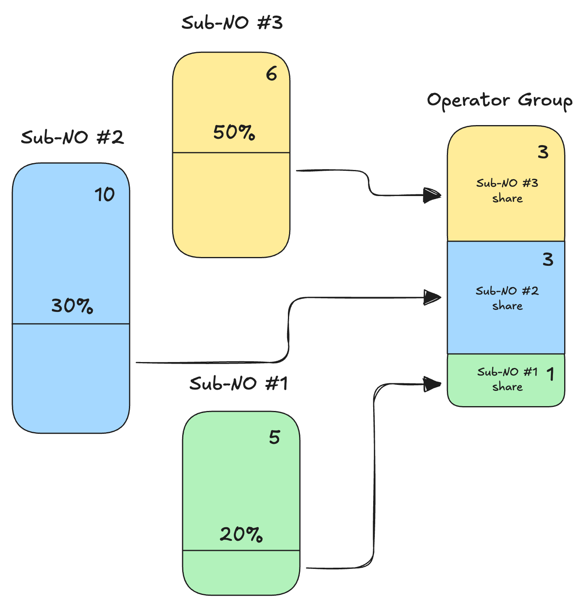

The sum of the effective weights should not exceed $max(w_1, w_2, w_3)$. Hence, $\sum_{i=1}^{n}s_i \le 10000$, but in the implementation we will use strict equality $\sum_{i=1}^{n}s_i = 10000$. To ensure consistency we can require this sum to be equal to 10_000 BP when creating, or updating `OperatorGroup`.

`SubNodeOperator.share` allows node operators to determine stake distribution between their sub-node operators. For example, if the operator wants to get ~80% of the stake allocated to their DVT setup, and the rest to the vanilla sub-node operator, they can set shares to 8000 BP, and 2000 BP.

> `SubNodeOperator.share` does not guarantee the exact stake split between operators, but rather determine the weight distribution between sub-node operators If sub-node operators have different original weights.

###### Accounting for the external stake

Now we need to determine how to account for the stake in the external modules. We need to fetch active stake for all `ExternalOperator` record in `OperatorGroup`, sum it up into $totalExternalStake$ and calculate additional stake for each sub-node-operator in the group as $es_1 = totalExternalStake * ew_1 /(ew_1+ew_2+ew_3)$,  $es_2 = totalExternalStake * ew_2 /(ew_1+ew_2+ew_3)$, and  $es_3 = totalExternalStake * ew_3 /(ew_1+ew_2+ew_3)$ respectively. This will allow us to split the external stake with respect to the sub-node-operators' effective weights and ensure fair stake allocation.

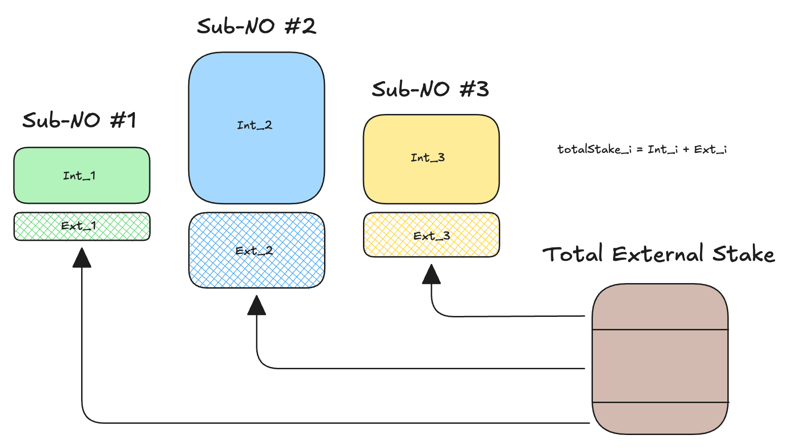

###### Restrictions

- One operator can be a part of only one `OperatorGroup`.
- One external operator can be associated with only one `OperatorGroup`.
- Only CMv1 should be supported in the first version of [`MetaRegistry.sol`](#MetaRegistrysol) as an external module.
- The sum of sub-node operator shares should always be 10000 BP.
- If the operator is not a participant of an `OperatorGroup`, return 0 weight for this node operator to disallow stake allocation to the operators not added to the group.

> If the operator is not added to the `OperatorGroup` and gets some allocations, after adding them to the group with the other sub-node-operators, we might end up with the stake over the target allocation on this Node Operator. Hence, we prohibit allocations to the operators not added to the `OperatorGroup`.

##### Allocation Strategy

CM v2 uses the "greedy" weighted stake allocation strategy to determine the order in which keys are provided for deposits. The high-level description of the algorithm is the following:

First, `currentStake` and `targetStake` are determined for each Node Operator in the module. `targetStake` is defined with respect to the Node Operator allocation weight obtained from [Meta Operators Registry](#Meta-Operators-Registry) as `targetStake = totalStakeInModule * operatorWeight / totalOperatorsWeight`. `currentStake` also accounts for external stake via [Meta Operators Registry](#Meta-Operators-Registry).

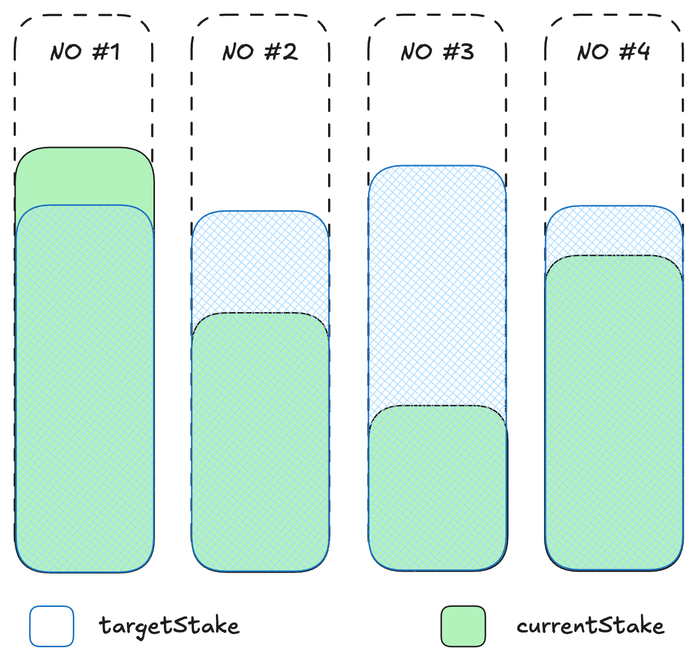

Second, all Node Operators are sorted by their `imbalance`, where `imbalance = max(0, targetStake - currentStake)`, and `capacities` are determined for each Node Operator.

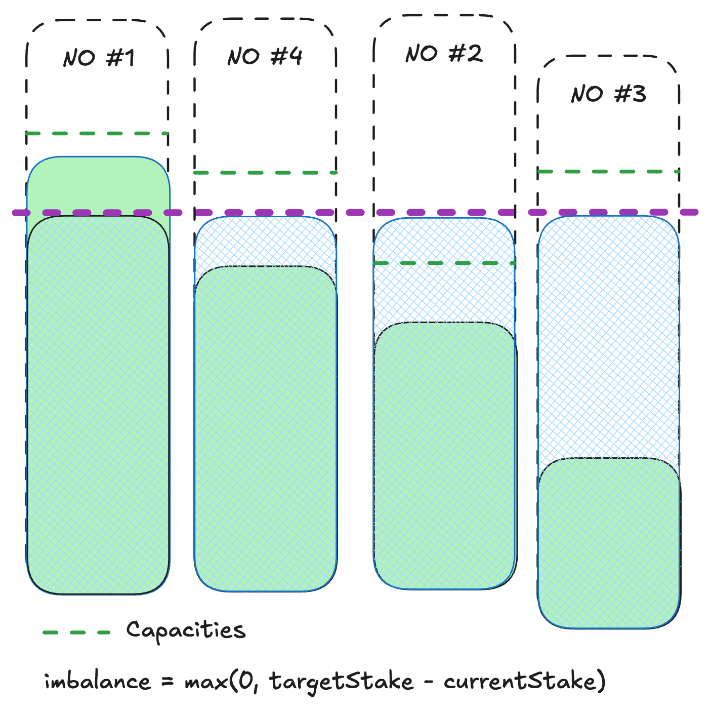

Next, stake is allocated as follows:
- We start allocating stake from the most imbalanced Node Operator
- We allocate stake to this Node Operator until:
    - Node Operator target stake is reached (1) OR
    - Node Operator capacity is exhausted (2) OR
    - There is no more stake to allocate (3)
- Then we move to the next most imbalanced Node Operator

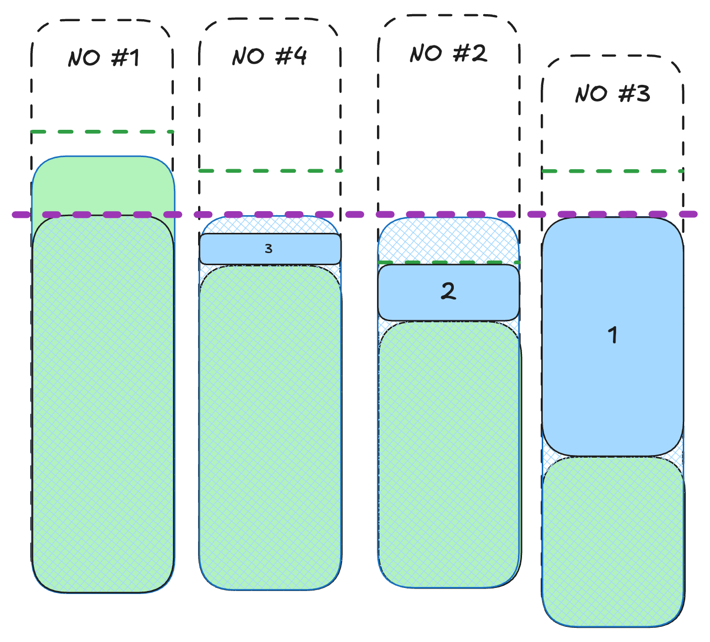

### CSM v3 main flows

#### Create Node Operator

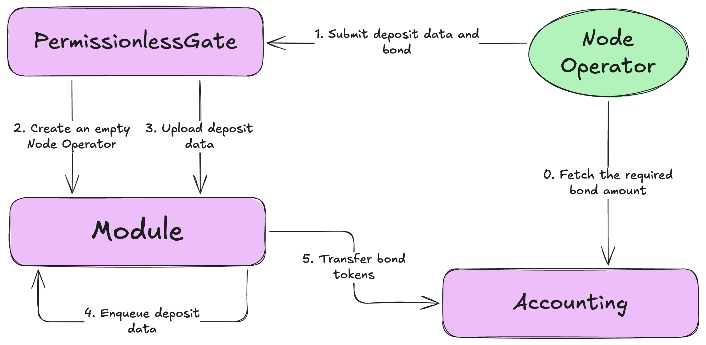

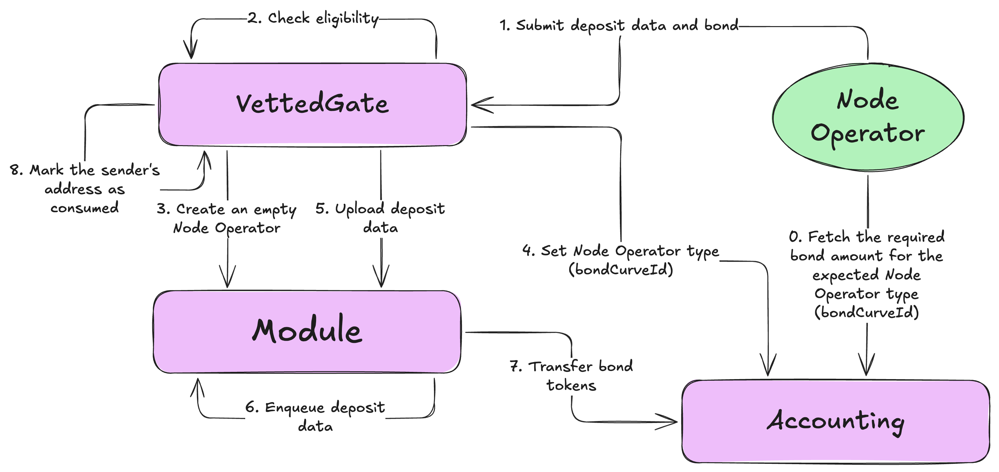

Node Operator creation uses either [`PermissionlessGate.sol`](#PermissionlessGatesol) or [`VettedGate.sol`](#VettedGatesol) or future [Entry Gates or Extensions](https://hackmd.io/@lido/csm-v2-tech#Gates-and-Extensions10) contracts attached to [`CSModule.sol`](#CSModulesol) via `CREATE_NODE_OPERATOR_ROLE`. Entry Gates (Extensions) should ensure that at least one deposit data entry and the corresponding bond amount are required to create a Node Operator, thereby preventing the module from being flooded with empty Node Operators. Before creating a Node Operator, the amount of bond needed should be fetched from the [`Accounting.sol`](#Accountingsol). Depending on the selected token, this amount should be:
- Attached as a payment to the transaction (`ETH`);
- Approved to be transferred by [`Accounting.sol`](#Accountingsol) (`stETH`, `wstETH`);
- Included in permit data approving transfers by [`Accounting.sol`](#Accountingsol) (`stETH`, `wstETH`);

[`VettedGate.sol`](#VettedGatesol) allows each vetted address to perform a one-time operation of Node Operator creation or Node Operator type upgrade for an existing Node Operator. If one of the operations is performed, the other can not be used. [`VettedGate.sol`](#VettedGatesol) should have the `SET_BOND_CURVE_ROLE` role in [`Accounting.sol`](#Accountingsol) to assign Node Operator types (bond curves).

#### Upload deposit data

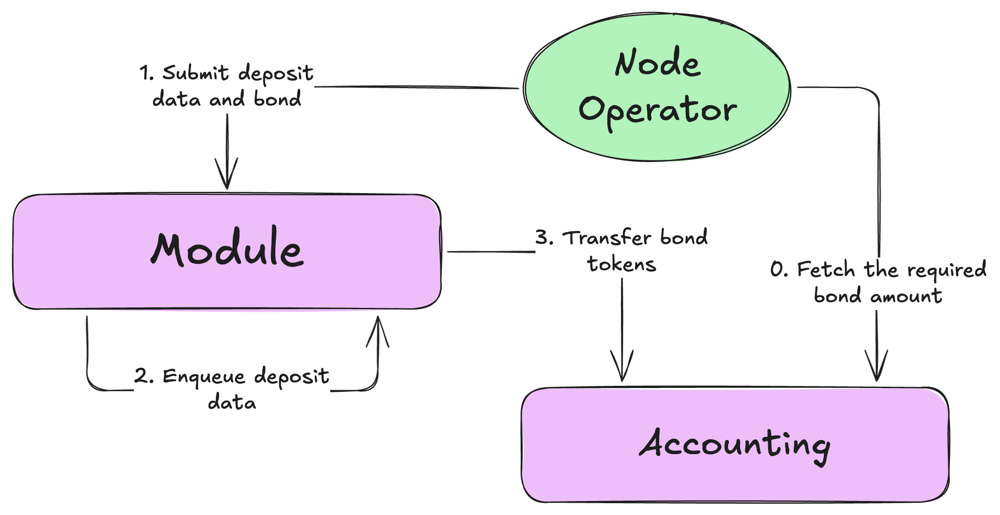

Node Operators can upload deposit data after creation. Before uploading, the amount of bond needed should be fetched from [`Accounting.sol`](#Accountingsol). Depending on the selected token, this amount should be:
- Attached as a payment to the transaction (`ETH`).
- Approved to be transferred by [`Accounting.sol`](#Accountingsol) (`stETH`, `wstETH`).
- Included in permit data approving transfers by [`Accounting.sol`](#Accountingsol) (`stETH`, `wstETH`).

#### Delete deposit data

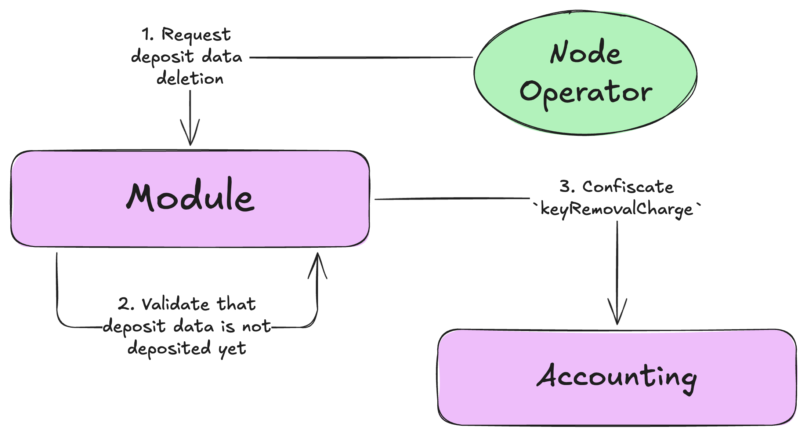

If deposit data has not been deposited yet, the Node Operator can request its deletion from [`CSModule.sol`](#CSModule.sol). [`CSModule.sol`](#CSModule.sol) validates that deposit data has not yet been deposited. If deletion is possible and `keyRemovalCharge` is set for the Node Operator type, [`Accounting.sol`](#Accountingsol) confiscates the `keyRemovalCharge` from the Node Operator's bond.

#### Top-up bond without deposit data upload

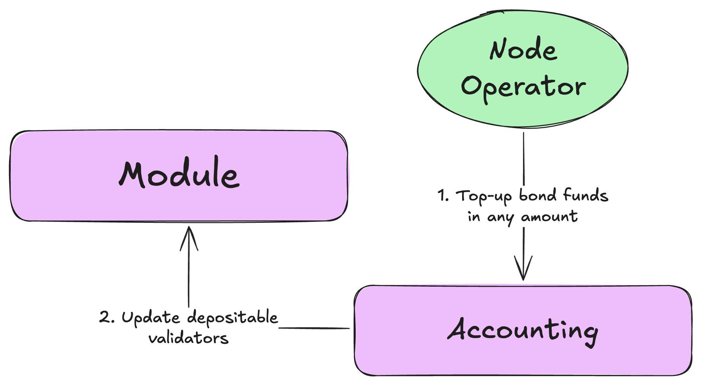

CSM Node Operators can top up the bond balance at any time to have an excess bond in advance or compensate for the penalties. Top-up is done via [`Accounting.sol`](#Accountingsol). Once funds are transferred to [`Accounting.sol`](#Accountingsol), [`CSModule.sol`](#CSModulesol) is informed about the bond amount change, and corresponding changes in the depositable keys are performed regarding the Node Operator to account for the change in the bond balance.

#### Stake allocation (deposit order)

> Changed in CSM v3
> 
> - Support for the validator top-ups is added to support `0x02` validator withdrawal credentials.
> - Each CSM instance can work with either `0x01` or `0x02` WCs, but not both simultaneously.

CSM utilizes the FIFO queues to determine the next portion of the validator keys to be deposited. Certain Node Operator types can be eligible for a limited number of priority queue spots.

##### Initial `32 ETH` deposits

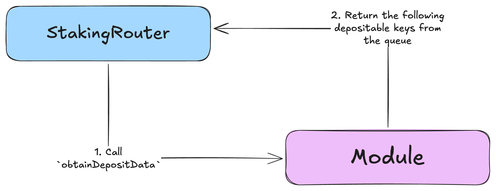

Once uploaded, the deposit data is placed in the queue with respect to the Priority queue parameters for the given Node Operator. To allocate stake to the CSM Node Operators, `StakingRouter` calls the `obtainDepositData(depositsCount)` method to get the next `depositsCount` depositable keys from the keys queue.

In case of a CSM instance working with `0x01` validator withdrawal credentials, only the initial `32 ETH` deposits are used for the stake allocation.

In case of a CSM instance working with `0x02` validator withdrawal credentials, the order of the initial deposits is recorded for further use in the top-ups flow below.

##### Top-ups for `0x02` keys

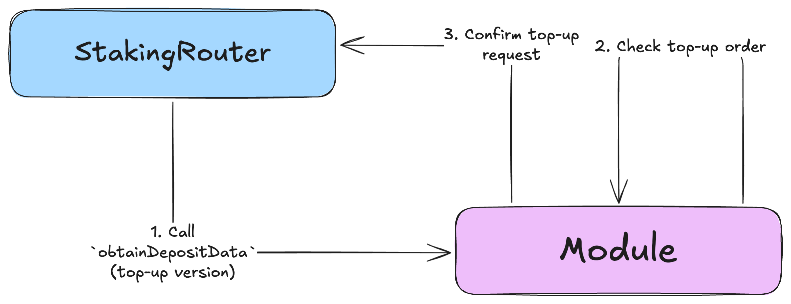

`0x02` validators get deposits in two phases:
- [Initial `32 ETH` deposit](#Initial-32-ETH-deposits).
- Top-ups up to `2048 ETH`.

The top-up phase involves a call from the `StakingRouter` to [`CSModule.sol`](#CSModulesol), providing information about the keys planned for top-up and top-up limits calculated using CL proofs. [`CSModule.sol`](#CSModulesol) verifies that the order of the provided keys matches the order of the [initial `32 ETH` deposits](#Initial-32-ETH-deposits) and marks fully deposited (up to the provided limit) keys as such.

##### Invalid keys

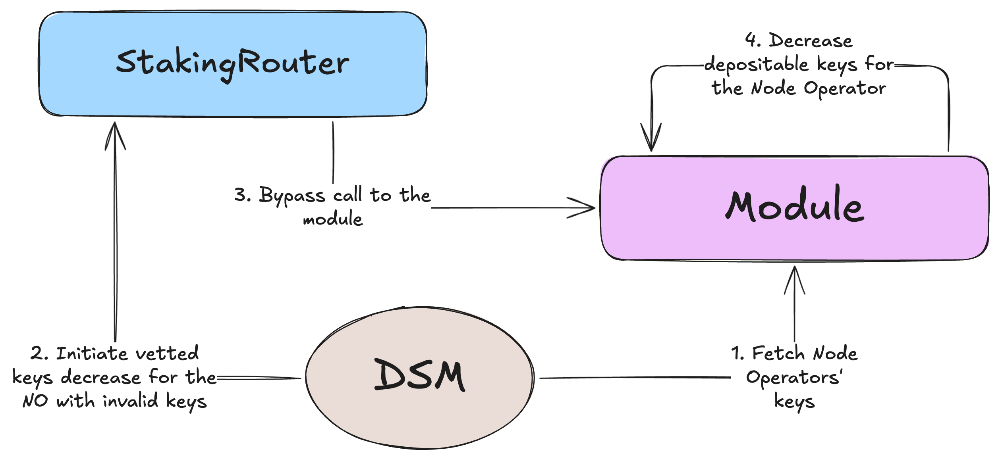

Due to the [optimistic vetting approach](https://hackmd.io/@lido/rJrTnEc2a#Optimistic-Vetting), invalid keys might be present in the queue. [DSM](https://docs.lido.fi/contracts/deposit-security-module) is responsible for detecting and reporting invalid keys through `StakingRouter`. If invalid keys are detected, a call to `decreaseOperatorVettedKeys` is expected from `StakingRouter` to [`CSModule.sol`](#CSModulesol). 

Node Operators should [delete](#Delete-deposit-data) the invalid keys to resolve the situation. If the invalid keys are still present after deletion, the process repeats.

#### Rewards distribution

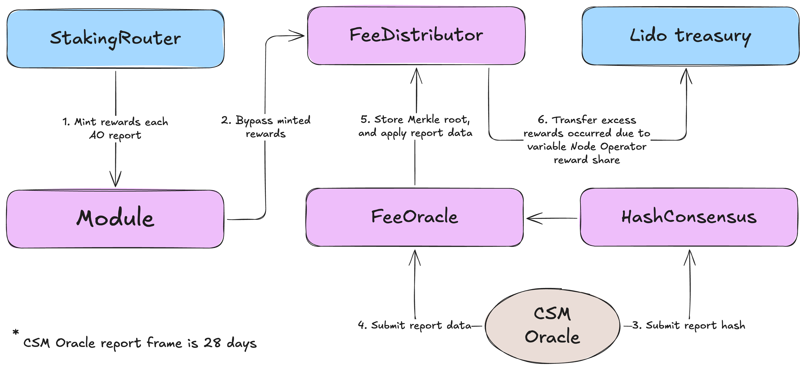

`StakingRouter` mint rewards for CSM Node Operators on each report of the [`AccountingOracle`](https://docs.lido.fi/contracts/accounting-oracle). [`CSModule.sol`](#CSModulesol) transfers minted rewards to the [`FeeDistributor.sol`](#FeeDistributorsol). Once the report slot is reached for the following CSM Oracle report, the rewards distribution tree is calculated by each Oracle member. After reaching the quorum, a new Merkle tree root is submitted to the [`FeeDistributor.sol`](#FeeDistributorsol), the corresponding portion of the rewards is transferred from the non-distributed to the non-claimed state, and excess rewards transferred by `StakingRouter` due to variable Node Operator reward share are returned to the Lido treasury.

#### Rewards claim

> Changed in CSM v3
> 
> - An optional built-in fee splitter is added.
> - The ability to set a custom address for `claimRewardsXXX` methods is added to streamline reward claims management from the Node Operator side.

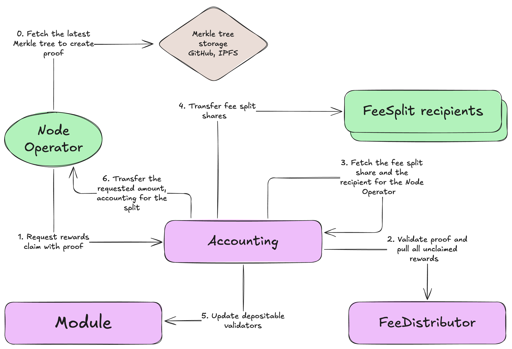

Total rewards for CSM Node Operators comprise bond rewards and staking fees. To claim the total rewards, the Node Operator must provide proof of the latest `cumulativeFeeShares` in the rewards tree. With that proof, [`Accounting.sol`](#Accountingsol) pulls the Node Operator's portion of the staking fees from the [`FeeDistributor.sol`](#FeeDistributorsol) and combines it with the Node Operator's bond. After that, all bond funds exceeding the bond required for the currently active keys are available for claim.

When staking fees are pulled from the [`FeeDistributor.sol`](#FeeDistributorsol), [`Accounting.sol`](#Accountingsol) fetches information about `FeeSplits` set for the given Node Operator and transfers corresponding fee shares to the `FeeSplitRecipients`. This allows for a seamless integration with the infrastructure providers like Obol and SVV, which charge a certain percentage of the staking rewards as a provider fee. Since there might be several `FeeSplitRecipients` (up to 10), this feature can also be used for the opt-in donations to the Protocol Guild or other public good funding services.

A special `pullFeeRewards` method allows the Node Operator to transfer staking rewards to the bond without transferring them to the reward address.

Suppose there are no new rewards to pull from the [`FeeDistributor.sol`](#FeeDistributorsol) Node Operator can still claim excess bond using the same flow.

#### General penalty with confirmation

> Changed in CSM v3
> 
> - The EL rewards stealing penalty mechanism is extended to a general penalty.
> - Compensation of the locked bond occurred due to General Delayed Penalty now happens from the bond balance instead of direct ETH payment.

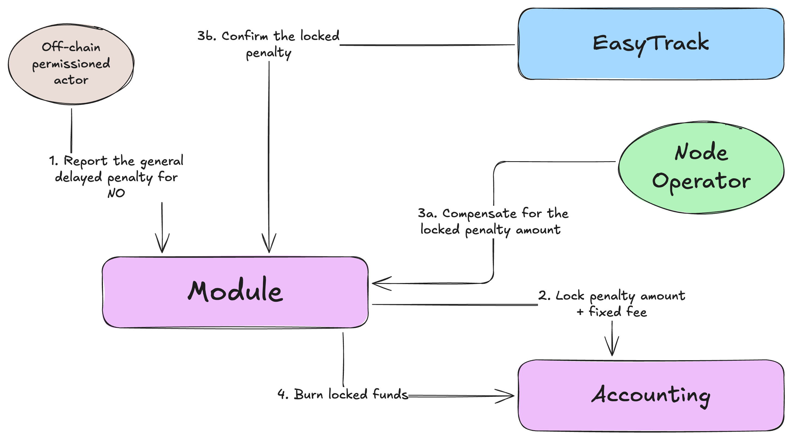

If the Node Operator violates CSM participation rules that are enforced off-chain (ex. violates the [Lido on Ethereum Block Proposer Rewards Policy](https://snapshot.box/#/s:lido-snapshot.eth/proposal/0x7ac2431dc0eddcad4a02ba220a19f451ab6b064a0eaef961ed386dc573722a7f)), this fact and the corresponding penalty amount are reported to the [`CSModule.sol`](#CSModulesol) by the off-chain actor. The reported amount of the bond funds (reported penalty + fixed fee) is locked by the [`Accounting.sol`](#Accountingsol). The Node Operator can voluntarily compensate for the penalty and the fixed fee. If the Node Operator does not compensate for the penalty, an `EasyTrack` motion will be started to confirm the penalty application. Once enacted, a penalty is applied (locked funds are burned).

#### Validator ejection due to strikes

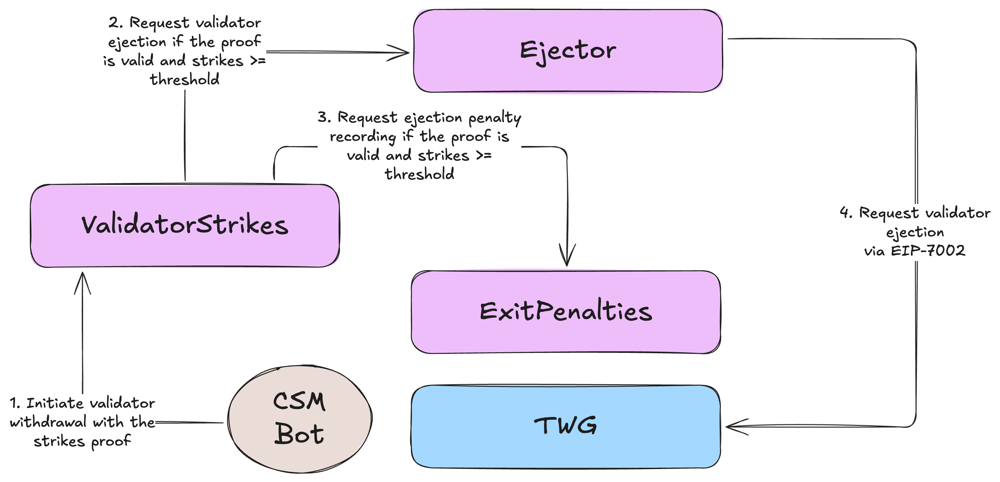

If the validator has reached the strikes threshold (`actual strikes >= threshold`) `CSM Bot` will initiate validator ejection using a permissionless method. [`ValidatorStrikes.sol`](#ValidatorStrikessol) validates the proof and makes a call to [`Ejector.sol`](#Ejectorsol) if the number of strikes >= threshold. [`Ejector.sol`](#Ejectorsol) notify `TWG` about the required validator ejection. Corresponding penalties are recorded in [`ExitPenalties.sol`](#ExitPenaltiessol).

#### Voluntary validator ejection

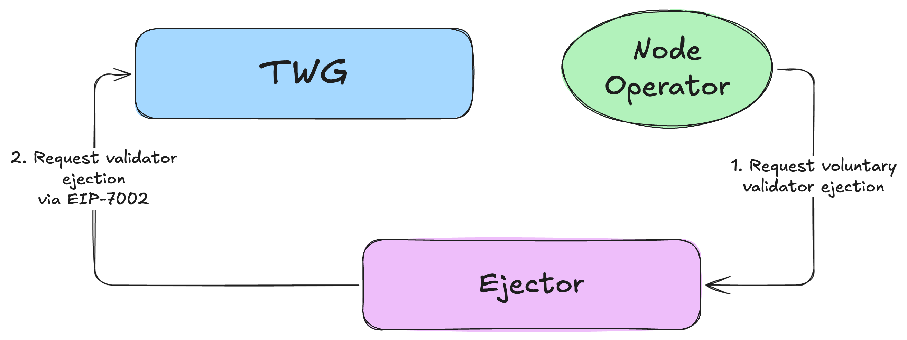

If Node Operators want to use EIP-7002 to exit their validators, they can do so via a dedicated method in the [`Ejector.sol`](#Ejectorsol) contract. In this case, [`Ejector.sol`](#Ejectorsol) will notify `TWG` about the required validator ejection.

#### Withdrawal reporting

> Changed in CSM v3
> 
> - The exit delay penalty and bad performance penalty amounts are modified relative to the actual withdrawal balance to account for the "non-full" `0x02` validators.
> - The exit delay penalty is changed from penalty to charge.
> - Two separate flows are introduced for slashed and non-slashed validators to ensure the calculation of the slashing penalty is accurate.

##### Non-slashed validators

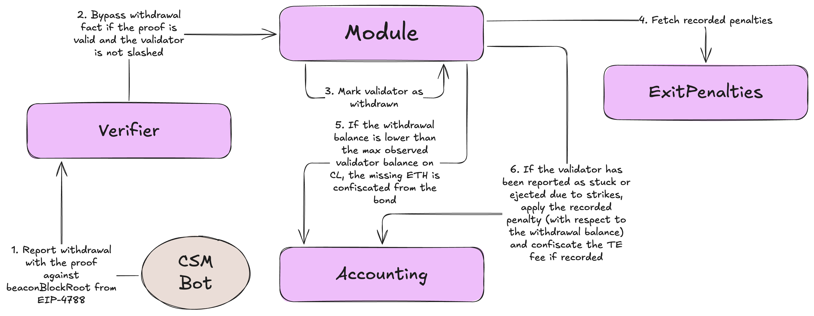

Once the CSM validator is withdrawn, the CSM Bot will report it using a permissionless method. The report is submitted to the [`Verifier.sol`](#Verifiersol) to validate proof against `beaconBlockRoot`. If the proof is valid and the validator is not slashed, the report is bypassed to the [`CSModule.sol`](#CSModulesol). [`CSModule.sol`](#CSModulesol) marks the validator as withdrawn. There is a separate flow for the slashed validators described below.

Suppose the validator is reported as stuck (late to exit) or ejected due to strikes (bad performance). In that case, the recorded stuck and/or bad performance penalties are applied, and the recorded TE fee is confiscated. If the validator was not reported as stuck or ejected due to bad performance, but the TE fee is recorded, the TE fee is ignored.

If the validator's balance is below the `max_reported_validator_balance`, the difference between the sum of deposits and the validator's balance is confiscated from the bond.

##### Slashed validators

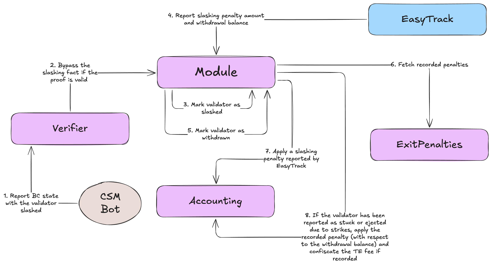

If the validator is slashed, a separate flow is used. First, the fact of validator slashing should be proved using [`Verifier.sol`](#verifiersol). Once slashing is proved, the slashing penalty and withdrawal balance are reported using `EasyTrack` motion.

The rest of the flow is identical to the flow for non-slashed validators described above.

#### Stuck validators ejection penalty

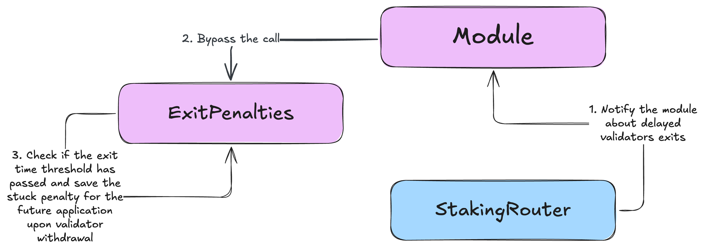

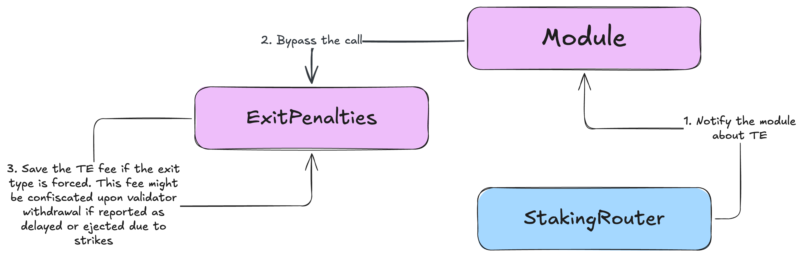

`VEBO` can trigger exits (via `TWG`) for the validators requested for exit in the `VEBO` report. However, the time when requested validators can be ejected is not limited. Hence, [`CSModule.sol`](#CSModulesol) should be notified by `StakingRouter` about the validator exits and the time between the request and ejection. If the time exceeds the threshold, the Node Operator should be penalized for not exiting their validators on time. If Triggerable Exit (TE) is used for the validator, depending on the exit type and whether the validator is delayed in exiting, the TE fee should be confiscated from the Node Operator's bond. Both the stuck penalty and TE fee are recorded in ExitPenalties.sol and applied upon the validator's withdrawal, as described above.

> The validator is considered "stuck" if the proof is delivered stating that it was not exited for more than `allowedExitDelay` seconds since the moment it was requested/available for exit. `allowedExitDelay` is a parameter that can be set per Node Operator type.

### Flows changed in CM v2 compared to CSM v3

> This section covers on the flows that are changed/added in CM v2 compared to CSM v3 flows described above. For the flows not mentioned in this section, it is expected that the same flow as in CSM v3 is used in CM v2.

#### Create Node Operator

> Changed in CM v2
> 
> - Node Operator creation is done via `CuratedGates` and requires no keys or bond upload.

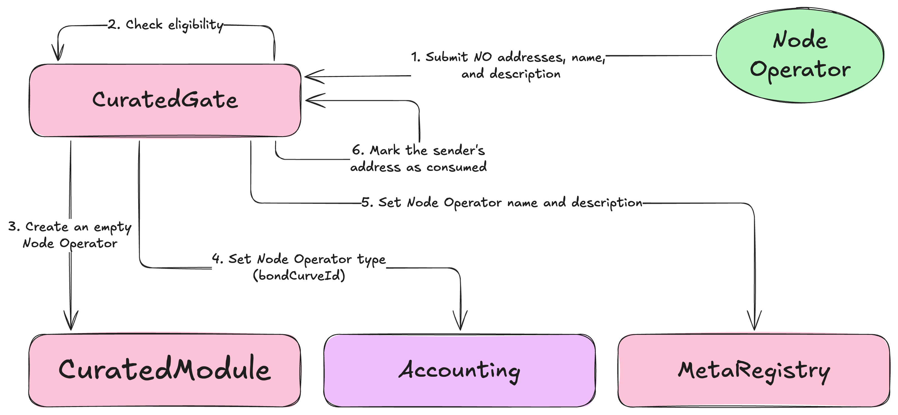

Node Operator creation uses [`CuratedGate.sol`](#CuratedGatesol) instances attached to [`CuratedModule.sol`](#CuratedModulesol) via `CREATE_NODE_OPERATOR_ROLE`. Unlike CSM, CM v2 assumes that the creation of the Node Operator is performed without uploading deposit data or a bond. Deposit data can be uploaded later using the flow below. 

Different instances of [`CuratedGate.sol`](#CuratedGatesol) represent different Node Operator types. Node Operators can join Curated Module v2 using the [`CuratedGate.sol`](#CuratedGatesol) instance, where their address is added to the participants list. Once used, the address can not be used again to join via the same instance of [`CuratedGate.sol`](#CuratedGatesol).

##### Operator addition to `OperatorGroup`

To become eligible for deposits, a Node Operator should be a part of an OperatorGroup in the [`MetaRegistry.sol`](#MetaRegistrysol). Adding to the group is a permissioned operation performed by CMC via EasyTrack.

#### Stake Allocation

> Changed in CM v2
> 
> - FIFO queues are replaced with a "greedy" weighted stake allocation strategy [described above](#Allocation-Strategy).
> - Unlike CSM v3 that can have deployments supporting either `0x01` or `0x02` validator WC, CM v2 only supports `0x02`.

##### Initial `32 ETH` deposits

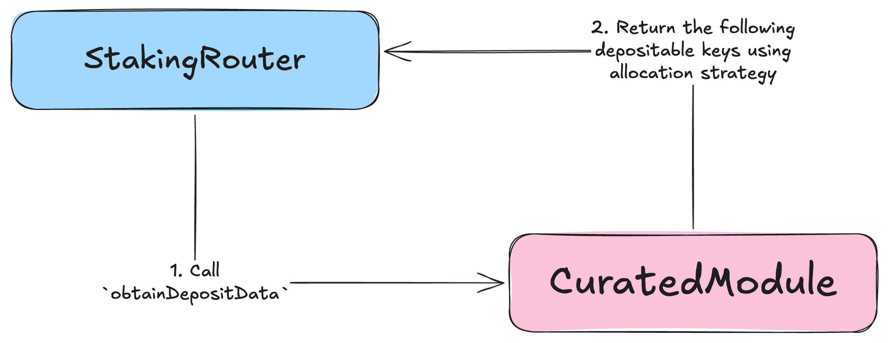

Once uploaded, deposit data becomes available for allocation of the initial `32 ETH` deposits. To allocate initial deposits to the CM v2 Node Operators, the `StakingRouter` calls the `obtainDepositData(depositsCount)` method to retrieve the next `depositsCount` depositable keys, as determined by the stake [allocation strategy](#Allocation-Strategy).

##### Top-ups for `0x02` keys

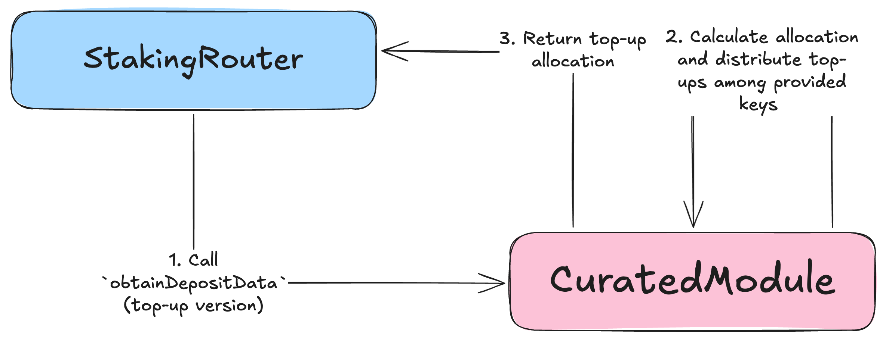

`0x02` validators get deposits in two phases:
- [Initial `32 ETH` deposit](#Initial-32-ETH-deposits).
- Top-ups up to `2048 ETH`.

The top-up phase involves a call from the `StakingRouter` to [`CuratedModule.sol`](#CuratedModulesol), providing information about the keys planned for top-up and top-up limits calculated using CL proofs. [`CuratedModule.sol`](#CuratedModulesol) calculates the stake allocation using the `maxDepositAmount` provided and allocates the stake among the provided keys, respecting the calculated allocation and the `topUpLimits` supplied by the `StakingRouter`. [`CuratedModule.sol`](#CuratedModulesol) also verifies that the keys provided belong to the corresponding Node Operators for security reasons.

##### Deposits order and priority

There are a few ways in which validators can get their balance increased, namely:
- **Initial 32 ETH deposit.** This deposit serves as a starting point in the validator's lifeline and adds 32 ETH to the validator's balance.
- **Top-up deposit.** Once the validator index is assigned, the Lido protocol can perform secure top-up deposits to the validator. This will simply increase the validator's balance.
- **Consolidations from the legacy CM v1.** This is the third source of balance increase for the validator. In the same manner as a top-up deposit, it can only be made (both from the Lido protocol's security perspective and under Ethereum network rules) to a validator with an assigned index. Moreover, the target validator (the one that will receive the balance after consolidation) should also be active on the Ethereum network.

Given the above-mentioned, the following guidelines for deposits is used in CM v2:
- **Initial deposits have the highest priority.** Whenever there are keys that can receive initial 32 ETH deposits, buffered ETH is used for them.
- It is recommended to use the earliest deposited keys as targets for consolidations.
- Top-up deposits should not clash with consolidations and respect the current and pending validator balance when submitted.

The actual process of deposits for CM v2 looks as follows:
- After module activation, the first phase consists only of initial deposits to all available keys, with consolidations and top-ups disabled.
- Once there is a sufficient amount (enough active keys per Node Operator to start consolidations) of activated keys in CM v2, the consolidation process starts, and top-up deposits are enabled.
- Whenever there are keys that can receive initial 32 ETH deposits, buffered ETH is used for them first.

#### Node Operator Addresses Management

> Changed in CM v2
> 
> - A dedicated role capable of changing both manager and reward addresses is added.

Node Operators in CM v2 can manage their addresses in the same way as CSM Node Operators. The primary difference is that in CM v2, designated role members can update both the manager and reward addresses. It is assumed that these changes are made directly by the Lido DAO via on-chain voting or by a designated emergency committee, which acts only if the Node Operator's `managerAddress` is compromised and no longer reachable.

To streamline Node Operator operations, it is proposed to set `extendedManagerPermissions = true` for all Node Operators in CM v2. This will allow for flexibility in address management.

### Common contract specifications

#### [`Accounting.sol`](https://github.com/lidofinance/community-staking-module/tree/develop/docs/src/src/Accounting.sol)

#### [`FeeDistributor.sol`](https://github.com/lidofinance/community-staking-module/tree/develop/docs/src/src/FeeDistributor.sol)

#### [`FeeOracle.sol`](https://github.com/lidofinance/community-staking-module/tree/develop/docs/src/src/FeeOracle.sol)

#### [`HashConsensus.sol`](https://github.com/lidofinance/community-staking-module/tree/develop/docs/src/src/lib/base-oracle/HashConsensus.sol)

#### [`Verifier.sol`](https://github.com/lidofinance/community-staking-module/tree/develop/docs/src/src/Verifier.sol)

#### [`ParametersRegistry.sol`](https://github.com/lidofinance/community-staking-module/tree/develop/docs/src/src/ParametersRegistry.sol)

#### [`Ejector.sol`](https://github.com/lidofinance/community-staking-module/tree/develop/docs/src/src/Ejector.sol)

#### [`ValidatorStrikes.sol`](https://github.com/lidofinance/community-staking-module/tree/develop/docs/src/src/ValidatorStrikes.sol)

#### [`ExitPenalties.sol`](https://github.com/lidofinance/community-staking-module/tree/develop/docs/src/src/ExitPenalties.sol)

### CSM-only contract specifications

#### [`CSModule.sol`](https://github.com/lidofinance/community-staking-module/tree/develop/docs/src/src/CSModule.sol)

#### [`PermissionlessGate.sol`](https://github.com/lidofinance/community-staking-module/tree/develop/docs/src/src/PermissionlessGate.sol)

#### [`VettedGate.sol`]([#VettedGatesol](https://github.com/lidofinance/community-staking-module/tree/develop/docs/src/src/VettedGate.sol))

### CM-only contract specifications

#### [`CuratedModule.sol`](https://github.com/lidofinance/community-staking-module/tree/develop/docs/src/src/CuratedModule.sol)

#### [`CuratedGate.sol`](https://github.com/lidofinance/community-staking-module/tree/develop/docs/src/src/CuratedGate.sol)

#### [`MetaRegistry.sol`](https://github.com/lidofinance/community-staking-module/tree/develop/docs/src/src/MetaRegistry.sol)

### Administrative actions

Community Staking Module and Curated Module contracts support a set of administrative actions, including:

- Changing the configuration options.
- Upgrading the system's code.

Each action can only be performed by a designated admin (`DEFAULT_ADMIN_ROLE`) or other role members. Only members of `DEFAULT_ADMIN_ROLE` can manage role members for the roles in CSM contracts.

### Roles to actors mapping in CSM

#### [`CSModule.sol`](#CSModulesol)

| Role                                       | Assignee                                                                                               |
| ------------------------------------------ | ------------------------------------------------------------------------------------------------------ |
| `DEFAULT_ADMIN_ROLE`                       | Aragon Agent                                                                                           |
| `PAUSE_ROLE`                               | `CircuitBreaker` contract and DG Reseal Manager                                                        |
| `RESUME_ROLE`                              | DG Reseal Manager                                                                                      |
| `STAKING_ROUTER_ROLE`                      | `StakingRouter` contract                                                                               |
| `REPORT_GENERAL_DELAYED_PENALTY_ROLE`      | [CSMC](#CSMC)                                                                                          |
| `SETTLE_GENERAL_DELAYED_PENALTY_ROLE`      | `EasyTrackEVMScriptExecutor`                                                                           |
| `VERIFIER_ROLE`                            | [`Verifier.sol`](#Verifier)                                                                            |
| `REPORT_REGULAR_WITHDRAWN_VALIDATORS_ROLE` | [`Verifier.sol`](#Verifier)                                                                            |
| `REPORT_SLASHED_WITHDRAWN_VALIDATORS_ROLE` | `EasyTrackEVMScriptExecutor`                                                                           |
| `RECOVERER_ROLE`                           | Not assigned by default                                                                                |
| `CREATE_NODE_OPERATOR_ROLE`                | [`PermissionlessGate.sol`](#PermissionlessGatesol) and instances of [`VettedGate.sol`](#VettedGatesol) |
| `MANAGE_TOP_UP_QUEUE_ROLE`                 | Not assigned by default                                                                                |
| `REWIND_TOP_UP_QUEUE_ROLE`                 | [CSMC](#CSMC)                                                                                          |

#### [`Accounting.sol`](#Accountingsol)

| Role                      | Assignee                                                          |
| ------------------------- | ----------------------------------------------------------------- |
| `DEFAULT_ADMIN_ROLE`      | Aragon Agent                                                      |
| `PAUSE_ROLE`              | `CircuitBreaker` contract and DG Reseal Manager                   |
| `RESUME_ROLE`             | DG Reseal Manager                                                 |
| `MANAGE_BOND_CURVES_ROLE` | Not assigned by default                                           |
| `SET_BOND_CURVE_ROLE`     | [CSMC](#CSMC) and instances of [`VettedGate.sol`](#VettedGatesol) |
| `RECOVERER_ROLE`          | Not assigned by default                                           |

#### [`FeeDistributor.sol`](#FeeDistributorsol)

| Role                 | Assignee                |
| -------------------- | ----------------------- |
| `DEFAULT_ADMIN_ROLE` | Aragon Agent            |
| `RECOVERER_ROLE`     | Not assigned by default |

#### [`FeeOracle.sol`](#FeeOraclesol)

| Role                             | Assignee                                             |
| -------------------------------- | ---------------------------------------------------- |
| `DEFAULT_ADMIN_ROLE`             | Aragon Agent                                         |
| `SUBMIT_DATA_ROLE`               | Not assigned by default                              |
| `PAUSE_ROLE`                     | `CircuitBreaker` contract and DG Reseal Manager      |
| `RESUME_ROLE`                    | DG Reseal Manager                                    |
| `RECOVERER_ROLE`                 | Not assigned by default                              |
| `MANAGE_CONSENSUS_CONTRACT_ROLE` | Not assigned by default                              |
| `MANAGE_CONSENSUS_VERSION_ROLE`  | Not assigned by default                              |

#### [`HashConsensus.sol`](#HashConsensussol)

| Role                             | Assignee                |
| -------------------------------- | ----------------------- |
| `DEFAULT_ADMIN_ROLE`             | Aragon Agent            |
| `MANAGE_MEMBERS_AND_QUORUM_ROLE` | Aragon Agent            |
| `DISABLE_CONSENSUS_ROLE`         | Not assigned by default |
| `MANAGE_FRAME_CONFIG_ROLE`       | Not assigned by default |
| `MANAGE_FAST_LANE_CONFIG_ROLE`   | Not assigned by default |
| `MANAGE_REPORT_PROCESSOR_ROLE`   | Not assigned by default |

#### [`Verifier.sol`](#Verifier)

| Role                 | Assignee                                             |
| -------------------- | ---------------------------------------------------- |
| `DEFAULT_ADMIN_ROLE` | Aragon Agent                                         |
| `PAUSE_ROLE`         | `CircuitBreaker` contract and DG Reseal Manager      |
| `RESUME_ROLE`        | DG Reseal Manager                                    |

#### [`ParametersRegistry.sol`](#ParametersRegistrysol)

> Note that the contract uses a custom role check modifiers. One allows both `roleMember` and `roleAdmin` to call methods, the other allows `roleMember` and and members of `MANAGE_CURVE_PARAMETERS_ROLE` to call methods. `MANAGE_CURVE_PARAMETERS_ROLE` is added to simplify addition of the new bond curves within governance actions.

| Role                                        | Assignee                |
| ------------------------------------------- | ----------------------- |
| `DEFAULT_ADMIN_ROLE`                        | Aragon Agent            |
| `MANAGE_GENERAL_PENALTIES_AND_CHARGES_ROLE` | [CSMC](#CSMC)           |
| `MANAGE_KEYS_LIMIT_ROLE`                    | Not assigned by default |
| `MANAGE_QUEUE_CONFIG_ROLE`                  | Not assigned by default |
| `MANAGE_PERFORMANCE_PARAMETERS_ROLE`        | Not assigned by default |
| `MANAGE_REWARD_SHARE_ROLE`                  | Not assigned by default |
| `MANAGE_VALIDATOR_EXIT_PARAMETERS_ROLE`     | Not assigned by default |
| `MANAGE_CURVE_PARAMETERS_ROLE`              | Not assigned by default |

#### [`Ejector.sol`](#Ejectorsol)

| Role                         | Assignee                                             |
| ---------------------------- | ---------------------------------------------------- |
| `DEFAULT_ADMIN_ROLE`         | Aragon Agent                                         |
| `PAUSE_ROLE`                 | `CircuitBreaker` contract and DG Reseal Manager      |
| `RESUME_ROLE`                | DG Reseal Manager                                    |
| `RECOVERER_ROLE`             | Not assigned by default                              |

#### [`ValidatorStrikes.sol`](#ValidatorStrikessol)

| Role                         | Assignee                |
| ---------------------------- | ----------------------- |
| `DEFAULT_ADMIN_ROLE`         | Aragon Agent            |

#### [`ExitPenalties.sol`](#ExitPenaltiessol)

This contract does not have roles.

#### [`PermissionlessGate.sol`](#PermissionlessGatesol)

| Role                         | Assignee                |
| ---------------------------- | ----------------------- |
| `DEFAULT_ADMIN_ROLE`         | Aragon Agent            |
| `RECOVERER_ROLE`             | Not assigned by default |

#### [`VettedGate.sol`](#VettedGatesol)

| Role                 | Assignee                                        |
| -------------------- | ----------------------------------------------- |
| `DEFAULT_ADMIN_ROLE` | Aragon Agent                                    |
| `PAUSE_ROLE`         | `CircuitBreaker` contract and DG Reseal Manager |
| `RESUME_ROLE`        | DG Reseal Manager                               |
| `SET_TREE_ROLE`      | `EasyTrackEVMScriptExecutor`                    |
| `RECOVERER_ROLE`     | Not assigned by default                         |

### Roles to actors mapping in CM

#### [`CuratedModule.sol`](#CuratedModulesol)

| Role                                       | Assignee                                          |
| ------------------------------------------ | ------------------------------------------------- |
| `DEFAULT_ADMIN_ROLE`                       | Aragon Agent                                      |
| `PAUSE_ROLE`                               | `CircuitBreaker` contract and DG Reseal Manager   |
| `RESUME_ROLE`                              | DG Reseal Manager                                 |
| `STAKING_ROUTER_ROLE`                      | `StakingRouter` contract                          |
| `REPORT_GENERAL_DELAYED_PENALTY_ROLE`      | [CMC](#CMC)                                       |
| `SETTLE_GENERAL_DELAYED_PENALTY_ROLE`      | `EasyTrackEVMScriptExecutor`                      |
| `VERIFIER_ROLE`                            | [`Verifier.sol`](#Verifier)                       |
| `REPORT_REGULAR_WITHDRAWN_VALIDATORS_ROLE` | [`Verifier.sol`](#Verifier)                       |
| `REPORT_SLASHED_WITHDRAWN_VALIDATORS_ROLE` | `EasyTrackEVMScriptExecutor`                      |
| `RECOVERER_ROLE`                           | Not assigned by default                           |
| `CREATE_NODE_OPERATOR_ROLE`                | Instances of [`CuratedGate.sol`](#CuratedGatesol) |
| `OPERATOR_ADDRESSES_ADMIN_ROLE`            | Not assigned by default                           |

#### [`Accounting.sol`](#Accountingsol)

| Role                      | Assignee                                                                           |
| ------------------------- | ---------------------------------------------------------------------------------- |
| `DEFAULT_ADMIN_ROLE`      | Aragon Agent                                                                       |
| `PAUSE_ROLE`              | `CircuitBreaker` contract and DG Reseal Manager                                    |
| `RESUME_ROLE`             | DG Reseal Manager                                                                  |
| `MANAGE_BOND_CURVES_ROLE` | Not assigned by default                                                            |
| `SET_BOND_CURVE_ROLE`     | Instances of [`CuratedGate.sol`](#CuratedGatesol) that use non-default bond curves |
| `RECOVERER_ROLE`          | Not assigned by default                                                            |

#### [`FeeDistributor.sol`](#FeeDistributorsol)

| Role                 | Assignee                |
| -------------------- | ----------------------- |
| `DEFAULT_ADMIN_ROLE` | Aragon Agent            |
| `RECOVERER_ROLE`     | Not assigned by default |

#### [`FeeOracle.sol`](#FeeOraclesol)

| Role                             | Assignee                                             |
| -------------------------------- | ---------------------------------------------------- |
| `DEFAULT_ADMIN_ROLE`             | Aragon Agent                                         |
| `SUBMIT_DATA_ROLE`               | Not assigned by default                              |
| `PAUSE_ROLE`                     | `CircuitBreaker` contract and DG Reseal Manager      |
| `RESUME_ROLE`                    | DG Reseal Manager                                    |
| `RECOVERER_ROLE`                 | Not assigned by default                              |
| `MANAGE_CONSENSUS_CONTRACT_ROLE` | Not assigned by default                              |
| `MANAGE_CONSENSUS_VERSION_ROLE`  | Not assigned by default                              |

#### [`HashConsensus.sol`](#HashConsensussol)

| Role                             | Assignee                |
| -------------------------------- | ----------------------- |
| `DEFAULT_ADMIN_ROLE`             | Aragon Agent            |
| `MANAGE_MEMBERS_AND_QUORUM_ROLE` | Aragon Agent            |
| `DISABLE_CONSENSUS_ROLE`         | Not assigned by default |
| `MANAGE_FRAME_CONFIG_ROLE`       | Not assigned by default |
| `MANAGE_FAST_LANE_CONFIG_ROLE`   | Not assigned by default |
| `MANAGE_REPORT_PROCESSOR_ROLE`   | Not assigned by default |

#### [`Verifier.sol`](#Verifiersol)

| Role                 | Assignee                                             |
| -------------------- | ---------------------------------------------------- |
| `DEFAULT_ADMIN_ROLE` | Aragon Agent                                         |
| `PAUSE_ROLE`         | `CircuitBreaker` contract and DG Reseal Manager      |
| `RESUME_ROLE`        | DG Reseal Manager                                    |

#### [`ParametersRegistry.sol`](#ParametersRegistrysol)

> Note that the contract uses a custom role check modifiers. One allows both `roleMember` and `roleAdmin` to call methods, the other allows `roleMember` and and members of `MANAGE_CURVE_PARAMETERS_ROLE` to call methods. `MANAGE_CURVE_PARAMETERS_ROLE` is added to simplify addition of the new bond curves within governance actions.

| Role                                        | Assignee                |
| ------------------------------------------- | ----------------------- |
| `DEFAULT_ADMIN_ROLE`                        | Aragon Agent            |
| `MANAGE_GENERAL_PENALTIES_AND_CHARGES_ROLE` | [CMC](#CMC)             |
| `MANAGE_KEYS_LIMIT_ROLE`                    | Not assigned by default |
| `MANAGE_QUEUE_CONFIG_ROLE`                  | Not assigned by default |
| `MANAGE_PERFORMANCE_PARAMETERS_ROLE`        | Not assigned by default |
| `MANAGE_REWARD_SHARE_ROLE`                  | Not assigned by default |
| `MANAGE_VALIDATOR_EXIT_PARAMETERS_ROLE`     | Not assigned by default |
| `MANAGE_CURVE_PARAMETERS_ROLE`              | Not assigned by default |

#### [`Ejector.sol`](#Ejectorsol)

| Role                         | Assignee                                             |
| ---------------------------- | ---------------------------------------------------- |
| `DEFAULT_ADMIN_ROLE`         | Aragon Agent                                         |
| `PAUSE_ROLE`                 | `CircuitBreaker` contract and DG Reseal Manager      |
| `RESUME_ROLE`                | DG Reseal Manager                                    |
| `RECOVERER_ROLE`             | Not assigned by default                              |

#### [`ValidatorStrikes.sol`](#ValidatorStrikessol)

| Role                         | Assignee                |
| ---------------------------- | ----------------------- |
| `DEFAULT_ADMIN_ROLE`         | Aragon Agent            |

#### [`ExitPenalties.sol`](#ExitPenaltiessol)

This contract does not have roles.

#### [`CuratedGate.sol`](#CuratedGatesol)

| Role                 | Assignee                     |
| -------------------- | ---------------------------- |
| `DEFAULT_ADMIN_ROLE` | Aragon Agent                 |
| `PAUSE_ROLE`         | [CMC](#CMC)                  |
| `RESUME_ROLE`        | Not assigned by default      |
| `SET_TREE_ROLE`      | `EasyTrackEVMScriptExecutor` |
| `RECOVERER_ROLE`     | Not assigned by default      |

#### [`MetaRegistry.sol`](#MetaRegistrysol)

| Role                          | Assignee                                                          |
| ----------------------------- | ----------------------------------------------------------------- |
| `DEFAULT_ADMIN_ROLE`          | Aragon Agent                                                      |
| `MANAGE_OPERATOR_GROUPS_ROLE` | `EasyTrackEVMScriptExecutor`                                      |
| `SET_OPERATOR_INFO_ROLE`      | [CMC](#CMC) and Instances of [`CuratedGate.sol`](#CuratedGatesol) |
| `SET_BOND_CURVE_WEIGHT_ROLE`  | Not assigned by default                                           |

### Upgradability

[`CSModule.sol`](#CSModulesol), [`CuratedModule.sol`](#CuratedModulesol), [`Accounting.sol`](#Accountingsol),  [`FeeOracle.sol`](#FeeOraclesol), [`FeeDistributor.sol`](#FeeDistributorsol), [`ParametersRegistry.sol`](#ParametersRegistrysol), [`ValidatorStrikes.sol`](#ValidatorStrikessol), [`ExitPenalties.sol`](#ExitPenaltiessol), [`VettedGate.sol`](#VettedGatesol), [`CuratedGate.sol`](#CuratedGatesol), and [`MetaRegistry.sol`](#MetaRegistrysol) are upgradable using [OssifiableProxy](https://github.com/lidofinance/community-staking-module/blob/main/src/lib/proxy/OssifiableProxy.sol) contracts.

[`Verifier.sol`](#Verifier), [`HashConsensus.sol`](#HashConsensussol),  [`Ejector.sol`](#Ejectorsol), and [`PermissionlessGate.sol`](#PermissionlessGatesol) are not upgradable and should be redeployed if needed.

### Security considerations

CSM v3 and CM v2 share all of the security considerations mentioned for CSM v2 in [LIP-29. Community Staking Module v2](https://github.com/lidofinance/lido-improvement-proposals/blob/develop/LIPS/lip-29.md#security-considerations). Additionally the following considerations were added in CSM v3:
#### Dequeueing validator keys from top-up queue before reaching 2048 ETH
Due to architecture of the top-up method on Staking Router v3, there is a chance that Depositor Bot will deliver invalid information about pending deposits for the given validator key (report more pending deposits than actual). In this case CSM will dequeue a validator key from the top-up queue due to reliance on this data to determine if the key was fully topped-up. Since this situation can occur only due to the bug in the Depositor bot code, we believe that the possibility of this situation is low.
To mitigate this situation CSM v3 features a permissioned service method to rollback top-up queue head pointer back to the key that was not fully topped-up. In this case updated version of the Depositor bot will be able to deliver correct information and perform a top-up. Other keys that were already deposited fully will be skipped due to CL proofs usage ion SR that will result in top-up limits for these keys being 0.

### Known issues

CSM v3 and CM v2 share all of the known issues mentioned for CSM v2 in [LIP-29. Community Staking Module v2](https://github.com/lidofinance/lido-improvement-proposals/blob/develop/LIPS/lip-29.md#known-issues), but [Permissionless withdrawal reporting vulnerability](https://github.com/lidofinance/lido-improvement-proposals/blob/develop/LIPS/lip-29.md#permissionless-withdrawal-reporting-vulnerability) which has changed and is described below.

#### Permissionless withdrawal reporting vulnerability

One of the existing issues, namely [Permissionless withdrawal reporting vulnerability](https://github.com/lidofinance/lido-improvement-proposals/blob/develop/LIPS/lip-29.md#permissionless-withdrawal-reporting-vulnerability) has a broader scope because top-ups are now an expected operation in the protocol, despite the old vector being almost fully mitigated.

##### Old vector mitigation

The check from the [original](https://github.com/lidofinance/lido-improvement-proposals/blob/develop/LIPS/lip-29.md#permissionless-withdrawal-reporting-vulnerability) issue has been changed to

```solidity
uint256 public immutable MIN_WITHDRAWAL_RATIO;
...
uint256 expectedBalance = MODULE.getKeyConfirmedBalances(nodeOperatorId, keyIndex, 1)[0] + ValidatorBalanceLimits.MIN_ACTIVATION_BALANCE;
withdrawalAmount = withdrawal.object.amountWei();
if (withdrawalAmount < (expectedBalance * MIN_WITHDRAWAL_RATIO) / MAX_BP) revert PartialWithdrawal();
```

Hence, with the updated condition in place, the attacker will have to make a deposit greater than `MIN_WITHDRAWAL_RATIO` of the total ETH deposited to a validator. This change makes an attack even more expensive and unreasonable. Also, since slashed validators are now reported via a separate flow, the attack no longer applies to them.

##### New issue

In the updated versions of CSM and CM v2, we compare the withdrawal balance to the `max_reported_validator_balance` that is permissionlesly delivered by prover-bot to correctly account for the top-ups that were not applied on CL yet.

Since top-ups are now the essential part of the deposit flow in the protocol, it is possible for `0x02` modules that:
1. The deposit queue on the Ethereum network is long enough
2. A top-up is made to the validator
3. This validator exits soon after the deposit and gets withdrawn before the deposit is applied on CL
4. The withdrawal event is not proven on-chain for some reason (prover-bot failure)
5. Top-up is applied on CL and gets withdrawn
6. If the amount of the top-up that was just withdrawn fits into `[max_reported_validator_balance * (100% - MIN_WITHDRAWAL_RATIO), max_reported_validator_balance]` Node Operator's bond will be penalized for `max_reported_validator_balance - topup_amount`

Alternatively, the similar case can happen when the validator should have been penalized because `exit_balance < max_reported_validator_balance`, but there was a top-up with the `amount > max_reported_validator_balance`, and this top-up withdrawal is used as a withdrawal proof. In this the losses are for the protocol and not Node Operator since the penalty that should have been applied is not applied.

> The new issue does not apply to the old 0x01 CSM.

##### Solution

While there is no complete and perfect solution here, the impact can be minimized by:
- Setting `MIN_WITHDRAWAL_RATIO` to very low values of <=1% (penalties for approx 6 months of validator offline), so that the chances of a top-up with the value described above are negligible.
- Asking Node Operators to run their own copy of a prover bot to serve their validator withdrawals, thereby minimizing the risk of Point 4 in the issue description.
- In very rare cases, when the validator legitimately lost more than `100% - MIN_WITHDRAWAL_RATIO` of the `max_reported_validator_balance`, a DAO action would be required. It can be either:
    - Deploy a separate instance of `Verifier.sol` with increased `MIN_WITHDRAWAL_RATIO`
    - Or deliver withdrawal info for this validator directly via governance vote.

##### Why 1% for `MIN_WITHDRAWAL_RATIO`

While it might seem that the value for `MIN_WITHDRAWAL_RATIO` is based on a blind guess, it is not.

In CSM, we have bad performance strikes that ensure any systematic bad performer is ejected after ~3 months of poor performance. Even with a very long exit queue, it is reasonable to assume that such validators will not be offline and not exited for more than 6 months.

In the Curated Module, the situation is even tighter. While we do not expect to see bad performance strikes in this module, the NOM team conducts thorough performance monitoring to ensure that Node Operators do not allow their validators to be offline for any prolonged period. In case of Node Operators being unresponsive, a `targetLimit` will be imposed, and the Node Operator will be removed from the module well before 6 or even 3 months of downtime.

It is also worth noting that a meaningful drop in the validator's balance might occur due to unfavourable network conditions, such as an inactivity leak. However, such a case was observed only once on the Ethereum mainnet. Should it happen again at scale, Lido DAO will always be able to deploy an instance of `Verifier.sol` with the increased `MIN_WITHDRAWAL_RATIO` to serve withdrawals for the validators affected by this situation.

The final consideration is the impact of the maximum possible withdrawal penalty on validators' bonding, especially its chain effects. In CSM, the 1% threshold means that, in the worst case, the penalty will be ~20 ETH. Given the expected bond of ~30 ETH per validator in 0x02 CSM, it will not cause any chain effects. **In the Curated Module, we recommend setting `MIN_WITHDRAWAL_RATIO` to 0.5%** or 3 months of offline due to the reasons above. This will cause a chain effect, but of a limited scale (up to 15 additional validators can be requested to exit in case of a max penalty).

##### Summary

Given all facts above it is proposed to:
- Set `MIN_WITHDRAWAL_RATIO = 1%` for 0x02 CSM for permissionless withdrawals
- Set `MIN_WITHDRAWAL_RATIO = 0.5%` for CM v2 for permissionless withdrawals
- Handle any extraordinary cases with a separate instance of `Verifier.sol` or direct governance vote if needed
- Require/recommend that Node Operators in CM v2 and 0x02 CSM run their own copy of prover-tool to serve their operators' withdrawals timely

## Links

- [LIP-29. Community Staking Module v2](https://github.com/lidofinance/lido-improvement-proposals/blob/develop/LIPS/lip-29.md)
- [LIP-26. Community Staking Module](https://github.com/lidofinance/lido-improvement-proposals/blob/develop/LIPS/lip-26.md)
- [DG Reseal Manager](https://github.com/lidofinance/dual-governance/blob/main/contracts/ResealManager.sol)
- [CSM/CM Oracle repo](https://github.com/lidofinance/lido-oracle/tree/develop/src/modules/csm)
- [CSM/CM Bot repo](https://github.com/lidofinance/csm-prover-tool)
- [CSM Research Post](https://research.lido.fi/t/community-staking-module/5917)
- [CSM Docs](https://docs.lido.fi/staking-modules/csm/intro)
- [CSM page on the Operators Portal](https://operatorportal.lido.fi/modules/community-staking-module)
