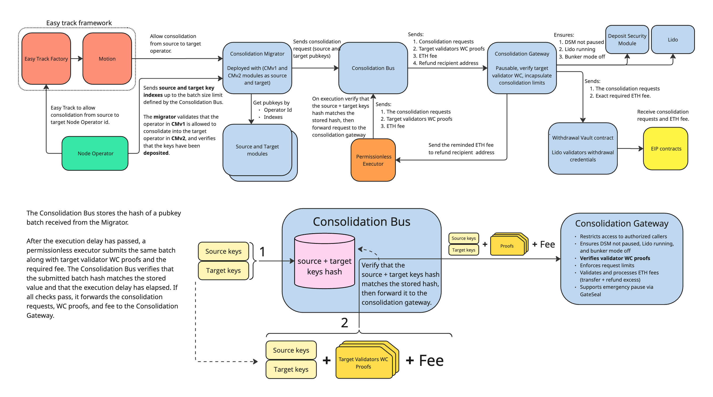
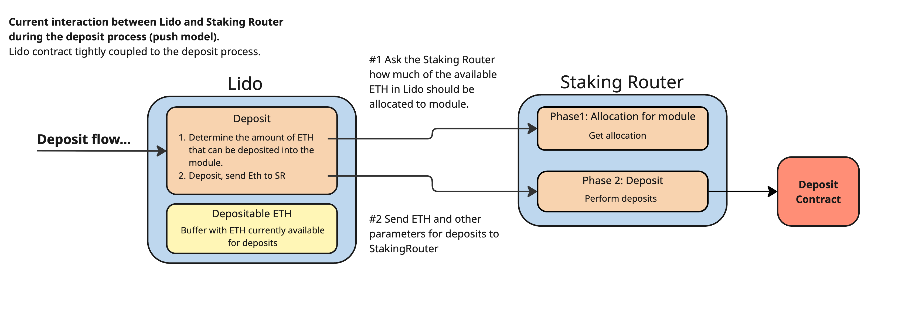
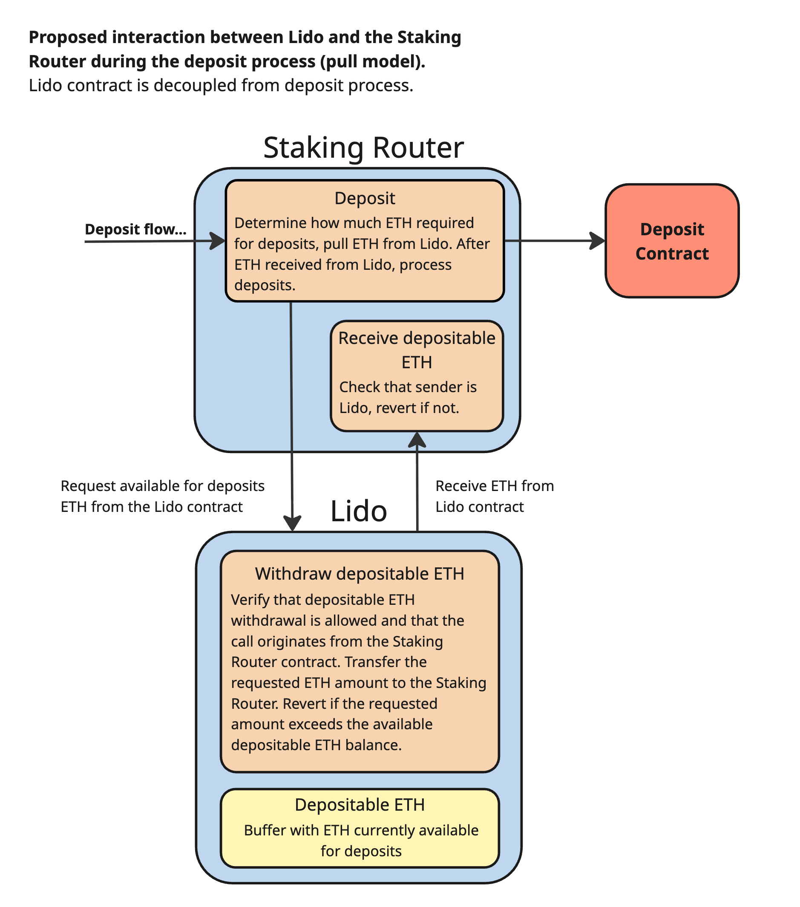
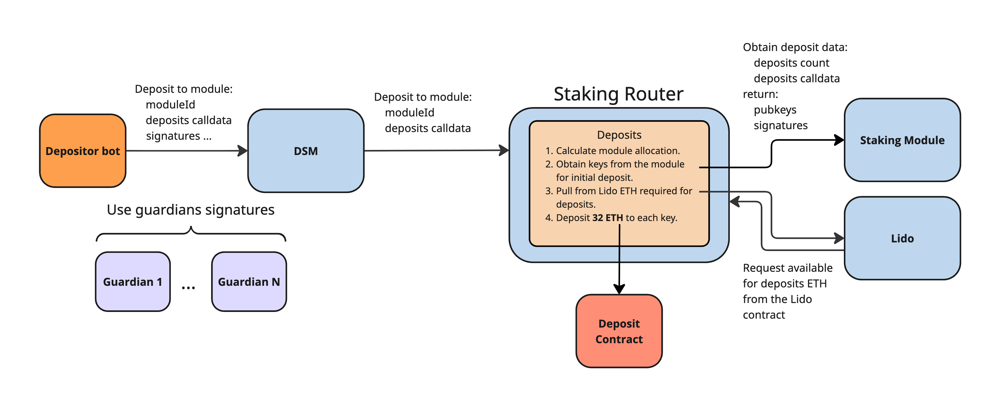
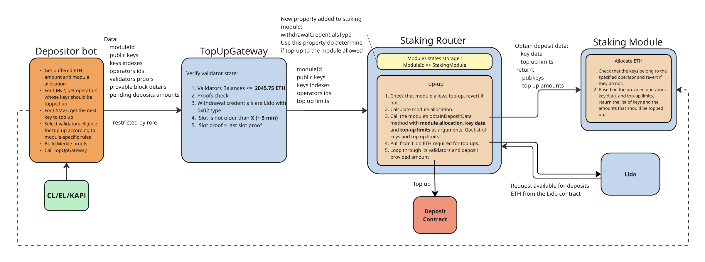
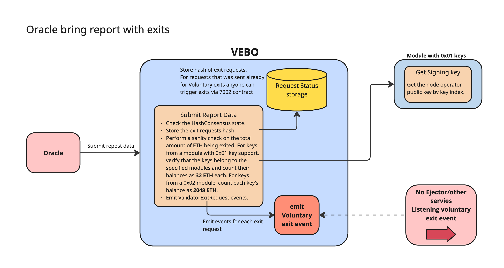
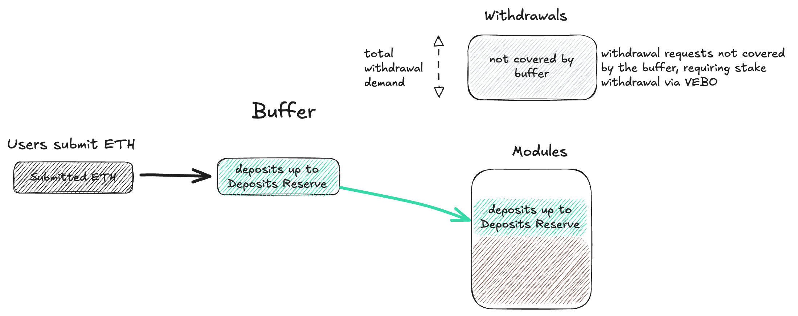
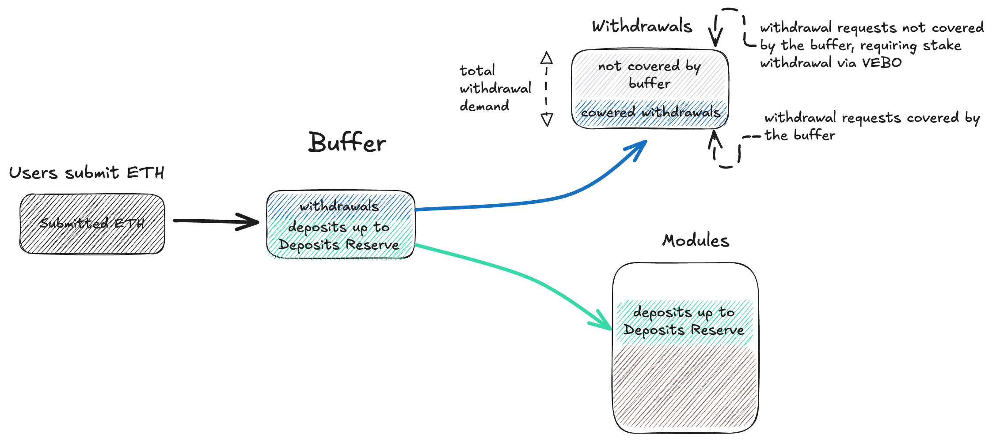
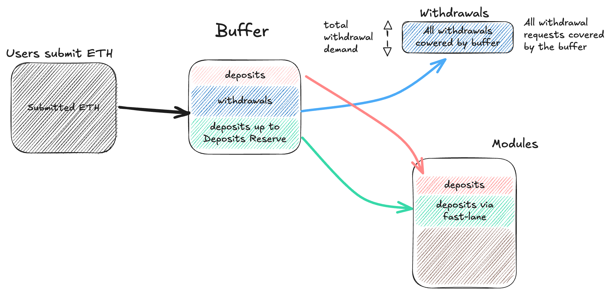
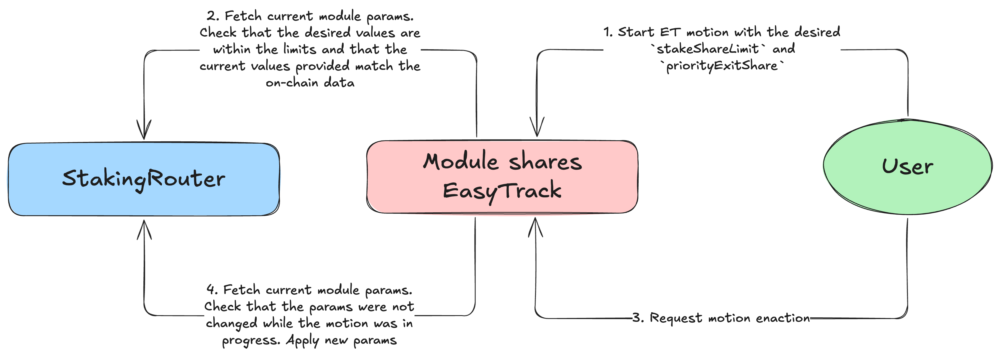

# LIP-35. Staking Router v3

## Simple Summary

Staking Router v3 upgrades Lido's core protocol for [EIP-7251](https://eips.ethereum.org/EIPS/eip-7251) (MaxEB). Validator accounting moves from per-validator counts to direct balance tracking, rewards are distributed per-module balance, and the deposit flow switches from a push model orchestrated by the Lido contract to a pull model where the Staking Router withdraws ETH from Lido as needed. A new `TopUpGateway` enables top-ups of `0x02` validators up to 2048 ETH, secured by on-chain Merkle-proof verification of validator state.

A consolidation pipeline enables stake migration from Curated Module v1 to v2, and the validator exit flow (VEBO/VEO) becomes key-type-aware and balance-based, with sanity checks bound by total effective balance rather than validator count.

A deposit reserve protects a portion of buffered ether for CL deposits, preventing withdrawal demand from consuming ETH needed for stake rebalancing and initial deposits during the CMv1 to CMv2 migration.

## Motivation

Staking Router v3 is the foundational infrastructure upgrade that serves as the base layer upon which [LIP-33 (CSM v3 and CM v2)](lip-33.md) is built. It unlocks a more flexible and efficient protocol, both technically and operationally. With these changes, the protocol will be able to reallocate stake between modules via consolidation operations, support new deposits into large validators, naturally streamlining the network, and lay the groundwork for smarter, leaner validator management overall.

**A new, `0x02`-ready, accounting model.** Although already supported by the stVaults architecture, this is a fundamental shift for Lido Core. Currently, the Lido protocol handles critical aspects of validator accounting — deposits, rewards, withdrawals — through a unit-based approach where 1 validator equals 32 ETH. A balance-based accounting model is essential for supporting large validators and consolidations because it allows the protocol to treat validators as flexible balances rather than fixed units, enabling seamless consolidation and validator top-ups. For this to happen, a significant rework of several key components of the on-chain protocol is required.

**Stake migration from CMv1 to CMv2.** The consolidation process would provide a secure and transparent way to quickly migrate stake from the old Curated Module v1 to the new Curated Module v2.

**Deposit reserve for reliable stake rebalancing.** Historically, stake rebalancing between modules through new deposits and withdrawals has been slow and unreliable — SDVT took over 1.5 years to reach its target share. A deposit reserve mechanism guarantees ETH availability for migration deposits and new module onboarding, regardless of withdrawal demand.

# Specification

## Accounting

### The 32 ETH Problem

Before the Pectra upgrade, every Ethereum validator had a fixed effective balance — 32 ETH. This allowed Lido to use a simple accounting model: it was enough to count the number of validators and multiply by 32 to get the total stake.

[EIP-7251](https://eips.ethereum.org/EIPS/eip-7251) (MaxEB) changed the rules. Now, a validator’s effective balance can range from 32 to 2048 ETH. A validator with 2048 ETH generates 64 times more rewards than a validator with 32 ETH, but the old system treated them equally.

As a result, the current validator-count–based accounting is incompatible with large validators in several aspects:

- **Rewards calculation** — the protocol doesn’t know how much ETH is actually working on the Consensus Layer
- **Stake distribution** — allocation between modules is based on validator count, not actual balance
- **Tracking totalPooledEther** — the key metric for stETH rate calculation becomes inaccurate

The solution is to transition from counting validators to direct balance accounting.

### New Accounting Model

Currently, in the `Lido` contract the protocol stores two values: `clValidators` (number of validators on the CL) and `clBalance` (their total balance). The validator count is used to calculate transient balance and perform security checks.

It is proposed to replace `clBalance` and `clValidators` in Lido with `clValidatorsBalance` and `clPendingBalance`. The oracle report structure changes accordingly — instead of total balance, it now delivers balances split by state.

#### Accounting oracle report changes

```diff
- clBalanceGwei
+ clValidatorsBalanceGwei
+ clPendingBalanceGwei
+ stakingModuleIdsWithUpdatedBalance[]
+ validatorBalancesGweiByStakingModule[]
```

Total protocol balance on the CL:

```
totalClBalance = clValidatorsBalance + clPendingBalance
```

> Note: For the `clValidatorsBalanceGwei` and `clPendingBalanceGwei` calculations, the oracle uses KAPI. When querying KAPI, the oracle verifies that the returned data corresponds to a slot greater than `refSlot`, ensuring that the response includes the most up-to-date state.

#### CL Validators Balance Calculation Algorithm

1. **Data retrieval:** get the active validator set (with balances) from the Consensus Layer, and the list of Lido keys from the Keys API.
2. **Consistency check:** the number of Lido keys returned by the Keys API must be at least equal to the count of deposited validators reported by the Staking Router. If fewer keys are returned, revert.
3. **Match keys to validators:** for every Lido key, look it up in the CL validator set:
   - If the key is present on the CL, it belongs to an active Lido validator and is included in the report.
   - If the key is not yet on the CL, it is pending (deposited on the Execution Layer, not yet activated on the Consensus Layer) and is skipped here — its balance is handled separately by the pending-balance calculation.
4. **Sum balances:** `clValidatorsBalance` is the sum of balances across all matched active Lido validators.

#### Pending Deposits Calculation Algorithm

1. **Data retrieval:** get pending deposits and the active validator set from the Consensus Layer, Lido keys from the Keys API, and Lido withdrawal credentials from the Lido contracts.
2. **Consistency check:** the number of Lido keys returned by the Keys API must be at least equal to the count of deposited validators reported by the Staking Router. If fewer keys are returned, revert.
3. **Find Lido keys awaiting activation:** compare Lido keys against the CL validator set — keys not yet present on the CL are considered _pending_ (deposited on the Execution Layer, not yet activated on the Consensus Layer).
4. **Attribute deposits to pending keys:** walk pending deposits in queue order; for each deposit targeting a Lido pending key:
   - Deposits with an invalid BLS signature are skipped.
   - The first BLS-valid deposit for a key determines the key’s status: if it points to Lido withdrawal credentials, the key is accepted and the deposit is kept; otherwise the key is considered front-run and all of its deposits are discarded.
   - Subsequent deposits to an already-accepted key are added to that key's group.
5. **Sum balances:** `clPendingBalance` is the sum of deposit amounts across all deposits attributed to accepted pending Lido keys.

### From Transient to Pending

**Currently**, there is a “transient balance” — a virtual value compensating for the delay between sending a deposit and its appearance on the Consensus Layer:

```
transientBalance = (depositedValidators - clValidators) × 32 ETH
```

This construct was necessary because a deposit could “hang” between the Execution Layer and the Consensus Layer for several hours or even days. The oracle didn’t see these funds, but the protocol had to account for them in `totalPooledEther`.

**Proposed:** Pectra ([EIP-6110](https://eips.ethereum.org/EIPS/eip-6110)) eliminates this problem. Deposits from the Execution Layer enter the Consensus Layer pending queue in the same block:

> “Validator deposits list supplied in a block is obtained by parsing deposit contract log events emitted by each deposit transaction included in a given block.” — [EIP-6110](https://eips.ethereum.org/EIPS/eip-6110)

The oracle always sees the complete picture: active validators in `clValidatorsBalance`, pending deposits in `clPendingBalance`. Transient balance is no longer needed — this simplifies the system and eliminates a potential source of discrepancies between the actual CL state and protocol data.

### Deposit Tracking

All deposits made after the accounting report reference slot were not included in the accounting report and therefore must be accounted for separately.

**Currently**, deposits are tracked through validator counters. When ETH moves from the buffer to the Deposit Contract:

```diff
- buffered -= 32 ETH
- depositedValidators += 1
```

The transient balance `(depositedValidators - clValidators) × 32 ETH` compensates for deposits in transit.

**Proposed:** deposits are tracked through balance using two counters. When ETH moves from the buffer to the Deposit Contract:

```diff
+ buffered -= amount
+ depositedSinceLastReport += amount
+ depositedForCurrentReport += amount
```

Where:

- `depositedSinceLastReport` — total deposits since the last oracle report reference slot across all frames (includes deposits made after the current reporting frame)
- `depositedForCurrentReport` — deposits that occurred between the last report reference slot and the current frame's reference slot (i.e., deposits the oracle should have observed; excludes deposits made after the current reporting frame)

```
                                                               NOW
                     ┌─ depositedSinceLastReport ────────────┐ ↓
                     │─ depositedForCurrentReport ─┐         │
      │○○○○○○○○○○○○○○│○●●○○R○○○●○○●○│○○●●●○○●○●○○○○│○○●●○○●○○●○○○○│
      ┆         lastReport-↑       currentRefSlot-↑└────⁠┬────┘
      ┆              ┆ currentReportFrame-↓        ┆    └depositedNextReport
      ⁠║   frame X    ⁠║   frame X+1  ⁠║   frame X+2  ⁠║   frame X+3  ⁠║

       R - report transaction slot
       ● - slot with deposits
       ○ - empty slot
       ⁠║ - frame refSlot
```

The new `getBalanceStats()` method provides full balance model data:

```solidity
interface ILido {
  /// @notice Returns current balance statistics
  /// @return clValidatorsBalanceAtLastReport Sum of validator's active balances in wei
  /// @return clPendingBalanceAtLastReport Sum of validator's pending deposits in wei
  /// @return depositedSinceLastReport Deposits made since last oracle report reference slot
  /// @return depositedForCurrentReport Deposits made between the last oracle report reference slot  and the current frame's reference slot
  function getBalanceStats()
    external
    view
    returns (
      uint256 clValidatorsBalanceAtLastReport,
      uint256 clPendingBalanceAtLastReport,
      uint256 depositedSinceLastReport,
      uint256 depositedForCurrentReport
    );
}
```

With this transition, the following deposit-related members are no longer needed and are proposed to be removed from Lido:

- `unsafeChangeDepositedValidators(uint256 _newDepositedValidators)` and the associated `UNSAFE_CHANGE_DEPOSITED_VALIDATORS_ROLE` — no longer required due to the transition to balance-based deposit tracking

### Rewards Calculation

**Currently**, the principal balance (total balance of validators in the previous report and deposits made since then) is calculated taking into account new validators:

```diff
- principalClBalance = prev.clBalance + (report.clValidators - prev.clValidators) × 32 ETH
- clRewards = _report.clBalance + update.withdrawalsVaultTransfer - update.principalClBalance
```

The formula compensates for deposits “in transit” but is tied to the 32 ETH assumption.

**Proposed:** the principal is taken directly from storage:

```diff
+ principalClBalance = prev.clValidatorsBalance + prev.clPendingBalance + prev.depositedSinceLastReport;
+ clRewards = (report.clValidatorsBalance + report.clPendingBalance) + update.withdrawalsVaultTransfer - principalClBalance
```

#### Rewards Distribution

**Currently**, a module’s share of rewards is determined by its active validator count:

```diff
- moduleShare = activeValidatorsCount / totalActiveValidators
```

**Proposed:** the share is determined by the module’s active validator balance:

```diff
+ moduleShare = moduleActiveBalance / totalActiveBalance
```

Where `moduleActiveBalance` is the module’s `validatorsBalanceGwei`, stored in the StakingRouter and updated by the oracle. As part of the main Accounting Oracle report phase, the oracle submits per-module validator balance data, which is routed to the `StakingRouter` via the following function:

```solidity
function reportValidatorBalancesByStakingModule(
    uint256[] calldata _stakingModuleIds,
    uint256[] calldata _validatorBalancesGwei,
) external;
```

The subsequent fee calculation has not changed: module and treasury fees are calculated from the share multiplied by the corresponding basis points from the module configuration. If a module is in the Stopped status, its fee is redirected to the treasury.

A module with one validator at 2048 ETH now receives a fair share of rewards corresponding to its contribution to the total stake, not an undervalued share of “one validator among many.”

### Migration

The migration aims to preserve data integrity and ensure correct rewards calculation in the first report after the upgrade.

#### Lido Migration

```diff
  depositedValidators
+ clValidatorsBalance
+ clPendingBalance
- clBalance
- clValidators
```

**Current state:** a single packed storage slot containing `clBalance` and `clValidators`.

**Target state:** a single packed storage slot containing `clValidatorsBalance` and `clPendingBalance`.

**Migration procedure:**

1. Read legacy state:
   - `clBalance`
   - `clValidators`
   - `depositedValidators`
2. Compute the transient balance as
   `transientBalance = (depositedValidators − clValidators) × 32 ETH`.
3. Populate the new state:
   - `clValidatorsBalance = clBalance`
   - `clPendingBalance = transientBalance`

The transient balance becomes the pending balance — semantically, it is the same thing (ETH on the way to activation), but now the oracle will report the actual value instead of a calculated one.

#### StakingRouter Migration

**Before:** modules store only validator counters (`depositedValidatorsCount`, `exitedValidatorsCount`).

**After:** each module stores `validatorsBalanceGwei`.

For each legacy module during migration:

1. Get deposited and exited validator counts
2. Calculate active: `activeCount = depositedValidators - exitedValidators`
3. Calculate initial balance: `validatorBalanceGwei = activeCount × 32 ETH`

The sum of `validatorsBalanceGwei` across all modules is written to the shared `RouterStateAccounting`. The next oracle report will update these values to actual balances from the Consensus Layer.

#### Data Integrity

The first report after migration is correct by construction:

- `principalClBalance` includes the migrated pending balance
- New deposits after migration are visible to the oracle in `clPendingBalance`
- Old transient stake is not counted as rewards

### Sanity Checks

The list of checks has been updated following the **Pectra hard-fork** and the subsequent expansion of parameters passed to the Validator Exit Bus Oracle (VEBO) and Accounting Oracles (AO).

[Here you can find full description of changes](https://docs.google.com/document/d/1YAWLxZk90dkcwCeQkv8xSeWYfVNKGCJmicZpPn-aGR0/edit?tab=t.0)

Most of the pre-existing sanityCheck parameters have been recalculated from the number of validators to the amount of ETH. The most significant changes were made to the following parameters:

1. **exitedEthAmountPerDayLimit (57,600 ETH)**
   This has been converted to ETH without changes to the underlying logic, but it now accounts for the specific calculation where the minimum possible validator balance is 16 ETH.

2. **consolidationEthAmountPerDayLimit (91,800 ETH)**
   This was calculated based on the current state of the network, including deposit queue and a buffer for potential DAO changes over a two-month period (37.3M + 3.2M + 3M).

#### [VEBO] checkMaximumOfAmountEthCalledToExitInReport

This check verifies the maximum amount of ETH that can be sent within a single VEBO report based on the count of different type cases multiplied by their weights. Under this check, we assume the weight of a `0x02`-type validator falls within the range of 32 to 2048 ETH and can be adjusted based on risk tolerance. Taking all conditions into account, the current value for `maxEffectiveBalanceWeightWCType02` is set to 2048.

```
count_of_0x01_keys * maxEffectiveBalanceWeightWCType01 +
+ count_of_0x02_keys * maxEffectiveBalanceWeightWCType02
<= maxBalanceExitRequestedPerReportInEth
```

#### [AO] checkCLBalancesConsistency

Basic data verification

```
sum(validatorBalancesGweiByStakingModule) == clValidatorsBalanceGwei
```

#### [AO] checkCLBalanceDecrease

Changed to be compatible with Pectra hard-fork.  
New sanity check allows CLValidatorBalance to be decreased by 3.6% in a 36-day window. Such a value (3.6%) represents the maximum balance decrease due to attestation penalties, initial slashing penalty, and correlation penalty while less than 1.08% of the network balance is slashed, more than a total of 11 million ETH is staked, and the network is not in inactivity leak mode.

[Here you can find particular algorithm and calculations](https://docs.google.com/document/d/1MK9XMU-xVdw0XQG9cxtR0rxusuBr1CI4DuGNxNXgswI/edit?tab=t.0)

#### [AO] calculateBalanceIncreasePerDay

- Verifying the flow of pending/inactive ETH in the queue (accounting for new deposits).
- Verifying changes in the total active balance migrated from the pending queue
- Verifying balance changes on a per-module basis.

```python=
aprAndGiftSafetyCap = clValidatorsBalanceGweiPre*annualBalanceIncreaseBPLimit/365

assert clPendingBalanceGweiCurrent <= clPendingBalanceGweiPre + stakeDeposits(t(prev->curr))

activatedGweiAmount = clPendingBalanceGweiPre + stakeDeposits(t(prev->curr)) - clPendingBalanceGweiCurrent
assert activatedGweiAmount <= appearedEthAmountPerDayLimit

activatedGweiAmountWithGap = activatedGweiAmount + aprAndGiftSafetyCap

if clValidatorsBalanceGweiCurrent > clValidatorsBalanceGweiPre:
    assert clValidatorsBalanceGweiCurrent - clValidatorsBalanceGweiPre <= activatedGweiAmountWithGap

totalActivatedInClByModules = 0
for i, stBalance in enumerate(validatorBalancesGweiByStakingModule(current)):
    _moduleIncrease = stBalance - validatorBalancesGweiByStakingModule(prev)[i]
    if _moduleIncrease > 0:
        totalActivatedInClByModules += _moduleIncrease

assert totalActivatedInClByModules <= activatedGweiAmountWithGap + consolidationEthAmountPerDayLimit
```

#### [AO] checkNumExitedValidatorsByStakingModule

This check has been updated to align with the introduction of the consolidation process. Now, the maximum amount of ETH exited at once cannot exceed double the sum of exited and consolidated ETH.

The necessity for doubling is due to the worst-case scenario where validators participating in these processes have the minimum balance of 16 ETH. The size of `0x02`-type validators is set to the minimum possible value because, otherwise, actual recorded withdrawals could falsely trigger a revert.

```
count_of_0x01_keys * 32 + count_of_0x02_keys * 32
<=
(exitedEthAmountPerDayLimit + consolidationEthAmountPerDayLimit)*2

OR

(count_of_0x01_keys + count_of_0x02_keys) * 16
<= exitedEthAmountPerDayLimit + consolidationEthAmountPerDayLimit
```

### Legacy API

Currently, external services use `Lido.getBeaconStat()`, which returns `depositedValidators`, `beaconValidators`, and `beaconBalance`.

However, `beaconValidators` would no longer reflect the actual consensus layer (CL) state and would always be equal to `depositedValidators`.

It is proposed to **mark `getBeaconStat` as deprecated**.

For new integrations, `getBalanceStats()` is recommended, as it reflects the current accounting model and provides more detailed information about the protocol state.

## Consolidation



It is suggested that the first step in the consolidation process is an EasyTrack motion to set consolidation parameters.

Operators will use EasyTrack to specify a **source/target operator pair** (CMv1 → CMv2), along with a **Consolidation Manager address**—the address that will be granted permission to submit consolidation requests for consolidating validators from the source operator to the target operator. Once the motion is enacted, stake transfers from a CMv1 operator entity to its corresponding CMv2 entity are permitted, allowing the operator to submit consolidation requests to the Migrator contract.

Once consolidation is allowed, the operator submits key indices to the Consolidation Migrator contract, which verifies that the keys are in use (deposited). The Consolidation Migrator, via dedicated modules, retrieves the corresponding pubkeys from the provided key indices. The consolidation requests are then sent to the Consolidation Bus, which stores the hash of the pubkey batch received from the Migrator.

After the required execution delay has passed, a permissionless executor submits the same batch along with target validator withdrawal credentials (WC) proofs and the required fee. The Consolidation Bus verifies that the submitted batch hash matches the stored value. If it does, the Bus forwards the consolidation request, WC proofs, and fee to the Consolidation Gateway.

The Consolidation Gateway verifies the target validators’ WC proofs, checks consolidation limits, and ensures that deposits in the Deposit Security Module (DSM) are not paused, that Lido is running, and that bunker mode is disabled.

The Gateway then forwards the requests, and the fee to the Withdrawal Vault contract, which submits the request to the system contract.

Dedicated on-chain monitoring would help ensure that operators submit valid consolidation requests (i.e., no attempts to consolidate validators scheduled for exit by VEBO, no consolidation of inactive validators, and no duplicate pending consolidation requests).

### Consolidation EasyTrack

When an operator creates an EasyTrack proposal to request consolidation permission, they would provide:

- **A single source operator ID** in CMv1
- **A list of target operator IDs** in CMv2
- **A single Consolidation Manager address** — the address that will be granted permission to submit consolidation requests for migrating validators from the source operator to all specified target operators

> Note. Operators may specify any Consolidation Manager address. This may be their reward address, if preferred, or any other address of their choosing.

Each proposal defines one source operator and multiple target operators, forming multiple source→target mappings that share the same source. The provided Consolidation Manager will be authorized to execute consolidations from the specified source operator to any of the listed target operators.

Currently, only consolidation from operators in the CMv1 module to operators in the CMv2 module will be allowed. Under the hood, Easy Track validation verifies that the source–target operator pair is registered in the CMv2 meta operators registry, which indicates that the pair is allowed under the migration plan.

A single node operator in the CMv1 module may consolidate into multiple operators in the CMv2 module, and such configurations can be submitted within a single EasyTrack motion.

### Consolidation Migrator

The **Consolidation Migrator** contract validates stake consolidation (migration) requests from a source operator in one module to a target operator in another module. The **source module ID** and **target module ID** are provided at deployment time in the implementation contract and are immutable thereafter.

```
// Consolidation Migrator receive key indexes grouped by target keys
sourceOperatorId
targetOperatorId
groups: [
  {
    sourceKeyIndices: [...], // many sources
    targetKeyIndex.          // single target
  },
  ...
]
```

The **Consolidation Migrator** receives a source operator ID, a target operator ID, and key indices grouped by target keys. It then uses the respective modules to resolve the provided key indices into pubkeys and additionally ensures that:

- Consolidation requests are submitted by the authorized **Consolidation Manager address**
- Consolidations are permitted only for explicitly allowed **(sourceOperator → targetOperator)** pairs
- Each validator key involved in a consolidation has been deposited by Lido.

If all checks pass, the **Consolidation Migrator** sends the resolved public keys (grouped by target key) from both the source and target modules to the **Consolidation Bus**.

To manage the list of allowed consolidation pairs (source → target operators), it is proposed to add three methods:

`allowPair` — allows consolidation from a source operator to a target operator for a specified consolidation manager address. This method will be called via an EasyTrack motion upon enactment.

`disallowPair` — disallows consolidation from a source operator to a target operator. This method may be called to correct an incorrectly allowed pair, update the consolidation manager address, or stop consolidation for operational reasons. It is proposed to grant the CMC Committee (also known as CM Committee Multisig) permission to call this method.

`selfDisallowPair` — allows the original submitter to revoke (disallow) a previously allowed pair. Permissionless, but restricted to the submitter of the pair.

Note. Once a consolidation pair is disallowed, it may be allowed again by creating and enacting a new EasyTrack motion by the operator.

```solidity
/// @notice Interface for validating and submitting stake consolidation (migration) requests
///         between operators across two modules.
interface IConsolidationMigrator {
  // =========
  //  Structs
  // =========
  struct ConsolidationIndexGroup {
    uint256[] sourceKeyIndices;
    uint256 targetKeyIndex;
  }

  // =========
  //  Events
  // =========
  event ConsolidationPairAllowed(
    uint256 indexed sourceOperatorId,
    uint256 indexed targetOperatorId,
    address indexed submitter
  );
  event ConsolidationPairDisallowed(
    uint256 indexed sourceOperatorId,
    uint256 indexed targetOperatorId,
    address indexed submitter
  );
  event ConsolidationSubmitted(
    uint256 indexed sourceOperatorId,
    uint256 indexed targetOperatorId,
    ConsolidationIndexGroup[] groups
  );

  // ==================
  //  Read-only views
  // ==================

  /// @notice Gets the source module ID this migrator is bound to.
  function sourceModuleId() external view returns (uint256);

  /// @notice Gets the target module ID this migrator is bound to.
  function targetModuleId() external view returns (uint256);

  /// @notice Returns true if consolidation from `sourceOperatorId` to `targetOperatorId` is allowed.
  function isPairAllowed(uint256 sourceOperatorId, uint256 targetOperatorId) external view returns (bool);

  /// @notice Returns the list of target operators allowed for a given `sourceOperatorId`.
  function getAllowedTargets(uint256 sourceOperatorId) external view returns (uint256[] memory targetOperatorIds);

  /// @notice Returns the submitter address for a consolidation pair.
  function getSubmitter(uint256 sourceOperatorId, uint256 targetOperatorId) external view returns (address);

  /// @notice Returns the StakingRouter address.
  function getStakingRouter() external view returns (address);

  /// @notice Returns the ConsolidationBus address.
  function getConsolidationBus() external view returns (address);

  // ===================
  //    Submission
  // ===================

  /// @notice Submits a batch of consolidation requests after validation.
  /// @dev MUST revert if the batch would fail validation. Emits ConsolidationSubmitted on success.
  /// @dev Caller must be the designated submitter for this pair (set via allowPair).
  function submitConsolidationBatch(
    uint256 sourceOperatorId,
    uint256 targetOperatorId,
    ConsolidationIndexGroup[] calldata groups
  ) external;

  // ======================
  //  Allowlist management
  // ======================

  /// @notice Allows consolidations from `sourceOperatorId` to `targetOperatorId`.
  /// @dev Access-controlled via ALLOW_PAIR_ROLE.
  function allowPair(uint256 sourceOperatorId, uint256 targetOperatorId, address submitter) external;

  /// @notice Disallows consolidations from `sourceOperatorId` to `targetOperatorId`.
  /// @dev Access-controlled via DISALLOW_PAIR_ROLE.
  function disallowPair(uint256 sourceOperatorId, uint256 targetOperatorId) external;

  /// @notice Allows a submitter to disallow their own previously allowed pair.
  /// @dev Permissionless, but restricted to the original submitter of the pair.
  function selfDisallowPair(uint256 sourceOperatorId, uint256 targetOperatorId) external;
}
```

#### Module Interaction

Since the migrator is a temporary contract whose primary purpose is to support the upcoming stake migration from legacy modules to new modules (specifically from CMv1 to CMv2), it is proposed to rely on the existing key-retrieval methods already implemented by these module types.

```solidity
/**
 * @dev Unified interface for staking modules (NOR, SDVT, CMv1, CMv2)
 *      It also works for legacy staking modules (NOR, SDVT) where `getSigningKeys` returns different
 *      tuple `(bytes memory pubkeys, bytes memory signatures, bool[] memory used)`.
 *      The trick: `abi.decode(returndata, (bytes))` will decode only the first tuple element.
 *      This is safe as long as the first returned value really is `bytes pubkeys` in that position.
 */
interface IUnifiedStakingModule {
  function getSigningKeys(
    uint256 nodeOperatorId,
    uint256 startIndex,
    uint256 keysCount
  ) external view returns (bytes memory);

  function getNodeOperatorSummary(
    uint256 _nodeOperatorId
  )
    external
    view
    returns (
      uint256 targetLimitMode,
      uint256 targetValidatorsCount,
      uint256 stuckValidatorsCount,
      uint256 refundedValidatorsCount,
      uint256 stuckPenaltyEndTimestamp,
      uint256 totalExitedValidators,
      uint256 totalDepositedValidators,
      uint256 depositableValidatorsCount
    );
}
```

To validate whether a target key has already been used (deposited), the `getNodeOperatorSummary` method from `IStakingModule` will be used to obtain the total number of deposited validators (`key index < totalDepositedValidators`).

### Consolidation Message Bus

The Message Bus decouples consolidation request submission from execution. This process consists of two steps:

1. Add consolidation requests via the `addConsolidationRequests` method.
2. Execute previously added requests via the `executeConsolidation` method.

Authorized actors (e.g., the Consolidation Migrator) can submit consolidation requests grouped by target key in batches using the `addConsolidationRequests` method:

```
// Add consolidation requests grouped by target key
groups: [
  {
    sourceKeys: [...],   // many sources
    targetKey            // single target
  },
  ...
]
```

The `addConsolidationRequests` method enforces:

- a batch size limit (maximum number of requests), and
- a target validator group limit (maximum number of target validator groups per batch).

It also stores batch hashes along with submission timestamps for deferred execution.

After the execution delay has elapsed, any permissionless executor can process a batch via `executeConsolidation` by submitting:

- the original batch (previously added via `addConsolidationRequests`)
- the required fee
- `ValidatorWitness` proofs for each target validator

```
// Execute consolidation requests
groups: [
  {
    sourceKeys: [...],
    validatorWitness // contains the original target key and withdrawal credentials (WC) proof
  },
  ...
]
```

The `addConsolidationRequests` verifies that:

- the submitted batch hash matches the stored hash of the original request
- the required execution delay has elapsed.

If all checks pass, the contract forwards the consolidation requests, withdrawal credentials proofs, and fee to the `ConsolidationGateway`. The processed batch is then removed from storage.

The `ConsolidationBus` allows configuring:

- **Batch size limit** via `setBatchSize` — maximum number of requests per batch
- **Target group limit** via `setMaxGroupsInBatch` — maximum number of validator groups per batch
- **Execution delay** via `setExecutionDelay` — minimum time between batch submission and execution

```solidity
/**
 * @title Consolidation Message Bus Interface
 * @notice
 * 1. Admins register/unregister publishers via grant/revoke PUBLISH_ROLE.
 * 2. Registered publishers add consolidation requests (PUBLISH_ROLE).
 * 3. Executor bot executes batches, paying the required ETH fee;
 *    the bus forwards the batch to ConsolidationGateway.
 * 4. Optional REMOVE_ROLE can remove batches from the pending queue.
 */
interface IConsolidationBus {
  // Structs
  struct ConsolidationGroup {
    bytes[] sourcePubkeys;
    bytes targetPubkey;
  }

  struct BatchInfo {
    address publisher;
    uint64 addedAt;
  }

  // Events
  event BatchLimitUpdated(uint256 newLimit);
  event MaxGroupsInBatchUpdated(uint256 newLimit);
  event ExecutionDelayUpdated(uint256 newDelay);
  event RequestsAdded(address indexed publisher, bytes batchData);
  event RequestsExecuted(bytes32 indexed batchHash, uint256 feePaid);
  event BatchesRemoved(bytes32[] batchHashes);

  // View methods
  function batchSize() external view returns (uint256);
  function maxGroupsInBatch() external view returns (uint256);
  function executionDelay() external view returns (uint256);
  function getConsolidationGateway() external view returns (address);
  function getBatchInfo(bytes32 batchHash) external view returns (BatchInfo memory);

  // Role constants
  // bytes32 public constant MANAGE_ROLE = keccak256("MANAGE_ROLE");
  // bytes32 public constant PUBLISH_ROLE = keccak256("PUBLISH_ROLE");
  // bytes32 public constant REMOVE_ROLE = keccak256("REMOVE_ROLE");

  // Admin API (MANAGE_ROLE)
  function setBatchSize(uint256 limit) external;
  function setMaxGroupsInBatch(uint256 limit) external;
  function setExecutionDelay(uint256 delay) external;

  // Remover API (REMOVE_ROLE)
  function removeBatches(bytes32[] calldata batchHashes) external;

  // Publisher API (PUBLISH_ROLE)
  // 1. Verify caller has PUBLISH_ROLE.
  // 2. Verify total batch size and number of groups do not exceed limits.
  // 3. Validate all pubkey lengths are 48 bytes and no source equals its target.
  // 4. Store batch hash and BatchInfo (publisher, addedAt timestamp).
  // 5. Emit RequestsAdded event.
  function addConsolidationRequests(ConsolidationGroup[] calldata groups) external;

  // Executor API
  // 1. Verify the batch was added and not executed or removed.
  // 2. Verify the execution delay has passed since the batch was added.
  // 3. Forward the batch to the ConsolidationGateway with ValidatorWitness proofs.
  // 4. Delete the batch from the pending queue.
  // 5. Emit RequestsExecuted event.
  function executeConsolidation(IConsolidationGateway.ConsolidationWitnessGroup[] calldata groups) external payable;
}
```

#### Execution delay

It is proposed that consolidation request execution can only be processed after an execution delay interval, which can be configured via the `setExecutionDelay` method.

This execution delay ensures that honest Council members have sufficient time to pause the DSM and thereby block the execution of new consolidation requests (the Consolidation Gateway checks that the DSM is not paused) in case keys with invalid withdrawal credentials were deposited.

#### Executor Bot

It is proposed that anyone can permissionlessly execute a consolidation batch by calling `executeConsolidation` method with the same batch which was originally added by authorized actors via `addConsolidationRequests`, along with the required fee and `ValidatorWitness` proofs for each target validator.

A new Consolidation Executor bot is expected to be designed to monitor the Consolidation Bus and execute consolidation request batches sequentially, in the order in which they were initially submitted to the Consolidation Message Bus contract.

### Consolidation Gateway

It is proposed to introduce a single entry point for processing consolidation requests. This entry point would be responsible for verifying target validators’ withdrawal credentials, checking consolidation preconditions, enforcing consolidation limits, and enabling the consolidation flow to be paused independently in the event of an emergency.

Using the Withdrawal Vault for this purpose would not be advisable. The Withdrawal Vault manages multiple independent concerns, including protocol withdrawals and triggerable exit requests. Treating it as a pausable unit would prevent selectively pausing consolidation requests while continuing to accept triggerable withdrawal requests, which is operationally undesirable.

To address this, the `ConsolidationGateway` is introduced as a pausable contract (see [PausableUntil.sol](https://github.com/lidofinance/core/blob/master/contracts/0.8.9/utils/PausableUntil.sol)) designed to handle consolidation requests in a controlled and secure manner. It:

- **Authorizes** only permitted callers to submit requests (e.g., the Consolidation Bus)
- **Enforces request limits** to prevent overload
- **Ensures DSM deposits are not paused**
- **Ensures Lido is not stopped and bunker mode is not active**
- **Verifies CL proofs** of target validator withdrawal credentials (via `CLProofVerifier`)
- **Validates ETH fees**, ensuring they meet the minimum consolidation cost
- **Transfers the required fee** to the `WithdrawalVault`
- **Refunds any excess ETH** to a specified recipient
- **Can be paused** via the `CircuitBreaker` mechanism for emergency control

```solidity
interface IConsolidationGateway {
  struct ValidatorWitness {
    bytes32[] proof;
    bytes pubkey;
    uint256 validatorIndex;
    uint64 childBlockTimestamp;
    uint64 slot;
    uint64 proposerIndex;
  }

  struct ConsolidationWitnessGroup {
    bytes[] sourcePubkeys;
    ValidatorWitness targetWitness;
  }

  function addConsolidationRequests(
    ConsolidationWitnessGroup[] calldata groups,
    address refundRecipient
  ) external payable onlyRole(ADD_CONSOLIDATION_REQUEST_ROLE) whenResumed;

  function setConsolidationRequestLimit(
    uint256 maxConsolidationRequestsLimit,
    uint256 consolidationsPerFrame,
    uint256 frameDurationInSec
  ) external onlyRole(EXIT_LIMIT_MANAGER_ROLE);

  function getConsolidationRequestLimitFullInfo()
    external
    view
    returns (
      uint256 maxConsolidationRequestsLimit,
      uint256 consolidationsPerFrame,
      uint256 frameDurationInSec,
      uint256 prevConsolidationRequestsLimit,
      uint256 currentConsolidationRequestsLimit
    );

  function resume() external onlyRole(RESUME_ROLE);
  function pauseFor(uint256 duration) external onlyRole(PAUSE_ROLE);
  function pauseUntil(uint256 pauseUntilInclusive) external onlyRole(PAUSE_ROLE);
}
```

### Withdrawal Vault

A consolidation request is made by signing a transaction with the source validator’s withdrawal address. Since all Lido core validators use **WithdrawalVault** credentials, the consolidation request to the [EIP-7251](https://eips.ethereum.org/EIPS/eip-7251) system contract must be sent from the **WithdrawalVault** contract.

It is proposed to add the following methods to the WithdrawalVault contract:

- `addConsolidationRequests`
- `getConsolidationRequestFee`

Only the **ConsolidationGateway** contract would be permitted to add consolidation requests.

```solidity
interface IWithdrawalVault {
  /**
   * @dev Submits EIP-7251 consolidation requests for each (source, target) pair.
   *      Each request instructs a validator to consolidate its stake to the target validator.
   *
   * @param sourcePubkeys 48-byte public keys of source validators.
   * @param targetPubkeys 48-byte public keys of target validators.
   *
   * @notice Reverts if:
   *         - Caller is not ConsolidationGateway.
   *         - Arrays are empty, malformed, or of unequal length.
   *         - Invalid total withdrawal fee value is provided.
   */
  function addConsolidationRequests(bytes[] calldata sourcePubkeys, bytes[] calldata targetPubkeys) external payable;

  /**
   * @dev Returns the current EIP-7251 consolidation fee per request.
   */
  function getConsolidationRequestFee() external view returns (uint256);
}
```

## Deposits

To fully support `0x02` keys and enable flexible stake rebalancing across operators, it is proposed to introduce **top-up deposits**. With this enhancement, the system will support two types of deposit flows:

- **Predeposits**: deposits of exactly 32 ETH to new validators for `0x01` and `0x02` types of keys
- **Top-ups**: deposits for `0x02`-type active validators intended to reach the max effective balance (2048 ETH)

Following this change, two types of deposit-handling modules may exist:

- Modules with **`0x01` keys** that accept only 32 ETH predeposits
- Modules with **`0x02` keys** that accept predeposits and top-ups up to 2,048 ETH

To maintain system simplicity, **each module must support only one key type** for deposits: either `0x01` or `0x02` — not both.

It is proposed that the deposit flow rely on validator balances rather than the number of keys, and that it support keys with both credential types: `0x01` and `0x02`.

### Depositable ETH Pull Model

The Lido contract is currently tightly coupled to the deposit process. Lido must determine—via the Staking Router—how much of the available ETH should be allocated to each module, and then pass both ETH and the required deposit data into the Staking Router’s `deposit` method. This creates unnecessary complexity in the deposit flow.



It is proposed to decouple deposit logic from the Lido contract by shifting the deposit flow from a **push** model to a **pull** model. Under this approach, the Staking Router would withdraw ETH from the Lido buffer as needed to execute deposits.



This change would allow:

- Keeping the Lido contract simpler, without deposit-related functions, reducing the number of responsibilities it carries.
- Simplifying the Staking Router logic by making it the single component responsible for executing deposits.
- Implementing all new deposit functionality outside of the Lido contract, in a newer Solidity version.

#### Lido

The Lido contract is responsible for supplying the ETH required for validator top-ups. To support the new ETH pull model during the deposit process, it is proposed to add a new `withdrawDepositableEther` method to the Lido contract.

Only the Staking Router will be permitted to pull ETH from Lido. The `withdrawDepositableEther` method will verify that the requested ETH amount is available for deposits and will then call `StakingRouter.receiveDepositableEther`, attaching the corresponding ETH.

```solidity
interface ILido {
  /// @notice Withdraw depositable ETH, send the requested ETH amount to the StakingRouter.
  /// @dev Can be called only by StakingRouter.
  /// @dev Access-controlled in the implementation (role-based).
  /// @param _amount amount of ETH to withdraw
  /// @param _seedDepositsCount amount of seed deposits. In case of top up this value will be equal to 0
  function withdrawDepositableEther(uint256 _amount, uint256 _seedDepositsCount) external;
}
```

As part of the pull model transition, the following deposit-related members are proposed to be removed from the Lido contract:

- `deposit(uint256 _maxDepositsCount, uint256 _stakingModuleId, bytes _depositCalldata)` — the old push-model deposit method.
- The `IStakingRouter.getStakingModuleMaxDepositsCount()` interface usage — Lido would no longer need to determine per-module deposit allocation, as the Staking Router would handle this independently under the pull model.

#### Staking Router

To support switching the deposit flow from a push model to a pull model, it is proposed to introduce a new `receiveDepositableEther` method for receiving ETH from Lido. The `receiveDepositableEther` method can receive ETH only from Lido.

```solidity
interface IStakingRouter {
  /**
   * @notice A payable function for depositable ether acquisition. Can be called only by `Lido`.
   */
  function receiveDepositableEther() external payable;
}
```

It is proposed that deposit flows adopt the new pull-based ETH model. These flows are covered in detail in the following Deposits sections.

### Predeposits flow description

A _predeposit_ refers to the initial 32 ETH deposit made to activate a validator.

For withdrawal credentials of type `0x01`, 32 ETH is both the minimum and the maximum effective balance for activation, so the predeposit constitutes the full deposit.

For withdrawal credentials of type `0x02`, the initial 32 ETH deposit is used to activate the validator, while any additional balance may be deposited later, if applicable.

**Note.** A 32 ETH deposit is suggested because it is the minimum effective balance needed for validator activation. Deposits below this threshold do not activate a validator and therefore do not accrue rewards until the total deposited amount reaches at least 32 ETH.



1. **The Depositor Bot** collects guardian signatures and initiates the deposit transaction.
2. **The DepositSecurityModule** verifies the guardian signatures and checks the deposit distance. If everything is valid, it calls `StakingRouter.deposit`.
3. **The StakingRouter** performs deposits. As part of this process, the Staking Router:
   - Calculates how much of Lido’s available ETH should be allocated to each staking module.
   - Obtains deposit keys from the staking module.
   - Pulls from Lido the total amount of ETH required to execute deposits for the received keys.
   - Submits a 32 ETH deposit for each key.

### Top-ups flow description

As in the initial predeposit flow, the Staking Router will deposit 32 ETH for both `0x01` and `0x02` keys. To support reaching the maximum effective balance for `0x02` keys, it is proposed to add Merkle-proof–based top-ups via a separate flow. This adds security by reducing trust assumptions and avoids complicating the validator-creation logic. Top-ups are allowed only for modules that support creation of `0x02` keys.



1. The Depositor Bot selects validators according to the algorithm described in the [Depositor Bot](#depositor-bot) section and calls `TopUpGateway.topUp`, providing staking module data (module ID, key indices, operator IDs), Merkle proofs, and validator consensus-layer (CL) data.
2. `TopUpGateway` verifies the validators’ CL data using Merkle proofs. Based on the verified CL data, it calculates the maximum allowed top-up amount for each validator. It then calls `StakingRouter.topUp`, passing the per-validator top-up limits together with the corresponding validator data (public key, module ID, operator ID, and key index).
3. The `StakingRouter` executes the top-ups:
   - The Staking Router verifies that top-ups are allowed for the module (i.e., the module uses withdrawal credentials of type `0x02`).
   - It determines how much ETH can be allocated to the module.
   - It calls `allocateDeposits` on the staking module with the module’s maximum deposit amount and the keys’ data, and receives the exact top-up amount for each key. The sum of all top-up amounts must be less than or equal to the module’s maximum deposit amount.
   - The Staking Router pulls from Lido the total ETH amount equal to the sum of all top-up amounts returned by the staking module.
   - The Staking Router then executes the top-ups for each key.
   - After all keys have been deposited, the Staking Router performs a sanity check to ensure that the entire amount of ETH requested from Lido has been deposited.

### Depositor Bot

The on-chain **min-first allocation strategy** defines how stake is distributed across modules. The depositor bot can not deposit more stake into any module than allowed by the allocation strategy.

Within the allocation constraint:

- For modules supporting `0x02` keys, the bot performs two types of deposits:
  - **Predeposits** (32 ETH seed deposits per new validator)
  - **Top-ups** (up to 2016 ETH per active validator)
- For modules supporting `0x01` keys, only:
  - **Full deposits** (32 ETH deposits per new 0x01 validator)

For modules that support `0x02 keys`, the system should maintain a sufficient number of validators eligible for top-ups, ensuring that a significant portion of the buffered ETH can be utilized without excessive delays (i.e., without waiting for validators to become active).

The Depositor Bot is proposed to be responsible for maintaining an appropriate balance between predeposits and top-ups in `0x02` modules, with **predeposits prioritized over top-ups**.

To determine module allocations, the Depositor Bot uses the `getDepositAllocations` method from the `StakingRouter` contract.

```solidity
interface IStakingRouter {
    /// @notice Returns new deposits allocation after distributing `_depositAmount`.
    /// @param _depositAmount The maximum ETH amount to allocate.
    /// @param _isTopUp Whether the allocation is for top-ups (true) or predeposits (false).
    /// @return totalAllocated The total amount actually allocated
    /// @return allocated Array of allocated amounts per module
    /// @return newAllocations Array of resulting allocation balances per module
    function getDepositAllocations(uint256 _depositAmount, bool _isTopUp)
        external
        view
        returns (
            uint256 totalAllocated,
            uint256[] memory allocated,
            uint256[] memory newAllocations
        );
}
```

#### Example Setup

Assume the system contains four modules:

| Module | Type (0x01/0x02) | Balance (ETH) |
| ------ | ---------------- | ------------- |
| A      | 0x02             | 100,000       |
| B      | 0x02             | 10,000        |
| C      | 0x01             | 100,000       |
| D      | 0x01             | 10,000        |

The bot runs every 25 blocks. On each run, the bot executes a **two-stage algorithm**:

1. **Stage 1** — Predeposits to modules with `0x02` keys
2. **Stage 2** — Top-ups for `0x02` modules or full 32 ETH deposits for `0x01` modules

#### **Stage 1. Predeposits to modules with `0x02` keys**

At this stage, the bot attempts to perform seed deposits into modules that support `0x02` keys (A and B).

- If deposits are possible, the bot:
  - Selects the module with the **lowest balance** among those with `allocated > 0`
  - Executes the deposits
  - Stops execution

Example:

```
// Modules sorted by balance
// Bot chooses module B (lowest balance with allocation > 0)

Module B:  <- selected
    balance: 10_000
    allocated: 320

Module A:
    balance: 100_000
    allocated: 640
```

- If no allocations are available (e.g., no keys remain or all modules exceed their target share), the bot proceeds to Stage 2.

Example:

```
// No allocation available — skip stage
Module B:
    balance: 10_320
    allocated: 0

Module A:
    balance: 100_640
    allocated: 0
```

#### **Stage 2. Top-ups to modules with `0x02` keys or deposits to `0x01` modules**

At this stage, the bot considers **top-ups** for `0x02` modules (A and B) or **full deposits** for `0x01` modules (C and D)

- If any allocations are available, the bot:
  - Selects the module with the **lowest balance** among those with `allocated > 0`
  - Executes:
    - a **top-up**, if the module is `0x02`, or
    - a **full deposit**, if the module is `0x01`
  - Stops execution

Example:

```
// Modules sorted by balance
// Bot skips modules with allocated = 0 and selects the lowest eligible one

Module D (0x01):  <- skipped (allocated = 0)
    balance: 10_000
    allocated: 0

Module B (0x02):  <- selected
    balance: 10_320
    allocated: 2000

Module C (0x01):
    balance: 100_000
    allocated: 1600

Module A (0x02):
    balance: 100_640
    allocated: 1000
```

- If no top-ups are allowed for `0x02` modules (e.g., all validators reached MaxEB or allocation is zero), **and** no full deposit are allowed for `0x01` modules (e.g., no available keys or all modules exceed their target share),
  the bot exits.

Example:

```
// No allocation available — bot exits
Module D:
    balance: 10_000
    allocated: 0

Module B:
    balance: 12_320
    allocated: 0

Module A:
    balance: 101_640
    allocated: 0

Module C:
    balance: 101_600
    allocated: 0
```

#### Depositor Bot top-up flow for `0x02` key modules

When the Depositor Bot needs to top up validators in 0x02 modules, it performs the following steps:

- Selects validators based on the module-specific algorithm described in the section below
- Builds Merkle proofs
- Calls `TopUpGateway.topUp` (a new contract that verifies proofs and calls `topUp` on the Staking Router) with the staking module data (module IDs, key indices, operator IDs), proofs, and validator CL data

#### Top-up key selection for CMv2

For **CMv2**, the Depositor Bot operates on a per-operator basis and select keys based on following algorithm:

1. Based on the allocated amount received from the Staking Router’s `getDepositAllocations` function, the Depositor Bot calls `getDepositsAllocation(uint256 depositAmount)` on the module to determine how much stake should be allocated to each operator.
2. Across this list of operators, the Depositor Bot chooses the oldest validators and checks that:
   - the validator has not exceeded a **2045.75 ETH** balance (this constant is discussed in the [Top-Up Limit Calculation](#top-up-limit-calculation) section) balance (actual + pending);
   - the validator is active;
   - the validator has not initiated exit on CL (`exitEpoch != FAR_FUTURE`);
   - the validator is not slashed;
   - the validator is not a consolidation target (when source validator is Lido WC);
3. For the selected validators, the Depositor Bot builds Merkle proofs:
   - Proof of the `Validator` container on CL;
4. For the selected validators, the Depositor Bot calculates pending deposit amounts.
5. The Depositor Bot calls the `TopUpGateway` with key data (module ID, key indices, operator IDs), proofs, and validator CL data.

#### Top-up key selection for the future `0x02` version of CSM

For the **`0x02` version of CSM**, the module maintains a global internal queue and exposes a **cursor** that always returns the next validator key that must be processed. Unlike CMv2, key selection is module-wide, not per-operator:

1. Based on the allocated amount received from the Staking Router’s `getDepositAllocations` function, the Depositor Bot queries the module cursor via `getKeysForTopUp` to retrieve the next keys to be topped up.
2. For the selected validators, the Depositor Bot builds Merkle proofs:
   - Proof of the `Validator` container on CL
3. For the selected validators, the Depositor Bot calculates pending deposit amounts.
4. The Depositor Bot calls the `TopUpGateway` with key data (module ID, key indices, operator IDs), proofs, and validator CL data.

Because the `0x02` CSM cursor **should never be blocked**, the Depositor Bot **should not skip any validators**, even if one:

- is slashed,
- is marked for exit,
- has actual + pending balance > 2046.75,
- or fails any other eligibility condition.

Instead, the module relies on **TopUpGateway** to set a **top-up limit of zero** for such validators and then advance the cursor in the `0x02` version of CSM. This design ensures continuous progress of the CSM queue.

### TopUpGateway

TopUpGateway is a new contract that serves as the entry point for validator top-ups.

It verifies validator status using Merkle proofs. Using this CL data, the TopUpGateway contract computes the maximum permitted top-up amount for each validator.

The contract then forwards these per-validator top-up limits — together with other validator metadata (public key, module ID, operator ID, and key index) — to the StakingRouter contract by calling `StakingRouter.topUp`.

To prevent duplicate keys and incorrect calculation of the top-up amount, TopUpGateway will check that `validatorIndices` does not contain duplicates.

```solidity
struct TopUpData {
  uint256 moduleId;
  // Key indices and operator IDs needed to verify the key belongs to the module
  uint256[] keyIndices;
  uint256[] operatorIds;
  uint256[] validatorIndices;
  BeaconRootData beaconRootData;
  ValidatorWitness[] validatorWitness;
  uint256[] pendingBalanceGwei;
}

struct BeaconRootData {
  uint64 childBlockTimestamp; // for EIP-4788 lookup
  uint64 slot; // header slot
  uint64 proposerIndex; // header proposer
}

struct ValidatorWitness {
  // Merkle path: Validator[i] → … → state_root → beacon_block_root
  bytes32[] proofValidator;
  // Validator container fields (except WC)
  bytes pubkey;
  uint64 effectiveBalance;
  bool slashed;
  uint64 activationEligibilityEpoch;
  uint64 activationEpoch;
  uint64 exitEpoch;
  uint64 withdrawableEpoch;
}

interface ITopUpGateway {
  /// @notice Allows topping up Lido Core validators.
  /// @dev Access-controlled in the implementation (role-based).
  function topUp(TopUpData calldata topUps) external;

  function getLastTopUpTimestamp() external view returns (uint256);
  function getMaxValidatorsPerTopUp() external view returns (uint256);
  function getMinBlockDistance() external view returns (uint256);
  function getMaxRootAge() external view returns (uint256);

  function setMaxValidatorsPerTopUp(uint256 newValue) external;
  function setMinBlockDistance(uint256 newValue) external;
  function setMaxRootAge(uint256 newValue) external;

  function canTopUp(uint256 stakingModuleId) external view returns (bool);
}
```

#### Proof building rules

The slot is taken from a selected beacon header, and the timestamp is taken from the execution block that stored the root of this header in the [EIP-4788](https://eips.ethereum.org/EIPS/eip-4788) contract. On-chain verification checks that this timestamp resolves, via EIP-4788, to the corresponding beacon root, and that the Merkle path includes a header node with exactly this `(slot, proposer)`.

The slot used in the proof must not be older than 5 minutes relative to the current timestamp. This requirement enforces that proofs are generated for **recent** headers, which reduces the probability that the validator has exited between proof construction and top-up execution, while providing sufficient time for an off-chain agent to assemble the proof and the remaining inputs required for the top-up.

Reorganizations are not treated as a separate risk: a proof built on a reorged branch simply fails because the [EIP-4788](https://eips.ethereum.org/EIPS/eip-4788) anchor root is no longer available and the Merkle verification reverts.

TopUpGateway enforces that the block timestamp used in the proof is newer than the timestamp of the last top-up.

Here is the corrected and improved version:

To perform a top-up for a given validator, an off-chain bot must provide all [consensus-layer validator fields](https://github.com/ethereum/consensus-specs/blob/2b83d5a2/specs/phase0/beacon-chain.md?plain=1#L387-L399), except for the withdrawal credentials, which are obtained from the Staking Router.

The Merkle proof for the validator must establish that the hash-tree-root of this validator container (with the expected withdrawal credentials and other fields) is a leaf of the beacon state tree whose root is the state root committed by the proved beacon header. In other words, the validator record is proven to belong to the state corresponding to the header whose root is exposed via [EIP-4788](https://eips.ethereum.org/EIPS/eip-4788) for the supplied timestamp.

#### Validator State Validation

After verifying the validator state via proofs, the `TopUpGateway` validates the following:

- **Withdrawal credentials** should match the expected `0x02`-format Lido withdrawal credentials.
- **Activation status:** the validator should be activated before the proved header slot:
  - `activationEpoch` should be less than the epoch corresponding to the proved slot.

If any of these checks fail, `TopUpGateway` reverts.

**Note.** If `exitEpoch != FAR_FUTURE_EPOCH` (i.e., an exit has been scheduled) or the validator is slashed, the top-up limit is set to `0` (see [Top-Up Limit Calculation](#top-up-limit-calculation)). Therefore, there is no requirement to restrict inputs to validators with an unknown exit epoch or an unslashed status.

#### Top-Up Limit Calculation

Based on a validator’s current status and the amount of pending deposits, the `TopUpGateway` contract computes the maximum permitted top-up amount for each validator.

If a validator is slashed, marked for exit, or has already exited, the allowed top-up amount is set to zero:

```
Top-up limit = 0
```

If the validator is eligible for deposits, the top-up limit is calculated as:

```
Top-up limit = targetBalanceGwei − effective_balance − pendingBalanceGwei

Where targetBalanceGwei is a configurable parameter (initialized to MAX_EFFECTIVE_BALANCE − TOP_UP_SAFETY_MARGIN = 2046.75 ETH).

Since Top-up limit ≥ minTopUpGwei, we have:

targetBalanceGwei − (effective_balance + pendingBalanceGwei) ≥ minTopUpGwei
⟺ effective_balance + pendingBalanceGwei ≤ targetBalanceGwei − minTopUpGwei

If effective_balance + pendingBalanceGwei > targetBalanceGwei − minTopUpGwei, then Top-up limit = 0.
```

For simplicity, it was suggested to use `effective_balance` instead of `active_balance` in the top-up limit calculation. A validator’s `active_balance` may differ from its `effective_balance` by no more than the hysteresis thresholds defined in the consensus layer:

- `DOWNWARD_THRESHOLD = 0.25 ETH`
- `UPWARD_THRESHOLD = 1.25 ETH`

To avoid over-depositing a validator, `TOP_UP_SAFETY_MARGIN` is introduced. It is therefore proposed to set `TOP_UP_SAFETY_MARGIN` to **1.25 ETH**.

This guarantees that, under the current hysteresis thresholds, topping up a validator to the limit will result in a balance between `MAX_EFFECTIVE_BALANCE − 1.5 ETH` and `MAX_EFFECTIVE_BALANCE` (for simplicity, excluding any balance changes during the deposit queue wait time). Under current conditions, it is expected to take up to 12 days for the validator to earn 1.5 ETH and reach `MAX_EFFECTIVE_BALANCE`.

Revisiting the upper bound on `effective_balance + pending_deposits` with `TOP_UP_SAFETY_MARGIN = 1.25 ETH`, we get:

```
effective_balance + pending_deposits ≤ MAX_EFFECTIVE_BALANCE − TOP_UP_SAFETY_MARGIN − 1 = 2045.75
```

#### Pause

If a validator is frontrun, it is not risky for top-ups, since the withdrawal credentials are verified on-chain.

Top-ups should not be executed if the protocol is in bunker mode or paused, or if the module is not active.

If it is necessary to stop predeposits/top-ups, for example during a hard fork, the Depositor Bot will be temporarily stopped.

|                             | Predeposits | Top-up |
| :-------------------------: | :---------: | :----: |
|          Front run          |      -      |   +    |
| Protocol paused/bunker mode |      -      |   -    |
|      Module not active      |      -      |   -    |

#### Possible top-up issue mitigation

It is proposed that the `topUp` method be restricted by role, and that this role be granted to the Depositor Bot.

Role-based restriction allows protection against potential over-deposits and reduces the risk of imbalances between validators.

**1. Incorrect handling of pending deposits and potential over-deposits**

To keep the system practical and avoid prohibitive proof sizes, the proposed design does not require the TopUpGateway to verify pending deposits via proofs. Instead, it relies on an authorized Depositor Bot to provide this data.

If pending deposits exist in the queue but are not supplied to the TopUpGateway, a validator may temporarily receive more ETH than necessary. Any excess will eventually be skimmed to the validator’s withdrawal credentials.

Any occurrence of an excessive top-up will be detected by existing monitoring and treated as an incident: the authorized top-up actors (e.g., the Depositor Bot) will be paused and promptly adjusted. Due to the automatic skimming mechanism, the impact of such events is expected to be minor.

**2. Unnecessary top-ups to soon-to-be-consolidated validators**

The authorized Depositor Bot is responsible for ensuring that a validator is not involved in consolidation — either as a source or a target. In particular, it must verify that the validator is not referenced in `pending_consolidations` as a target, and that no related consolidation requests are currently being processed by the Lido consolidation workflow (waiting in the `ConsolidationBus` contract) or are waiting in the EL consolidation queue.

Any instance of an unnecessary top-up will be detected by monitoring and treated as an incident: the authorized top-up actors (e.g., the Depositor Bot) will be adjusted. Due to the automatic skimming mechanism, the impact of such events is expected to be minor.

**3. Increased imbalance between validator cohorts**

For modules that support `0x02` keys, the Depositor Bot should maintain a sufficient number of top-up–eligible validators so that a meaningful portion of the ETH buffer can be utilized immediately, without waiting until the validator becomes active.

If the Depositor Bot incorrectly prioritizes top-ups over initial deposits and exhausts the current set of top-up–eligible validators, the system may temporarily have no eligible validators available and will be forced to wait for new validators to be activated.

If monitoring detects that the number of top-up–eligible keys has fallen below the required threshold, an alert will be triggered and the Depositor Bot will be promptly adjusted. The impact of such events is expected to be minor.

### Staking Router

It is proposed to update the existing `deposit` methods to support the ETH pull model and enable initial 32 ETH deposits to `0x02` withdrawal credentials. The updated `deposit` method would:

1. **Calculate module allocation.** The amount of ETH that can be deposited into a module is divided by 32 (for both module types) to determine the maximum number of deposits (`maxDepositsCount`). This value is additionally capped by `maxDepositsCountPerBlock`, which can be configured individually for each module.
2. **Obtain keys for the initial deposit.** After determining the deposit limit, the Staking Router calls the existing `IStakingModule(stakingModuleAddress).obtainDepositData(maxDepositsCount, depositCalldata)` method to fetch public keys and signatures. The `obtainDepositData` call may return up to `maxDepositsCount` keys.
3. **Pull the required ETH from Lido.** The Staking Router pulls from Lido the total amount of ETH required to execute the deposits for the keys obtained from the module. The required amount is calculated as: `number of obtained keys × 32 ETH`.
4. **Perform 32 ETH deposits.** The Staking Router performs a 32 ETH deposit for each key, using the appropriate withdrawal credentials based on `withdrawalCredentialsType`:
   - `0x02` + withdrawal credentials contract
   - `0x01` + withdrawal credentials contract address
5. **Sanity checks.** After all keys have been deposited, the Staking Router performs a sanity check to ensure that the entire amount of ETH requested from Lido has been deposited.

To support the new top-up flow, it is proposed to add a new `topUp` method to perform validator top-ups. The `topUp` method will:

1. **Check module eligibility for top-ups.** Verifies that the module supports top-ups (i.e., it uses withdrawal credentials of type `0x02`). If the module is not eligible, the call reverts.
2. **Calculate module allocation.** Determines the maximum total amount of ETH that can be allocated to the module according to the MinFirst allocation strategy.
3. **Obtain top-up amounts.** Calls `allocateDeposits` on the staking module, passing the module’s maximum deposit amount along with key indices, operator IDs, public keys, and per-key top-up limits. The `allocateDeposits` method returns the computed top-up amounts for the supplied public keys.
4. **Validate the returned total top-up amount.**
   - Verifies that each returned top-up amount does not exceed the corresponding per-key top-up limit.
   - Verifies that the sum of all returned per-key top-up amounts is less than or equal to the module’s maximum allocated top-up amount for the call.
5. **Pull the required ETH from Lido.** Pulls from Lido the total amount of ETH required to execute the top-ups for the keys returned by the module. The required amount equals the sum of the returned per-key top-up amounts.
6. **Execute top-ups.** Executes a top-up for each returned key using the corresponding amount provided by the module.
7. **Sanity checks.** After all top-ups are executed, performs a sanity check to ensure that the entire amount of ETH requested from Lido has been deposited.

```solidity
interface IStakingRouter {
  /// @notice Invokes a deposit call to the official Deposit contract.
  /// @param _stakingModuleId Id of the staking module to be deposited.
  /// @param _depositCalldata Staking module calldata.
  /// @dev Only the DepositSecurityModule is allowed to call this method.
  function deposit(uint256 _stakingModuleId, bytes calldata _depositCalldata) external;

  /// @notice Method performs top-up calls to the official Deposit contract. Determines how much Lido buffered ether can be deposited
  /// to the staking module, obtains keys from the staking module with exact allocation for each key, pulls ether from Lido,
  /// and performs the top-up call.
  /// @param _stakingModuleId Id of the staking module to be deposited.
  /// @param _keyIndices List of keys' indices
  /// @param _operatorIds List of operator indices
  /// @param _pubkeys List of public keys
  /// @param _topUpLimits Maximum amount (in wei) that can be deposited per key based on CL data and TopUpGateway logic.
  /// @dev Only the TopUpGateway is allowed to call this method.
  function topUp(
    uint256 _stakingModuleId,
    uint256[] calldata _keyIndices,
    uint256[] calldata _operatorIds,
    bytes[] calldata _pubkeys,
    uint256[] calldata _topUpLimits
  ) external;
}
```

#### Staking Router Configuration

It is proposed to add a new `withdrawalCredentialsType` property to the module configuration in the `StakingRouter`. This property would distinguish modules that use `0x01` withdrawal credentials from modules that use `0x02` withdrawal credentials and support top-ups up to 2,048 ETH.

```solidity
struct StakingModule {
    ...

    /// @notice The type of withdrawal credentials used for validator creation.
    uint8 withdrawalCredentialsType;
}
```

#### Request limits

As the `topUp` method on `TopUpGateway` will be restricted by role, it is sufficient to limit requests based on top-up block distance, as is done in the DSM.

#### Module stake allocation

The Staking Router distributes incoming ETH across staking modules using the MinFirst allocation strategy: modules with proportionally less stake receive deposits first, gradually equalizing their sizes over time.

Each module's capacity is capped by two constraints: its number of depositable validator keys, and a configured stake share limit. The effective capacity is the minimum of the two:

**Initial deposits:**

```
capacity = min(shareLimit × totalValidators / BASIS_POINTS, currentAllocation + depositableCount)
```

**Top-up deposits** follow the same priority ordering, but a `0x02` type module's capacity is measured by the remaining effective balance headroom of its active validators rather than available keys:

```
capacity = min(shareLimit × totalValidators / BASIS_POINTS, activeCount × maxEBType2 / maxEBType1)
```

The allocation strategy operates in `maxEBType1` (32 ETH) units, so the amount allocated to each module is always a multiple of 32 ETH.

For legacy modules, the current allocation is:

```
currentAllocation = depositedValidators - max(moduleReportedExited, stakingRouterTrackedExited)
```

For new modules, the total stake is obtained via `getTotalModuleStake` and converted into 32 ETH units:

```
currentAllocation = ceil(totalModuleStake / maxEBType1)
```

### Staking Modules

It is proposed to add a new `IStakingModuleV2` interface, which will include the methods required by the new deposit flow:

- `allocateDeposits` — method to obtain from the module the top-up amounts for the provided public keys. The module also verifies that the keys belong to this module and reverts if invalid data is provided.
- `getTotalModuleStake` - method to obtain the total amount of ETH staked in the module

```solidity
interface IStakingModuleV2 {
  /// @notice Validates provided keys and calculates deposit allocations for top-ups.
  /// @dev Reverts if any key doesn't belong to the module or data is invalid.
  /// @param maxDepositAmount Total ether amount available for top-ups (must be a multiple of 1 gwei).
  /// @param pubkeys List of validator public keys to top up.
  /// @param keyIndices Indices of keys within their respective operators.
  /// @param operatorIds Node operator IDs that own the keys.
  /// @param topUpLimits Maximum amount that can be deposited per key based on Consensus Layer data and SR internal logic.
  /// @return allocations Amount to deposit to each key.
  /// @dev Values maxDepositAmount, topUpLimits, allocations are denominated in wei.
  /// @dev allocations can contain zero values.
  /// @dev sum(allocations) must be less than or equal to maxDepositAmount.
  function allocateDeposits(
    uint256 depositAmount,
    bytes[] calldata pubkeys,
    uint256[] calldata keyIndices,
    uint256[] calldata operatorIds,
    uint256[] calldata topUpLimits
  ) external returns (uint256[] memory allocations);

  /// @notice returns the total amount of ETH staked in the module, in wei.
  function getTotalModuleStake() external view returns (uint256);
}
```

#### CMv2

The new Curated module is expected to include this method to guide the Depositor Bot on which operators need to be topped up.

```solidity
/// @notice Returns operators and the amount of ETH that can be allocated to each operator from `depositAmount`.
/// @param depositAmount Amount of ETH that can be deposited to the module.
function getDepositsAllocation(
  uint256 depositAmount
) external view returns (uint256 allocated, uint256[] memory operatorIds, uint256[] memory allocations);
```

#### `0x02` version of CSM

In the `0x02` version of the CSM module, it is proposed to include this method to provide the Depositor Bot with the ordered list of validator keys that need to be topped up next.

```solidity
/// @notice Fetches up to `keysCount` validator public keys from the front of the top-up queue.
/// @dev If the queue contains fewer than `keysCount` entries, all available keys are returned.
/// @dev The keys are returned in the same order as they appear in the queue.
/// @param keysCount The maximum number of keys to retrieve.
/// @return pubkeys The list of validator public keys returned from the queue.
function getKeysForTopUp(uint256 keysCount) external view returns (bytes[] memory pubkeys);
```

## Validators Exits

It is proposed to update the Validators Exit flow:

- **On-chain (VEBO):** Update the exit report format and sanity checks to support MaxEB by validating exits using an upper-bound total effective balance (key-type aware) instead of validator-count limits.
- **Off-chain (VEO):** Update the exit selection logic to support MaxEB balance-based prioritization, deposit reserve buffer effects, consolidation-aware exits, and operator-weight–based withdrawals in CMv2.

### Validators Exit Bus Oracle (VEBO)

Currently, the `ValidatorsExitBusOracle.sol` contract performs a sanity check on the number of exiting validators included in a VEBO report, under the assumption that every validator uses a `0x01`-type key with a maximum effective balance of 32 ETH.

After the transition to MaxEB, the validator count–based approach in VEBO is no longer sufficient: a validator’s effective balance may range from 32 ETH up to 2048 ETH, so the number of validators alone does not provide a reliable upper bound on the withdrawn amount.

To ensure a reliable upper bound on the withdrawn amount, it is proposed to:

- Extend the VEBO report format to include the pubkey, module ID, operator ID, and key index, allowing the key type (`0x01` / `0x02`) to be determined on-chain.
- Update the sanity checker to validate the **upper-bound total effective balance** requested to exit based on the key type (`0x01` with a MaxEB of 32 ETH or `0x02` with a MaxEB of 2048 ETH), rather than the raw validator count.



#### Report format

It is proposed to introduce a second VEBO report data format, `DATA_FORMAT_LIST_WITH_KEY_INDEX`, which will include the pubkey, module ID, operator ID, and key index, allowing the key type (`0x01` / `0x02`) to be determined on-chain.

```
/// Current DATA_FORMAT_LIST = 1
/// MSB <------------------------------------------------------- LSB
/// |  3 bytes   |  5 bytes   |     8 bytes      |    48 bytes     |
/// |  moduleId  |  nodeOpId  |  validatorIndex  | validatorPubkey |

/// NEW DATA_FORMAT_LIST_WITH_KEY_INDEX = 2
/// MSB <-------------------------------------------------------------------- LSB
/// |  3 bytes   |  5 bytes   |     8 bytes      |   8 bytes  |    48 bytes     |
/// |  moduleId  |  nodeOpId  |  validatorIndex  |  keyIndex  | validatorPubkey |
```

It is proposed that oracles submit exit reports using the new `DATA_FORMAT_LIST_WITH_KEY_INDEX` format, enabling the key type (`0x01` / `0x02`) to be determined reliably on-chain.

At the same time, existing trusted entities (i.e., Easy Track for the Curated and SDVT modules) are expected to continue operating with the current `DATA_FORMAT_LIST` format without changes. This is acceptable because Easy Track already performs an on-chain verification that the reported keys belong to the corresponding module before submitting exit requests.

#### Sanity checker

The proposed update is to validate the **upper-bound total effective balance** requested to exit rather than the raw validator count. In `OracleReportSanityChecker.sol`:

- The existing `maxValidatorExitRequestsPerReport` limit will be replaced with a balance-based limit, `maxBalanceExitRequestedPerReportInEth`.
- To preserve the current safety threshold, `maxBalanceExitRequestedPerReportInEth` should be set to **19,200 ETH**, equivalent to the previous cap of `600 validators × 32 ETH`.

Under the new logic, each VEBO report will be validated as follows:

- For modules with **`0x01`-type keys**, multiply the number of validators in the report that belong to this module by **32 ETH**.
- For modules with **`0x02`-type keys**, multiply the number of validators in the report that belong to this module by **2048 ETH**.
- Sum the resulting values across all modules and compare the total against the configured **ETH-denominated sanity-check limit**.

This approach establishes a conservative upper bound on withdrawal volume per report and ensures that VEBO cannot trigger an excessively large withdrawal in a single submission, thereby reducing protocol risk.

### Validators Exit Oracle (VEO)

It is proposed to update the Validators Exit Oracle (VEO) off-chain logic to correctly support:

- MaxEB
- Consolidation
- Deposit reserve
- Operator weight in the CSMv2 module

#### MaxEB

The Validators Exit Oracle currently uses the number of validators per operator as one of the primary metrics for determining exit priority.

To align with MaxEB, VEO should base exit priority on each operator’s total validator balance rather than validator counts.

Without this change, an operator with many low-balance validators could be incorrectly prioritized for exit ahead of an operator with fewer but significantly higher-balance validators.

#### Deposit reserve

When VEO decides how many validators need to be exited, it also looks at the amount of ETH in the buffer.

Currently, VEO assumes that all of this amount can be used to fulfill Withdrawal Requests and therefore reduces the number of validator exits, assuming that the buffer ETH will cover part of the requests.

However, if deposit reserve is introduced, part of the buffer may be used for deposits that bypass withdrawals.

Therefore, VEO should take deposit reserve into account when calculating the amount of ETH that needs to be withdrawn.

#### Consolidation

During stake migration from CMv1 to CMv2, and in other cases after the migration is finished:

- Source consolidation validators **should not** be selected for exit by VEO; otherwise, exit requests would be wasted on validators that are already about to be consolidated.
- Target validators **can** be selected by VEO, but VEO should take into account the balances of their associated consolidation source validators, since those balances will be consolidated into the target validator.

It is expected that VEBO would inspect the `PendingConsolidation` queue to differentiate exit requests from consolidation requests when calculating the required ETH withdrawal amount.

#### CMv2 Meta Registry and CMv1 Operator Balances

The process of migrating stake from the CMv1 module to the CMv2 module may occur unevenly: some operators migrate their stake earlier than others.

In the current implementation, when validators are exited from the CMv1 module, the Validator Exit Oracle (VEO) uses a fair distribution algorithm: exits are requested from operators with the largest stake.

Given the uneven migration, it is necessary to correctly account for the aggregate operator balances across the CMv1 and CMv2 modules in order to properly determine from which operators stake exits should be initiated.

The [Meta Registry](https://hackmd.io/@lido/cm-v2-spec#Meta-Operators-Registry) stores information about the explicit relationship between CMv1 module operators and their corresponding operators in the CMv2 module. As a result, when selecting validators to exit from the CMv1 module, the VEO will be able to take into account the amount of stake already migrated by operators to the CMv2 module.

#### Operator weight in the CSMv2 module

For withdrawals, VEO must be able to determine from which modules and from which operators stake should be withdrawn.

At the **module level**, VEO continues to rely on the existing exit share limit.

At the **operator level**, withdrawals depend on the stake allocation strategy used by the module. Currently, two types of withdrawal strategies are in use:

- **Operator-weight–based distribution** (CMv2)
- **Even distribution** (CMv1, CSM, SDVT)

The existing even-distribution strategy does not require any additional data. However, to support operator-weight–based withdrawals, it is proposed to add a `getOperatorWeights` method to the module interface. This method returns operator weights from the CMv2 on-chain allocation strategy.

```solidity
interface ITargetAllocation {
  function getOperatorWeights(uint256[] calldata operatorIds) external view returns (uint256[] memory operatorWeights);
}
```

To determine which validators to request for exit, VEO builds a sorted list of exitable validators based on the predicates described in the table below. It then selects entries from this list until the withdrawal queue (WQ) demand is covered by the exiting validators and future rewards, or until the per-report limit is reached.

Within the new operator-weight–based distribution strategy for the CMv2 module, the fourth predicate in VEO’s exit-prioritization algorithm will be updated.

_The full list of predicates used by VEO to build the sorted list of exitable validators:_

| Module                                      | Node Operator                                                                 | Validator              |
| ------------------------------------------- | ----------------------------------------------------------------------------- | ---------------------- |
|                                             | Highest number of targeted validators for boosted exit                        |                        |
|                                             | Highest number of targeted validators for smooth exit                         |                        |
| Highest deviation from the exit share limit |                                                                               |                        |
|                                             | **Balance of validators for (CMv1, CSM, SDVT) or operator weight for (CMv2)** |                        |
|                                             |                                                                               | Lowest validator index |

## Stake Rebalancing

The current sporadic stake rebalancing between modules via new deposits and withdrawals raises several challenges that are difficult to solve efficiently with existing rebalancing approaches:

- Efficiently rebalance stake between modules; it took SDVT over a year and a half to reach its target share. A future possible CSM share limit increase up to 10% might require significant time.
- Ensure that there is always enough ETH for initial 32 ETH deposits to `0x02`-type keys in the CMv2 module to support stake migration from the CMv1 to the CMv2 module via consolidation.

To solve these challenges, it is proposed to add a deposit reserve mechanism to protect a portion of the protocol's buffered ether for CL deposits, regardless of withdrawal demand.

### Deposit Reserve

Under current conditions, cycling arbitrage and vampire attacks via withdrawals can result in submitted ether being withdrawn before it is ever deposited. This situation limits the ability to allocate stake to new modules and node operators.

To ensure that there is always enough ETH for stake rebalancing and initial 32 ETH deposits to `0x02`-type keys in the CMv2 module during the migration process, it is proposed to reserve a portion of the protocol's buffered ether for CL deposits, protecting it from being consumed by withdrawal demand.

#### Proposed solution

1. Allow the DAO or a delegated entity to set a deposits reserve target (`depositsReserveTarget`) — the amount of buffered ether to protect for CL deposits.
2. On each oracle report, the effective deposits reserve is synced (restored) to the configured target, up to the available buffered ether.
3. The deposits reserve is filled with the highest priority: buffered ether is first allocated to the deposits reserve, then to covering withdrawal requests, and only after that the remainder becomes available for additional CL deposits.

The mechanism introduces two storage values in the Lido main contract:

1. **`depositsReserve`** — the current effective reserve amount, consumed as CL deposits are performed and restored on each oracle report.
2. **`depositsReserveTarget`** — the governance-configured target that `depositsReserve` is restored to on each oracle report.

And affects the following functions:

1. `Lido.getDepositableEther()` — returns total depositable ether (deposits reserve + unreserved).
2. `Lido.withdrawDepositableEther()` — spends depositable buffer and decreases stored deposits reserve accordingly. See [Depositable ETH Pull Model](#depositable-eth-pull-model) for more details.

A setter function is presented, governed by the DAO via `BUFFER_RESERVE_MANAGER_ROLE`:

```solidity
interface ILido {
  /// @notice Set deposits reserve target.
  /// @dev Access-controlled in the implementation (BUFFER_RESERVE_MANAGER_ROLE).
  function setDepositsReserveTarget(uint256 _newDepositsReserveTarget) external;

  /// @notice Returns configured target for deposits reserve.
  function getDepositsReserveTarget() external view returns (uint256);

  /// @notice Returns the currently effective deposits reserve — buffer portion
  ///         available for CL deposits, protected from withdrawals demand.
  /// @dev Capped by current buffered ether.
  function getDepositsReserve() external view returns (uint256);

  /// @notice Returns the currently effective withdrawals reserve.
  /// @dev Computed after deposits reserve is applied.
  function getWithdrawalsReserve() external view returns (uint256);
}
```

#### Buffered Ether Allocation

Buffered ether is split into three priority-ordered buckets:

1. **Deposits Reserve** — per-frame CL deposit allowance, filled first from the buffer.
2. **Withdrawals Reserve** — covers unfinalized withdrawal requests from the remaining buffer.
3. **Unreserved** — excess buffer available for additional CL deposits beyond the reserve.

```
┌─────────── Total Buffered Ether ───────────┐
├────────────────────┬───────────────────────┼─────┬──────────────┐
│●●●●●●●●●●●●●●●●●●●●│●●●●●●●●●●●●●●●●●●●●●●●●○○○○○│○○○○○○○○○○○○○○│
├────────────────────┼───────────────────────┼─────┼──────────────┤
└─ Deposits Reserve ─┼─ Withdrawals Reserve ─┘     ├─ Unreserved ─┘
                     └───── Unfinalized stETH ─────┘

● — covered by Buffered Ether
○ — not covered by Buffered Ether
```

The allocation is computed as follows:

```
depositsReserve    = min(totalBuffered, storedDepositsReserve)
withdrawalsReserve = min(totalBuffered - depositsReserve, unfinalizedStETH)
unreserved         = totalBuffered - depositsReserve - withdrawalsReserve
```

The depositable ether is the sum of deposits reserve and unreserved:

```
depositableEther = depositsReserve + unreserved = totalBuffered - withdrawalsReserve
```

**Example 1:** An ETH amount not exceeding the deposits reserve target is available in buffer. In this case, the deposits reserve absorbs the ETH, protecting it for CL deposits. Withdrawal requests should be covered by validator exits via VEBO.



**Example 2:** An ETH amount greater than the deposits reserve target but insufficient to cover all withdrawal requests is available in buffer. In this case, the deposits reserve is filled first, and the remaining ETH in the buffer covers withdrawal requests. Uncovered withdrawals will be satisfied via validator exits through VEBO.



**Example 3:** An ETH amount exceeding both the deposits reserve target and total withdrawal requests is available in buffer. In this case, the deposits reserve is filled, all withdrawal requests are covered, and the remaining ETH is available for additional CL deposits.



## Module Shares Easy Track

It is proposed that an [Easy Track (ET)](https://github.com/lidofinance/easy-track) factory be developed to create ET motions to change `stakeShareLimit` and `priorityExitShare` parameters for Lido staking modules. This factory streamlines operations around staking modules' share limits. The factory operates within pre-defined limits set upon deployment, including the ID of the module it works with (one factory per module). `stakeShareLimit` and `priorityExitShare` can be increased or decreased using the same factory.

### Limits

Upon deployment, the following limits are set:

- `stakingModuleId` - the ID of the module the factory will work with
- `maxStakeShareLimitIncrease` - allowed absolute increase of the module's `stakeShareLimit` in BP per 1 ET motion
- `maxStakeShareLimitDecrease` - allowed absolute decrease of the module's `stakeShareLimit` in BP per 1 ET motion
- `maxPriorityExitShareIncrease` - allowed absolute increase of the module's `priorityExitShare` in BP per 1 ET motion
- `maxPriorityExitShareDecrease` - allowed absolute decrease of the module's `priorityExitShare` in BP per 1 ET motion

### Algorithm



1. **Motion is started**
   An ET motion is created with the desired `stakeShareLimit` and `priorityExitShare` values.
2. **Current state is validated**
   The current module parameters are fetched from `StakingRouter`, and it is verified that:
   - Provided `currentXXX` values match the on-chain data
   - Requested changes are within configured limits
3. **Motion enactment is requested**
   The created motion is submitted for enactment via Easy Track.
4. **State is re-checked and changes are applied**
   The current parameters are fetched again to ensure they have not changed during the motion.
   If unchanged, the new values are applied; otherwise, the transaction is reverted.

### Motion creation

The factory accepts the following parameters for motion creation:

```
    uint256 currentStakeShareLimit,
    uint256 newStakeShareLimit,
    uint256 currentPriorityExitShareThreshold,
    uint256 newPriorityExitShareThreshold
```

These parameters are validated against the current parameters of the staking module to ensure that changes to both parameters are within the [limits](#limits) set upon ET factory deployment and that the current values are provided correctly.

The `currentXXX` values are required to ensure that the motion can be enacted only if the parameters have not been changed while the motion is in progress. This guarantees that concurrent motions cannot be executed simultaneously and that effectively only one motion can be in progress at any moment.

Once all of the actions above are done, the new motion is created.

#### Motion enacting

After enacting the motion, the parameters are rechecked to ensure the `currentXXX` values have not changed. If the checks are successful, the motion is enacted.

### Required changes to StakingRouter

In the current version of the [`StakingRouter.sol`](https://github.com/lidofinance/core/blob/f7916decdddef32c404d47e8e589ee31cc713a56/contracts/0.8.9/StakingRouter.sol) contract module, parameters are changed using a single method, [`updateStakingModule`](https://github.com/lidofinance/core/blob/f7916decdddef32c404d47e8e589ee31cc713a56/contracts/0.8.9/StakingRouter.sol#L296). This approach requires the caller to grant significant permission (`STAKING_MODULE_MANAGE_ROLE`). Given the limited scope of the parameters involved in the described ET factory, it is reasonable to create a distinct method that will allow for changing the following module's parameters:

```solidity
interface IStakingRouter {
  /// @notice Updates staking module share params.
  /// @param _stakingModuleId Staking module id.
  /// @param _stakeShareLimit New stake share limit value.
  /// @param _priorityExitShareThreshold New priority exit share threshold value.
  /// @dev The function is restricted to the `STAKING_MODULE_SHARE_MANAGE_ROLE` role.
  function updateModuleShares(
    uint256 _stakingModuleId,
    uint16 _stakeShareLimit,
    uint16 _priorityExitShareThreshold
  ) external;
}
```

In addition to a distinct method, it is proposed to create a special role (`STAKING_MODULE_SHARE_MANAGE_ROLE`) to allow for granular permissions in the updated version of the `StakingRouter.sol`.

## Proposed params and roles

Below is a list of roles, configuration values, and deployment parameters proposed to be assigned as part of the upcoming upgrade. If certain parameters are not listed, they would either remain unchanged or are defined by network-level constraints.

### Lido

New implementation; state migration is performed via `finalizeUpgrade_v4()` which reads from storage and takes no arguments. The Lido app implementation has no parameters that change between versions.

### LidoLocator

New implementation. Two new addresses (`consolidationGateway`, `topUpGateway`) are added to the locator config;

| Name                   | Value                                 | Description                    |
| ---------------------- | ------------------------------------- | ------------------------------ |
| `consolidationGateway` | New `ConsolidationGateway` deployment | non-proxy ConsolidationGateway |
| `topUpGateway`         | New `TopUpGateway` proxy              | TopUpGateway proxy             |

### StakingRouter

Two new immutables (`MAX_EFFECTIVE_BALANCE_WC_TYPE_01`, `MAX_EFFECTIVE_BALANCE_WC_TYPE_02`) are added. Per-module state migration and OpenZeppelin AccessControl role re-import are performed in `finalizeUpgrade_v4()` (no parameters).

| Role                               | Assignee                 |
| ---------------------------------- | ------------------------ |
| `STAKING_MODULE_SHARE_MANAGE_ROLE` | Module Shares Easy Track |

Constructor parameters:

| Name          | Value                                   | Description                                             |
| ------------- | --------------------------------------- | ------------------------------------------------------- |
| `_maxEBType1` | `32000000000000000000` (32 ETH in wei)  | Max effective balance for `0x01` withdrawal credentials |
| `_maxEBType2` | `2048000000000000000000` (2048 ETH wei) | Max effective balance for `0x02` withdrawal credentials |

### AccountingOracle

New implementation. Constructor signature is unchanged; the upgrade calls `finalizeUpgrade_v5(consensusVersion)` to bump the consensus version.

| Name               | Value                                | Description                             |
| ------------------ | ------------------------------------ | --------------------------------------- |
| `consensusVersion` | `5` (passed to `finalizeUpgrade_v5`) | New consensus version bumped on upgrade |

### WithdrawalVault

Constructor is extended with `_consolidationGateway`; `finalizeUpgrade_v3()` bumps the contract version and has no parameters.

| Name                             | Value                                        | Description                              |
| -------------------------------- | -------------------------------------------- | ---------------------------------------- |
| `_triggerableWithdrawalsGateway` | New TriggerableWithdrawalsGateway deployment | TriggerableWithdrawalsGateway            |
| `_consolidationGateway`          | New `ConsolidationGateway` deployment        | ConsolidationGateway                     |
| `_withdrawalRequest`             | `0x00000961Ef480Eb55e80D19ad83579A64c007002` | [EIP-7002](https://eips.ethereum.org/EIPS/eip-7002) withdrawal request predeploy    |
| `_consolidationRequest`          | `0x0000BBdDc7CE488642fb579F8B00f3a590007251` | [EIP-7251](https://eips.ethereum.org/EIPS/eip-7251) consolidation request predeploy |

### DepositSecurityModule

New non-proxy contract deployed at upgrade; its address is written to `LidoLocator`. Ownership is transferred to Agent; guardians and quorum are re-imported from the previous DSM.

### OracleReportSanityChecker

New non-proxy contract deployed at upgrade; replaces the previous sanity checker in `LidoLocator`.

| Role                 | Assignee |
| -------------------- | -------- |
| `DEFAULT_ADMIN_ROLE` | Agent    |

Constructor parameters:

| Name                                | Value   | Description                                              |
| ----------------------------------- | ------- | -------------------------------------------------------- |
| `maxEffectiveBalanceWeightWCType01` | `32`    | Per-key weight in ETH for `0x01` keys used in VEBO check |
| `maxEffectiveBalanceWeightWCType02` | `2048`  | Per-key weight in ETH for `0x02` keys used in VEBO check |
| `maxCLBalanceDecreaseBP`            | `360`   | Max CL balance decrease over 36-day window (BP, 3.6%)    |
| `consolidationEthAmountPerDayLimit` | `93375` | Max ETH consolidated per day                             |
| `exitedValidatorEthAmountLimit`     | `32`    | Per-validator ETH amount used in exit reporting          |

### ConsolidationGateway

New non-proxy contract.

| Role                             | Assignee                      |
| -------------------------------- | ----------------------------- |
| `DEFAULT_ADMIN_ROLE`             | Agent                         |
| `PAUSE_ROLE`                     | CircuitBreaker, ResealManager |
| `RESUME_ROLE`                    | ResealManager                 |
| `ADD_CONSOLIDATION_REQUEST_ROLE` | ConsolidationBus              |
| `EXIT_LIMIT_MANAGER_ROLE`        | Not assigned by default       |

Constructor parameters:

| Name                            | Value                                                                | Description                                                   |
| ------------------------------- | -------------------------------------------------------------------- | ------------------------------------------------------------- |
| `admin`                         | Aragon Agent (granted via temporary admin after `completeSetup`)     | Receives `DEFAULT_ADMIN_ROLE`                                 |
| `lidoLocator`                   | LidoLocator proxy                                                    | Lido protocol service locator                                 |
| `maxConsolidationRequestsLimit` | `2900`                                                               | Max consolidation requests accepted before rate-limit applies |
| `consolidationsPerFrame`        | `1`                                                                  | Number of consolidations processed per frame                  |
| `frameDurationInSec`            | `30`                                                                 | Frame duration used for limit refill (seconds)                |
| `gIFirstValidatorPrev`          | `0x0000000000000000000000000000000000000000000000000096000000000028` | Generalized index for first validator before fork pivot       |
| `gIFirstValidatorCurr`          | `0x0000000000000000000000000000000000000000000000000096000000000028` | Generalized index for first validator after fork pivot        |
| `pivotSlot`                     | `0`                                                                  | Slot at which the active generalized index switches           |

### ConsolidationGateway CircuitBreaker registration

`ConsolidationGateway` is registered as a pausable contract on the existing [CircuitBreaker](./lip-34.md) instance, with a dedicated pauser committee assigned to it. Pause duration and heartbeat interval are global CircuitBreaker parameters and are not set per registration.

| Name       | Value                    | Description                                                      |
| ---------- | ------------------------ | ---------------------------------------------------------------- |
| `pausable` | `ConsolidationGateway`   | Contract registered as pausable on CircuitBreaker                |
| `pauser`   | Dedicated multisig (TBD) | Multisig authorized to trigger a pause on `ConsolidationGateway` |

### ConsolidationBus

New contract behind `OssifiableProxy`.

| Role                 | Assignee              |
| -------------------- | --------------------- |
| Proxy admin          | Agent                 |
| `DEFAULT_ADMIN_ROLE` | Agent                 |
| `PUBLISH_ROLE`       | ConsolidationMigrator |
| `REMOVE_ROLE`        | Agent                 |
| `MANAGE_ROLE`        | Agent                 |

Constructor parameters (implementation):

| Name                   | Value                            | Description                                   |
| ---------------------- | -------------------------------- | --------------------------------------------- |
| `consolidationGateway` | New ConsolidationGateway address | Downstream gateway receiving executed batches |

`initialize(...)` parameters (called on proxy):

| Name                      | Value                              | Description                                                 |
| ------------------------- | ---------------------------------- | ----------------------------------------------------------- |
| `admin`                   | Aragon Agent (via temporary admin) | Receives `DEFAULT_ADMIN_ROLE`, `MANAGE_ROLE`, `REMOVE_ROLE` |
| `initialBatchSize`        | `350`                              | Maximum number of consolidation requests per batch          |
| `initialMaxGroupsInBatch` | `10`                               | Maximum number of target validator groups per batch         |
| `initialExecutionDelay`   | `86400` (24 hours)                 | Delay (seconds) between batch publishing and executability  |

### ConsolidationMigrator

New contract behind `OssifiableProxy`. Source/target module IDs are immutable constructor args.

| Role                 | Assignee                    |
| -------------------- | --------------------------- |
| Proxy admin          | Agent                       |
| `DEFAULT_ADMIN_ROLE` | Agent                       |
| `ALLOW_PAIR_ROLE`    | EasyTrack EVMScriptExecutor |
| `DISALLOW_PAIR_ROLE` | CMC Committee               |

Constructor parameters (implementation):

| Name               | Value                  | Description                                           |
| ------------------ | ---------------------- | ----------------------------------------------------- |
| `stakingRouter`    | StakingRouter proxy    | Used to resolve module by id and introspect operators |
| `consolidationBus` | ConsolidationBus proxy | Bus that receives published consolidation batches     |
| `_sourceModuleId`  | `1` (NOR / CMv1)       | Immutable source module ID                            |
| `_targetModuleId`  | `4` (CMv2)             | Immutable target module ID                            |

`initialize(...)` parameters (called on proxy):

| Name    | Value                              | Description                   |
| ------- | ---------------------------------- | ----------------------------- |
| `admin` | Aragon Agent (via temporary admin) | Receives `DEFAULT_ADMIN_ROLE` |

### TopUpGateway

New contract behind `OssifiableProxy`.

| Role                 | Assignee                |
| -------------------- | ----------------------- |
| Proxy admin          | Agent                   |
| `DEFAULT_ADMIN_ROLE` | Agent                   |
| `TOP_UP_ROLE`        | Lido Depositor Bot      |
| `MANAGE_LIMITS_ROLE` | Not assigned by default |

Constructor parameters (implementation):

| Name                    | Value                                                                | Description                                             |
| ----------------------- | -------------------------------------------------------------------- | ------------------------------------------------------- |
| `_lidoLocator`          | LidoLocator proxy                                                    | Lido protocol service locator                           |
| `_gIFirstValidatorPrev` | `0x0000000000000000000000000000000000000000000000000096000000000028` | Generalized index for first validator before fork pivot |
| `_gIFirstValidatorCurr` | `0x0000000000000000000000000000000000000000000000000096000000000028` | Generalized index for first validator after fork pivot  |
| `_pivotSlot`            | `0`                                                                  | Slot at which the active generalized index switches     |
| `_slotsPerEpoch`        | `32`                                                                 | Slots per epoch (from chain spec)                       |

`initialize(...)` parameters (called on proxy):

| Name                     | Value                              | Description                                                                               |
| ------------------------ | ---------------------------------- | ----------------------------------------------------------------------------------------- |
| `_admin`                 | Aragon Agent (via temporary admin) | Receives `DEFAULT_ADMIN_ROLE`                                                             |
| `_maxValidatorsPerTopUp` | `32`                               | Maximum number of validators a single `topUp` can process                                 |
| `_minBlockDistance`      | `1`                                | Minimum block distance between `topUp` calls                                              |
| `_maxRootAgeSec`         | `600`                              | Maximum age (seconds) of the beacon root used to prove validator state                    |
| `_targetBalanceGwei`     | `2046750000000` (2046.75 ETH)      | Validator target balance ceiling after top-up (leaves 1.25 ETH safety margin below MaxEB) |
| `_minTopUpGwei`          | `2000000000` (2 ETH)               | Minimum top-up amount; smaller calculated top-ups are skipped                             |

### TriggerableWithdrawalGateway

Parameter upgrade for `TriggerableWithdrawalGateway`:
| Name | Value | Description |
| ----------------------- | -------------------- | ----------------------------------------------------------------------------------------------------------------- |
| `maxExitRequestsLimit` | 250 | Maximum number of triggerable exit requests in the limit bucket |
| `exitsPerFrame` | 1 | Number of exit requests restored to the bucket per frame |
| `frameDurationInSec` | 240 | Duration of each refill frame, in seconds |

### EasyTrack

Two new factories are proposed to be registered; EasyTrack admin roles would remain unchanged.

| Factory                          | Permission target                  |
| -------------------------------- | ---------------------------------- |
| `UpdateStakingModuleShareLimits` | `StakingRouter.updateModuleShares` |
| `AllowConsolidationPair`         | `ConsolidationMigrator.allowPair`  |

## Useful Links

- [LIP-33. Community Staking Module v3 and Curated Module v2](https://github.com/lidofinance/lido-improvement-proposals/blob/develop/LIPS/lip-33.md)
- [Hoodi Curated Module v2 Migration - Node Operator Overview](https://enchanted-direction-844.notion.site/Hoodi-Curated-Module-v2-Migration-Node-Operator-Overview-PUBLIC-880bf633d0c982ea9dc58158d876d9e3?source=copy_link)
- [ConsolidationGateway Limits](https://docs.google.com/document/d/1sq-CVq0AAznt0I7uamX0IWHzzaX3iGc3xfghDtB-9DA/edit?tab=t.0)
- [TriggerableWithdrawalsGateway Limits](https://hackmd.io/@5wamg-wlRCCzGh0aoCqR0w/SJ-bhZ5elx/edit)
- [Sanity checks specification](https://docs.google.com/document/d/1YAWLxZk90dkcwCeQkv8xSeWYfVNKGCJmicZpPn-aGR0/edit?tab=t.0)
- [CL balance decrease calculations](https://docs.google.com/document/d/1MK9XMU-xVdw0XQG9cxtR0rxusuBr1CI4DuGNxNXgswI/edit?tab=t.0)
- [DG Reseal Manager](https://github.com/lidofinance/dual-governance/blob/main/contracts/ResealManager.sol)
