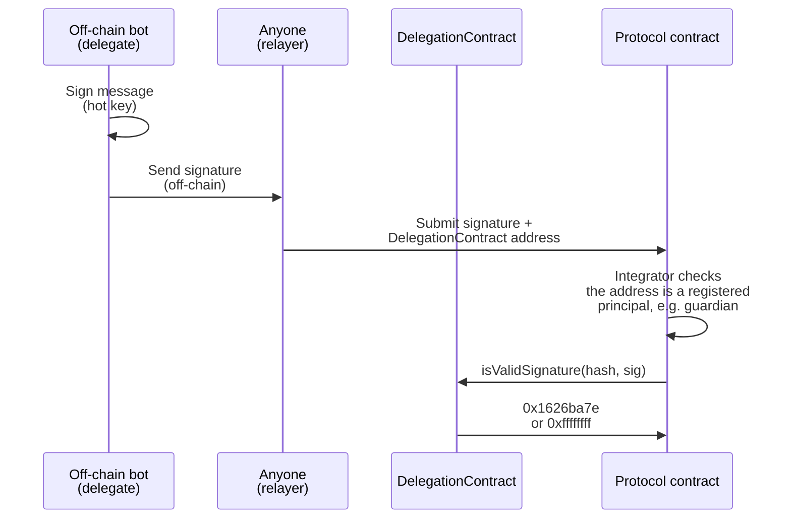
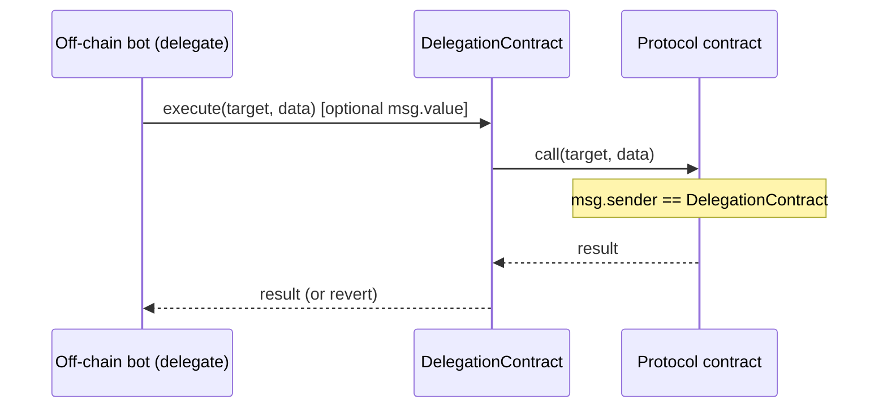

## Simple Summary

This proposal introduces an Execution Delegation Framework (EDF) and adopts it across Lido's Oracle ([AO](https://docs.lido.fi/contracts/accounting-oracle) and [VEBO](https://docs.lido.fi/contracts/validators-exit-bus-oracle)) and [DSM](https://docs.lido.fi/contracts/deposit-security-module) stacks:

1. **Execution Delegation Framework (EDF)** — a general-purpose delegation mechanism for permissioned roles, intended as protocol-recommended infrastructure for off-chain components and broader usage. The protocol grants a permission once to a delegation contract; that contract's owner then chooses and rotates the active hot signing key freely, without a governance vote — a compromised key can be de-authorized by its owner immediately, and a replacement becomes effective after a safety cooldown.
2. **EDF adoption within Oracle and DSM scope** — specifies the concrete off-chain and on-chain changes required to adopt EDF across [Lido Oracle](https://docs.lido.fi/holders/lido-oracle) and [Lido Council Daemon](https://docs.lido.fi/holders/lido-council-daemon) members.

## Abstract

We propose to standardize the Execution Delegation Framework (EDF): a protocol-wide mechanism for delegating the operational keys of permissioned actors. It targets the protocol's off-chain components first, but is suitable for any role whose permissions are exercised by an operator-held key. EDF inserts a factory-deployed, per-entity delegation contract between the protocol and each operator's hot key: governance grants permissions to the delegation contract, while the operator's cold key or multisig controls which hot key is active. The cold key can de-authorize a compromised hot key immediately and bring a replacement after a short safety cooldown or, if the cold key itself is compromised, irreversibly lock the contract. Oracle and Council operators are the first adopters, so that the response to a key compromise can be measured in minutes rather than the ~10 days a governance vote requires today. Beyond incident response, periodic hot-key rotation is itself a valuable security practice, and EDF makes it routine.

Concretely, we propose to deploy a new `DelegationFactory` / `DelegationContract` system (repository: [`lidofinance/delegation-execution-authority`](https://github.com/lidofinance/delegation-execution-authority)), and targeted updates to the [`lido-oracle`](https://github.com/lidofinance/lido-oracle) daemon and [`DepositSecurityModule`](https://docs.lido.fi/contracts/deposit-security-module). The adoption scope specifies the integration points: the `lido-oracle` daemon gains delegation support via a `DELEGATION_CONTRACT_ADDRESS` environment variable, and the `DepositSecurityModule` is updated to verify guardian signatures with a standard ERC-1271 check against the guardian's `DelegationContract` (which implements `isValidSignature`), enabling council members to operate behind delegation contracts. Adoption is mandatory for these roles; a coordinated migration process is defined for existing Oracle and DSM operators to onboard to the new model without service interruption.

## Motivation

Operational compromise is now the dominant cause of losses in the ecosystem. Of the roughly $4 billion lost to Web3 incidents in 2025, about $2.1 billion (~52%) stemmed from access-control and operational-security failures — leaked signing keys, compromised machines, and mishandled signers — against roughly $512 million from smart-contract vulnerabilities ([Hacken 2025 Security Report](https://hacken.io/insights/2025-security-report/)). The largest and least-recoverable losses now come from compromised signers, not flawed code, and the situation is getting [even more noticeable in 2026](https://quantstamp.com/blog/june-security-beat). 

### A standard primitive for permissioned key handling

Today each role handles its signing keys in its own one-off way, and rotating any of them runs through the same heavyweight governance path. Without a shared primitive, every new role re-invents key custody and rotation, and monitoring must learn each role's own conventions — multiplying operational risk. Standardizing delegation as a single, audited mechanism lets any role inherit the same rotation, revocation, and termination semantics, and lets monitoring treat every delegated key uniformly.

EDF improvements unlock:

- **Routine rotation as hygiene.** Periodic hot-key rotation limits the value of any single leaked key and shrinks the window in which an undetected compromise stays useful — a standard operational practice that the governance-gated path makes impractical today.
- **Owners’ setup.** Owners increasingly prefer a multisig (or hard-wallet) over a bare EOA for stronger custody.
- **Future signing-scheme migration.** The signing schemes EDF relies on are not post-quantum safe, and in the future the protocol might need to support such verification. Routing all signature verification through EDF means such a migration needs no protocol change, only a EDF upgrade itself.

### Hot-key operational risk for Oracle and Council operators

Oracle members and Deposit Security Module Committee council members currently operate with hot EOA private keys stored directly in off-chain bots. These keys:

- Carry meaningful protocol off-chain components permissions (report submission, pause/unvet signing, deposit message signing).
- May be long-lived with an unclear custody history.
- Require a full on-chain governance vote (~10 days) to rotate, whether after a compromise or as a routine precaution.

By their very nature, these bots must operate with hot keys: the signing key lives on the machine, which makes it inherently exposed and comparatively easy to compromise. The liability is operational: rotating a hot key today requires a full on-chain governance vote, drawing in the dev team and token holders for what should be routine key management. That cost cuts both ways. It makes proactive, periodic rotation too expensive to do regularly, so keys live longer than they should. And when a key is actually suspected, the replacement is only authorized once the vote executes — leaving the operator to choose between continuing to run on a key it no longer trusts or dropping the seat entirely until governance acts.

EDF removes the governance from rotation. A suspect key is de-authorized immediately and a replacement comes online after a short safety cooldown, turning both routine rotation and incident response into a local operator action measured in minutes rather than the ~10 days a governance vote takes today.


## Specification

### Overview

The release consists of four coordinated changes:

1. Deployment of the `DelegationFactory`, establishing the general-purpose on-chain delegation infrastructure (EDF).
2. An update to the `DepositSecurityModule` contract to verify guardian signatures via the guardian's ERC-1271 `DelegationContract.isValidSignature`, so that Council guardians can operate behind EDF delegation contracts.
3. Modifications to the Oracle and Council daemons' off-chain code to support operating behind delegation contracts.
4. Rotation of all members of Lido Oracle and Lido Council Daemon members to a deployed delegation contract instances.

### Rationale

**Why EDF ships with its adoption scope.** The `DelegationFactory` and `DelegationContract` are inert on their own: without the Oracle and DSM integration they deliver no security benefit. Shipping the contracts together with their adoption scope is what actually closes the hot-key risk in this release rather than deferring it.

**Why a purpose-built own delegation contract rather than reusing an existing solution.** Other delegation frameworks we looked into are far more complex and flexible than this role needs, and that unused flexibility is attack and misconfiguration surface. A minimal, non-upgradeable contract instead makes EDF's guarantees structural — owner can never `execute()` or sign, one active delegate, immediate revocation with a cooldown-gated assignment, irreversible `terminate()` — keeping the audited surface small.

**Why keep cryptography outside the protocol.** All signature verification lives in EDF, so the eventual move to post-quantum signatures means updating only EDF, not the protocol. The protocol just does a generic ERC-1271 check against the delegation contract address and never needs to know how a signature is produced, so a PQ migration stays entirely within EDF.

### Technical Specification

---

#### Part 1: Execution Delegation Framework (EDF) — Contracts

##### Architecture

The delegation layer is composed of two contracts:

- **`DelegationFactory`** — a singleton that deploys a fresh `DelegationContract` per instance. The per-instance `owner` and `cooldown` are constructor arguments stored as Solidity `immutable`s; the initial `delegate` is set in the same constructor.
- **`DelegationContract`** — a non-upgradeable, minimal on-chain delegation contract. It enforces a one-owner / one-active-delegate model and supports two integration patterns described below.

##### Roles

The contract has exactly two trusted entities, **owner** and **delegate**:

| Role         | Custody                         | Capabilities                                                                                                                                      |
|--------------|---------------------------------|---------------------------------------------------------------------------------------------------------------------------------------------------|
| **Owner**    | Safe multisig or cold wallet    | Assign, reassign, and revoke the delegate (`assignDelegate()` / `revokeDelegate()`); irreversibly `terminate()` the contract                      |
| **Delegate** | Hot key in the off-chain daemon | Call `execute()` to dispatch transactions (`push`); sign messages that integrators verify via the contract's ERC-1271 `isValidSignature` (`pull`) |

The owner manages the delegate's lifecycle but can never act *as* the contract. Termination is the escape hatch for owner-key compromise: because `terminate()` is irreversible — it permanently disables `execute()` and clears the delegate — a still-trusted owner can neutralize the contract entirely.

##### Contract Interface

The contract implements [ERC-165](https://eips.ethereum.org/EIPS/eip-165) `supportsInterface`, advertising ERC-1271, [ERC-5313](https://eips.ethereum.org/EIPS/eip-5313), and `IDelegationContract`. The owner is exposed via the ERC-5313 `owner()` view.

```solidity
interface IDelegationFactory {
    /// @notice Deploy a new DelegationContract.
    /// @param owner     The contract's owner, set as a constructor immutable.
    ///                  Fixed for the lifetime of the contract; replacing 
    ///                  the owner requires deploying a new contract.
    /// @param delegate  Initial active delegate, set in the constructor (and
    ///                  effective immediately — the cooldown applies only to
    ///                  later reassignments). Mutable thereafter via
    ///                  assignDelegate(). Pass address(0) to deploy with no
    ///                  delegate.
    /// @param cooldown  Seconds a reassigned delegate waits before becoming
    ///                  effective (see assignDelegate). Set as a constructor
    ///                  immutable; may be 0 to disable the cooldown.
    /// @return instance Address of the newly deployed DelegationContract.
    function deploy(address owner, address delegate, uint256 cooldown)
        external
        returns (address instance);

    /// @notice Emitted for each DelegationContract deployed by the factory.
    event DelegationContractDeployed(
        address indexed instance,
        address indexed owner,
        address indexed delegate,
        uint256 cooldown
    );
}

interface IDelegationContract {
    // --- Owner controls ---

    /// @notice Assign (or reassign) the active delegate.
    ///         Only callable by owner. The new delegate becomes effective only
    ///         after the contract's cooldown (`getCooldown()` seconds, or
    ///         immediately if cooldown is 0). The currently effective delegate
    ///         (if any) stays effective throughout the cooldown and is dropped
    ///         only when the new one activates — so a planned rotation is
    ///         seamless, with no interval lacking an active delegate.
    ///         Reassigning before the cooldown elapses replaces the pending
    ///         delegate and restarts the cooldown; the current one stays
    ///         effective throughout. To drop a (e.g. compromised) delegate
    ///         immediately, use revokeDelegate().
    ///         Reverts if delegate == owner.
    ///         Reverts if the contract is terminated.
    /// @param delegate Address of the incoming delegate.
    function assignDelegate(address delegate) external;

    /// @notice Immediately remove the current and pending delegate. 
    ///         Only callable by owner.
    ///         Reverts if the contract is terminated.
    function revokeDelegate() external;

    /// @notice Terminate the contract, permanently disabling execute(), signature verification via isValidSignature(), and further delegate reassignment via assignDelegate.
    ///         Only callable by owner.
    ///         Also clears the active delegate (as revokeDelegate), so
    ///         getDelegate() returns address(0) after termination.
    ///         Intended for emergency use when the owner is suspected compromised.
    ///         Termination is irreversible.
    ///         Reverts if the contract is already terminated.
    function terminate() external;

    // --- Push integration ---

    /// @notice Execute an arbitrary non-delegate call on behalf of this contract.
    ///         Only callable by the current delegate.
    ///         Reverts if the contract is terminated.
    ///         Reverts if the target call reverts.
    ///         Forwards msg.value to the target to support payable targets.
    /// @param target  Address to call.
    /// @param data    Call data.
    /// @return result Return data from the call.
    function execute(address target, bytes calldata data)
        external
        payable
        returns (bytes memory result);

    // --- Pull integration (ERC-1271) ---

    /// @notice ERC-1271 signature validation. Returns the ERC-1271 magic value
    ///         (0x1626ba7e) if `signature` is a valid signature over `hash`
    ///         by the contract's current *effective* delegate; otherwise
    ///         returns 0xffffffff.
    ///         The delegate is resolved via getDelegate(), so validation
    ///         fails closed when there is no effective delegate (never
    ///         assigned, revoked, or terminated → address(0)).
    ///
    ///         NOTE: unlike a raw ECDSA check, this result is state-dependent
    ///         and revocable — it can return valid at one block and invalid at
    ///         the next (e.g. after the delegate is rotated, revoked, or the
    ///         contract is terminated).
    /// @param hash      Message hash that was signed.
    /// @param signature Opaque signature bytes (ECDSA).
    function isValidSignature(bytes32 hash, bytes calldata signature)
        external
        view
        returns (bytes4 magicValue);

    // --- Interface detection (ERC-165) ---

    /// @notice ERC-165 interface detection. Returns true for the ERC-165,
    ///         ERC-1271 (`isValidSignature`), ERC-5313 (`owner`), and
    ///         `IDelegationContract` interface ids.
    function supportsInterface(bytes4 interfaceId) external view returns (bool);

    // --- Views ---

    /// @notice The contract's owner. Provided as the
    ///         read-only ERC-5313 ownership view so explorers, multisig UIs,
    ///         and generic tooling recognize the controlling party.
    function owner() external view returns (address);

    /// @notice Returns the currently *effective* delegate, or address(0) if
    ///         none. After assignDelegate(), the previously effective delegate
    ///         remains the effective one until the new delegate's cooldown
    ///         elapses; only then does this return the new delegate. Returns
    ///         address(0) when there is no current delegate (never assigned, or
    ///         revoked) and once the contract is terminated.
    function getDelegate() external view returns (address);

    /// @notice Returns the pending (not-yet-effective) delegate and the
    ///         timestamp at which it becomes effective, or (address(0), 0) when
    ///         there is no such pending assignment. Derived from the current
    ///         time: once the cooldown has elapsed (block.timestamp >=
    ///         activeFrom) the scheduled delegate is already effective, so it is
    ///         no longer reported here — this returns (address(0), 0) and
    ///         getDelegate() returns that delegate instead.
    function getPendingDelegate() external view returns (address delegate, uint256 activeFrom);

    /// @notice Cooldown in seconds between assigning a delegate and it
    ///         becoming effective. Set in the constructor (Solidity immutable)
    ///         and unchangeable thereafter.
    function getCooldown() external view returns (uint256);

    /// @notice Returns true if the contract has been terminated.
    function isTerminated() external view returns (bool);

    // --- Events ---

    event DelegateNominated(address indexed newDelegate, uint256 activeFrom);
    event DelegateRevoked(address indexed revokedDelegate);
    event Terminated();
}
```

##### Integration Models

The `DelegationContract` is designed as a **general integration primitive** for any permissioned bot in the Lido ecosystem. Two complementary patterns are supported; protocol integrations should select the one that fits their verification model.

###### Pull Style — ERC-1271 Signature Verification

The `DelegationContract` is itself an **[ERC-1271](https://eips.ethereum.org/EIPS/eip-1271) signer**: it implements `isValidSignature(hash, signature)`. The integrator (protocol) contract treats the `DelegationContract` address as the signing principal and verifies a relayed signature by calling that contract's `isValidSignature(hash, signature)`.

All of the delegation indirection lives inside `isValidSignature`: it resolves the current effective delegate via `getDelegate()` and validates the signature against it. This keeps the integrator **delegation-agnostic**. The contract fails closed: with no effective delegate (never assigned, revoked, or terminated) — `getDelegate()` is `address(0)`.

The integrator must know which `DelegationContract` to check. The address must be relayed alongside the signature, so the signature is bound to a specific delegation contract and the integrator reads the target from the message.



**Security assumptions:**
- The integrator must treat the `DelegationContract` address as the authorized principal: it checks that the supplied `DelegationContract` is a registered entity **and** that `isValidSignature` returns the magic value (`0x1626ba7e`) for a valid signature.
- The signing key must match the effective delegate at the time of on-chain verification. A key rotated (or the contract terminated) after signing but before verification causes `isValidSignature` to reject — failing closed.
- The fail-closed-on-zero-delegate guard lives **inside** `isValidSignature` (it returns the failure value rather than verifying against `address(0)`), so integrators cannot accidentally validate a malformed signature against an unassigned delegate.

Reference implementation of the contract side:

```solidity
bytes4 internal constant EIP1271_MAGIC_VALUE = 0x1626ba7e;
bytes4 internal constant EIP1271_INVALID     = 0xffffffff;

function isValidSignature(bytes32 hash, bytes calldata signature)
    external
    view
    returns (bytes4)
{
    address delegate = getDelegate();   // effective delegate, or address(0)
    // Fail closed when there is no effective delegate (never assigned/revoked/terminated).
    // SignatureChecker: OpenZeppelin's library (utils/cryptography/SignatureChecker.sol).
    if (delegate != address(0) && SignatureChecker.isValidSignatureNow(delegate, hash, signature)) {
        return EIP1271_MAGIC_VALUE;
    }
    return EIP1271_INVALID;
}
```

**When to use:** Any integration where the protocol collects signatures off-chain and verifies them on-chain.

###### Push Style — Transaction Execution via `execute()`

The delegate calls `execute(target, data)` on the `DelegationContract`, which forwards the call to the target protocol contract. From the target's perspective, `msg.sender` is the `DelegationContract` address.



`execute()` is `payable` and forwards `msg.value` to the target. This is required to support future permissioned bots that interact with payable protocol functions where a fee must be paid in ETH at call time.

**Security assumptions:**
- The target contract must verify `msg.sender == DelegationContract` is a registered permission holder.
- The delegate can call any target with any data; the contract does not restrict the call target. Governance must ensure the `DelegationContract` address holds only the narrowest set of permissions needed.
- If the target call reverts, `execute()` reverts atomically and forwarded ETH is returned to the delegate. On a *successful* call, only the current call's change (the unspent portion of `msg.value`) is returned to the delegate before `execute()` returns; pre-existing or force-sent ETH is excluded from this refund.
- The refund is bounded to the current call's balance delta, so a (compromised) delegate cannot use `execute()` to extract ETH that was already sitting on the contract.

**When to use:** Any integration where the bot submits transactions that modify on-chain state and the protocol contract checks `msg.sender` for authorization.

##### Owner Immutability

The owner address is fixed at deployment and **cannot be changed on-chain** — the contract exposes no ownership-transfer function. This is a deliberate security choice: an ownership-transfer call would be the single most damaging action available to a compromised owner, letting an attacker lock the legitimate operator out permanently.

Rotating the owner therefore requires deploying a fresh `DelegationContract` and reassigning the role to the new contract. This also prevents silent transfer of committee participation between organizations and avoids legal ambiguity over who is accountable for the seat.

##### Delegate Assignment and Revocation

Assignment is cooldown-gated; revocation is immediate:

- **Assignment** (`assignDelegate(newHotKey)`) schedules the new delegate, which becomes effective after the contract's `cooldown` elapses (immediately if the cooldown is 0). **The currently effective delegate stays active throughout the cooldown** and is dropped only when the new key activates — so `getDelegate()` returns the old key right up until the new one takes over, and a routine rotation has no gap. Activation is **not** a separate transaction: there is no stored "active" flag flipped at `activeFrom`. Instead the schedule (`pending`, `activeFrom`) is kept in storage and the views resolve the effective key from the current time — `getDelegate()` returns the scheduled key once `block.timestamp >= activeFrom`, and `getPendingDelegate()` stops reporting it at the same instant. Reassigning *before* the cooldown elapses replaces the pending key and restarts the cooldown, with the current key staying effective throughout. Reassigning *after* it has matured first **settles** the matured key as the current delegate (the next state-changing call folds the scheduled key into `current` before applying its own change), so a later rotation keeps the matured key effective during the new cooldown and never reverts to an earlier key. The cooldown is a reaction window: an unexpected assignment (e.g. from a compromised owner) is visible via the `DelegateNominated` event and `getPendingDelegate()` for `cooldown` seconds before the new key can act — while the previous key keeps operating the seat — so monitoring and governance can react before any swap takes effect.
- **Revocation** (`revokeDelegate()`) is immediate and clears both the current and any pending delegate, leaving the contract with no delegate until a new one is assigned and its cooldown elapses.

The cooldown is set in the constructor and cannot change; it may be 0.

##### Emergency Termination

The owner may call `terminate()` to permanently disable the contract's `execute()` function; it also clears the active delegate (equivalent to `revokeDelegate()`) as part of the same call. This is an **irreversible** operation: a terminated contract cannot be reactivated. After termination:

- All delegate calls to `execute()` revert.
- All state-changing owner methods (`assignDelegate()`, `revokeDelegate()`, and `terminate()` itself) also revert — no owner method remains callable after termination.
- `getDelegate()` returns `address(0)`, so any pull-style integrator that resolves the active delegate through it (to verify a signature) fails closed and does not keep trusting the last delegate.
- A new `DelegationContract` must be deployed and the role must be reassigned to the new address.

Termination is intended for scenarios where the owner believes the owner's own address has been compromised and wishes to ensure no further actions can be taken under its authority.

##### Hot-Key Rotation

For a **planned** rotation the owner calls `assignDelegate(newHotKey)`. The previous key keeps operating until the new key becomes effective after the cooldown, so the rotation is seamless.

The specific cadence for routine rotation is not mandated here; recommended practices will be maintained on the Lido research forum and may be revised. Contract-level requirements are:

- On any suspected or confirmed hot-key compromise, the owner must call `revokeDelegate()` to drop the key **immediately**. 
- A replacement is then assigned with `assignDelegate(newHotKey)` and becomes effective after its cooldown.
- After assignment, the operator updates the daemon configuration.

##### Owner Address Requirements

The owner is the critical security boundary of the delegation model. The principles below apply; the detailed operational requirements — hardware-wallet models, multisig quorums — are maintained in a dedicated "Key Handling Policy" document on the Lido research forum.

**Strongly recommended: Safe (Gnosis Safe) multisig.** Safe is the preferred owner implementation because it is battle-tested at Lido scale and its upgrade path is expected to include post-quantum (PQ) signature support — an assumption this design explicitly relies on. A Safe-based owner should be upgradeable to PQ-compatible signing without replacing the multisig address or requiring a governance vote for the delegation contract.

---

#### Part 2: EDF Adoption — Oracle and DSM Integration

This section defines which components are migrated to the delegation model in this release, the concrete changes required for each, and the operator migration process. Adoption is mandatory for Oracle and DSM roles.

##### Scope of Migration in This Release

| Component                              | Integration style                                                                                                                                                                                                                           |
|----------------------------------------|---------------------------------------------------------------------------------------------------------------------------------------------------------------------------------------------------------------------------------------------|
| Lido Oracle                            | Push (`execute()`)                                                                                                                                                                                                                          |
| `DepositSecurityModule` contract       | Both — pull (ERC-1271 `isValidSignature` check against the guardian's `DelegationContract`, the only path for `depositBufferedEther`) and push (direct `msg.sender == DelegationContract` call, `pauseDeposits`/`unvetSigningKeys` only)    |
| Council daemon                         | Push, for pause and unvetting — calls DSM directly via its `DelegationContract`'s `execute()`. Pull, for deposits — signs the DSM message and publishes its `DelegationContract` address with each signature for the depositor bot to relay |
| Depositor bot                          | Pull — claims the council-provided `(signature, DelegationContract address)` pairs for deposits; re-sorts the deposit array by delegation contract address. See DSM section below                                                           |
| Pauser / unvet bots                    | Pull — relay a council-signed `GuardianSignature` for `pauseDeposits`/`unvetSigningKeys` as an alternative to the daemon's direct push call. See DSM section below                                                                          |
| Validator ejector (node-operator side) | Off-chain only — must resolve the active delegate via `getDelegate()`. See Validator Ejector section below                                                                                                                                  |

All components in the table are migrated together.

---

###### Oracle Daemon — Push Integration

**Pattern:** Push via `execute()`.

**Authorization model:** `HashConsensus` and the report processors (`AccountingOracle`, `ValidatorsExitBusOracle`, CM's `FeeOracle`, and CSM's `FeeOracle`) check `msg.sender` against the registered oracle committee member set. After migration, `msg.sender` is the `DelegationContract` address, which governance must have registered as the committee member.

**Daemon configuration:** `DELEGATION_CONTRACT_ADDRESS` environment variable. When set, all oracle contract calls are routed through `DelegationModule`, a Web3py extension that wraps `execute()` dispatch. Startup validation checks: (a) `getDelegate() == configuredHotKey`, and (b) `delegationContract` address holds oracle committee membership in `HashConsensus`.

**Transitional behavior:** When `DELEGATION_CONTRACT_ADDRESS` is unset, calls are sent directly from the hot key EOA as before. This path exists for development, for the migration window, and as a long-term fallback.

---

###### DSM Contract — Push and Pull Integration

**Pattern:**
- **Pull — the only path for `depositBufferedEther`, and one path for `pauseDeposits`/`unvetSigningKeys`.** DSM verifies each signature against the supplied guardian with a standard ERC-1271 `isValidSignature` check over a digest **bound to that guardian**.
- **Push — the other path for `pauseDeposits`/`unvetSigningKeys` only.** A guardian's `DelegationContract` calls DSM directly via `execute()`; DSM authorizes the action from `msg.sender == DelegationContract` (see Direct guardian calls below).

**Authorization model today.** `DepositSecurityModule` does **not** take the guardian address as an input — it *derives* it: every verification path calls `ECDSA.recover(msgHash, sig.r, sig.vs)` and looks the recovered EOA up in the guardian set via `_isGuardian`.

**Required change — the guardian address must be supplied with the signature.** A contract guardian cannot be recovered from a signature, so the submitter provides the registered guardian address **explicitly alongside each signature**. Every guardian is a `DelegationContract` — EOA guardians are no longer supported — and DSM verifies the signature **through that contract's** [ERC-1271](https://eips.ethereum.org/EIPS/eip-1271) `isValidSignature(hash, sig)`, requiring the `0x1626ba7e` magic-value return.

```solidity
// Per-signature payload: the registered guardian plus an opaque signature blob.
struct GuardianSignature {
    address guardian;    // registered guardian
    bytes   signature;   // opaque blob, forwarded to the guardian's ERC-1271 isValidSignature
}

function _isValidGuardianSignature(
    address guardian,
    bytes32 msgHash,
    bytes calldata signature
) internal view returns (bool) {
    if (!_isGuardian(guardian)) return false;

    // verify via isValidSignature, which resolves the effective delegate and fails
    // closed (returns a non-magic value) if there is none.
    return IERC1271(guardian).isValidSignature(msgHash, signature) == EIP1271_MAGIC_VALUE;
}
```

**Binding the digest and rejecting duplicate guardians.** The signer (a delegate) is no longer the same address as the guardian being counted, so an unbound signature would validate for *every* guardian currently delegating to that signer. The signed digest therefore binds the guardian address, added to the existing chain id / DSM address / action-type prefix (`keccak256(ATTEST_MESSAGE, block.chainid, address(this))`). DSM also rejects a repeated guardian by requiring the batch to be strictly ascending by guardian address, which rejects both an unsorted array and any duplicate in one comparison:

```solidity
// Digest now binds the guardian; the prefix already binds chainId/DSM/action.
function _hashDepositMessage(address guardian, /* ...existing fields... */)
    internal view returns (bytes32)
{
    return keccak256(abi.encodePacked(
        ATTEST_MESSAGE_PREFIX, guardian,
        blockNumber, blockHash, depositRoot, stakingModuleId, nonce
    ));
}

// The loop below runs inside _verifyAttestSignatures (the signature verification path).
address prevGuardian;
for (uint256 i = 0; i < sortedGuardianSignatures.length; ++i) {
    GuardianSignature calldata gs = sortedGuardianSignatures[i];

    bytes32 msgHash = _hashDepositMessage(gs.guardian, /* ...existing fields... */);
    // _isValidGuardianSignature checks _isGuardian + the guardian's ERC-1271 signature.
    if (!_isValidGuardianSignature(gs.guardian, msgHash, gs.signature)) revert InvalidSignature();

    // Distinct guardians: strictly ascending by guardian address.
    if (gs.guardian <= prevGuardian) revert GuardiansNotSortedOrDuplicate();
    prevGuardian = gs.guardian;
}
```

The submitter must sort the batch by **guardian address** to satisfy the ascending check.

**Affected DSM entry points:** each `Signature` / `Signature[]` argument is extended to carry the guardian address as above:

```solidity
function depositBufferedEther(
    uint256 blockNumber,
    bytes32 blockHash,
    bytes32 depositRoot,
    uint256 stakingModuleId,
    uint256 nonce,
    bytes calldata depositCalldata,
    // Changed in LIP-37, was Signature[] before
    GuardianSignature[] calldata sortedGuardianSignatures
) external;

function pauseDeposits(
    uint256 blockNumber,
    // Changed in LIP-37, was Signature before
    GuardianSignature calldata sig
) external;

function unvetSigningKeys(
    uint256 blockNumber,
    bytes32 blockHash,
    uint256 stakingModuleId,
    uint256 nonce,
    bytes calldata nodeOperatorIds,
    bytes calldata vettedSigningKeysCounts,
    // Changed in LIP-37, was Signature before
    GuardianSignature calldata sig
) external;
```

**Direct guardian calls.** `pauseDeposits` and `unvetSigningKeys` also support a path where a guardian calls DSM **directly**, authorizing the action via `msg.sender` instead of a relayed signature. Under delegation this path must accept the `DelegationContract` as `msg.sender` — i.e. the delegate dispatches the call through the contract's `execute()` (push), so DSM sees `msg.sender == DelegationContract` and authorizes it as the registered guardian. In other words, these two methods support both integration styles: pull (relayed `GuardianSignature` verified via the guardian's ERC-1271 `isValidSignature`) and push (`msg.sender` is the guardian's `DelegationContract`). `depositBufferedEther` is signature-only and has no direct path.

**No EOA-guardian path.** The redeployed DSM does not retain the legacy ECDSA-against-an-EOA verification: every registered guardian must be a contract that supports ERC-1271.

**`addGuardian` checks ERC-1271 at registration.** `addGuardian` is extended to check, via [ERC-165](https://eips.ethereum.org/EIPS/eip-165) `supportsInterface`, that the incoming guardian address advertises the ERC-1271 interface id before adding it to the guardian set.

```solidity
function addGuardian(address guardian, uint256 newQuorum) external {
    if (!IERC165(guardian).supportsInterface(type(IERC1271).interfaceId)) {
        revert GuardianDoesNotSupportERC1271();
    }
    // ...existing add-to-set and quorum-update logic...
}
```

**Contract version bump.** Because `depositBufferedEther`, `pauseDeposits`, and `unvetSigningKeys` change a signature format — each `Signature` / `Signature[]` argument becomes `GuardianSignature` / `GuardianSignature[]` — this is a breaking interface change, so the redeployed contract bumps `VERSION` to `5`.

---

###### Council Daemon — Push and Pull Integration (Signer Side)

**Pattern:**
- **Deposits — pull.** The daemon signs the DSM message off-chain using the **delegate hot key**; the depositor bot aggregates these signatures from the guardian quorum and submits them to DSM, which verifies each one via a standard ERC-1271 check against the guardian's `DelegationContract`.
- **Pause and unvetting — push.** The daemon's primary path for `pauseDeposits`/`unvetSigningKeys` is a direct call dispatched through its `DelegationContract`'s `execute()`; DSM authorizes it from `msg.sender == DelegationContract`.
- **Pause and unvetting — pull.** An alternative to the direct push call: the daemon signs the DSM message off-chain and a pauser/unvet bot relays it as a `GuardianSignature`; DSM verifies it the same way as for deposits, via the guardian's ERC-1271 `isValidSignature`.

The council daemon produces ECDSA signatures over the DSM message using the **delegate hot key**. The digest now **binds the daemon's own guardian address** (its `DelegationContract`) in addition to the existing message fields, so the daemon signs the guardian-bound message.

**Required change to the council daemon:** Sign with the delegate private key, set `DELEGATION_CONTRACT_ADDRESS`, and publish that `DelegationContract` address together with each signature.

**Required change to the depositor bot:** The bot relays the council-provided `(DelegationContract address, signature)` pairs to DSM as-is. Two behavioral changes are required:

1. **Filtering (on receival):** accept an incoming message only if its signer is the **current delegate** of the referenced guardian's `DelegationContract` (resolved via `getDelegate()`), instead of matching against a delegation-contract address. Messages signed by a rotated-out key are dropped.
2. **Ordering (on submission):** when assembling `depositBufferedEther`, sort the signature array by **guardian address**, matching DSM's strictly-ascending-by-guardian check.

---

###### Validator Ejector (Node-Operator Side) — Off-Chain Update

The **validator ejector** is the off-chain daemon run by each node operator that watches `ValidatorsExitBusOracle` (VEBO) — the oracle that publishes which validators must exit — and broadcasts the corresponding signed voluntary-exit messages to the consensus layer.

To accept those messages the ejector keeps an **allowlist** of trusted oracle signing addresses. Oracle messages are always signed by the **delegate EOA**, never by the `DelegationContract`, so the allowlist must contain the **delegate EOA** and be refreshed to the new EOA whenever the delegate is rotated.

---

##### Operator Migration Process

Migration is designed to be zero-downtime. All preparatory steps are completed off the critical path, leaving a single irreversible governance vote that flips every prepared seat to delegation at once.

1. **Deploy and configure contracts (operators)**: each operator deploys its `DelegationContract` via `DelegationFactory.deploy(ownerAddress, hotKey, cooldown)` — the owner being a Safe multisig, fixed for the contract's lifetime (see Owner Immutability in Part 1); the active delegate (its existing hot key) set in the same transaction; and a `cooldown` set according to policy for both Oracle and DSM services.
2. **Publish and verify addresses (operators)**: each operator publishes its `DelegationContract` and owner addresses on the Lido research forum, so the DAO and other operators can verify them ahead of the vote.
3. **Prepare daemons for rotation (operators)**: each operator stages the delegate key and the `DELEGATION_CONTRACT_ADDRESS` configuration in its Oracle and Council daemons, so they are ready to operate via the delegation contract the moment the seat is reassigned. No key material changes, and the daemons keep operating from the hot EOA until the vote lands.
4. **Set up monitoring (Lido team)**: the Lido team registers every delegation contract in the monitoring infrastructure and begins watching the owner and delegate addresses for unexpected activity, so anomalies are caught both before and after the seat reassignment.
5. **Governance vote**: a single DAO vote reassigns each Oracle committee and DSM guardian seat from the operator's hot EOA to its `DelegationContract` address — a `HashConsensus` member update for oracles, a `DepositSecurityModule` guardian replacement for guardians; the pre-configured daemons begin routing through the delegation contract without interruption.

Until the governance vote in step 5 executes, operators continue to run as EOA principals on the existing (pre-migration) contracts, which keeps them online throughout preparation. After the vote, each operator confirms the switchover via `getDelegate()` and a successful report or guardian message in the following frame, and may rotate the hot key at any time via `assignDelegate()` with no further governance vote.

### Deployment Summary

**Newly deployed:**

| Contract                           | Deployed by                    | Notes                                                                                                                    |
|------------------------------------|--------------------------------|--------------------------------------------------------------------------------------------------------------------------|
| `DelegationFactory`                | deployer                       | Single new deployment establishing the EDF infrastructure.                                                               |
| `DelegationContract` (one per bot) | each operator, via the factory | One instance per Oracle/Council bot; deployed during the operator migration (Part 2), not by a single governance action. |

**Redeployed at a new address:**

| Contract                | Repointing required                 |
|-------------------------|-------------------------------------|
| `DepositSecurityModule` | Update the `LidoLocator` reference. |

## Links

- Delegation contracts repository (`lidofinance/delegation-execution-authority`): https://github.com/lidofinance/delegation-execution-authority
- Oracle daemon (`lidofinance/lido-oracle`): https://github.com/lidofinance/lido-oracle
- Core repository (`lidofinance/core`, contains `DepositSecurityModule`): https://github.com/lidofinance/core

## Copyright

Copyright and related rights waived via [CC0](https://creativecommons.org/publicdomain/zero/1.0/).

<!-- my python
                           (o)(o)
                          /     \
                         /       |
                        /   \ .. |
          ________     /    /\__/
  _      /        \   /    /   \\
 / \    /  ____    \_/    /
//\ \  /  /    \         /
V  \ \/  /      \       /
    \___/        \_____/
-->
