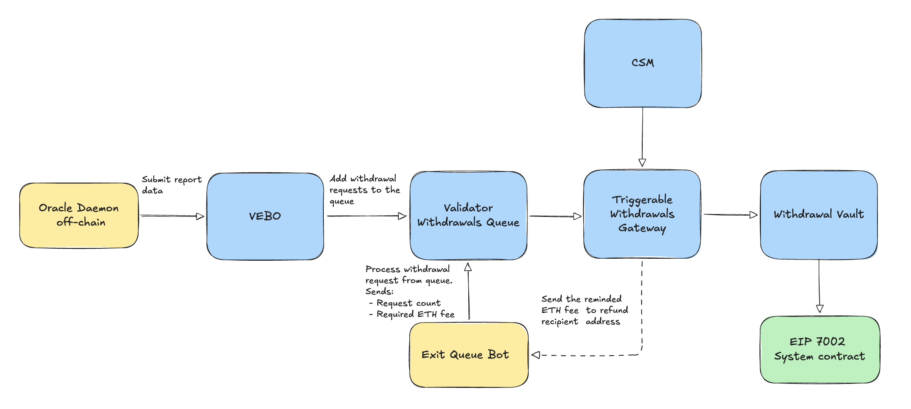
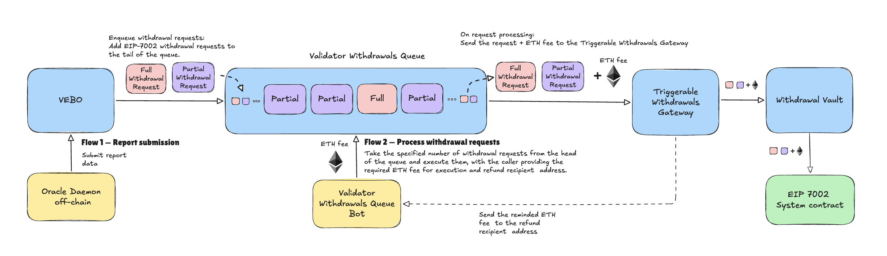

## Simple Summary

This proposal redesigns the Validators Exit Bus Oracle (VEBO) around **EIP-7002 execution-layer withdrawal requests**. It also introduces **Active Rebalancing** — a controlled way to reduce excess stake at Node Operators without waiting for organic inflows and outflows.

1. **VEBO-7002** — VEBO replaces Node-Operator-supplied pre-signed exit messages and the Ejector with EIP-7002 partial withdrawal requests (PWRs) and full withdrawal requests (FWRs) as the primary exit mechanism. This enables precise, partial stake exits from `0x02` validators, reduces unproductive stake time, shortens withdrawal finalization, and simplifies the protocol by removing several legacy components.
2. **Active Rebalancing** — a controlled, rate-limited way for the protocol to forcibly move stake toward a target distribution by requesting additional withdrawals from over-target Curated Module v2 (CMv2) operators, reusing the same withdrawal-based flow introduced by VEBO-7002.

## Abstract

We propose to rework the Validators Exit Bus Oracle ("VEBO-7002") across its on-chain and off-chain parts.

**On-chain**, we add a new **`ValidatorWithdrawalsQueue` contract** that stores a **FIFO queue** of withdrawal request intentions (partial and full), appended by the VEBO on each Oracle report. Anyone can call a public function on the queue to process requests in order and send them to the EIP-7002 predeploy. An `enablePartialWithdrawals` / `disablePartialWithdrawals` switch on the VEBO lets the protocol turn partial withdrawals off, reverting to FWR-only operation (that could be fulfilled through a Validator Ejector) under extreme EIP-7002 fee conditions.

**Off-chain**, we rework the exit-ordering logic so it selects both which validators to exit and the withdrawal amount per validator. This adds support for **partial withdrawal requests** — preferring PWRs against `0x02` validators and falling back to FWRs where PWRs are not applicable — and for **Active Rebalancing**: additional, rate-limited exits against CMv2 operators whose `currentStake` exceeds their `targetStake`, moving the module toward its target distribution.

This redesign also removes components made redundant by the new flow: late-exit penalties and proofs to trigger full withdrawal requests.

## Motivation

### Limitations of the current VEBO

The current VEBO depends on Node Operators uploading pre-signed validator exit messages and on Ejector software to broadcast them. This design has these limits:

- **Full exits only.** The flow exclusively supports full validator exits.
- **Limited upload capacity.** Only some pre-signed exit messages can be uploaded for each Node Operator. This limits the harm if an operator's signing system is compromised, but also limits how many and which validators the Ejector can exit.
- **Operational overhead.** Every Node Operator must run and secure dedicated Ejector software, and the protocol must verify that they do.
- **Limited exit selection.** Because VEBO can request only specific pre-signed keys, it is hard to optimize the exit order, reduce sweep delay, or target an exact amount of stake.

### Why withdrawal-based exits

EIP-7002 lets the protocol trigger withdrawals from the execution layer using validators' `0x01` and `0x02` withdrawal credentials. Building VEBO around PWRs and FWRs:

- Allows **precise stake exit** from `0x02` validators in CMv2 using partial withdrawals, leaving the validator active.
- **Eliminates unproductive stake time** — ETH keeps earning rewards right up until a withdrawal is processed, with no idle time behind a queued full exit waiting for the sweep to reach the exited validator.
- Enables **full exits** via EIP-7002 without unfolding a VEBO report.

### Why active rebalancing

Today, stake redistribution across Node Operators and modules happens only through organic inflows (new deposits) and outflows (withdrawal demand). When a module or an individual operator drifts above its target stake, there is no protocol-level lever to correct it on a controlled schedule. For CMv2 we need a mechanism that can deliberately move the module toward its target distribution while staying compatible with the regular withdrawal and deposit flow. The withdrawal-based VEBO-7002 flow makes such a mechanism natural to express: rebalancing is simply additional, rate-limited exit demand against over-target operators.

## Specification



### Overview

1. **Off-chain Oracle computes exit demand in three sequential phases.**
    - Phase 1 — cover regular **withdrawal-queue demand**.
    - Phase 2 — issue **forced validator exits**.
    - Phase 3 — add **active rebalancing** within CMv2. Phase 3 is optional and can be switched off (leaving only Phases 1–2).
2. **The Oracle reports the ordered withdrawal request intentions on-chain, where they are appended to a single FIFO queue in the `ValidatorWithdrawalsQueue` contract.**
3. **Anyone can execute queued intentions.** A permissionless handle on the `ValidatorWithdrawalsQueue` pops them one by one and submits each as an actual partial (PWR) or full (FWR) withdrawal request to the EIP-7002 predeploy, paying the per-request fee.

An **`enablePartialWithdrawals` / `disablePartialWithdrawals` switch** can turn partial withdrawals off, making VEBO create FWRs only. `ExitRequested` events for FWRs let an Ejector fulfill them through voluntary exits without EIP-7002 fees.

### Rationale

#### Single FIFO queue

Withdrawal request intentions (both PWRs and FWRs) are stored in a single FIFO queue — held by the dedicated `ValidatorWithdrawalsQueue` contract — and processed in submission order, each becoming an actual EIP-7002 withdrawal request only once executed (see [Flow 2](#flow-2--process-withdrawal-requests)). We chose this model because:

- **Simplicity.** One queue is simple to process on-chain and does not need separate concurrency controls.
- **Safety with public execution.** The Oracle report fixes the order and the `ValidatorWithdrawalsQueue` enforces it, which limits interference by public callers and removes the possibility of [FWR-replay DDoS](https://github.com/lidofinance/lido-improvement-proposals/blob/develop/LIPS/lip-30.md#61-attack-vector-vulnerability-from-uncontrolled-creation-of-twrs).

The trade-offs are:

- **No skipping.** Requests must run in order. A request that is no longer valid must still run before the queue can move forward. We do not add a skip function because it would add on-chain complexity. This assumption holds only while EIP-7002 fees are low; the FWR-only fallback does not remove already queued PWRs.
- **No choice at execution time.** Because the order is fixed, the executor cannot optimize it later, for example to reduce FWR sweep delay. This is acceptable because CMv2 should mostly use PWRs. CSM instances (`0x01` and `0x02`) do not support PWRs because of their FIFO stake-distribution mechanism and the need for a key to remain fully bonded.
- **PWR/FWR concurrency.** PWRs and FWRs share the same EIP-7002 throughput. VEBO manages this through ordering and batching. They can also conflict for one validator: a pending PWR blocks a later FWR, and the later request is rejected by the CL and must be sent again (see [Shared iterator mechanics](#shared-iterator-mechanics) and [Security Considerations](#security-considerations)).

#### Deprecating the Ejector as the primary tool

The Ejector cannot process PWRs, and the new system expects few FWRs. Historical mainnet data shows that EIP-7002 fee spikes are short and end before VEBO could react. With fewer validators and no planned reduction in EIP-7002 throughput, request fees should remain reasonable. The Ejector therefore becomes a **fallback**, used only when `disablePartialWithdrawals()` enables FWR-only operation.

#### From validator-count limits to balance-based limits

We are updating the `TriggerableWithdrawalsGateway`. Its rate limiter becomes **balance-based**: it bounds the total ETH extracted per frame. Each request is weighed by how much stake it actually withdraws — `amountGwei` for a PWR, or the validator's max effective balance by WC type (32/2048 ETH) for an FWR.

### Technical Specification

The design splits cleanly along the oracle boundary:

- **Off-chain Oracle** owns all *ordering* logic — which module, which Node Operator, and which validator keys (with what amounts) should exit next, and all active-rebalancing decision-making. It produces the per-report list of withdrawal request intentions.
- **On-chain** protocol side — a thin set of primitives that:
    - ingests the Oracle report and appends its withdrawal request intentions to the single FIFO queue held by the new `ValidatorWithdrawalsQueue` contract;
    - exposes a permissionless handle on the queue to execute queued intentions, turning each into an actual withdrawal request against the EIP-7002 contract;
    - enforces the exit limits (TWG rate limit on extracted balance);
    - enforces the configurable rebalancing bounds (rate limit, thresholds);
    - holds partial withdrawal requests off/on switch (full withdrawal requests only mode);

#### Off-chain Oracle: ordering and rebalancing logic

Per report, the Oracle produces the ordered list of withdrawal request intentions. It runs the exit-order iterator ([`exit_order_iterator.py`](https://github.com/lidofinance/lido-oracle/blob/f352b8552b717ebf8ecaf3bd0f5cf6785909ec17/src/services/exit_order_iterator.py#L106)) — generalized from "pick the next validators to fully exit" to "pick the next validators and the amount (PWR/FWR) to withdraw" — across **three sequential phases**, each with its own demand source.

##### Shared iterator mechanics

All three phases reuse the same machinery. Two governance-tunable parameters drive it, both stored in the `OracleDaemonConfig` smart contract so they can be changed without an Oracle release:

- **`EXIT_ITERATION_CHUNK`** (default **32 ETH**) — the fixed unit of demand the iterator allocates per step.
- **`MIN_PARTIAL_WITHDRAWAL`** (default **2 ETH**) — the minimum withdrawable balance a validator must have above the min-effective-balance floor to serve a PWR, and the lower bound of any single PWR.

**Iteration granularity.** The iterator processes exit demand in fixed `EXIT_ITERATION_CHUNK` (32 ETH) steps. Each step gives one chunk of demand to the highest-ranked operator and one of its validators, then ranks again. This keeps the order balanced across operators. A chunk becomes a PWR of up to `EXIT_ITERATION_CHUNK` from a `0x02` validator, or an FWR.

**PWR vs. FWR threshold.** A validator can serve a PWR only when it can give up enough balance while keeping the min-effective-balance floor. If **no** validator for the highest-ranked Node Operator has more than `MIN_PARTIAL_WITHDRAWAL` (2 ETH) available above that floor, the Oracle uses an **FWR** for the highest-ranked validator. Otherwise, it takes a partial withdrawal of `[MIN_PARTIAL_WITHDRAWAL, EXIT_ITERATION_CHUNK]` (2–32 ETH) in that iteration step. More than one step can select the same validator in one report. These allocations are combined into one PWR intention, so the final PWR can be larger than `EXIT_ITERATION_CHUNK`.

**No FWR over an unprocessed PWR.** The Oracle MUST NOT issue an FWR for a validator that has an unprocessed PWR, including one still in the FIFO queue. It can use an FWR only in a later report, after the PWR has executed on the CL. See [Security Considerations](#security-considerations).

**Per-report exit limit.** The iterator stops adding requests when the report's total exit balance (`max_current_exit_balance`) reaches the per-report limit. All three phases share this limit. Requests are weighed with the **same formula as the on-chain TWG limiter** — `amount` for a PWR, max effective balance by WC type (32/2048 ETH) for an FWR; see [rate limiter invariants](#triggerablewithdrawalsgateway-twg).

##### Phase 1 — Cover withdrawal-queue demand

Phase 1 covers the current **withdrawal-queue (WQ) demand**, preferring PWRs over full exits where possible. It walks that demand in `EXIT_ITERATION_CHUNK` steps, ranking validator at each step by, in order:

1. **Forced-exit deviation** — operators over a force-exit limit first, by how far `currentValidators − targetValidators` exceeds the threshold.
2. **Soft-exit deviation** — same idea for soft-exit limits, after forced exits.
3. **Module share-rate deviation** — modules above their `priority_exit_share_threshold` (relative to total protocol balance) get elevated priority.
4. **Target-stake deviation** — operators furthest **above** their target stake exit first, where `targetStake = moduleStake × operatorWeight / moduleTotalWeight`. Operator weights come from [LIP-35](lip-35.md): read on-chain via `getOperatorWeights` for CMv2, aggregated via the Meta Registry for CMv1, and a uniform baseline weight elsewhere.
5. **Already-requested validators** — validators that already have PWR demand allocated to them **within this report** rank first, but only while their remaining balance stays above `MIN_ACTIVATION_BALANCE`. This concentrates exited balance into as few validators as possible, taking more balance from one validator before moving to the next.
6. **Biggest validator first** — among the operator's validators, prefer the one with the **largest balance**. This maximizes the balance a single PWR can extract while leaving the validator active, favoring partial over full withdrawals.
7. **Lowest validator index** — within an operator, ascending validator index.

##### Phase 2 — Forced validator exits

After WQ demand is covered, the iterator satisfies any **forced-exit obligations**.

1. **Forced-exit deviation** — operators over a force-exit limit first, by how far `currentValidators − targetValidators` exceeds the threshold.
2. **Lowest validator index** — within an operator, ascending validator index.

##### Phase 3 — Active rebalancing

This phase applies **only to the CMv2 staking module** and adds exit demand against operators drifting above their target stake, pushing the module back toward its target distribution.

**Data model.** Phase 3 (and Phase 1 criterion 4) uses the following definitions:

- **`operatorWeight` / `moduleTotalWeight`** — CMv2 operator weights introduced in [LIP-35](lip-35.md), read on-chain via `getOperatorWeights`. `moduleTotalWeight` is the sum of weights over operators participating in the calculation, **excluding** operators inside the grace period (see the grace period below).
- **`targetStake`** = `moduleStake × operatorWeight / moduleTotalWeight`, where `moduleStake` is the total balance of CMv2 validators at the report's refSlot, **excluding** operators inside the grace period.
- **`currentStake`** — the operator's active validator balance at `refSlot`, after reserving all in-flight withdrawals. For a PWR, reserve its requested amount. For an FWR, reserve the validator's balance at `refSlot`. In-flight requests include `ValidatorWithdrawalsQueue` FIFO entries and requests pending on the CL (`pending_partial_withdrawals` for PWRs).
- **Request types.** All CMv2 validators use `0x02` credentials; rebalancing prefers PWRs but **may issue an FWR** where a partial withdrawal cannot serve the demand.

| `OracleDaemonConfig` key                | Type        | Meaning                                                                                                                              |
|-----------------------------------------|-------------|--------------------------------------------------------------------------------------------------------------------------------------|
| `ACTIVE_REBALANCING_ENABLED`            | bool        | Global on/off for Phase 3.                                                                                                           |
| `ACTIVE_REBALANCING_RATE_LIMIT`         | uint (ETH)  | Max stake that may exit for rebalancing in one VEBO report.                                                                          |
| `ACTIVE_REBALANCING_OPERATOR_EXCESS_BP` | uint (bp)   | Operator-level trigger: `currentStake` over `targetStake` as a share of `targetStake`.                                               |
| `ACTIVE_REBALANCING_MODULE_EXCESS_BP`   | uint (bp)   | Module-level trigger: the sum of over-target stake across all operators as a share of total module stake.                            |
| `ACTIVE_REBALANCING_GRACE_PERIOD`       | uint (days) | Days since the first key deposit before an operator counts toward `moduleStake`/`moduleTotalWeight` and participates in rebalancing. |

**Trigger.** Phase 3 requires `ACTIVE_REBALANCING_ENABLED` to be set, and runs when **one or more** of the following conditions holds:

1. **Operator-level** — at least one operator's `currentStake` exceeds `targetStake × (1 + ACTIVE_REBALANCING_OPERATOR_EXCESS_BP / 10,000)`;
2. **Module-level** — the sum of stake above target stake across all operators within the module exceeds a defined percentage of the total module stake.
   `Σ max(0, currentStake − targetStake) > moduleStake × ACTIVE_REBALANCING_MODULE_EXCESS_BP / 10,000`
   (summed over operators outside the grace period).

While neither condition holds, Phase 3 stays dormant, so small temporary differences do not create exit churn.

A **new-operator grace period** applies: an operator whose first key was deposited less than `ACTIVE_REBALANCING_GRACE_PERIOD` days ago is **excluded from the rebalancing calculation entirely** — its balance does not count toward `moduleStake`, its weight does not count toward `moduleTotalWeight`, and it is neither ranked nor targeted by rebalancing exits. Grace-period operators remain eligible to receive deposits via the normal deposit allocation.

**Bounds.** The total rebalancing stake added to the report is capped at `ACTIVE_REBALANCING_RATE_LIMIT` and by the remaining shared per-report exit limit. Rebalancing reduces excess stake; it does not guarantee that the withdrawn ETH is redeposited or that it reaches a specific under-target operator. That depends on future withdrawal demand, available buffer ETH, and the normal deposit-allocation rules.

**Ordering.** When it runs, the iterator ranks over-target CMv2 operators by, in order:

1. **Target-stake deviation** — node operators rank by the deviation `currentStake − targetStake`; the operator furthest **above** target ranks first.
2. **Already-requested validators** — validators with PWR demand already allocated **within this report** rank first, concentrating exited balance into as few validators as possible.
3. **Biggest validator first** — prefer the largest-balance validator so exits stay partial and keep the validator active.
4. **Lowest validator index** — within an operator, ascending validator index.

#### On-chain Oracle

On-chain, the protocol takes the Oracle's ordered withdrawal request intentions and turns them into EIP-7002 withdrawals. This happens in **two flows**:

- **Report submission** — the Oracle submits a packed report; each intention is decoded and appended to a single FIFO queue.
- **Execute withdrawal requests** — a permissionless handle pops queued intentions and pushes each down the request path to the EIP-7002 predeploy, where it becomes an actual withdrawal request:



##### Flow 1 — Report submission

```
Oracle daemon  ->  ValidatorsExitBusOracle  ->  ValidatorWithdrawalsQueue (FIFO)
report submission     report limits                  enqueue requests 
```

The Oracle calls `submitReportData` with the existing `ReportData` structure: a `dataFormat` selector and a `data` blob of fixed-width records packed together. It introduces a **new `dataFormat` version** whose record carries the withdrawal **amount**. The current record (`DATA_FORMAT_LIST_WITH_KEY_INDEX = 2`, introduced in [LIP-35](lip-35.md)) is 72 bytes; the new record appends an 8-byte `amount`:

```
/// MSB <--------------------------------------------------------------------------------------------------- LSB
/// |  3 bytes   |   5 bytes    |    8 bytes     |   8 bytes  |      48 bytes       |      8 bytes          |
/// |  moduleId  |  nodeOpId    | validatorIndex |  keyIndex  |   validatorPubkey   |  amount (gwei) *new*  |
```

`amount` (uint64, gwei) — **new**; `0` = full withdrawal (FWR), `> 0` = partial withdrawal (PWR).

On submission VEBO-7002 decodes each record into a `WithdrawalIntent` struct — a withdrawal request intention, not yet a real withdrawal request on the CL — and appends it to the `ValidatorWithdrawalsQueue` FIFO via the role-gated `addWithdrawalIntents` call.

When partial withdrawals are disabled, the report is still in the new format but every record MUST carry `amount == 0` (FWR-only); if any record carries a non-zero amount, the protocol reverts the entire `submitReportData` call.

##### Flow 2 — Process withdrawal requests

```
Validator Withdrawals Queue Bot  ->  ValidatorWithdrawalsQueue  ->  TriggerableWithdrawalsGateway (TWG)  ->  WithdrawalVault  ->  EIP-7002 predeploy
    permissionless call, fee          dequeue requests (FIFO)           rate limits, fee refund                encoding         withdrawal request
```

Anyone calls the permissionless `processWithdrawalIntents(count, refundRecipient)` on the `ValidatorWithdrawalsQueue`, forwarding the per-request EIP-7002 fee. It pops the next `count` intentions from the FIFO in order and pushes each down the path above: **TWG** applies the exit limits and refunds unused fee to `refundRecipient`, then the **WithdrawalVault** encodes an actual withdrawal request and submits it to the EIP-7002 contract.

**Cost model.** The `processWithdrawalIntents` caller pays EIP-7002 fees for all VEBO-path requests. The forced-exit fee refund mechanism from [LIP-30](lip-30.md) is removed.

```solidity
interface IValidatorsExitBusOracle7002 {
    /// Flow 1: Oracle submits the ordered, packed report; each record is decoded into a
    /// WithdrawalIntent and appended to the ValidatorWithdrawalsQueue FIFO.
    function submitReportData(ReportData calldata report, uint256 contractVersion) external;

    /// FWR-only fallback switch (privileged); split into two explicit calls rather
    /// than a single bool-param setter so each direction is a distinct, auditable action.
    function enablePartialWithdrawals() external;
    function disablePartialWithdrawals() external;
    function partialWithdrawalsEnabled() external view returns (bool);

    /// Emitted for every queued intention.
    /// `validatorIndex` is carried by the packed report record and is included
    /// so the ejector can keep matching pre-signed exit messages by index.
    event ExitRequested(
        uint32  indexed moduleId,
        uint64  indexed nodeOperatorId,
        uint64  validatorIndex,
        bytes   pubkey,
        uint64  amountGwei
    );
}

interface IValidatorWithdrawalsQueue7002 {
    /// A single queued withdrawal request intention — not yet an EIP-7002 request.
    /// amount == 0  -> full withdrawal (FWR) once executed; weighed against the TWG's
    ///                 extracted-balance rate limit at the validator's max effective
    ///                 balance for its wcType (32/2048 ETH).
    /// amount  > 0  -> partial withdrawal (PWR) once executed; weighed at amount.
    struct WithdrawalIntent {
        uint32  moduleId;       // matches the 3-byte moduleId field width in the packed report record
        uint64  nodeOperatorId; // matches the 5-byte nodeOpId field width in the packed report record
        uint64  amount;         // gwei; 0 = full withdrawal (FWR), > 0 = partial withdrawal (PWR).
        uint8   wcType;         // validator withdrawal-credentials type: 0x01 or 0x02
        bytes   pubkey;         // dynamic type placed last so it doesn't break packing of the fields above
    }

    /// Flow 1 (called by VEBO-7002): append decoded report intentions to the tail of the
    /// FIFO queue. Role-gated; VEBO-7002 is the only expected holder of the role.
    function addWithdrawalIntents(WithdrawalIntent[] calldata intents) external;

    /// Flow 2: Permissionless — pop the next `count` queued intentions and execute each as an
    /// actual withdrawal request down the EIP-7002 path (TWG -> WithdrawalVault -> predeploy).
    /// Caller forwards the per-request fee; unused fee is refunded to `refundRecipient`.
    function processWithdrawalIntents(uint256 count, address refundRecipient) external payable;

    /// Number of intentions waiting in the FIFO queue.
    function unprocessedIntentsCount() external view returns (uint256);

    /// Returns the queued intention at FIFO offset `index` from the head of the queue
    /// (`index == 0` is the next intention `processWithdrawalIntents` will execute), letting
    /// permissionless executors and monitoring tools inspect the queue before calling it.
    function getWithdrawalIntent(uint256 index) external view returns (WithdrawalIntent memory);
}

```

##### Scope — contracts to change

| Contract                                | Change                                                                                                                                                                                                                                                                                                                                                                   |
|-----------------------------------------|--------------------------------------------------------------------------------------------------------------------------------------------------------------------------------------------------------------------------------------------------------------------------------------------------------------------------------------------------------------------------|
| `ValidatorsExitBusOracle` (→ VEBO-7002) | New report `dataFormat` with `amount`; decodes report records and appends them to the `ValidatorWithdrawalsQueue`; `enablePartialWithdrawals` / `disablePartialWithdrawals` switch.                                                                                                                                                                                                 |
| `ValidatorWithdrawalsQueue`             | **New contract** — stores the single FIFO queue of withdrawal request intentions; role-gated `addWithdrawalIntents` (called by VEBO-7002); permissionless `processWithdrawalIntents` execution handle; queue-inspection views.                                                                                                                                        |
| `TriggerableWithdrawalsGateway` (TWG)   | Add `triggerWithdrawals` (partial and full, used by VEBO-7002); **retain `triggerFullWithdrawals`** unchanged for existing consumers (CSM `Ejector`); drop `_notifyStakingModules`; switch the rate limiter from **validator-based** (one quota unit per request, per [LIP-30](lip-30.md)) to **balance-based** (extracted gwei per frame), shared by both entry points. |
| `StakingRouter`                         | Remove `onValidatorExitTriggered` (no longer called by the TWG) and `reportValidatorExitDelay` (late-exit-penalty accounting); revoke the two orphaned role grants.                                                                                                                                                                                                      |
| Staking Modules (NOR, SDVT, CSM)        | Remove the module-side late-exit logic and penalty accounting: the `onValidatorExitTriggered` implementations and exit-delay-penalty bookkeeping fed by `reportValidatorExitDelay`; see [Staking Modules](#staking-modules-nor-sdvt-csm).                                                                                                                                |
| `ValidatorExitDelayVerifier`            | **Removed entirely** — the exit-delay proof contract is obsolete once late-exit penalties are gone.                                                                                                                                                                                                                                                                      |
| `WithdrawalVault`                       | Already supports partial withdrawals — implementation upgrade behind the existing proxy, with the new TWG as authorized caller (immutable constructor parameter). The proxy address is the protocol's withdrawal-credentials target and never changes.                                                                                                                   |
| `LidoLocator`                           | Register the new TWG and `ValidatorWithdrawalsQueue` addresses, and remove the `ValidatorExitDelayVerifier` entry.                                                                                                                                                                                                                                                                                         |
| `OracleDaemonConfig`                    | Add the iterator params (`EXIT_ITERATION_CHUNK`, `MIN_PARTIAL_WITHDRAWAL`) and the five `ACTIVE_REBALANCING_*` keys; see [`OracleDaemonConfig`](#oracledaemonconfig).                                                                                                                                                                                                    |
| EasyTrack factories                     | **Removed**: the VEBO-bypass exit-request factories are removed and their `EVMScriptExecutor` roles on the VEBO revoked. **Added**: a new factory lets CMC update the `ACTIVE_REBALANCING_*` keys on `OracleDaemonConfig`; see [EasyTrack factories](#easytrack-factories).                                                                                              |

##### `ValidatorsExitBusOracle` → VEBO-7002

The report `dataFormat` with `amount`, the `submitReportData` entry point, and the `enablePartialWithdrawals` / `disablePartialWithdrawals` switch are described in Flows 1–2 above. The FIFO queue itself lives in the dedicated [`ValidatorWithdrawalsQueue`](#validatorwithdrawalsqueue) contract, to which VEBO-7002 holds the role-gated write access.

**Cutover.** Legacy report hashes with exit data not yet delivered at the moment of the upgrade are **abandoned** — the new format cannot deliver them, and no legacy delivery path is retained. This is accepted: the underlying exit demand re-emerges organically from validator balances and is re-covered by subsequent VEBO-7002 reports.

The `disablePartialWithdrawals` / `enablePartialWithdrawals` toggle is the FWR-only fallback: when disabled, the contract accepts FWRs only. `ExitRequested` still fires for every FWR so a Validator Ejector can fulfill them via voluntary exits without EIP-7002 fees. This is the safe mode under sustained extreme EIP-7002 fees.

**Switch semantics:**

- **Role.** `enablePartialWithdrawals` and `disablePartialWithdrawals` are gated by a dedicated role held by **DAO governance in both directions** — turning the mode off and back on each require a vote.
- **Validity at submission.** Reports are validated against the **live** switch state in `submitReportData`: while the switch is off, any record with `amount > 0` reverts the whole report. A report built and quorum-agreed before a mid-frame flip therefore reverts; that frame is skipped and the next report is built FWR-only.
- **Already-queued PWRs.** PWRs in the FIFO when the switch turns off **remain in the queue and must still be executed** — there is no dismissal. The off-chain VEBO **must not count queued but unexecuted PWRs** as WQ coverage in later reports, because high fees may delay them for an unknown time.

On `submitReportData`, VEBO-7002 **MUST validate that every record with `amount > 0` (a PWR) targets a `0x02` (compounding-credentials) validator**.

##### `ValidatorWithdrawalsQueue`

**New contract.** It stores the single FIFO queue of withdrawal request intentions and exposes the full queue surface:

- **`addWithdrawalIntents`** — role-gated append; VEBO-7002 is the only expected role holder, adding decoded report records to the tail of the queue in report order.
- **`processWithdrawalIntents`** — the permissionless Flow 2 handle: pops intentions from the head of the queue and executes each down the TWG → WithdrawalVault → EIP-7002 path, with the caller forwarding the per-request fee and naming a refund recipient for the unused remainder.
- **`unprocessedIntentsCount` / `getWithdrawalIntent`** — views that let permissionless executors and monitoring tools inspect the queue before processing it.

The queue offers no dismissal or reordering surface — requests execute strictly in submission order (see [Single FIFO queue](#single-fifo-queue)).

##### `TriggerableWithdrawalsGateway` (TWG)

**Unified request path.** The TWG becomes the single entry point for **all** withdrawal requests — partial and full. A new `triggerWithdrawals` method carrying a per-request `amount` (`0` = FWR, `> 0` = PWR) is added for VEBO-7002. The existing full-exit-only **`triggerFullWithdrawals` is retained with an unchanged external signature**, so current consumers — the CSM `Ejector` (`voluntaryEject` and strikes-based ejection via `ValidatorStrikes._ejectByStrikes`) — keep working across the upgrade without a redeploy or role migration:

```solidity
interface ITriggerableWithdrawalsGateway {
    struct WithdrawalIntent {
        uint32  moduleId;       // matches the 3-byte moduleId field width in the packed report record
        uint64  nodeOperatorId; // matches the 5-byte nodeOpId field width in the packed report record
        uint64  amount;         // gwei; 0 = full withdrawal (FWR), > 0 = partial withdrawal (PWR).
        uint8   wcType;         // validator withdrawal-credentials type: 0x01 or 0x02
        bytes   pubkey;         // dynamic type placed last, consistent with the queue's WithdrawalIntent
    }

    /// New single path for partial and full withdrawal requests (used by VEBO-7002).
    /// Applies the extracted-balance rate limit, forwards each request to the WithdrawalVault,
    /// and refunds any unused EIP-7002 fee to `refundRecipient`.
    function triggerWithdrawals(
        WithdrawalIntent[] calldata intents,
        address refundRecipient
    ) external payable;

    /// Retained: full-withdrawal-only entry point with the existing external
    /// signature, kept for backward compatibility with deployed consumers
    /// (CSM Ejector). Since CSM is a 0x01 module, each request should consume 
    /// 32 ETH of the limit quota.
    function triggerFullWithdrawals(
        IStakingRouter.ValidatorExitData[] calldata validatorsData,
        address refundRecipient,
        uint256 exitType
    ) external payable;
}
```

Both entry points draw from the **same** extracted-balance rate limit, so the retained method cannot be used to bypass the per-frame limits.

As part of this it **drops `_notifyStakingModules`**: the current TWG calls back into staking modules (via the Staking Router's `onValidatorExitTriggered`) whenever it triggers an exit, which existed for the late-exit-penalty accounting that this release removes.

Note that this is a **behavioral change for the retained `triggerFullWithdrawals`** as well: its external signature is unchanged, but it no longer notifies staking modules on exit. Any module-side logic hanging off that notification (e.g. CSM's EL-fee charge-back against operator bond) stops firing. This is a deliberate removal — see the [cost model](#flow-2--process-withdrawal-requests) in Flow 2.

**Rate limiter.** The limiter is **balance-based** — it caps the total extracted balance per frame. Three rules apply:

1. **One weight formula.** A PWR weighs `amountGwei`. An FWR weighs the validator's maximum effective balance for its WC type: 32 ETH for `0x01` and 2048 ETH for `0x02`. The off-chain iterator, submission-time sanity check, and TWG limiter MUST use **exactly this formula**.
2. **Frame max limit floor.** The configured limit MUST be ≥ 2048 ETH, so the head-of-queue request — whatever its weight — always fits in a frame and the FIFO can never jam permanently on a single max-weight FWR.
3. **WR processing on exhaustion.** When a `processWithdrawalIntents(count, refundRecipient)` batch would exceed the remaining frame budget, TWG stops processing further PWRs without reverting the transaction. The transaction reverts only if no WR is processed.

##### `StakingRouter`

Two exit-related hooks are removed, both tied to the late-exit-penalty accounting this release drops:

- **`onValidatorExitTriggered`** — the TWG no longer notifies modules on exit, so this callback (and its module-interface counterpart) is deleted.
- **`reportValidatorExitDelay`** — the entry point through which the `ValidatorExitDelayVerifier` reported proven exit delays for penalty accounting; with penalties gone, nothing calls it.

Removing the hooks orphans their access-control grants, so the upgrade vote MUST also **revoke the corresponding roles**: the TWG's grant to call `onValidatorExitTriggered` and the `ValidatorExitDelayVerifier`'s grant to call `reportValidatorExitDelay`.

##### Staking Modules (NOR, SDVT, CSM)

Once the TWG stops calling `onValidatorExitTriggered` and `StakingRouter.reportValidatorExitDelay` is removed, the module-side counterparts of those hooks become unreachable and can be removed:

- **`onValidatorExitTriggered` implementations** (NOR, SDVT, CSM) — deleted from each module; nothing calls them once the TWG no longer notifies on exit.
- **Late-exit-penalty accounting** — the bookkeeping fed by `reportValidatorExitDelay` (tracking proven exit delays and applying the corresponding penalty) is removed from the modules that implement it.

##### `ValidatorExitDelayVerifier`

**Removed entirely.** This contract proved on-chain that a validator's exit was delayed beyond the allowed window, feeding the late-exit penalty via `StakingRouter.reportValidatorExitDelay`. Once late-exit penalties are removed there is nothing to prove or report, so the contract and its `LidoLocator` registration are deleted.

##### `WithdrawalVault`

The WithdrawalVault already supports EIP-7002 partial withdrawals (variable `amount`), so it needs no functional change. Its proxy address is the target of the protocol's withdrawal credentials and therefore **cannot move**; the change is an **implementation upgrade behind the existing proxy** — a new implementation constructed with the new TWG as its authorized caller (immutable constructor parameter). The `LidoLocator` entry for the vault is unchanged.

##### `LidoLocator`

Register the new TWG and `ValidatorWithdrawalsQueue` addresses so the rest of the protocol resolves them after the upgrade, and **remove the `ValidatorExitDelayVerifier` entry**.

##### `OracleDaemonConfig`

This release **adds the following keys** to the contract: the iterator params shared by all modules (see [Shared iterator mechanics](#shared-iterator-mechanics)), and CMv2's five Phase 3 active-rebalancing keys (see [Phase 3 — Active rebalancing](#phase-3--active-rebalancing) for their meaning and defaults):

| Key                                     | Type        | Default | Meaning                                                                                                                              |
|-----------------------------------------|-------------|---------|--------------------------------------------------------------------------------------------------------------------------------------|
| `EXIT_ITERATION_CHUNK`                  | uint (ETH)  | 32      | Fixed unit of demand the iterator allocates per step.                                                                                |
| `MIN_PARTIAL_WITHDRAWAL`                | uint (ETH)  | 2       | Min withdrawable balance above the floor for a validator to serve a PWR; PWR lower bound.                                            |
| `ACTIVE_REBALANCING_ENABLED`            | bool        | —       | Global on/off for Phase 3.                                                                                                           |
| `ACTIVE_REBALANCING_RATE_LIMIT`         | uint (ETH)  | —       | Max stake that may exit for rebalancing in one VEBO report.                                                                          |
| `ACTIVE_REBALANCING_OPERATOR_EXCESS_BP` | uint (bp)   | —       | Operator-level trigger: `currentStake` over `targetStake` as a share of `targetStake`.                                               |
| `ACTIVE_REBALANCING_MODULE_EXCESS_BP`   | uint (bp)   | —       | Module-level trigger: the sum of over-target stake across all operators as a share of total module stake.                            |
| `ACTIVE_REBALANCING_GRACE_PERIOD`       | uint (days) | —       | Days since the first key deposit before an operator counts toward `moduleStake`/`moduleTotalWeight` and participates in rebalancing. |

#### EasyTrack factories

The EasyTrack factories that interact with VEBO (e.g. the VEBO-bypass exit flow, which lets a committee submit exit requests directly without waiting on Oracle quorum) are **removed** in this release.

A new EasyTrack factory is **added**: it lets CMC update the five `ACTIVE_REBALANCING_*` keys on `OracleDaemonConfig` (see [`OracleDaemonConfig`](#oracledaemonconfig)) without a full DAO vote per change.

## Security Considerations

- **Interference / DDoS by public callers.** The single FIFO queue in the `ValidatorWithdrawalsQueue` keeps request order fixed by the Oracle report and avoids the FWR-replay attack surface.
- **PWR/FWR concurrency for one validator.** The CL rejects an FWR while the validator has an unprocessed PWR. The FWR fee is lost and the request must be sent again. **VEBO MUST NOT issue an FWR for a validator that has an unprocessed PWR**. It may use an FWR only after the PWR has cleared, and MUST never select a validator that already has an in-flight FWR, except in FWR-only mode.
- **Balance-based TWG limit.** Changing the TWG rate limiter to bound extracted balance (instead of request count) caps how much stake can leave per frame, so a stream of large partial withdrawals cannot exceed the intended ETH-denominated limit. Note this makes FWRs the expensive request against the limit: an FWR consumes the validator's full max effective balance (up to 2048 ETH for `0x02`) from the frame budget, so a burst of FWRs can exhaust the TWG limit far faster than PWRs. The frame-budget floor (≥ 2048 ETH) guarantees the queue still advances at least one request per frame in the worst case.
- **EIP-7002 fee risk.** Modeling of normal usage shows that high fees are unlikely at realistic batch sizes. `disablePartialWithdrawals` enables FWR-only operation during a long extreme-fee period, but it does not remove old queued PWRs or the related duplicate-withdrawal exposure. [EIP-7002 Partial Withdrawal Economics](https://hackmd.io/G82dyK7lQZWmO9vYNJ7fjA?view#EIP-7002-Fee-Dynamics)
- **No cost enforcement in FWR-only mode.** With the bond charge-back removed, the FWR-only fallback (exits fulfilled by the Validator Ejector via fee-less voluntary exits) carries no economic penalty for an operator that ignores an exit request — precisely the mode where the protocol prefers not to pay EIP-7002 fees itself. Accepted: the fallback is expected to be short-lived (fee spikes historically resolve quickly), and the protocol can still force any individual exit through EIP-7002 by paying the spiked fee if an operator stalls.
- **Migration safety.** The explicit enable/disable control ensures active rebalancing cannot interfere with migration sequencing.
- **Grace period.** Excluding new operators from the rebalancing calculation entirely (no contribution to `moduleStake`/`moduleTotalWeight`, not ranked, not targeted) prevents them from inducing immediate rebalancing pressure right after onboarding. Residual risk: a drained operator can re-register under a fresh identity and re-receive stake through normal deposit allocation while immune to rebalancing for the grace window; this is bounded by CMv2 bond requirements and `ACTIVE_REBALANCING_RATE_LIMIT`.

## Failure Modes

- **EIP-7002 fee spike** — mitigation: call `disablePartialWithdrawals` for FWR-only operation and monitor execution-layer withdrawal-request fees. Old queued PWRs may later execute in addition to replacement FWRs. This is not automatically harmless. See [switch semantics](#validatorsexitbusoracle--vebo-7002).
- **No-op requests** (a validator is already exiting, slashed, or is otherwise unaffected) — there is **no dismissal mechanism**. Every queued request MUST still be executed before the FIFO can advance, even when the CL will not apply it.

## Copyright

Copyright and related rights waived via [CC0](https://creativecommons.org/publicdomain/zero/1.0/).

<!-- my monkey

   w  c(..)o w
    \__(-)__/
       /\
      /  \
     w   w

-->
