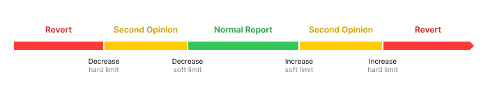

# Lean Oracle Rebase Sanity Check

## Simple Summary

Replace the rolling negative CL rebase allowance and positive rebase smoothing with one configurable range model. The Accounting Oracle processes normal reports as usual, exceptional CL accounting decreases or increases require an independent second opinion, and reports beyond hard limits revert. Once accepted, reported vault amounts and burn requests are settled in full.

## Abstract

The current checker uses separate mechanisms for decreases and increases: a 36-day history for negative CL rebases, annualized CL growth checks, and a positive rebase limiter that can defer part of vault transfers and share burns. This proposal replaces these aggregate controls with one set of configurable ranges for the CL accounting rebase.

- **Normal range.** Reports are processed on Accounting Oracle consensus as usual.
- **Exceptional ranges.** A larger increase or decrease may be processed only when an independent committee confirms the exact report hash.
- **Beyond the hard limits.** The report always reverts, even when confirmed by the committee.

The hard limits are intended to sit beyond normal operating conditions and remain configurable by the DAO.

The limits apply to the CL part of the report, including ETH withdrawn from CL into the Withdrawal Vault. EL rewards and share burns are excluded because their reported amounts are already bounded by live on-chain state. Once a report is accepted, reported vault amounts and share burns are settled in full rather than clipped. The proposal removes the rolling negative-rebase history and positive smoothing; sanity checks unrelated to the aggregate rebase remain unchanged.

## Motivation

**The negative CL rebase allowance adds complexity for a condition not seen in production.** The current checker stores a rolling report history and models one penalties-and-slashing scenario, requiring window traversal, state migration, and recalibration as CL rules change ([LIP-23](./lip-23.md), [LIP-35](./lip-35.md#ao-cl-balance-decrease)). Historical replay found no negative CL accounting rebase in any mainnet report since Lido V2. Independently, [stETH has never had a negative rebase](https://docs.lido.fi/guides/lido-tokens-integration-guide/#accounting-oracle). Setting the soft decrease limit to zero is simpler and more conservative: no CL accounting decrease can be accepted on Accounting Oracle consensus alone, and the checker no longer needs history or a modeled loss allowance.

**Positive smoothing adds permanent settlement complexity but has not affected a V2+ report.** It was introduced to reduce sandwiching around unusually large rewards or cover burns ([LIP-6](./lip-6.md), [LIP-12](./lip-12.md)). A replay of 1,185 V2+ reports found no effective deferral of reported vault amounts or burn requests. The known November 2022 and March 2023 cap events occurred under the predecessor 2 BP EL-rewards limit. Across the replay, the largest combined positive movement before Withdrawal Queue processing was 3.57 BP against the current 7.5 BP budget. A reported positive CL balance update consumes this budget but cannot itself be clipped; only the vault and burn inputs applied after it can be deferred. Removing the limiter therefore leaves the observed routine settlement path unchanged while accepting greater one-report sandwich and rate-shock exposure during exceptional EL-reward, backlog, or burn events.

**A ZK second opinion is costly to keep production-ready.** Ethereum's consensus layer and Lido's accounting continue to evolve, so relevant upgrades require changes to the ZK program, testing, and renewed audit work. [SP1](https://research.lido.fi/t/zk-lido-oracle-powered-by-succinct/5747) and [RISC Zero/Boundless](https://research.lido.fi/t/proposal-for-a-lido-accounting-oracle-second-opinion/9534/8) both demonstrated generation and on-chain verification of mainnet reports, but neither was connected to the checker or operated as a production second-opinion provider. For an exceptional path, an independent committee is materially simpler to operate and maintain.

## Specification

### Rebase processing model

Four configurable limits divide the CL accounting rebase into five intervals and three outcomes. A value at or inside the corresponding soft limit is processed on Accounting Oracle consensus. A value beyond a soft limit but at or inside the hard limit additionally requires the second-opinion committee. A value beyond a hard limit reverts. Hard limits are evaluated before consulting the second-opinion provider and cannot be overridden by it.



The aggregate check uses the values already passed to `checkAccountingOracleReport(...)`. Its conceptual flow is:

```solidity
// Deposits are principal rather than rewards.
preCLBalance =
    preCLValidatorsBalance +
    preCLPendingBalance +
    deposits;

// New in LIP-39: account for ETH withdrawn from CL into the vault.
postCLAccountingBalance =
    postCLValidatorsBalance +
    postCLPendingBalance +
    withdrawalVaultBalance;

if (postCLAccountingBalance < preCLBalance) {
    outcome = classifyPerReportDecrease(
        preCLBalance - postCLAccountingBalance
    );
} else {
    outcome = classifyAnnualizedIncrease(
        postCLAccountingBalance - preCLBalance,
        timeElapsed
    );
}

if (outcome == SECOND_OPINION) requireMatchingReportHash();
if (outcome == REVERT) revert;
```

Decrease limits are fixed percentages of `preCLBalance` per report. Increase limits are annualized percentages of `preCLBalance` and are prorated by `timeElapsed`; the existing one-hour fallback is retained when the elapsed time is zero. The asymmetry is intentional: CL rewards accrue continuously, while losses may occur as discrete events. After a missed report, the next report is measured from the last processed state, so loss and recovery are netted while the positive allowance spans the full elapsed interval.

The reported Withdrawal Vault balance is included so that ETH moved from CL to the vault is not treated as a loss. EL rewards and share burns remain outside the checked value because they are independently bounded by live on-chain state.

### Initial parameters

For each direction, the checker enforces `0 <= soft <= hard <= MAX_BASIS_POINTS`. Decrease limits are per report; increase limits are annualized and prorated by elapsed time.

| Parameter | Initial value | Effect |
| --- | ---: | --- |
| `clRebaseDecreaseSoftBPLimit` | `0 BP` per report | Any CL accounting decrease requires the committee |
| `clRebaseDecreaseHardBPLimit` | `500 BP` per report | A decrease above 5% always reverts |
| `annualCLRebaseIncreaseSoftBPLimit` | `1,000 BP` annualized | Accounting Oracle-only range; approximately `2.74 BP` over 24 hours |
| `annualCLRebaseIncreaseHardBPLimit` | `1,750 BP` annualized | Joint Accounting Oracle and committee range; approximately `4.79 BP` over 24 hours |

**`clRebaseDecreaseSoftBPLimit = 0 BP`.** The Accounting Oracle cannot report a CL accounting loss without the committee. Because EL rewards are excluded, a genuine CL-side loss may require the committee even when the final stETH rebase remains positive. This is deliberately more conservative than the current rolling loss allowance and allows that stateful mechanism to be removed.

**`clRebaseDecreaseHardBPLimit = 500 BP`.** The value reuses the former `oneOffCLBalanceDecreaseBPLimit`, which [LIP-23](./lip-23.md) replaced because Accounting Oracle alone could repeat a 5% decrease before governance reacted. Under this proposal every such decrease requires both reporting groups, but repetition remains material: with no offsetting flows, three and seven consecutive decreases at the hard limit would reduce the starting CL accounting balance by approximately 14.3% and 30.2%, respectively. The value is not directly comparable to the production `360 BP` rolling limit and remains provisional pending historical replay and loss-scenario analysis.

**`annualCLRebaseIncreaseSoftBPLimit = 1,000 BP`.** The provisional value reuses the production `annualBalanceIncreaseBPLimit` for Accounting Oracle-only reports, preserving approximately the current annualized reward envelope. Its final calibration remains subject to historical replay.

**`annualCLRebaseIncreaseHardBPLimit = 1,750 BP`.** The provisional value creates a `750 BP` annualized committee range, approximately `2.05 BP` over 24 hours. It must not be derived by mechanically annualizing the current 7.5 basis-point `maxPositiveTokenRebase`, which is a fixed share-rate budget over CL, vault, and burn inputs rather than a CL accounting integrity limit. The exact value requires historical replay and economic analysis.

### Affected contracts

| Contract | Change |
| --- | --- |
| `OracleReportSanityChecker` | Replacement contract with the new CL rebase ranges; removes rolling history, smoothing, and tolerance-based second opinion |
| `Accounting` | New implementation that settles accepted reports directly and simplifies `CalculatedValues` |
| `LidoLocator` | New implementation instance with updated immutable wiring to the replacement checker |
| `SecondOpinionOracle` **(new)** | Stores complete report hashes confirmed by the independent committee |

### OracleReportSanityChecker

**Aggregate range check.** `Accounting` continues to call the checker, but now validates report inputs before simulation:

```text
Accounting.handleOracleReport(...)
├── _checkOracleReportData(...)
│   └── checkAccountingOracleReport(...)
│       ├── caller, live vault, and Burner checks
│       └── CL accounting rebase range check
├── _simulateOracleReport(...)
└── _checkSimulatedOracleReport(...)
    └── simulated share-rate and Withdrawal Queue checks
```

The body of `_checkAccountingOracleReportCLBalances(...)` is replaced by the stateless classification shown above. `checkAccountingOracleReport(...)` no longer receives the redundant `_withdrawalsVaultTransfer` argument and becomes `view`. Report inputs are checked before direct-settlement simulation; checks that depend on simulated Withdrawal Queue values remain after it.

**Checks retained.** The checker continues to require reported Withdrawal Vault and EL Rewards Vault amounts not to exceed their live balances and reported Burner shares not to exceed live backed requests. The simulated-share-rate check, Withdrawal Queue report validation, exit limits, and extra-data limits are unchanged.

**Per-module invariant.** `checkModuleAndCLBalancesChangeRates(...)` remains a separate deterministic invariant and does not consult the committee. Every report must still satisfy:

```text
grossPositiveModuleDeltas
    <= activatedBalance
     + ordinaryCLRewardsAllowance
     + consolidationAllowance
```

The existing balance-consistency, pending-balance, activation, consolidation, and module-baseline checks remain. `ordinaryCLRewardsAllowance` uses the annual positive soft limit, while `consolidationAllowance` continues to use the separate `consolidationEthAmountPerDayLimit`. Committee confirmation cannot override this invariant.

The duplicate aggregate `postCLValidatorsBalance` growth branch inside `_checkModuleValidatorsBalanceIncrease(...)` is removed because aggregate classification now belongs to the CL accounting rebase check. Keeping that branch would reject an increase between the soft and hard limits before the aggregate check could consult the committee.

The global first-report bypass and `isPostMigrationFirstReportDone` state are removed because the replacement checker is activated against the existing Staking Router accounting state rather than during its migration. The existing per-module cold-start behavior is retained: a module whose stored Accounting state has both zero validator balance and zero exited count is excluded from the positive-delta sum. Balance-consistency, pending-balance, and activation checks still apply.

**Removed machinery.** The replacement checker removes:

- the rolling negative-rebase history, window traversal, and baseline migration;
- inferred Withdrawal Vault withdrawals, including `lastVaultBalanceAfterTransfer` and its cross-report finalization;
- `PositiveTokenRebaseLimiter`, `smoothenTokenRebase(...)`, and `maxPositiveTokenRebase` management;
- the global first-report module bootstrap, old separate aggregate growth checks, and tolerance-based second-opinion comparison;
- superseded rebase limits, roles, setters, getters, and events.

### Accounting

`Accounting._simulateOracleReport()` no longer calls `smoothenTokenRebase(...)`. An accepted report is settled directly:

```diff
- (
-     update.withdrawalsVaultTransfer,
-     update.elRewardsVaultTransfer,
-     update.sharesToBurnForWithdrawals,
-     update.totalSharesToBurn
- ) = _contracts.oracleReportSanityChecker.smoothenTokenRebase(...);
+ update.totalSharesToBurn =
+     _report.sharesRequestedToBurn + update.sharesToFinalizeWQ;
```

The three smoothing outputs are no longer needed in `CalculatedValues`. Their consumers use the accepted report or the already calculated Withdrawal Queue value directly:

```diff
- update.withdrawalsVaultTransfer
+ _report.withdrawalVaultBalance

- update.elRewardsVaultTransfer
+ _report.elRewardsVaultBalance

- update.sharesToBurnForWithdrawals
+ update.sharesToFinalizeWQ
```

The same values are used in post-report accounting, fee calculation, the call to `Lido.collectRewardsAndProcessWithdrawals(...)`, and the unchanged `checkSimulatedShareRate(...)` interface. As a result, `simulateOracleReport(...)` keeps its selector but returns a 12-field `CalculatedValues` tuple instead of 15 fields.

**Live balances may exceed the reported values.** Vault balances and Burner requests can grow between the reference slot and report processing, so the checks use `reported <= live`. Only the values committed by the report are settled; later growth remains for the next report. Vault value and Burner requests deferred by the outgoing smoother become eligible for full settlement under the new rules.

### LidoLocator

LIP-39 requires a new `LidoLocator` implementation because the `oracleReportSanityChecker` address is immutable. The new instance points it to the replacement checker.

### Second opinion

**Exceptional reports require an independent confirmation.** An aggregate CL accounting rebase inside an exceptional range is accepted only when the second-opinion committee confirms the complete report selected by Accounting Oracle consensus for the same reference slot.

`_startProcessing()` freezes the consensus report before the checker runs. The exceptional path then compares that report with the committee confirmation:

```solidity
(
    consensusReportHash,
    refSlot,
    ,
    processingStarted
) = accountingOracle.getConsensusReport();

require(processingStarted);
require(address(secondOpinionOracle) != address(0));

(exists, committeeReportHash) =
    secondOpinionOracle.getReportHash(refSlot);

require(exists && committeeReportHash == consensusReportHash);
```

The consensus hash is `keccak256(abi.encode(data))` and binds the committee to every field covered by Accounting Oracle consensus. Neither the hash nor the reference slot is added to report-processing interfaces, and reports inside the normal range do not access the provider.

The new `SecondOpinionOracle` stores one replaceable hash per `refSlot`; writing a zero hash clears it. `SUBMIT_REPORT_HASH_ROLE` must be held by the DAO-approved on-chain threshold-controlled committee contract, rather than an individual member or relayer. Committee members must be independent from Accounting Oracle members, independently validate the complete report, and recompute its ABI-encoded hash rather than copy the Accounting Oracle consensus hash.

The committee cannot submit an Accounting Oracle report or override a hard limit. Exact-hash confirmation removes field-specific tolerances and binds the committee to the complete report, but makes the exceptional path dependent on committee availability and intentionally drops compatibility with CL-only ZK providers. A future proof system would have to prove the complete Accounting Oracle report hash.

### Interfaces, deprecations, and compatibility

| Interface or state | Change |
| --- | --- |
| `smoothenTokenRebase(...)` | Removed |
| `checkAccountingOracleReport(...)` | Removes `_withdrawalsVaultTransfer`; selector changes |
| `simulateOracleReport(...)` | Keeps its selector; output tuple is reduced from 15 to 12 fields |
| `ISecondOpinionOracle.getReport(...)` | Replaced by `getReportHash(refSlot)` |
| `LimitsList` | Keeps the same tuple length and unrelated field positions; four fields receive new names and semantics |
| Checker report history | Removed and not migrated |
| SP1-based oracle implementation | Deprecated and not adapted to the new interface |
| RISC Zero/Boundless integration | Remains paused and is not deployed or migrated |

The four limits are returned by `getOracleReportLimits()` and can be updated through the existing bulk setter, whose `(LimitsList, secondOpinionOracle)` ABI shape is retained. `setCLRebaseDecreaseBPLimits(...)` and `setAnnualCLRebaseIncreaseBPLimits(...)` update each soft-hard pair atomically under separate manager roles and emit pair-specific events. The provider may be changed through `setSecondOpinionOracle(...)` under `SECOND_OPINION_MANAGER_ROLE`.

Four existing `LimitsList` positions receive new names and semantics:

- `annualBalanceIncreaseBPLimit` → `annualCLRebaseIncreaseSoftBPLimit`;
- `maxPositiveTokenRebase` → `annualCLRebaseIncreaseHardBPLimit`;
- `maxCLBalanceDecreaseBP` → `clRebaseDecreaseSoftBPLimit`;
- `clBalanceOraclesErrorUpperBPLimit` → `clRebaseDecreaseHardBPLimit`.

Readers of unrelated fields remain wire-compatible because their positions and types do not change. Consumers of the replaced fields, callers of the full-tuple setter, and decoders of `simulateOracleReport(...)` must update before activation.

LIP-39 does not change the `AccountingOracle` report-processing code or `ReportData` schema. The Accounting Oracle consensus version is incremented because direct settlement can change Withdrawal Queue finalization values and therefore the consensus report hash.

## Security Considerations

**Some token-rate changes remain outside the ranges.** EL rewards and Burner shares are excluded because their reported amounts cannot exceed live on-chain backing. Applying the same hard limit to the final stETH rebase would let permissionless EL Rewards Vault donations block otherwise valid reports. Bad-debt internalization may also reduce the share rate without committee confirmation; its existing VaultHub controls remain unchanged.

**Withdrawal Vault donations can move a report between ranges.** Withdrawal Vault value is included in the checked CL accounting balance, so genuine withdrawals can offset a CL decrease. A stateless checker cannot distinguish forced ETH from a CL withdrawal, making this a liveness risk rather than an unbacked-accounting risk.

**Removing smoothing increases immediate market exposure.** Exceptional EL rewards and Burner requests are applied in one report. The existing 7.5 BP budget was calibrated to market conditions at the time, and current modeling finds positive gross returns for some sandwich routes below it. The proposal therefore accepts greater sandwich and downstream rate-shock exposure in exchange for removing partial settlement and its cross-report state.

**The configured authority renews across reports.** Joint compromise of the Accounting Oracle and committee can repeat committee-confirmed decreases and use positive allowances over successive intervals, so losses can compound until detected. Hard limits bound each report; committee independence, exact-hash confirmation, monitoring, and DAO control reduce the chance or duration of repeated abuse but do not eliminate it.

## Failure Modes

**Committee unavailable or hash mismatch.** An exceptional report is deferred unless the committee publishes the matching hash before the frame deadline. A changed consensus report requires a new confirmation. Missing the frame also defers the rebase, Withdrawal Queue finalization, bunker-mode updates, and other report-dependent actions; after two days, VaultHub force rebalancing and bad-debt operations are also blocked. Changing the provider or a limit requires DAO execution and may be delayed by Dual Governance or Rage Quit. Normal-range reports remain unaffected.

**Report beyond a hard limit.** The report reverts even if the committee attests to it. For an increase, a later report has a larger annualized allowance because more time has elapsed. For a decrease, the limit remains fixed per report, but later CL rewards or Withdrawal Vault value may reduce the net loss. Otherwise the DAO must change the relevant limit or replace the checker. Dual Governance may delay that action.

## Links

- [LIP-6: In-protocol coverage application mechanism](./lip-6.md)
- [LIP-12: On-chain part of the rewards distribution after the Merge](./lip-12.md)
- [LIP-23: Negative rebase sanity check with second opinion](./lip-23.md)
- [LIP-35: Staking Router v3](./lip-35.md)
- [SRv3 sanity-check parameter research](https://hackmd.io/0ePemSJtQA6S5NDK2M3mww)
- [ZK Lido Oracle powered by Succinct](https://research.lido.fi/t/zk-lido-oracle-powered-by-succinct/5747)
- [RISC Zero/Boundless second-opinion update](https://research.lido.fi/t/proposal-for-a-lido-accounting-oracle-second-opinion/9534/8)
- [Accounting Oracle second-opinion pause](https://research.lido.fi/t/proposal-for-a-lido-accounting-oracle-second-opinion/9534/9)

## Copyright

Copyright and related rights waived via [CC0](https://creativecommons.org/publicdomain/zero/1.0/).
