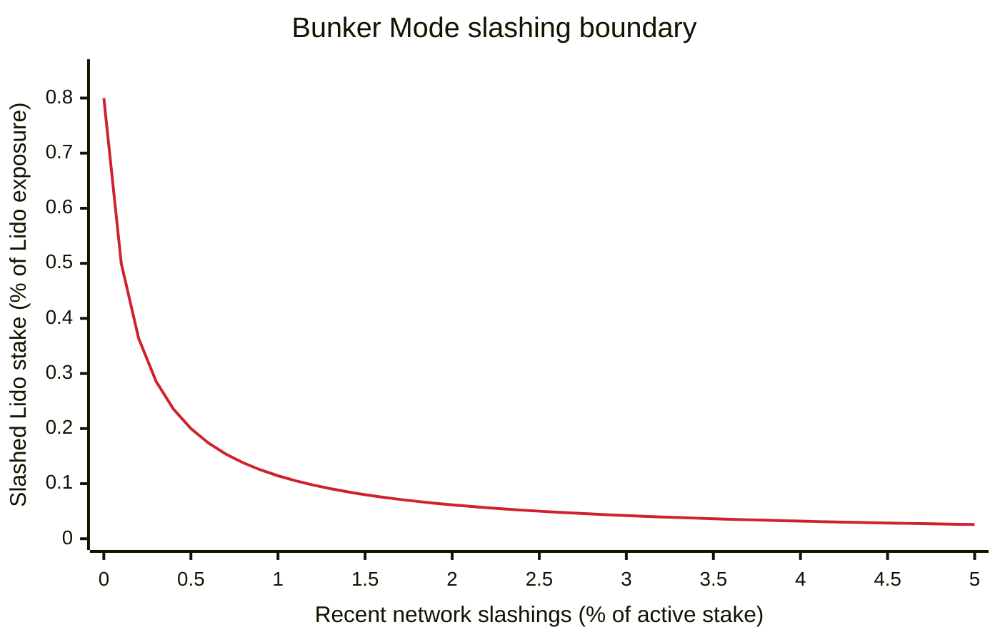

# Lean Bunker Mode

## Simple Summary

Simplify Bunker Mode activation and withdrawal finalization with a current-state slashing-impact check and a DAO-configurable request-age delay.

## Abstract

This proposal simplifies how Bunker Mode is activated and how its safe border is calculated, without changing its on-chain interface.

**Bunker Mode is activated if either:**

- the simulated CL rebase is negative;
- the current slashing-impact estimate reaches the configured threshold.

**Finalization:**

- all requests must satisfy the ordinary request timestamp margin, which is increased;
- while Bunker Mode remains active, requests must also be older than a DAO-configurable delay.

## Motivation

**Problem.** A slashing or other validator failure can become observable before its full loss reaches the stETH share rate. Withdrawal requests are finalized at the lower of their request-time share rate and the post-report share rate. Without a delay, users can finalize withdrawals before the loss is reported and shift it to remaining holders. The [original Bunker design](https://research.lido.fi/t/withdrawals-for-lido-on-ethereum-bunker-mode-design-and-implementation/3890) prevents this by keeping recent withdrawal requests exposed to losses that are already known or reasonably expected.

**Current approach.** The current oracle activates Bunker Mode for a negative CL rebase, slashings expected to cause a future negative rebase, or an abnormally low rebase ending in a negative tail. While Bunker Mode is active, it combines a negative-rebase border with a border derived from incomplete slashings considered associated with queued requests.

**Drawbacks.** The slashing and abnormal-rebase paths estimate future penalties or rewards, query historical beacon states, and approximate request-to-slashing associations. They depend on Ethereum penalty timing, validator lifecycle rules, and report cadence. This makes independent oracle implementations difficult and creates recurring maintenance across Ethereum forks for logic intended only for rare incidents.

**Proposed approach.** This proposal replaces those calculations with current-state checks and a fixed Bunker finalization delay while the mode remains active. It also increases the ordinary request timestamp margin so requests created during the longest interval sampled by the removed abnormal-rebase check remain ineligible for the same report.

## Specification

This proposal changes two off-chain oracle decisions: whether to report Bunker Mode and which withdrawal requests are safe to finalize. It replaces the complex calculations behind them with current-state activation checks and a fixed Bunker finalization delay. The on-chain interface and stored Bunker state remain unchanged.

### Bunker Mode activation

**Current policy.** Under the [current Accounting Oracle policy](https://docs.lido.fi/guides/oracle-spec/accounting-oracle/#bunker-mode-activation), Bunker Mode is reported for a negative CL rebase, slashings expected to cause a future negative CL rebase, or an abnormally low CL rebase with a negative sampled tail.

**Proposed policy.** The negative-rebase check is retained. The slashing prediction and abnormal-rebase classifier are replaced with one current-state slashing-impact estimate. The oracle evaluates two checks on every report and reports Bunker Mode if either check is true:

- the simulated CL rebase is negative;
- the current slashing-impact estimate reaches the configured threshold.

```python
isBunkerMode = isNegativeCLRebase or isSlashingImpactBigEnough
```

If both checks are false, the oracle reports Turbo Mode immediately, with no minimum Bunker duration or exit cooldown. Before the first report has been successfully processed, the oracle reports Turbo Mode.

**Negative simulated CL rebase.** The oracle uses the ordinary [on-chain report simulation](https://docs.lido.fi/guides/oracle-spec/accounting-oracle/#available-ether-and-share-rate), with EL rewards set to zero and no Withdrawal Queue requests finalized. The condition holds if the simulated post-report total pooled ether is below its pre-report value. All other report effects remain included, such as the reported CL balances, the Withdrawal Vault, shares already requested for burning, and external bad debt internalized by the report. Withdrawal finalization therefore cannot trigger this condition.

```python
clRebaseSimulation = simulateReport(
    elRewardsVaultBalance=0,
    withdrawalFinalizationBatches=[],
    simulatedShareRate=0,
)

isNegativeCLRebase = (
    clRebaseSimulation.postTotalPooledEther
    < Lido.totalSupply(referenceBlock)
)
```

**Slashing impact.** `lidoExposureBalance` is the total effective balance of Lido validators that have activated and are not yet withdrawable at the reference epoch. The estimate multiplies the share of this exposure that is slashed by the estimated impact per slashed ETH. That impact is the sum of:

- a DAO-configurable base impact rate for cumulative incident effects that do not depend on other network slashings;
- the current CL proportional slashing factor, used as a proxy for the correlated penalty.

$$
\text{slashingImpactShare}
=
\frac{\text{lidoNonWithdrawableSlashedBalance}}{\text{lidoExposureBalance}}
\times
\left(
\frac{\text{baseSlashingImpactRatePPM}}{\text{PPM}}
+
\min\left(
\text{proportionalSlashingMultiplier}
\times
\frac{\text{networkRecentSlashedBalance}}{\text{networkActiveBalance}},
1
\right)
\right)
$$

`networkRecentSlashedBalance` includes Lido slashings, so a fresh Lido-only incident affects both components. Network slashings without slashed Lido stake produce zero impact. The Lido balances below use validator effective balances at the reference epoch.

```python
PPM = 1_000_000

lidoExposure = [
    validator
    for validator in lidoValidators
    if validator.activationEpoch <= referenceEpoch < validator.withdrawableEpoch
]

lidoExposureBalance = sum(
    validator.effectiveBalance
    for validator in lidoExposure
)

lidoNonWithdrawableSlashedBalance = sum(
    validator.effectiveBalance
    for validator in lidoExposure
    if validator.slashed
)

networkRecentSlashedBalance = sum(beaconState.slashings)
networkActiveBalance = getTotalActiveBalance(beaconState)
baseSlashingImpactRatePPM = BUNKER_BASE_SLASHING_IMPACT_RATE_PPM
proportionalSlashingMultiplier = PROPORTIONAL_SLASHING_MULTIPLIER_BELLATRIX  # 3

# Follows adjusted_total_slashing_balance in CL process_slashings:
# https://ethereum.github.io/consensus-specs/specs/electra/beacon-chain/#modified-process_slashings
adjustedNetworkSlashedBalance = min(
    proportionalSlashingMultiplier * networkRecentSlashedBalance,
    networkActiveBalance,
)

slashingImpactFactorNumerator = (
    baseSlashingImpactRatePPM * networkActiveBalance
    + PPM * adjustedNetworkSlashedBalance
)

if lidoExposureBalance == 0:
    isSlashingImpactBigEnough = False
else:
    # Multiply before dividing and use arbitrary-precision intermediate values.
    slashingImpactSharePPM = (
        lidoNonWithdrawableSlashedBalance
        * slashingImpactFactorNumerator
        // (lidoExposureBalance * networkActiveBalance)
    )

    isSlashingImpactBigEnough = (
        slashingImpactSharePPM
        >= BUNKER_SLASHING_IMPACT_THRESHOLD_PPM
    )
```

The base impact rate and activation threshold are DAO-configurable. `adjustedNetworkSlashedBalance` follows the target fork's CL [`process_slashings`](https://ethereum.github.io/consensus-specs/specs/electra/beacon-chain/#modified-process_slashings): the proportional component is capped at one, and its multiplier is not DAO-configurable.

The chart shows the activation boundary for the proposed initial base rate of `5,000 ppm` and threshold of `40 ppm` over the range where it changes most. A point on or above the curve activates Bunker Mode. Only slashed Lido validators that are not yet withdrawable are counted on the Y axis. For larger network incidents, the boundary continues falling. Once recent network slashings reach one third of active stake, the network factor is capped and the boundary settles at approximately `0.004%` of Lido exposure.



The slashing check can activate before the correlated penalty is reflected in the reported CL balance. If the penalty later makes the simulated CL rebase negative, the negative-rebase check also activates Bunker Mode.

### Withdrawal finalization

The safe border is the request-creation cutoff used to select finalization batches. Requests created at or before it become eligible, while the existing queue constraints still determine whether they are finalized.

**Current policy.** In Bunker Mode, the oracle uses the earlier of a negative-rebase border and an associated-slashing border. The negative-rebase border is anchored to the report preceding Bunker Mode activation and starts advancing after a configured maximum delay. The associated-slashing border is reconstructed from incomplete Lido slashings considered associated with queued requests.

**Proposed policy.** Both Bunker-specific borders are replaced by one age-based border. In Turbo Mode, the existing default requests border applies. While Bunker Mode is active, a request must satisfy both the ordinary request timestamp margin and the configured Bunker finalization delay. When Bunker Mode clears, the default requests border applies immediately.

```python
secondsPerEpoch = slotsPerEpoch * secondsPerSlot
finalizationDefaultShift = ceil(requestTimestampMargin / secondsPerEpoch)

finalizationShift = finalizationDefaultShift

if isBunkerMode:
    finalizationShift = max(
        finalizationDefaultShift,
        BUNKER_FINALIZATION_DELAY_EPOCHS,
    )

safeBorderEpoch = max(0, referenceEpoch - finalizationShift)
```

The resulting epoch is converted to the timestamp at its start and passed to the existing [finalization algorithm](https://docs.lido.fi/guides/oracle-spec/accounting-oracle/#finalization). All existing queue constraints, including FIFO ordering and the available-ETH budget, remain unchanged, so actual finalization may occur later.

### Configuration

The proposal adds three parameters to [`OracleDaemonConfig`](https://docs.lido.fi/contracts/oracle-daemon-config/), retires five legacy Bunker parameters, and changes one limit in [`OracleReportSanityChecker`](https://docs.lido.fi/contracts/oracle-report-sanity-checker/#limits-list).

<table>
  <thead>
    <tr>
      <th>Policy or parameter</th>
      <th>Current mainnet policy or value</th>
      <th>Proposed initial policy or value</th>
    </tr>
  </thead>
  <tbody>
    <tr><th colspan="3" align="left"><code>OracleDaemonConfig</code></th></tr>
    <tr>
      <td>Bunker requests border</td>
      <td>An associated-slashing border with no fixed time cap, or a negative-rebase border capped by <a href="https://dao.lido.fi/vote/184"><code>FINALIZATION_MAX_NEGATIVE_REBASE_EPOCH_SHIFT = 2,250 epochs</code></a> (10 days), whichever is earlier.</td>
      <td>One Bunker-specific age-based border: <code>BUNKER_FINALIZATION_DELAY_EPOCHS = 9,000 epochs</code> (40 days).</td>
    </tr>
    <tr>
      <td>Base slashing impact rate</td>
      <td>No direct equivalent.</td>
      <td><code>BUNKER_BASE_SLASHING_IMPACT_RATE_PPM = 5,000</code> (0.5% of non-withdrawable slashed Lido balance).</td>
    </tr>
    <tr>
      <td>Slashing impact threshold</td>
      <td>No direct equivalent.</td>
      <td><code>BUNKER_SLASHING_IMPACT_THRESHOLD_PPM = 40</code> (0.004% of Lido exposure).</td>
    </tr>
    <tr><th colspan="3" align="left"><code>OracleReportSanityChecker</code></th></tr>
    <tr>
      <td><code>requestTimestampMargin</code></td>
      <td><a href="https://research.lido.fi/t/withdrawals-for-lido-on-ethereum-bunker-mode-design-and-implementation/3890/4"><code>7,680 seconds</code></a> (20 epochs).</td>
      <td><code>9,216 seconds</code> (24 epochs).</td>
    </tr>
  </tbody>
</table>

**Bunker finalization delay.** `BUNKER_FINALIZATION_DELAY_EPOCHS` replaces the associated-slashing and negative-rebase borders. The delay is cause-independent: while either activation check remains true, the same Bunker border applies. The initial `9,000`-epoch delay covers three relevant horizons:

- **Legacy negative-rebase limit — 2,250 epochs (10 days):** the maximum shift used by the current negative-rebase border.
- **Slashing horizon — 8,192 epochs (about 36.4 days):** the minimum time before a slashed validator becomes withdrawable under the [target fork's inherited rules](https://ethereum.github.io/consensus-specs/specs/electra/beacon-chain/#modified-slash_validator).
- **Full Lido exit — approximately 8,450 epochs (about 37.6 days):** if all Lido validators are slashed, exit churn can keep the last affected validators non-withdrawable beyond the base slashing horizon under the [Gloas exit rules](https://eips.ethereum.org/EIPS/eip-8061) inherited by the target fork.

`9,000` epochs equal 40 days and 40 [Accounting Oracle frames](https://docs.lido.fi/contracts/accounting-oracle/#report-cycle), covering the longest estimate with about 550 epochs of margin. The full-exit estimate assumes Lido at no more than 25% of active stake and no material exit demand ahead of or concurrent with Lido exits.

If these assumptions or the fork rules no longer hold, responders must [pause the Withdrawal Queue](https://docs.lido.fi/guides/protocol-levers/#emergency-pause) or update the parameter. While Bunker Mode remains active, the 40-day delay is the available response window for requests held by the Bunker border. The delay should remain a whole number of frames, although the oracle does not enforce this.

The calibration below assumes 9 million ETH of Lido exposure, 40 million ETH of active network stake, and a representative one-frame CL rebase of about 630 ETH when estimating foregone rewards.

**Base slashing impact rate.** The initial `5,000 ppm` value estimates cumulative incident effects independent of other network slashings as 0.5% of non-withdrawable slashed Lido balance. Under normal finality and no replacement stake, the calibration model combines the [initial slashing penalty](https://ethereum.github.io/consensus-specs/specs/electra/beacon-chain/#modified-slash_validator), continuing [source and target penalties](https://ethereum.github.io/consensus-specs/specs/altair/beacon-chain/#get_flag_index_deltas), and foregone CL rewards into a shortfall of about 0.44% relative to the no-slashing case over the 8,192-epoch horizon, rounded up to 0.5%. This is a cumulative severity estimate, not a prediction of the loss in one report. The correlated penalty is added separately through the current network slashing factor.

**Slashing impact threshold.** At the calibration baseline, the initial `40 ppm` threshold represents about 360 ETH of estimated cumulative impact. Together with the base impact rate, it makes a fresh Lido-only incident cross the boundary at about 44,000 ETH, or 0.48% of Lido exposure, while larger network incidents require less Lido stake to be slashed. Across a 20–25% Lido share of active network stake, the Lido-only boundary remains approximately 0.47–0.50%; a materially lower share requires recalibration.

**Default requests border.** `requestTimestampMargin` increases from 20 to 24 epochs. The retired abnormal-rebase classifier sampled CL balance changes beginning 1 and [23 epochs](https://research.lido.fi/t/withdrawals-for-lido-on-ethereum-bunker-mode-design-and-implementation/3890/4) before the reference epoch. A 24-epoch margin keeps requests created during the longer sampled interval ineligible for the same report, with one epoch for alignment. It does not reproduce the classifier's ability to activate Bunker Mode and hold older requests.

The proposal is activated no earlier than Glamsterdam. These calibrations are revalidated against the final target-fork specification before activation and whenever the Accounting Oracle frame, Lido share of active stake, or representative CL income changes materially.

### Implementation and activation

The proposal requires a new Accounting Oracle daemon release and an Accounting Oracle consensus-version bump; no contract upgrade is required.

The daemon implements the activation and finalization rules specified above.

After the preceding report has been processed and while the Withdrawal Queue is in Turbo Mode, all Accounting Oracle instances are upgraded. The following on-chain changes are then required:

- add `BUNKER_FINALIZATION_DELAY_EPOCHS`, `BUNKER_BASE_SLASHING_IMPACT_RATE_PPM`, and `BUNKER_SLASHING_IMPACT_THRESHOLD_PPM` to `OracleDaemonConfig`;
- unset `NORMALIZED_CL_REWARD_PER_EPOCH`, `NORMALIZED_CL_REWARD_MISTAKE_RATE_BP`, `REBASE_CHECK_NEAREST_EPOCH_DISTANCE`, `REBASE_CHECK_DISTANT_EPOCH_DISTANCE`, and `FINALIZATION_MAX_NEGATIVE_REBASE_EPOCH_SHIFT` in `OracleDaemonConfig`;
- change `OracleReportSanityChecker.requestTimestampMargin` from 7,680 to 9,216 seconds;
- bump the Accounting Oracle consensus version.

Complete the on-chain changes before the next reference slot and bump the consensus version last. This keeps the reference-state configuration aligned with the live sanity-checker settings and avoids skipping a report frame.

## Security Considerations

While Bunker Mode remains active, the 9,000-epoch delay provides a response window, not a solvency guarantee. If a loss can remain latent for longer, the Withdrawal Queue must be paused before affected requests become eligible.

At runtime, the slashing-impact threshold does not adjust to current CL income. A sub-threshold slashing during an unusually low-income frame, or a non-slashing performance incident, may activate Bunker Mode only once the simulated CL rebase becomes negative. The 24-epoch request margin does not guarantee that such an incident is detected before requests become eligible.

The estimate uses all non-withdrawable slashed Lido validators and the current CL slashings vector. It can keep applying the proportional component after the corresponding penalty has been charged or combine slashings from different incidents, biasing the result toward a longer Bunker period.

If an unusually long exit queue outlasts the CL slashings vector, the base-only activation boundary is 0.8% of Lido exposure. The queue can also extend penalties beyond the 8,192-epoch horizon used to calibrate the base rate. The base rate assumes normal finality; inactivity leaks and other exceptional conditions require operational assessment.

Buffered ETH cannot be deposited to the CL while Bunker Mode is active. For incidents outside the automatic policy's assumptions, the [CircuitBreaker](https://github.com/lidofinance/lido-improvement-proposals/blob/develop/LIPS/lip-34.md) can pause the Withdrawal Queue, and the Reseal Committee can extend the pause through the [Reseal Manager](https://github.com/lidofinance/dual-governance/blob/develop/docs/mechanism.md) under its existing Dual Governance preconditions.

Changing the delay may be unavailable during Dual Governance escalation. RageQuit uses the same queue, so both the Bunker delay and any pause also delay its completion.

## Copyright

Copyright and related rights waived via [CC0](https://creativecommons.org/publicdomain/zero/1.0/).
