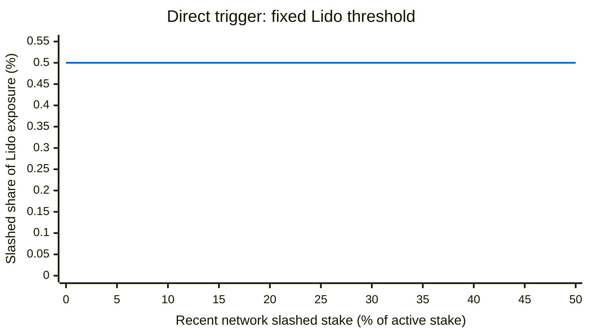
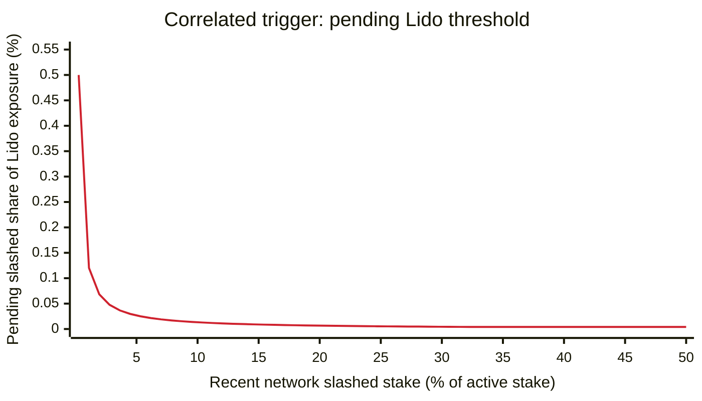

# Lean Bunker Mode

## Simple Summary

Make Bunker Mode leaner by replacing its complex, maintenance-heavy activation and withdrawal finalization logic with simpler rules calibrated conservatively.

## Abstract

This proposal simplifies how Bunker Mode is activated and how its safe border is calculated, without changing its on-chain interface.

**Bunker Mode activation** (if any of the following occurs):

- the simulated CL rebase is negative;
- a significant amount of Lido validator stake is slashed;
- network-wide slashings materially increase losses for slashed Lido validators.

**Finalization:**

- in Bunker Mode: recent requests become eligible after a fixed, DAO-configurable delay while the mode remains active;
- in Turbo Mode: the ordinary request timestamp margin is increased.

## Motivation

**Problem.** A slashing or other validator failure can become observable before its full loss reaches the stETH share rate. Without a delay, users can finalize withdrawals before the loss is reported and shift it to remaining holders. The [original Bunker design](https://research.lido.fi/t/withdrawals-for-lido-on-ethereum-bunker-mode-design-and-implementation/3890) prevents this by keeping recent withdrawal requests exposed to losses that are already known or reasonably expected.

**Current approach.** The current oracle activates Bunker Mode for a negative CL rebase, slashings expected to cause a future negative rebase, or an abnormally low rebase ending in a negative tail. While Bunker Mode is active, it combines a negative-rebase border with a border derived from incomplete slashings considered associated with queued requests.

**Drawbacks.** The slashing and abnormal-rebase paths estimate future penalties or rewards, query historical beacon states, and approximate request-to-slashing associations. They depend on Ethereum penalty timing, validator lifecycle rules, and report cadence. This makes independent oracle implementations difficult and creates recurring maintenance across Ethereum forks for logic intended only for rare incidents.

**Proposed approach.** This proposal replaces those calculations with current-state checks calibrated conservatively and a fixed Bunker finalization delay while the mode remains active. It also increases the ordinary request timestamp margin to preserve the time horizon covered by the removed abnormal-rebase checks. Requests are already finalized at the lower of their request-time share rate and the post-report share rate, so holding them until a loss is reported preserves the original protection without forecasting a future rebase or associating individual requests with slashings.

## Specification

This proposal changes two off-chain oracle decisions: whether to report Bunker Mode and which withdrawal requests are safe to finalize. It replaces the complex calculations behind them with current-state activation checks and a fixed Bunker finalization delay. The on-chain interface and stored Bunker state remain unchanged.

### Bunker Mode activation

**Current policy.** Under the [current Accounting Oracle policy](https://docs.lido.fi/guides/oracle-spec/accounting-oracle/#bunker-mode-activation), Bunker Mode is reported for a negative CL rebase, slashings expected to cause a future negative CL rebase, or a lower-than-expected CL rebase with a negative rebase expected at the end of the frame.

**Proposed policy.** The negative-rebase check is retained. The slashing prediction and abnormal-rebase classifier are replaced with current-state slashing checks. The oracle evaluates three checks on every report and reports Bunker Mode if any check is true:

- the simulated CL rebase is negative;
- the slashed share of non-withdrawable Lido stake reaches the direct threshold;
- pending slashed Lido stake combined with recent network slashings reaches the correlated-loss threshold.

```python
isBunkerMode = (
    isNegativeCLRebase
    or isDirectSlashingBigEnough
    or isCorrelatedSlashingBigEnough
)
```

If all three checks are false, the oracle reports Turbo Mode immediately, with no minimum Bunker duration or exit cooldown. Before the first report has been successfully processed, the oracle reports Turbo Mode, matching the current policy.

**Negative simulated CL rebase.** The oracle [simulates the report](https://docs.lido.fi/guides/oracle-spec/accounting-oracle/#available-ether-and-share-rate) with EL rewards set to zero and no Withdrawal Queue requests finalized. The condition holds if the simulated post-report total pooled ether is below its pre-report value. The simulation still includes the reported CL balances, the Withdrawal Vault, and shares already requested for burning. Withdrawal finalization therefore cannot trigger this condition.

```python
clRebaseSimulation = simulateReport(
    elRewardsVaultBalance=0,
    withdrawalFinalizationBatches=[],
    simulatedShareRate=0,
)

isNegativeCLRebase = (
    clRebaseSimulation.postTotalPooledEther
    < Lido.totalSupply(referenceBlock)
)
```

**Slashing exposure.** Both slashing checks use validator effective balances at the report reference epoch. `lidoExposure` contains Lido validators that have activated and are not yet withdrawable at that epoch. If its total effective balance is zero, both slashing checks are false and neither ratio is evaluated.

```python
PPM = 1_000_000

lidoExposure = [
    validator
    for validator in lidoValidators
    if validator.activationEpoch <= referenceEpoch < validator.withdrawableEpoch
]

lidoExposureBalance = sum(
    validator.effectiveBalance
    for validator in lidoExposure
)
```

**Direct Lido slashing.** This check depends only on Lido's slashed exposure; network-wide slashings do not affect it. The condition holds when the slashed share of `lidoExposure` reaches the configured direct threshold.

```python
lidoNonWithdrawableSlashedBalance = sum(
    validator.effectiveBalance
    for validator in lidoExposure
    if validator.slashed
)

if lidoExposureBalance == 0:
    isDirectSlashingBigEnough = False
else:
    directLidoSlashedSharePPM = (
        PPM * lidoNonWithdrawableSlashedBalance // lidoExposureBalance
    )

    isDirectSlashingBigEnough = (
        directLidoSlashedSharePPM
        >= BUNKER_LIDO_SLASHED_SHARE_THRESHOLD_PPM
    )
```

The initial direct threshold is `0.5%` of Lido exposure (`5,000 ppm` in the configuration). The network axis is included only to make the two slashing charts comparable; it is not an input to this check. An observed Lido slashed share on or above the line activates Bunker Mode.



**Correlated slashing.** This check counts only slashed Lido validators whose correlated penalty has not yet been applied at the report reference state. It scales their share of `lidoExposure` by the network-wide proportional slashing factor: the recent network slashed share multiplied by `proportionalSlashingMultiplier`, capped at one. The condition holds when the resulting proxy reaches the configured correlated-loss threshold. Network slashings without pending Lido slashings produce zero.

```python
lidoPendingSlashedBalance = sum(
    validator.effectiveBalance
    for validator in lidoExposure
    if validator.slashed
    and referenceEpoch
        <= validator.withdrawableEpoch - epochsPerSlashingsVector // 2
)

networkRecentSlashedBalance = sum(beaconState.slashings)
networkActiveBalance = totalActiveBalance(beaconState)

# Follows adjusted_total_slashing_balance in CL process_slashings:
# https://ethereum.github.io/consensus-specs/specs/electra/beacon-chain/#modified-process_slashings
adjustedNetworkSlashedBalance = min(
    proportionalSlashingMultiplier * networkRecentSlashedBalance,
    networkActiveBalance,
)

# Calculate the full product before dividing. Use at least 256-bit or
# arbitrary-precision intermediate values; do not round the two shares separately.
if lidoExposureBalance == 0:
    isCorrelatedSlashingBigEnough = False
else:
    correlatedLidoLossSharePPM = (
        PPM
        * lidoPendingSlashedBalance
        * adjustedNetworkSlashedBalance
        // (lidoExposureBalance * networkActiveBalance)
    )

    isCorrelatedSlashingBigEnough = (
        correlatedLidoLossSharePPM
        >= BUNKER_CORRELATED_LOSS_THRESHOLD_PPM
    )
```

The `adjustedNetworkSlashedBalance` calculation follows the CL [`process_slashings`](https://ethereum.github.io/consensus-specs/specs/electra/beacon-chain/#modified-process_slashings) formula inherited by the target fork: it applies the proportional slashing multiplier and caps the network factor at one. The target fork uses `proportionalSlashingMultiplier = 3` and `epochsPerSlashingsVector = 8,192`; these values are taken from its CL specification, pinned by the new Accounting Oracle consensus version, and are not DAO-configurable. A slashed validator remains pending when `referenceEpoch` equals its correlated penalty epoch because `process_slashings` for that epoch runs only when the state advances past its last slot. Excluding validators after that epoch prevents an already applied Lido penalty from being combined with a later network event. `correlatedLidoLossSharePPM` cannot exceed the pending slashed share of Lido exposure.

Only slashed Lido validators still awaiting their correlated penalty are counted on the y-axis below. With the initial `0.004%` correlated-loss threshold (`40 ppm` in the configuration) and a proportional slashing multiplier of `3`, the curve meets the `0.5%` direct threshold when about `0.27%` of active network stake has been slashed recently. The chart starts at this crossover; below it, the direct check activates first. When roughly one third of active network stake has been slashed recently, the network factor reaches its cap and the required pending Lido share remains `0.004%` thereafter. A point on or above the curve activates the correlated check; the pseudocode above defines the exact calculation.



Both slashing checks use slashings already visible in the reference state and can therefore activate before the correlated penalty reaches the reported CL balance and the stETH share rate. The negative-rebase check remains a backstop once the loss appears in the report simulation.

### Withdrawal finalization

The safe border is the latest request creation timestamp that the oracle may include in finalization batches. Crossing it only makes a request eligible; the existing queue constraints still determine whether the request is finalized.

**Current policy.** In Bunker Mode, the oracle uses the earlier of a negative-rebase border and an associated-slashing border. The negative-rebase border is anchored to the report preceding Bunker Mode activation and starts advancing after a configured maximum delay. The associated-slashing border is reconstructed from incomplete Lido slashings considered associated with queued requests.

**Proposed policy.** Both Bunker-specific borders are replaced by one age-based border. In Turbo Mode, the existing default requests border applies. While Bunker Mode is active, a request must satisfy both the ordinary request timestamp margin and the configured Bunker finalization delay. When Bunker Mode clears, the default requests border applies immediately.

```python
secondsPerEpoch = slotsPerEpoch * secondsPerSlot
finalizationDefaultShift = ceil(requestTimestampMargin / secondsPerEpoch)

defaultRequestsBorderEpoch = max(
    0,
    referenceEpoch - finalizationDefaultShift,
)

if not isBunkerMode:
    safeBorderEpoch = defaultRequestsBorderEpoch
else:
    bunkerRequestsBorderEpoch = max(
        0,
        referenceEpoch - bunkerFinalizationDelayEpochs,
    )

    safeBorderEpoch = min(
        defaultRequestsBorderEpoch,
        bunkerRequestsBorderEpoch,
    )
```

The resulting epoch is converted to the timestamp at its start and passed to the existing [finalization algorithm](https://docs.lido.fi/guides/oracle-spec/accounting-oracle/#finalization). Report cadence, FIFO ordering, share-rate accounting, batch construction and limits, pause handling, and the available-ETH budget can make actual finalization later.

### Configuration

The proposal adds three parameters to [`OracleDaemonConfig`](https://docs.lido.fi/contracts/oracle-daemon-config/), retires five legacy Bunker parameters, and changes one limit in [`OracleReportSanityChecker`](https://docs.lido.fi/contracts/oracle-report-sanity-checker/#limits-list).

<table>
  <thead>
    <tr>
      <th>Policy or parameter</th>
      <th>Current mainnet policy or value</th>
      <th>Proposed initial policy or value</th>
    </tr>
  </thead>
  <tbody>
    <tr><th colspan="3" align="left"><code>OracleDaemonConfig</code></th></tr>
    <tr>
      <td>Bunker requests border</td>
      <td>The earlier of an associated-slashing border and a negative-rebase border bounded by <a href="https://dao.lido.fi/vote/184"><code>FINALIZATION_MAX_NEGATIVE_REBASE_EPOCH_SHIFT = 2,250 epochs</code></a> (10 days).</td>
      <td>One Bunker-specific age-based border: <code>BUNKER_FINALIZATION_DELAY_EPOCHS = 9,000 epochs</code> (40 days).</td>
    </tr>
    <tr>
      <td>Direct Lido slashing threshold</td>
      <td>No direct equivalent.</td>
      <td><code>BUNKER_LIDO_SLASHED_SHARE_THRESHOLD_PPM = 5,000</code> (0.5% of Lido exposure).</td>
    </tr>
    <tr>
      <td>Correlated slashing threshold</td>
      <td>No direct equivalent.</td>
      <td><code>BUNKER_CORRELATED_LOSS_THRESHOLD_PPM = 40</code> (0.004% of Lido exposure).</td>
    </tr>
    <tr><th colspan="3" align="left"><code>OracleReportSanityChecker</code></th></tr>
    <tr>
      <td><code>requestTimestampMargin</code></td>
      <td><a href="https://research.lido.fi/t/withdrawals-for-lido-on-ethereum-bunker-mode-design-and-implementation/3890/4"><code>7,680 seconds</code></a> (20 epochs).</td>
      <td><code>9,216 seconds</code> (24 epochs).</td>
    </tr>
  </tbody>
</table>

**Bunker finalization delay.** `BUNKER_FINALIZATION_DELAY_EPOCHS` replaces the associated-slashing and negative-rebase borders. Its initial `9,000` epochs are calibrated against, rather than added to, three horizons:

- **Legacy negative-rebase limit — 2,250 epochs (10 days):** the maximum shift used by the current negative-rebase border.
- **Slashing horizon — 8,192 epochs (about 36.4 days):** the minimum time before a slashed validator becomes withdrawable under the [target fork's inherited rules](https://ethereum.github.io/consensus-specs/specs/electra/beacon-chain/#modified-slash_validator).
- **Full Lido exit — approximately 8,450 epochs (about 37.6 days):** in a protocol-wide incident, exit churn can keep the last affected validators non-withdrawable beyond the base slashing horizon under the [Gloas exit rules](https://eips.ethereum.org/EIPS/eip-8061) inherited by the target fork.

`9,000` epochs equal 40 days and 40 [Accounting Oracle frames](https://docs.lido.fi/contracts/accounting-oracle/#report-cycle), covering the longest estimate with about 550 epochs of margin. The full-exit estimate assumes Lido at no more than 25% of active stake and no material pre-existing exit queue. If these assumptions or the fork rules no longer hold, the delay provides a 40-day response window while Bunker Mode remains active for [pausing the Withdrawal Queue](https://docs.lido.fi/guides/protocol-levers/#emergency-pause) and updating the parameter. The delay should remain a whole number of frames, although the oracle does not enforce this.

The threshold rationale below uses a calibration baseline of 9 million ETH of Lido exposure, 40 million ETH of active network stake, and a representative one-frame CL rebase of about 630 ETH.

**Direct Lido slashing threshold.** The initial `5,000 ppm` threshold activates when 0.5% of Lido exposure is non-withdrawable and slashed. At the calibration baseline, this is 45,000 ETH. With no other recent slashings, normal finality, and no replacement stake, the modeled total shortfall over the full slashing horizon is about 350 ETH. This is roughly half of the baseline one-frame CL rebase and is spread across many reports, so the threshold remains an early trigger.

**Correlated slashing threshold.** At the calibration baseline, the initial `40 ppm` threshold corresponds to a correlated-loss proxy of about 360 ETH, slightly more than half of the one-frame CL rebase. With a proportional slashing multiplier of `3`, larger network incidents activate the correlated check with less than 0.5% of Lido exposure slashed.

**Default requests border.** `requestTimestampMargin` increases from 20 to 24 epochs. The retired abnormal-rebase classifier looked back up to [23 epochs](https://research.lido.fi/t/withdrawals-for-lido-on-ethereum-bunker-mode-design-and-implementation/3890/4), so 24 epochs preserves that horizon with one epoch of alignment margin.

The proposal is activated no earlier than Glamsterdam. These calibrations are revalidated against the final target-fork specification before activation and whenever the Accounting Oracle frame, Lido exposure, or representative CL income changes materially.

### Implementation and activation

The proposal requires a new Accounting Oracle daemon release and an Accounting Oracle consensus-version bump; no contract upgrade is required.

The daemon replaces the abnormal-rebase classifier, future slashing-penalty prediction, and the two existing Bunker finalization borders with the activation and finalization rules specified above.

After the preceding report has been processed and while the Withdrawal Queue is in Turbo Mode, all Accounting Oracle instances are upgraded. The following on-chain changes are then required:

- add `BUNKER_FINALIZATION_DELAY_EPOCHS`, `BUNKER_LIDO_SLASHED_SHARE_THRESHOLD_PPM`, and `BUNKER_CORRELATED_LOSS_THRESHOLD_PPM` to `OracleDaemonConfig`;
- unset `NORMALIZED_CL_REWARD_PER_EPOCH`, `NORMALIZED_CL_REWARD_MISTAKE_RATE_BP`, `REBASE_CHECK_NEAREST_EPOCH_DISTANCE`, `REBASE_CHECK_DISTANT_EPOCH_DISTANCE`, and `FINALIZATION_MAX_NEGATIVE_REBASE_EPOCH_SHIFT` in `OracleDaemonConfig`;
- change `OracleReportSanityChecker.requestTimestampMargin` from 7,680 to 9,216 seconds;
- bump the Accounting Oracle consensus version.

Complete the on-chain changes before the next reference slot and bump the consensus version last. This keeps the reference-state configuration aligned with the live sanity-checker settings and avoids skipping a report frame.

## Security Considerations

While Bunker Mode remains active, the 9,000-epoch delay provides a response window, not a solvency guarantee. If a loss can remain latent for longer, the Withdrawal Queue must be paused before affected requests become eligible.

The new activation conditions are not a strict superset of the retired abnormal-rebase classifier, which can detect some non-slashing performance incidents before the simulated CL rebase becomes negative. The 24-epoch request margin preserves its lookback horizon but does not eliminate this detection gap.

The existing restriction on depositing buffered ETH to the CL also remains in effect while Bunker Mode is active. For incidents outside the automatic policy's assumptions, the [CircuitBreaker](https://github.com/lidofinance/lido-improvement-proposals/blob/develop/LIPS/lip-34.md) can pause the Withdrawal Queue, and the Reseal Committee can extend the pause through the [Reseal Manager](https://github.com/lidofinance/dual-governance/blob/develop/docs/mechanism.md) under its existing Dual Governance preconditions. Changing the delay may be unavailable during Dual Governance escalation. RageQuit uses the same queue, so both the Bunker delay and any pause also delay its completion.

## Copyright

Copyright and related rights waived via [CC0](https://creativecommons.org/publicdomain/zero/1.0/).
