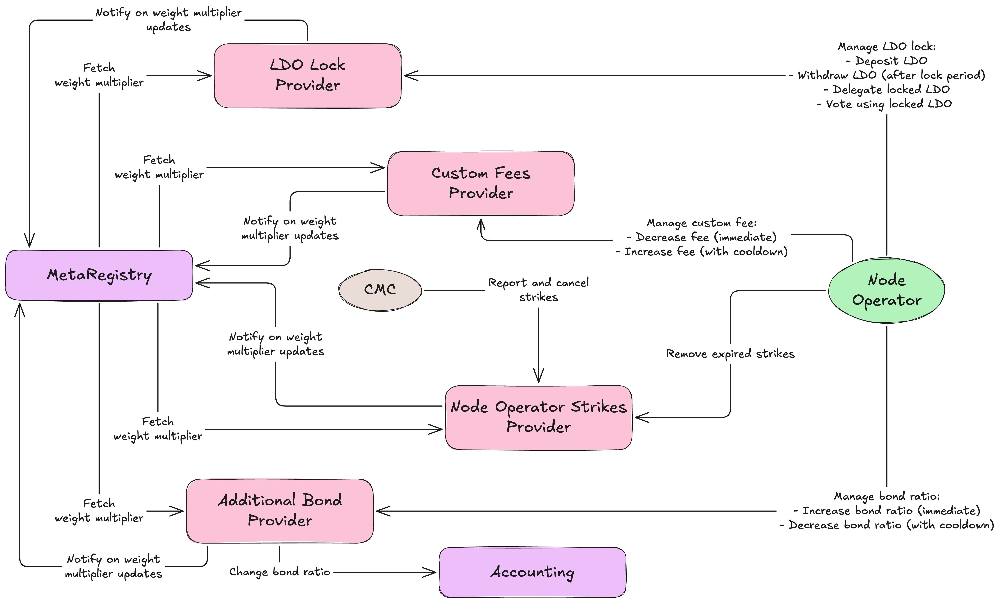
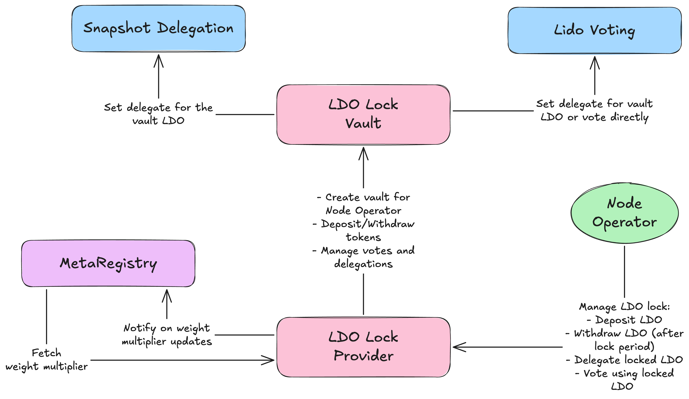
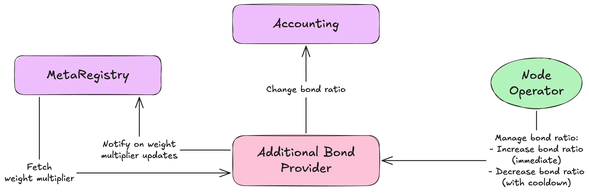
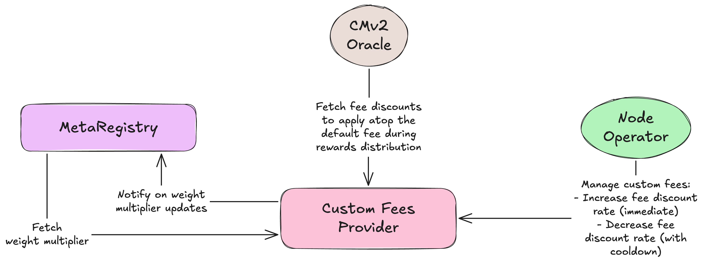
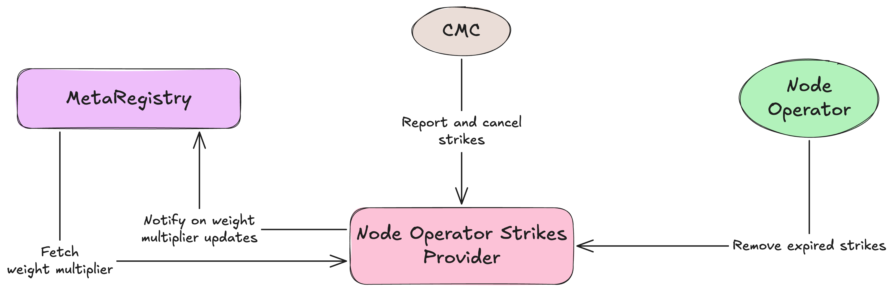

# LIP-42. Curated Module v2 Phase 2. ValMart

## Simple Summary

[Curated Module v2](./lip-33) (CMv2) has laid the foundation for the next phase of the Lido protocol's evolution. The stake allocation mechanism in CMv2 already supports weight-based stake allocation. The missing piece is the way for the Node Operators to influence their stake allocation weight. CMv2 Phase 2 closes this gap with the introduction of the Validation Market (ValMart). The ability to set custom fee values, increase the bonding ratio, lock LDO tokens, and the Node Operator strike system are key components of ValMart. Node Operators can increase their stake allocation weight by offering more favorable conditions to the Lido protocol, which will be reflected in their stake allocation weight. At the same time, CMC, the party responsible for overseeing the Curated Module, will have the ability to issue Node Operator Strikes in case of underperformance or other violations of the standard node operator protocols (SNOPs), consequently reducing the stake allocation weight of the Node Operator. The combination of these mechanisms will create a dynamic and competitive environment for Node Operators, fostering innovation and efficiency in the Lido protocol.

Alongside ValMart, several technical and operational improvements are proposed for both CMv2 and CSM.

## Motivation

Since the very inception of the Lido protocol, the Node Operators have been the backbone of its operations. Their performance and reliability directly impact the protocol's efficiency and security. However, the current system lacks a mechanism for Node Operators to actively influence their stake allocation weight based on their performance and offerings. This limitation has led to a static environment with even stake distribution and minimal differentiation based on performance, where Node Operators have little incentive to innovate or improve their services.  

ValMart is aimed at improving both protocol economics and the overall performance of the Lido network by creating a competitive environment for Node Operators, incentivizing them to offer better conditions and maintain high standards of operation.

## Introduction

This LIP covers new contracts and flows added with ValMart to CMv2, and additional improvements to CSM and CMv2 not directly related to ValMart. Contracts architecture, flows, permissions, upgradability, and security considerations remain unchanged compared to [LIP-33](./lip-33) unless explicitly stated otherwise.

## Specification

- [Project repo](https://github.com/lidofinance/staking-modules)
- Written in [Solidity 0.8.33](https://github.com/ethereum/solidity/tree/v0.8.33)
- Developed in [Foundry](https://github.com/foundry-rs/foundry)

> Terms validator, key, validator key, and deposit data meanings are the same within the document

### ValMart

General architecture of CMv2 is covered in [LIP-33](./lip-33). Here we focus on the specific changes and additions introduced in ValMart.

All ValMart features listed below are applicable to CMv2 only.

#### Weight Boost Providers

The key component of ValMart's architecture is the concept of weight boost providers. Weight boost providers are responsible for determining the weight multiplier of each Node Operator based on various factors. These weights are then used to calculate the overall stake allocation weight of the Node Operator within the protocol.

Weight boost providers are added to `MetaRegistry` via `DEFAULT_ADMIN_ROLE` by the DAO. Due to limited plans on changes in the set of weight boost providers, there is no method to remove them once added. However, the DAO can disable provider via `setWeightBoostProviderEnabled(uint256 providerId, bool enabled)` and information from this provider will no longer be used in weight calculations.

Weight boosts are applied by simple multiplication of the Node Operator's base weight (defined by Node Operator's type) with the weight multiplier provided by each active weight boost provider. The final weight of the Node Operator is the product of its base weight and all applicable weight multipliers.

#### LDO Lock Provider (`ERC20LockBoostProvider.sol`)

Node Operators can lock their LDO tokens to indicate alignment with the protocol's long-term interests.

Depositing LDO starts a lock period during which the tokens cannot be withdrawn. Additional deposits restart the lock period. Once the lock period ends, the tokens can be unlocked and withdrawn by the Node Operator. Withdrawals do not restart the lock period. If the Node Operator has no active and depositable keys, the lock period is ignored, and LDO tokens can be withdrawn immediately.

Lock period duration is configurable and determined by the DAO via `DEFAULT_ADMIN_ROLE`.

Deposited LDO tokens are held on the Node Operator's vault (`LidoGovernanceLockVault.sol`) created upon first deposit and can be used in the protocol's governance. Delegation on both Aragon Voting and Snapshot voting is supported. It is also possible to vote on Aragon proposals directly.

`MetaRegistry` is notified about weight multiplier changes when Node Operators deposit or withdraw their LDO tokens. `MetaRegistry` pulls the recent weight multiplier from the provider should the Node Operator weight need recalculation due to changes in the other weight providers or changes to the Node Operator's type.

Unlike other providers that provide weight boost for the exact Node Operator, LDO Lock Provider provides weight boost for all Node Operators in the Node Operator Group the Node Operator belongs to. If several operators in the same group weight boost from the LDO Lock provider, the largest boost is used to avoid situations of staked boosts from the same provider.

Weight multiplier is defined based on the current amount of LDO tokens deposited by the Node Operator to the vault. The weight multiplier values are set for ranges of LDO token amounts. The number of ranges and corresponding weight multipliers are determined by the DAO via `DEFAULT_ADMIN_ROLE`.

Example:

| LDO Amount Deposited | Weight Multiplier |
|----------------------|-------------------|
| 0 - X LDO            | 1x                |
| X+1 - Y LDO          | Mx                |
| Y+1 LDO and above    | Nx                |

#### Additional Bond Provider (`AdditionalBondRegistry.sol`)

Node Operators can increase their bonding ratio for their validators to improve bond coverage and protocol security.
  
Bonding ratio is the multiplier applied to the base bond requirements determined by the Node Operator's bond curve. Increasing this multiplier means that Node Operators need to have more bond for their already uploaded and future validator keys. The default bonding ratio is 1x, meaning that the default bond requirements are applied.

Node Operators can increase their bonding ratio at any time with the immediate effect on their stake allocation weight. Node Operators should have sufficient bond to cover the increased bonding ratio. Increased bonding ratio is applied immediately and reflected in `Accounting` contract.

Decreasing bond ratio comes with the cooldown period. Once the decrease of the bonding ratio compared to the current value is requested, stake allocation weight is reduced immediately, while the bonding ratio remains the same until the cooldown period elapses. Once the cooldown period elapses, Node Operators have to submit an additional transaction to apply the reduced bonding ratio in the `Accounting` contract. This approach ensures that Node Operators can not immediately reduce their bonding ratio and withdraw bond in case of a detected slashing or low performance incident.

Cooldown duration is configurable and determined by the DAO via `DEFAULT_ADMIN_ROLE`.

An additional bond provider is attached to the `Accounting` contract via `SET_BOND_CURVE_MULTIPLIER_ROLE`.

`MetaRegistry` is notified about weight multiplier changes when Node Operators increase or request a decrease of their bonding ratio. `MetaRegistry` pulls the recent weight multiplier from the provider should the Node Operator weight need recalculation due to changes in the other weight providers or changes to the Node Operator's type.

Weight multiplier is defined based on the current bonding ratio set or requested by the Node Operator. The weight multiplier values are set for ranges of bonding ratios. The number of ranges and corresponding weight multipliers are determined by the DAO via `DEFAULT_ADMIN_ROLE`.

Example:

| Bonding Ratio  | Weight Multiplier |
|----------------|-------------------|
| Qx and below   | 1x                |
| Qx+1 - Rx      | Mx                |
| Rx+1 and above | Nx                |

#### Custom Fee Provider (`CustomFeeRegistry.sol`)

Node Operators can set the custom fee they are willing to operate at. Lower fees are beneficial for the protocol. Hence, setting a lower fee (relative to the default fee for the given Node Operator type) results in higher stake allocation weight for the Node Operator.

Custom fee set as the percentage discount from the default fee defined for the Node Operator type. Ex. 10% discount when default fee is 5% results in a custom fee of 4.5%, while for the default fee of 3% a 10% discount results in a custom fee of 2.7%. The bigger the discount, the higher the stake allocation weight for the Node Operator.

Node Operators can increase their fee discount at any time, which will immediately affect their stake allocation weight, and the effective fee will be used at the next Oracle report.

Decreasing the fee discount is subject to a cooldown period. Once the decrease of the fee discount compared to the current value is requested, stake allocation weight is reduced immediately, while the effective fee remains the same until the cooldown period elapses. Once the cooldown period elapses, Node Operators have to submit an additional transaction to apply the reduced fee discount. This approach ensures that Node Operators cannot immediately reduce their fee discount and gain an unfair advantage in stake allocation since fees are effective as of Oracle reports (currently every 14 days).

Cooldown duration is configurable and determined by the DAO via `DEFAULT_ADMIN_ROLE`.

CMv2 Oracle uses active fee discounts set by Node Operators as of the report's `refSlot`. That indirectly means that the discount reduction cooldown period should be at least as long as the interval between Oracle reports to prevent Node Operators from bypassing the cooldown by timing their discount reductions around Oracle reports.

`MetaRegistry` is notified about weight multiplier changes when Node Operators increase or request a decrease of their fee discount. `MetaRegistry` pulls the recent weight multiplier from the provider should the Node Operator weight need recalculation due to changes in the other weight providers or changes to the Node Operator's type.

Weight multiplier is defined based on the current fee discount set or requested by the Node Operator. The weight multiplier values are set for ranges of fee discounts. The number of ranges and corresponding weight multipliers are determined by the DAO via `DEFAULT_ADMIN_ROLE`.

Example:

| Fee Discount     | Weight Multiplier |
|------------------|-------------------|
| Q% or below      | 1x                |
| (Q+1)% - R%      | Mx                |
| (R+1)% and above | Nx                |

#### Node Operator Strikes Provider (`NodeOperatorStrikes.sol`)

Poor performance, standard node operator protocol (SNOP) violations, and other misbehavior by Node Operators should have a clear reflection in their stake allocation weight. Node Operator Strikes Provider is the way to achieve this accountability.

The overseeing party (likely CMC - Curated Module Committee) can issue strikes to Node Operators and remove already issued strikes via `STRIKES_COMMITTEE_ROLE`. Each strike is an independent record that comes with the category, description, and lifetime. Category and description provide context for the strike, while the lifetime determines how long the strike affects the Node Operator's stake allocation weight.

Node Operators should submit a separate TX to remove the strike once it has expired to restore their stake allocation weight.

`MetaRegistry` is notified about weight multiplier changes when strikes are issued or removed for the Node Operator. `MetaRegistry` pulls the recent weight multiplier from the provider should the Node Operator weight need recalculation due to changes in the other weight providers or changes to the Node Operator's type.

Weight multiplier is defined based on the current number of active strikes for the Node Operator. The weight multiplier values are set for ranges of strike counts. The number of ranges and corresponding weight multipliers are determined by the DAO via `DEFAULT_ADMIN_ROLE`.

Example:

| Active Strikes | Weight Multiplier |
|----------------|-------------------|
| Q or below     | 1x                |
| Q+1 - R        | 0.Mx              |
| R+1 and above  | 0.Nx              |

### Non-ValMart changes

#### Bond claim block on unresolved slashing

> This feature applies to both CMv2 and CSM.

One of the non-ValMart-related changes is the introduction of a bond claim block on unresolved slashing events. This mechanism ensures that Node Operators cannot immediately claim their bond if there is an ongoing slashing process, even if they exit other non-slashed validators, providing additional security and accountability within the protocol.

A new per-Node-Operator counter of unresolved slashing events is introduced. This counter keeps track of the number of slashings reported via `reportValidatorSlashing` and not resolved via `ReportWithdrawalsForSlashedValidators` Easy Track motion. The bond claim for a Node Operator is blocked as long as this counter is non-zero, ensuring that bonds cannot be claimed while there are unresolved slashing events.

Bond claim restriction is also applied to [reward splitters](./lip-33.md#rewards-claim). Neither Node Operator nor split recipients can claim bond if the restriction is active. Pulling rewards from `FeeDistributor` to Node Operator's bond is still permitted.

#### Late Exit Penalty Deprecation

> This feature applies to both CMv2 and CSM.

[LIP-38](./lip-38.md) introduces a new approach to validator exits and partial withdrawals. Post-LIP-38 exits are performed via [EIP-7002](https://eips.ethereum.org/EIPS/eip-7002) and do not require any action from the Node Operator side. Hence, late exit penalty mechanism becomes obsolete and should be removed.

The following methods and flows will be removed:
- `BaseModule.sol`
    - `reportValidatorExitDelay` - Method for reporting delayed validator exits.
    - `onValidatorExitTriggered` - Hook to notify module about TW fee paid.
- `ExitPenalties.sol`
    - `processExitDelayReport`
    - `processTriggeredExit`
    - `isValidatorExitDelayPenaltyApplicable`

`ExitPenalties.sol` sole responsibility post LIP-42 is to handle validator strike ejection penalties.

#### New balance tracking mechanism for CMv2

> This feature applies to CMv2 only. CSM keeps the mechanism covered in [LIP-33](./lip-33.md).

Partial withdrawals introduced in [LIP-38](./lip-38.md) make current ever-increasing per-validator balance accounting system insufficient, necessitating a new balance tracking mechanism for CMv2 with support for balance decreases.

The solution is to transition to a balance-checkpoint system. `keyConfirmedBalance` is deprecated. New `lastAccountingProofSlot` variable is introduced. `keyAllocatedBalance` is now updated according to the following rules:

- Top-up allocations increase `keyAllocatedBalance` immediately without recording `lastAccountingProofSlot` since it takes time for the deposit to be applied on CL.
- Balance proof from CL can only increase `keyAllocatedBalance` and update `lastAccountingProofSlot`. Proofs with `BeaconState.balances[validatorIndex]` below the current value of `keyAllocatedBalance` are ignored and do not affect the checkpoint.
- Partial withdrawal proof updates `keyAllocatedBalance` (with possible decrease) to the `BeaconState.balances[validatorIndex]` at the proof slot and updates `lastAccountingProofSlot`.
- Proofs for the validators marked as withdrawn are rejected.

Balance increases due to incoming consolidations are reported using ordinary balance proofs. 

Outgoing consolidations and full withdrawals are considered terminal event in the validator lifecycle. Once reported, current value of `keyAllocatedBalance + 32 ETH` is subtracted from the operator's and module's balances. No future updates to `keyAllocatedBalance` are expected after this point.

More details in a [separate document](https://hackmd.io/@lido/new-balance-tracking-for-cmv2).

#### Exit balance deficit penalty removal for CMv2

> This feature applies to CMv2 only. CSM keeps the mechanism covered in [LIP-33](./lip-33.md).

Due to the transition to the new balance tracking mechanism in CMv2, the exit balance deficit penalty is removed. The new mechanism does not guarantee a reliable snapshot of the validator's balance. Hence, exit balance deficit can not be calculated reliably.

Since CMv2 already assumes an overseeing committee (CMC) for reliable operation, it is assumed that a balance deficit that occurred due to validator underperformance is penalized manually using [General Delayed Penalty mechanism](./lip-33.md#general-penalty-with-confirmation). Balance deficit due to slashing is already handled using [dedicated Easy Track flow](./lip-33.md#slashed-validators).

#### Updated `Verifier` contract for CMv2 to support partial withdrawals and new balance tracking mechanism

> This feature applies to CMv2 only. CSM keeps the version of `Verifier` covered in [LIP-33](./lip-33.md).

Due to significant changes in the balance tracking mechanism, CMv2 will have it's own version of the `Verifier` contract called `CuratedVerifier` featuring the following methods:

##### `processSlashedProof`

This method is identical to the LIP-33 version.

##### `processValidatorWithdrawnProof`

Unlike LIP-33 `processWithdrawalProof`, this method does not require a proof of the full withdrawal event from the CL. Instead, it only requires a proof that the validator's `withdrawable_epoch` has been reached. The actual withdrawal event is no longer required due to the removal of the exit balance deficit penalty.

This method reports a terminal event in the validator's lifecycle to `CuratedModule` for validators that have exited or were consolidated.

##### `processBalanceProof`

This method is similar to the LIP-33 version, with the only difference being that it now updates the `keyAllocatedBalance` and `lastAccountingProofSlot` on `CuratedModule` to reflect the new balance and the slot of the proof, respectively.

##### `processPartialWithdrawalProof`

Allows reporting partial withdrawal proofs from the CL. The withdrawal event is considered a partial withdrawal if:

- Validator's withdrawal epoch is ahead of the current epoch.
- `BeaconState.balances[validatorIndex]` at the proof slot is below `MAX_EFFECTIVE_BALANCE`.

Once reported, `keyAllocatedBalance` is updated to reflect the new balance, and `lastAccountingProofSlot` is set to the slot of the proof.

##### `processHistoricalPartialWithdrawalProof`

This method is the version of `processPartialWithdrawalProof` that handles historical proofs, allowing reporting of partial withdrawals that occurred in the past.

##### Note on the historical versions of methods

The only historical method is `processHistoricalPartialWithdrawalProof`. Other methods do not need historical versions due to:

- `processSlashedProof` - once slashed, a validator remains slashed forever, and any future state of this validator can be used.
- `processValidatorWithdrawnProof` - once set, `withdrawable_epoch` remains unchanged, and any future state of this validator can be used.
- `processBalanceProof` - due to the fact that `CuratedModule` accepts balance reports with the increased balance for the slots newer than `lastAccountingProofSlot`, and features no high-water mark mechanism, historical versions are unnecessary.

#### "Bahamas" mode (autonomous operation mode)

Currently, both CMv2 and CSM assume an active overseeing committee (CMC for CMv2 and CSMC for CSM) to act in case of validator slashing (report slashing penalty via Easy Track). CMv2 also relies on CMC to monitor the module's performance and take necessary actions in case of poor performance (issue node operator strikes or general delayed penalties). Should these committees become inactive or fail to perform their duties, the modules may face operational risks like permanent inability to process slashing penalties or unactionable poor performance cases for CMv2.

It is proposed to introduce a "Bahamas" mode (autonomous operation mode) that, if active, will enable automated validator performance management in CMv2 identical to the one used in CSM (see [LIP-33](./lip-33.md#validator-ejection-due-to-strikes)), and replace slashing penalty reporting by committees via Easy Track with automated application of the DAO-defined slashing penalty upon permissionless reporting of the validator slashings.

##### "Bahamas" mode in CMv2

A new method `switchAutomatedPenaltiesMode(uint256 slashingPenaltyPer32Eth)` is introduced on the `CuratedModule` contract. This method is callable by the DAO (optionally can be callable by CMC as well). 

When called with `slashingPenaltyPer32Eth > 0` (activation), this value is stored in the contract storage, and a call is made to the `ParametersRegistry` contract's method `setDefaultPerformanceLeeway(DEFAULT_PERFORMANCE_LEEWAY_AUTO)`, where `DEFAULT_PERFORMANCE_LEEWAY_AUTO` is a constant defined in the `CuratedModule` contract. `DEFAULT_PERFOMANCE_LEEWAY_AUTO` should be pre-defined by the DAO before the contract deployment and represent the acceptable deviation of the validator's performance from the observed network average validator performance.

When called with `slashingPenaltyPer32Eth == 0` (deactivation), the automated slashing penalties mode is disabled (the stored slashing penalty value is cleared), and a call is made to the `ParametersRegistry` contract's method `setDefaultPerformanceLeeway(10000)`, where `10000` means that any performance deviation is acceptable by the CMv2 Performance Oracle, effectively disabling the automated performance management.

If stored `slashingPenaltyPer32Eth > 0`, the method `reportValidatorSlashing` automatically applies `slashingPenaltyPer32Eth` scaled using `keyAllocatedBalance` recorded for the slashed validator to the Node Operator's bond. The validator is also immediately marked as `withdrawn` to release its bond for withdrawal (if any left) and prevents future reporting of the slashing penalty via Easy Track. This ensures that if the committee becomes active again, it will not be able to apply a duplicated slashing penalty. If the slashing for the given validator has already been reported before the "Bahamas" mode was activated, but has not been resolved via Easy Track motion, the `reportValidatorSlashing` method will still accept the report, apply automated penalty, and decrease the unresolved slashing counter accordingly.

If stored `slashingPenaltyPer32Eth == 0`, the method `reportValidatorSlashing` will operate in the normal mode with no automated slashing penalties applied.

Strikes parameters (lifetime and threshold) are already configured for CMv2 in the corresponding `ParametersRegistry` contract instance. Hence, there is no need to change it upon activation of the "Bahamas" mode. When `performanceLeeway` is set to `10000` during normal operation, these parameters are effectively ignored by the CMv2 Performance Oracle. Current values set for CMV2 are `lifetime = 6 oracle frames` and `threshold = 3 strikes`. Should the DAO consider changing these parameters, it can do so via the `ParametersRegistry` contract within the vote to upgrade CMv2 to Phase 2, or at any time earlier if necessary.

For the correct operation of the "Bahamas" mode in CMv2, `CuratedModule` should hold `MANAGE_PERFORMANCE_PARAMETERS_ROLE` on the `ParametersRegistry` contract.

In case the DAO wants to change `slashingPenaltyPer32Eth` while the "Bahamas" mode is active, it can simply call `switchAutomatedPenaltiesMode` again with the new value. This will update the stored slashing penalty and continue the automated enforcement with the new parameter.

##### "Bahamas" mode in CSM

In CSM, the "Bahamas" mode will operate according to the same rules as in CMv2, with the difference being that `performanceLeeway` remains unchanged, as it is already set in a correct way during normal operation.

### Upgradability

`ERC20LockBoostProvider.sol`, `AdditionalBondRegistry.sol`, `CustomFeeRegistry.sol`, `NodeOperatorStrikes.sol` are upgradable using [OssifiableProxy](https://github.com/lidofinance/staking-modules/blob/main/src/lib/proxy/OssifiableProxy.sol) contracts.

Instances of `LidoGovernanceLockVault.sol` are deployed using [BeaconProxy](https://github.com/OpenZeppelin/openzeppelin-contracts/blob/v5.4.0/contracts/proxy/beacon/BeaconProxy.sol) and share the same DAO-controlled [Beacon](https://github.com/OpenZeppelin/openzeppelin-contracts/blob/v5.4.0/contracts/proxy/beacon/UpgradeableBeacon.sol).

### Known Issues

[LIP-33](./lip-33.md) mentions ["Permissionless withdrawal reporting vulnerability"](./lip-33.md#permissionless-withdrawal-reporting-vulnerability). This issue is no longer applicable to CMv2 due to the removal of the penalty applied upon validator exit and calculated based on the recorded validator balance. This penalty was initially introduced in CSM, a highly autonomous and permissionless staking module. CMv2, in turn, assumes a dedicated overseeing committee (CMC) responsible for monitoring the module's performance and acting accordingly (reporting general delayed penalties for cases of poor performance, see [snapshot vote](https://snapshot.org/#/s:lido-snapshot.eth/proposal/0xa4179234377bab093a8ee46da0f430d51bb343d00ca74ce8bf1d7d8cdb0db9dd)). Hence, the vulnerable mechanism is no longer needed in CMv2 and is removed in this LIP.

#### Slashing event reported but unresolved before module upgrade can reduce bond claim block time for future slashing events

If a slashing event is reported but remains unresolved before a module upgrade, the ongoing slashings counter will remain zero after the module upgrade. If another slashing occurs after the upgrade, resolution of the slashing started before the upgrade will null out the ongoing slashings counter that should have been incremented, potentially allowing Node Operators to claim their bonds prematurely.

Because this scenario is highly unlikely in practice, the impact can be accepted as a minor risk. Alternatively, the module upgrade can be postponed until all unresolved slashing events are resolved, ensuring that the ongoing slashings counter accurately reflects the true state of unresolved slashings.

#### Race condition in `keyAllocatedBalance` updates between top-ups and partial withdrawals

A top-up is recorded immediately but may not yet be reflected on the consensus layer. If an earlier partial-withdrawal proof arrives during this window, its checkpoint replaces the tracked balance and temporarily excludes the pending top-up from `keyAllocatedBalance`. A newer proof restores it once the deposit is applied.

Current design prefers temporary underestimation, which may allow additional deposits, over advancing the `lastAccountingProofSlot` on top-up, which would reject the unreported partial-withdrawal proof and temporarily overestimate allocation, unnecessarily restricting deposits.

## Links

- [LIP-33. Community Staking Module v3 and Curated Module v2](https://github.com/lidofinance/lido-improvement-proposals/blob/develop/LIPS/lip-33.md)
- [LIP-29. Community Staking Module v2](https://github.com/lidofinance/lido-improvement-proposals/blob/develop/LIPS/lip-29.md)
- [LIP-26. Community Staking Module](https://github.com/lidofinance/lido-improvement-proposals/blob/develop/LIPS/lip-26.md)
